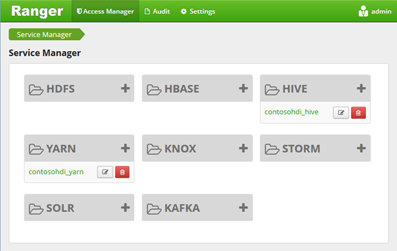

<properties
    pageTitle="Configurare i criteri Hive nel dominio HDInsight | Microsoft Azure"
    description="Informazioni su..."
    services="hdinsight"
    documentationCenter=""
    authors="saurinsh"
    manager="jhubbard"
    editor="cgronlun"
    tags="azure-portal"/>

<tags
    ms.service="hdinsight"
    ms.devlang="na"
    ms.topic="hero-article"
    ms.tgt_pltfrm="na"
    ms.workload="big-data"
    ms.date="10/25/2016"
    ms.author="saurinsh"/>

# Configurare i criteri Hive nel dominio HDInsight (Preview)

Informazioni su come configurare i criteri di Apache cane per Hive. In questo articolo è creare due criteri cane per limitare l'accesso per la hivesampletable. Il hivesampletable viene fornito con i cluster HDInsight. Dopo aver configurato i criteri, utilizzare Excel e il driver ODBC per connettersi a tabelle Hive HDInsight.

## Prerequisiti

- Un cluster di dominio HDInsight. Vedere [configurare dominio HDInsight cluster](hdinsight-domain-joined-configure.md).
- Lavoro utilizzando Office 2016, Office 2013 Professional Plus, Office 365 Pro Plus, Excel 2013 autonomo o Office 2010 Professional Plus.

## Connettersi a Apache cane amministrazione dell'interfaccia utente

**Per connettersi all'interfaccia utente di amministratore cane**

1. In un browser, connettersi all'interfaccia utente di amministratore cane. L'URL è https://&lt;nome cluster >.azurehdinsight.net/Ranger/. 

    >[AZURE.NOTE] Cane utilizza credenziali diverse rispetto a Hadoop cluster. Per evitare browser con credenziali memorizzate Hadoop, utilizzare nuova finestra del browser inprivate per connettersi all'interfaccia di amministrazione cane.
4. Accedere usando il cluster amministratore nome utente e la password:

    

    Cane attualmente funziona solo con filati e Hive.

## Creare gli utenti del dominio

Per [configurare dominio HDInsight cluster](hdinsight-domain-joined-configure.md#create-and-configure-azure-ad-ds-for-your-azure-ad), è stato creato hiveruser1 e hiveuser2. Utilizzare l'account due utente in questa esercitazione.

## Creare criteri di cane

In questa sezione, è necessario creare due criteri cane per l'accesso a hivesampletable. Assegnare autorizzazioni selezionare nel set di colonne diverso. Entrambi gli utenti sono stati creati in [cluster di configurare dominio HDInsight](hdinsight-domain-joined-configure.md#create-and-configure-azure-ad-ds-for-your-azure-ad).  Nella sezione successiva, si verificherà due criteri di Excel.

**Per creare i criteri di cane**

1. Aprire l'interfaccia utente di amministratore cane. Vedere [connettersi a Apache cane amministrazione dell'interfaccia utente](#connect-to-apache-ranager-admin-ui).
2. Fare clic su ** &lt;nome cluster > _hive**, in **Hive**. Si sono visualizzati due pre-configurare i criteri.
3. Fare clic su **Aggiungi nuovo criterio**e quindi immettere i valori seguenti:

    - Nome del criterio: lettura hivesampletable completa
    - Hive Database: predefinito
    - tabella: hivesampletable
    - Hive colonna: *
    - Selezionare l'utente: hiveuser1
    - Autorizzazioni: selezionare

    .

    >[AZURE.NOTE] Se un utente del dominio non è vuoto nel Seleziona utente, attendere alcuni istanti per cane per sincronizzarlo con AAD.

4. Fare clic su **Aggiungi** per salvare il criterio.
5. Ripetere gli ultimi due passaggi per creare un altro criterio con le proprietà seguenti:

    - Nome del criterio: devicemake di hivesampletable lettura
    - Hive Database: predefinito
    - tabella: hivesampletable
    - Hive colonna: clientid, devicemake
    - Selezionare l'utente: hiveuser2
    - Autorizzazioni: selezionare

## Creare l'origine dati ODBC Hive

Le istruzioni disponibili in [creare Hive dati ODBC](hdinsight-connect-excel-hive-odbc-driver.md).  

    Proprietà|Descrizione
    ---|---
    Nome dell'origine dati|Assegnare un nome all'origine dati
    Host|Immettere &lt;HDInsightClusterName >. azurehdinsight.net. Ad esempio myHDICluster.azurehdinsight.net
    Porta|Utilizzare <strong>443</strong>. (Questa porta è stata modificata da 563 alla porta 443.)
    Database|Utilizzare <strong>predefinito</strong>.
    Tipo di Server hive|Selezionare <strong>Hive Server 2</strong>
    Meccanismo|Selezionare <strong>Il servizio Azure HDInsight</strong>
    Percorso HTTP|Lasciare vuota.
    Nome utente|Immettere hiveuser1@contoso158.onmicrosoft.com. Se è diverso, aggiornare il nome di dominio.
    Password|Immettere la password per hiveuser1.
    </table>

Assicurarsi di fare clic su **Test** prima di salvare l'origine dati.

##Importare dati in Excel da HDInsight

Nella sezione precedente è stato configurato due criteri.  hiveuser1 disponga delle autorizzazioni Seleziona tutte le colonne e hiveuser2 ha l'autorizzazione select in due colonne. In questa sezione è rappresentare due utenti per importare dati in Excel.

1. Aprire una cartella di lavoro nuovo o esistente in Excel.
2. Nella scheda **dati** fare clic su **Da altre origini dati**e quindi fare clic su **Da connessione guidata dati** per avviare la **Connessione guidata dati**.

    ! [Guidata di connessione dati aperta] [img-hdi-simbahiveodbc.excel.dataconnection]

3. Selezionare **L'errore DSN ODBC** come origine dati e quindi fare clic su **Avanti**.
4. Origini dati ODBC, selezionare il nome di origine dati creata nel passaggio precedente e quindi fare clic su **Avanti**.
5. Immettere nuovamente la password per il raggruppamento nella creazione guidata e quindi fare clic su **OK**. Attendere che la finestra di dialogo **Seleziona Database e tabella** aprire. Possono essere necessari alcuni secondi.
8. Selezionare **hivesampletable**e quindi fare clic su **Avanti**. 
8. Fare clic su **Fine**.
9. Nella finestra di dialogo **Importa dati** , è possibile modificare o specificare la query. A tale scopo, fare clic su **proprietà**. Possono essere necessari alcuni secondi. 
10. Fare clic sulla scheda **definizione** . Il testo del comando è:

        SELECT * FROM "HIVE"."default"."hivesampletable"

    In base ai criteri di cane definito hiveuser1 disponga dell'autorizzazione select per tutte le colonne.  Pertanto questa query funziona con le credenziali dell'hiveuser1, ma questa query non non funziona con le credenziali dell'hiveuser2.

    ! [Proprietà connessione] [img-hdi-simbahiveodbc-excel-connectionproperties]

11. Fare clic su **OK** per chiudere la finestra di dialogo Proprietà connessione.
12. Fare clic su **OK** per chiudere la finestra di dialogo **Importa dati** .  
13. Digitare nuovamente la password per hiveuser1 e quindi fare clic su **OK**. Bastano pochi secondi prima ottiene importare i dati in Excel. Al termine, risulta 11 colonne di dati.

Per testare il secondo criterio (lettura-hivesampletable-devicemake) creata nella sezione precedente

1. Aggiungere un nuovo foglio in Excel.
2. Seguire la procedura ultima per importare i dati.  L'unica modifica che si effettuano consiste nell'usare le credenziali dell'hiveuser2 invece di hiveuser1. Questa operazione non riuscirà perché hiveuser2 ha soltanto le autorizzazioni per visualizzare due colonne. Viene visualizzato l'errore seguente:

        [Microsoft][HiveODBC] (35) Error from Hive: error code: '40000' error message: 'Error while compiling statement: FAILED: HiveAccessControlException Permission denied: user [hiveuser2] does not have [SELECT] privilege on [default/hivesampletable/clientid,country ...]'.

3. Seguire la stessa procedura per importare i dati. In questo caso, utilizzare le credenziali dell'hiveuser2 e anche modificare l'istruzione select da:

        SELECT * FROM "HIVE"."default"."hivesampletable"

    A:

        SELECT clientid, devicemake FROM "HIVE"."default"."hivesampletable"

    Al termine, risulta due colonne di dati importati.

## Passaggi successivi

- Per configurare un cluster di dominio HDInsight, vedere [configurare dominio HDInsight cluster](hdinsight-domain-joined-configure.md).
- Per la gestione di un cluster di dominio HDInsight, vedere [gestire dominio HDInsight cluster](hdinsight-domain-joined-manage.md).
- Per eseguire query Hive utilizzando SSH nei cluster HDInsight dominio, vedere [Usare SSH con basati su Linux Hadoop in HDInsight da Linux, Unix o OS X](hdinsight-hadoop-linux-use-ssh-unix.md#connect-to-a-domain-joined-hdinsight-cluster).
- Per la connessione Hive utilizzando JDBC Hive, vedere [connettersi a Hive su Azure HDInsight con il driver JDBC Hive](hdinsight-connect-hive-jdbc-driver.md)
- Per Excel si connette alla Hadoop tramite Hive ODBC, vedere [Connettere Excel a Hadoop con l'unità di Microsoft Hive ODBC](hdinsight-connect-excel-hive-odbc-driver.md)
- Per Excel si connette alla Hadoop tramite Power Query, vedere [Connettere Excel a Hadoop tramite Power Query](hdinsight-connect-excel-power-query.md)