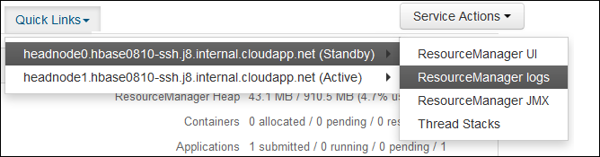

<properties
    pageTitle="Applicazione di Access filati Hadoop accede basati su Linux HDInsight | Microsoft Azure"
    description="Informazioni su come accedere filati registri delle applicazioni in un cluster basati su Linux HDInsight (Hadoop) tramite la riga di comando e un web browser."
    services="hdinsight"
    documentationCenter=""
    tags="azure-portal"
    authors="Blackmist" 
    manager="jhubbard"
    editor="cgronlun"/>

<tags
    ms.service="hdinsight"
    ms.workload="big-data"
    ms.tgt_pltfrm="na"
    ms.devlang="na"
    ms.topic="article"
    ms.date="10/21/2016"
    ms.author="larryfr"/>

# Applicazione di Access filati accede basati su Linux HDInsight 

In questo documento viene illustrato l'accesso dei registri per le applicazioni di filati (ancora un'altra risorsa negoziatore) termine in un cluster di Hadoop in Azure HDInsight.

> [AZURE.NOTE] Le informazioni contenute in questo documento sono specifiche di cluster basati su Linux HDInsight. Per informazioni sui cluster basato su Windows, vedere [applicazione di Access filati accesso HDInsight basato su Windows](hdinsight-hadoop-access-yarn-app-logs.md)

## Prerequisiti

* Un cluster di HDInsight basati su Linux.

* È necessario [creare un tunnel SSH](hdinsight-linux-ambari-ssh-tunnel.md) poter accedere a web ResourceManager log dell'interfaccia utente.

## Server di filati sequenza temporale

Per informazioni generiche sulla completa di applicazioni, nonché informazioni specifiche del framework applicazione tramite due diverse interfacce [Filati sequenza temporale Server](http://hadoop.apache.org/docs/r2.4.0/hadoop-yarn/hadoop-yarn-site/TimelineServer.html) . In particolare:

* Archiviazione e il recupero delle informazioni di applicazione generica nei cluster HDInsight è stato abilitato con versione 3.1.1.374 o versione successiva.
* Il componente di informazioni specifiche del framework applicazione del Server di sequenza temporale non è attualmente disponibile nei cluster HDInsight.

Informazioni generali sulla applicazioni includono i tipi di dati seguenti:

* ID applicazione, un identificatore univoco di un'applicazione
* L'utente che ha avviato l'applicazione
* Informazioni su tentativi per completare l'applicazione
* I contenitori utilizzati da qualsiasi tentativo di applicazione specificato

## FILATI applicazioni e log

FILATI supporta più modelli di programmazione (MapReduce da uno di essi), la separazione di gestione delle risorse dalla programmazione/monitoraggio delle applicazioni. Ciò avviene tramite un globale *ResourceManager* (RM), per nodo lavoro *NodeManagers* (NMs) e all'applicazione *ApplicationMasters* (AMs). AM per applicazione negoziare risorse (CPU, memoria, disco, rete) la eseguire l'applicazione con suo Il funzionamento con NMs da concedere a queste risorse, concesso come *contenitori*. Il AM è responsabile per verificare l'avanzamento della contenitori assegnato dal suo Un'applicazione può richiedere molti contenitori a seconda della natura dell'applicazione.

Inoltre, ogni applicazione può essere costituito più *applicazione tenta* per terminare in presenza di anomalo o a causa la perdita di comunicazione tra un AM e un RM. Di conseguenza, contenitori vengono assegnati a un tentativo di specifico di un'applicazione. Concetto di, un contenitore fornisce il contesto per unità di base del lavoro eseguito da un'applicazione di filati e tutte le operazioni che sono stata completata nel contesto di un contenitore viene eseguita sul nodo singolo lavoro in cui è stato ricevuto il contenitore. Vedere [Concetti filati] [ YARN-concepts] per un'ulteriore riferimento.

Registri delle applicazioni e dei registri del contenitore associato sono critici debug applicazioni Hadoop problematiche. FILATI fornisce un utile per la raccolta, l'aggregazione e archiviazione di registri delle applicazioni con l' [Aggregazione Log] [ log-aggregation] caratteristica. La funzione di aggregazione Log rende più deterministico accesso ai registri applicazioni ed è aggrega registri in tutti i contenitori su un nodo lavoro Archivia come un aggregato file di log per nodo di lavoro nel file system predefinito al termine dell'applicazione. L'applicazione può utilizzare centinaia o migliaia di contenitori, ma registri per tutti i contenitori eseguirvi su un nodo singolo lavoro verranno sempre aggregati in un unico file risultante in un file di log per nodo lavoro utilizzata dall'applicazione. Registro aggregazione è attivata per impostazione predefinita nei cluster HDInsight (versione 3.0 e versioni successive), e i log aggregati si trovano nel contenitore predefinito del cluster nel percorso seguente:

    wasbs:///app-logs/<user>/logs/<applicationId>

In posizione, *l'utente* è il nome dell'utente che ha avviato l'applicazione e *ID applicazione* è l'identificatore univoco di un'applicazione come assegnato dal suo filati

I registri aggregati non sono direttamente leggibili, man mano che vengono scritte in una [TFile][T-file], [formato binario] [ binary-format] indicizzato dal contenitore. È necessario utilizzare i registri ResourceManager filati o strumenti CLI per visualizzare i registri come testo normale per applicazioni o i contenitori di interesse. 

##Strumenti filati CLI

Per utilizzare gli strumenti di filati CLI, è prima di tutto necessario connettersi al cluster HDInsight tramite SSH. Per informazioni sull'utilizzo di SSH con HDInsight, usare uno dei seguenti documenti:

- [Usare SSH con basati su Linux Hadoop in HDInsight da Linux, Unix o OS X](hdinsight-hadoop-linux-use-ssh-unix.md)

- [Usare SSH con basati su Linux Hadoop in HDInsight da Windows](hdinsight-hadoop-linux-use-ssh-windows.md)
    
È possibile visualizzare i registri come testo normale eseguendo uno dei comandi seguenti:

    yarn logs -applicationId <applicationId> -appOwner <user-who-started-the-application>
    yarn logs -applicationId <applicationId> -appOwner <user-who-started-the-application> -containerId <containerId> -nodeAddress <worker-node-address>
    
È necessario specificare il &lt;ID applicazione >, &lt;chi-avviato-the-dell'applicazione utente >, &lt;ID contenitore >, ed e indirizzo di nodo ltworker > informazioni durante l'esecuzione di questi comandi.

##Interfaccia utente di ResourceManager filati

L'interfaccia utente ResourceManager filati viene eseguito su headnode cluster e sono accessibili tramite il web Ambari interfaccia utente. Tuttavia, è necessario prima [creare un tunnel SSH](hdinsight-linux-ambari-ssh-tunnel.md) prima di poter accedere UI ResourceManager.

Dopo aver creato un tunnel SSH, utilizzare la procedura seguente per visualizzare i registri filati:

1. Nel web browser, passare a https://CLUSTERNAME.azurehdinsight.net. Sostituire nome cluster con il nome del cluster HDInsight.

2. Nell'elenco dei servizi a sinistra, selezionare __filati__.

    

3. Nell'elenco a discesa __Collegamenti rapidi__ , selezionare uno dei nodi testa cluster e quindi selezionare __ResourceManager Log__.

    
    
    Verrà visualizzato un elenco di collegamenti ai registri filati.

[YARN-timeline-server]:http://hadoop.apache.org/docs/r2.4.0/hadoop-yarn/hadoop-yarn-site/TimelineServer.html
[log-aggregation]:http://hortonworks.com/blog/simplifying-user-logs-management-and-access-in-yarn/
[T-file]:https://issues.apache.org/jira/secure/attachment/12396286/TFile%20Specification%2020081217.pdf
[binary-format]:https://issues.apache.org/jira/browse/HADOOP-3315
[YARN-concepts]:http://hortonworks.com/blog/apache-hadoop-yarn-concepts-and-applications/
