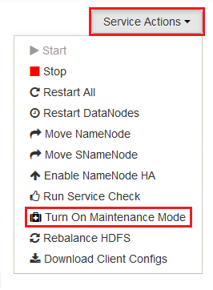
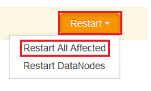

<properties
    pageTitle="Abilitare heap immagini per i servizi Hadoop su HDInsight | Microsoft Azure"
    description="Abilitare heap immagini per i servizi di Hadoop da cluster basati su Linux HDInsight per il debug e analisi."
    services="hdinsight"
    documentationCenter=""
    authors="Blackmist"
    manager="jhubbard"
    editor="cgronlun"
    tags="azure-portal"/>

<tags
    ms.service="hdinsight"
    ms.workload="big-data"
    ms.tgt_pltfrm="na"
    ms.devlang="na"
    ms.topic="article"
    ms.date="09/27/2016"
    ms.author="larryfr"/>

#Abilitare heap immagini per i servizi Hadoop su HDInsight basati su Linux (Preview)

[AZURE.INCLUDE [heapdump-selector](../../includes/hdinsight-selector-heap-dump.md)]

Le immagini heap contenere uno snapshot della memoria dell'applicazione, inclusi i valori delle variabili durante la creazione di dettagli. In modo che siano molto utile per la diagnosi problemi che si verificano in fase di esecuzione.

> [AZURE.NOTE] Le informazioni in questo articolo si applicano solo a HDInsight basati su Linux. Per informazioni su HDInsight basato su Windows, vedere [abilitare heap immagini per i servizi Hadoop su HDInsight basato su Windows](hdinsight-hadoop-collect-debug-heap-dumps.md)

## Servizi

È possibile abilitare heap immagini per i servizi seguenti:

*  **hcatalog** - tempelton
*  **hive** - hiveserver2, metastore, derbyserver
*  **mapreduce** - jobhistoryserver
*  **filati** , resourcemanager, nodemanager, timelineserver
*  **hdfs** - datanode, secondarynamenode, namenode

È anche possibile attivare heap immagini per la mappa e ridurre i processi è stato eseguito da HDInsight.

## Configurazione di Understanding heap dettagli

Immagini heap abilitati passando opzioni (a volte denominato sceglie, o parametri) a JVM all'avvio di un servizio. Per la maggior parte dei servizi Hadoop, questa può essere effettuata modificando lo script di shell utilizzato per avviare il servizio.

In ogni script, esiste un'esportazione per ** \* \_OPTS**, che contiene le opzioni passate JVM. Ad esempio, in script **hadoop env.sh** la riga che inizia con `export HADOOP_NAMENODE_OPTS=` contiene le opzioni per il servizio NameNode.

Eseguire il mapping e ridurre i processi sono leggermente diversi, poiché si tratta di un processo figlio del servizio MapReduce. Ogni mapping o ridurre processo in esecuzione in un contenitore figlio e sono presenti due voci che contengono le opzioni di JVM per questi. Entrambi inclusi in **mapred site.xml**:

* **MapReduce.Admin.Map.Child.java.OPTS**
* **MapReduce.Admin.reduce.Child.java.OPTS**

> [AZURE.NOTE] È consigliabile utilizzare Ambari per modificare script e impostazioni mapred site.xml, come Ambari consente di gestire la replica delle modifiche nei nodi del cluster. Vedere la sezione [Utilizzando Ambari](#using-ambari) per i passaggi specifici.

###Abilitare heap immagini

La seguente opzione Abilita heap immagini quando si verifica un OutOfMemoryError:

    -XX:+HeapDumpOnOutOfMemoryError

Il **+** indica che questa opzione sia abilitata. Il valore predefinito è disattivato.

> [AZURE.WARNING] Immagini heap non abilitati per i servizi Hadoop su HDInsight per impostazione predefinita, come file immagine possono essere grandi. Se si attivarli per la risoluzione dei problemi, non dimenticare di disattivarli dopo aver riprodurre il problema e raccolti i file di immagine.

###Posizione dell'immagine

Il percorso predefinito per il file di immagine è la cartella di lavoro corrente. È possibile controllare la posizione in cui è archiviato il file con l'opzione seguente:

    -XX:HeapDumpPath=/path

Ad esempio, se si utilizza `-XX:HeapDumpPath=/tmp` impedirà immagini verrà archiviato nella directory /tmp.

###Script

È anche possibile attivare uno script quando si verifica un **OutOfMemoryError** . Attivare una notifica, ad esempio, per sapere che si è verificato un errore. Questa funzionalità è controllata utilizzando le seguenti opzioni:

    -XX:OnOutOfMemoryError=/path/to/script

> [AZURE.NOTE] Poiché Hadoop è un sistema distribuito, tutti gli script utilizzati devono essere inseriti in tutti i nodi del cluster che il servizio viene eseguito su.
>
> Lo script deve essere in un percorso accessibile dall'account del servizio viene eseguito come e deve fornire eseguire anche le autorizzazioni. Ad esempio, che si desidera archiviare script in `/usr/local/bin` e usare `chmod go+rx /usr/local/bin/filename.sh` per concedere in lettura e le autorizzazioni di esecuzione.

##Utilizzo Ambari

Per modificare la configurazione di un servizio, utilizzare la procedura seguente:

1. Aprire il web Ambari dell'interfaccia utente per il cluster. L'URL sarà https://YOURCLUSTERNAME.azurehdinsight.net.

    Quando richiesto, eseguire l'autenticazione per il sito usando il nome dell'account HTTP (impostazione predefinita: l'amministratore) e la password per il cluster.

    > [AZURE.NOTE] Potrebbe essere richiesto una seconda volta per Ambari il nome utente e la password. In caso affermativo, basta immettere nuovamente lo stesso nome di account e la password

2. Usare l'elenco a sinistra, selezionare l'area di servizio che si desidera modificare. Ad esempio, **HDFS**. Nell'area centrale selezionare la scheda **configurazioni** .

    

3. Utilizzando la voce di **filtro...** , immettere **sceglie**. Consente di filtrare l'elenco degli elementi di configurazione solo a quelli che contiene il testo ed è un modo rapido per trovare lo script di shell o **modello** che può essere utilizzato per impostare queste opzioni.

    

4. Trovare il ** \* \_OPTS** voce relativa al servizio di cui si desidera abilitare heap immagini per e aggiungere le opzioni che si desidera attivare. Nell'immagine seguente sono stati aggiunti `-XX:+HeapDumpOnOutOfMemoryError -XX:HeapDumpPath=/tmp/` per il **HADOOP\_NAMENODE\_OPTS** voce:

    

    > [AZURE.NOTE] Quando l'attivazione heap Scarica per la mappa o ridurre processo figlio, verrà invece cercato i campi etichettate **mapreduce.admin.map.child.java.opts** e **mapreduce.admin.reduce.child.java.opts**.

    Utilizzare il pulsante **Salva** per salvare le modifiche. Sarà possibile immettere una breve nota che descrive le modifiche.

5. Dopo che sono state applicate le modifiche, viene visualizzata l'icona **riavvio obbligatorio** accanto a uno o più servizi.

    

6. Selezionare ogni servizio che richiede il riavvio e usare il pulsante **Azioni del servizio** per **Attivare in modalità di manutenzione**. In questo modo avvisi generate da questo servizio quando si riavvia.

    

7. Una volta è stata attivata la modalità di manutenzione, utilizzare il pulsante **riavviare** per il servizio per **Riavviare effettuati tutti**

    

    > [AZURE.NOTE] le voci per il pulsante **riavviare** potrebbero essere diverse per altri servizi.

8. Una volta i servizi riavvio, utilizzare il pulsante **Azioni del servizio** per **Attivare disattivare la modalità di manutenzione**. Questo Ambari per riprendere il monitoraggio per gli avvisi per il servizio.
