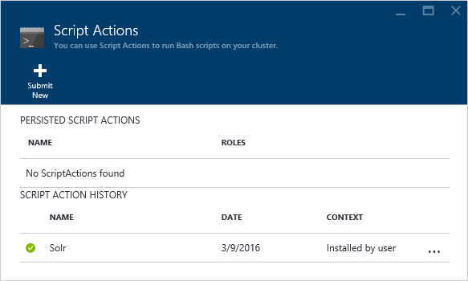

<properties
    pageTitle="Personalizzare cluster HDInsight mediante le azioni script | Microsoft Azure"
    description="Informazioni su come aggiungere componenti personalizzati basati su Linux HDInsight cluster utilizzo di azioni di Script. Azioni di script sono Bash script che nei nodi del cluster e possono essere usate per personalizzare la configurazione di cluster o aggiungere altri servizi e utilità come tonalità, Solr o R."
    services="hdinsight"
    documentationCenter=""
    authors="Blackmist"
    manager="jhubbard"
    editor="cgronlun"
    tags="azure-portal"/>

<tags
    ms.service="hdinsight"
    ms.workload="big-data"
    ms.tgt_pltfrm="na"
    ms.devlang="na"
    ms.topic="article"
    ms.date="09/06/2016"
    ms.author="larryfr"/>

# Personalizzare i cluster basati su Linux HDInsight tramite Script azione

HDInsight fornisce un'opzione di configurazione denominata **Azione Script** che richiama script personalizzati per personalizzare il grafico. Questi script possono essere utilizzati durante la creazione di cluster o in un cluster già in esecuzione e vengono usati per installare componenti aggiuntivi o modificare le impostazioni di configurazione.

> [AZURE.NOTE] La possibilità di usare script azioni in un cluster già in esecuzione è disponibile solo per i cluster basati su Linux HDInsight. Per informazioni sull'utilizzo di azioni di script con i cluster basato su Windows, vedere [personalizzare HDInsight cluster tramite Script azione (Windows)](hdinsight-hadoop-customize-cluster.md).

Azioni di script possono anche essere pubblicate in Azure Marketplace come applicazione HDInsight. Alcuni degli esempi inclusi in questo documento Mostra come è possibile installare un'applicazione di HDInsight usando i comandi di azione script di PowerShell e .NET SDK. Per ulteriori informazioni sulle applicazioni HDInsight, vedere [le applicazioni di pubblicare HDInsight in Azure Marketplace](hdinsight-apps-publish-applications.md). 

## Informazioni sulle azioni di Script

Un'azione Script è semplicemente un Bash script che viene fornito un URL e parametri per e quindi è stato eseguito nei nodi del cluster HDInsight. Di seguito sono le caratteristiche e le funzionalità di azioni di script.

* Deve essere memorizzato su un URI accessibile dal cluster HDInsight. Di seguito sono possibili percorsi di archiviazione:

    * Un account di archiviazione blob è lo spazio di archiviazione principale o altre account per il cluster HDInsight. Poiché HDInsight è concesso l'accesso a entrambi i tipi di account di archiviazione durante la creazione di cluster, questi consentono di utilizzare un'azione script non pubblici.
    
    * URI pubblicamente leggibile, ad esempio un Blob Azure, GitHub, OneDrive, Dropbox, e così via.
    
    Per esempi di URI per script memorizzati nel contenitore di blob (pubblicamente leggibili), vedere la sezione [script azione script di esempio](#example-script-action-scripts) .

* È possibile limitare a __eseguire su solo determinati tipi di nodo__, ad esempio testa nodi o lavoro.

    > [AZURE.NOTE] Quando si utilizza HDInsight Premium, è possibile specificare che lo script deve essere utilizzato in nodo del bordo.

* Può essere __mantenuta__ o __ad hoc__.

    Gli script __persistenza__ sono script che vengono applicati ai nodi di lavoro e verrà eseguito automaticamente su nuovi nodi creati durante il ridimensionamento di un cluster.

    Uno script persistente potrebbe anche applicare le modifiche a un altro tipo di nodo, ad esempio un nodo principale, ma dal punto di vista funzionalità l'unico motivo mantenere uno script è in modo it si applica a nuovi nodi di lavoro creati quando un cluster viene ridimensionato fuori.

    > [AZURE.IMPORTANT] Le azioni script persistente devono avere un nome univoco.

    __Hoc__ script non vengono mantenute; Tuttavia, è possibile successivamente alzare di livello uno script ad hoc a uno script persistente o abbassare di livello un script persistente di uno script ad hoc.

    > [AZURE.IMPORTANT] Azioni di script utilizzate durante la creazione di cluster automaticamente vengono mantenute.
    >
    > Mantenere gli script che non hanno esito negativo, anche se si indica in particolare che devono essere.

* Può accettare __i parametri__ vengono usati dallo script durante l'esecuzione.

* Esecuzione con __privilegi a livello radice__ nei nodi del cluster.

* Può essere utilizzato tramite il __portale di Azure__, __PowerShell di Azure__, __CLI Azure__o __HDInsight.NET SDK__

    [AZURE.INCLUDE [upgrade-powershell](../../includes/hdinsight-use-latest-powershell-cli-and-dotnet-sdk.md)]

Per facilitare la comprensione quali script sono stati applicati a un cluster e per determinare che l'ID di script per promozione o retrocessione, cluster conserva la cronologia di tutti gli script che sono stati è stato eseguito.

> [AZURE.IMPORTANT] Non è automatica per annullare le modifiche apportate da un'azione script. Se è necessario annullare gli effetti di uno script, è necessario comprendere le modifiche apportate e manualmente invertirne (o fornire un'azione script che li inverte.)

### Azione di script nel processo di creazione cluster

Azioni di script utilizzate durante la creazione di cluster sono leggermente diverse da script azioni eseguite su un cluster esistente:

* Lo script viene __mantenuto automaticamente__.

* __Errore__ lo script può causare il processo di creazione cluster l'esito negativo.

Il diagramma seguente illustra durante l'esecuzione Script azione durante il processo di creazione:

![Personalizzazione di cluster HDInsight e fasi durante la creazione di cluster][img-hdi-cluster-states]

Lo script è stato eseguito mentre viene configurato HDInsight. In questa fase, lo script eseguito in parallelo su tutti i nodi specificati nel cluster ed esecuzione con privilegi root nei nodi.

> [AZURE.NOTE] Perché lo script è stato eseguito con privilegi di livello principale nei nodi del cluster, è possibile eseguire operazioni come arrestare e avviare servizi, inclusi quelli relativi Hadoop. Se si interrompono servizi, è necessario assicurarsi che il servizio Ambari e altri servizi di Hadoop sono in esecuzione prima che lo script al termine dell'esecuzione. Questi servizi sono necessari per definire l'integrità e lo stato del cluster durante la creazione.

Durante la creazione di cluster, è possibile specificare più azioni di script richiamati nell'ordine in cui sono stati specificati.

> [AZURE.IMPORTANT] Azioni di script devono essere completate entro 60 minuti oppure vengono riprodotti timeout. Durante il provisioning di cluster, lo script è stato eseguito contemporaneamente ad altri processi di installazione e configurazione. Concorrenza per le risorse, ad esempio ora o in rete larghezza di banda può causare lo script richiedere più tempo rispetto a un ambiente di sviluppo.
>
> Per ridurre al minimo il tempo che necessario per eseguire lo script, evitare di attività, ad esempio il download e la compilazione di applicazioni dall'origine. Se, tuttavia, pre-compilare l'applicazione e archiviare il file binario in archiviazione Blob Azure in modo che può essere scaricato rapidamente al cluster.

###Azione di script in un cluster in esecuzione

Diversamente da quanto succede azioni utilizzate durante la creazione di cluster, un errore di uno script eseguite in un cluster già in esecuzione script non determina automaticamente il cluster modificare in stato di errore. Al termine di uno script, il cluster deve restituire a uno stato "esecuzione".

> [AZURE.IMPORTANT] Ciò significa che il cluster in esecuzione è disfunzioni agli script che eseguire operazioni errate. Ad esempio uno script Impossibile eliminare i file necessari per il cluster, configurazione di modifica, in modo che i servizi e così via.
>
> Script azioni eseguite con privilegi di radice, pertanto è necessario assicurarsi comprendere che cosa significa uno script prima di applicare al cluster.

Quando si applica uno script in un cluster, lo stato del cluster verrà modificare in __esecuzione__ in __accettato__, quindi __HDInsight configurazione__e infine di nuovo a __eseguire__ per gli script di esito negativo. Lo stato di script è registrato nella cronologia azione script e utilizzare questo per determinare se lo script di esito positivo o negativo. Ad esempio, il `Get-AzureRmHDInsightScriptActionHistory` cmdlet di PowerShell può essere utilizzato per visualizzare lo stato di uno script. Verrà restituito informazioni simile al seguente:

    ScriptExecutionId : 635918532516474303
    StartTime         : 2/23/2016 7:40:55 PM
    EndTime           : 2/23/2016 7:41:05 PM
    Status            : Succeeded

> [AZURE.NOTE] Se è stato modificato la password dell'utente (amministratori) cluster dopo il cluster è stato creato, potrebbe script azioni state eseguite su questo cluster l'esito negativo. Se si dispone di tutte le azioni di script persistente che nodi di lavoro di destinazione, si potrebbe non riuscire quando si aggiungono nodi al cluster tramite operazioni di ridimensionamento.

## Script di azione Script di esempio

Script di azione script può essere utilizzato dal portale di Azure, PowerShell di Azure, CLI Azure o HDInsight .NET SDK. HDInsight fornisce script per installare i componenti seguenti nei cluster HDInsight:

Nome | Script
----- | -----
**Aggiungere un account di archiviazione Azure** | https://hdiconfigactions.BLOB.Core.Windows.NET/linuxaddstorageaccountv01/Add-Storage-account-v01.sh. Vedere [applicare un'azione Script in un cluster di esecuzione](#apply-a-script-action-to-a-running-cluster).
**Installare tonalità** | https://hdiconfigactions.BLOB.Core.Windows.NET/linuxhueconfigactionv02/Install-Hue-uber-v02.sh. Vedere [installare e utilizzare cluster di tonalità in HDInsight](hdinsight-hadoop-hue-linux.md).
**Installare R** | https://hdiconfigactions.BLOB.Core.Windows.NET/linuxrconfigactionv01/r-Installer-v01.sh. Vedere [installazione e uso R su cluster HDInsight](hdinsight-hadoop-r-scripts-linux.md).
**Installare Solr** | https://hdiconfigactions.BLOB.Core.Windows.NET/linuxsolrconfigactionv01/solr-Installer-v01.sh. Vedere [installare e utilizzare cluster di Solr su HDInsight](hdinsight-hadoop-solr-install-linux.md).
**Installare Giraph** | https://hdiconfigactions.BLOB.Core.Windows.NET/linuxgiraphconfigactionv01/giraph-Installer-v01.sh. Vedere [installare e utilizzare cluster di Giraph su HDInsight](hdinsight-hadoop-giraph-install-linux.md).
| **Pre-caricare Hive raccolte** | https://hdiconfigactions.BLOB.Core.Windows.NET/linuxsetupcustomhivelibsv01/Setup-customhivelibs-v01.sh. Vedere [aggiungere Hive raccolte in cluster HDInsight](hdinsight-hadoop-add-hive-libraries.md) |

## Utilizzare un'azione Script durante la creazione di cluster

In questa sezione sono forniti esempi in diversi modi, che è possibile utilizzare le azioni script quando si crea un cluster di HDInsight - dal portale di Azure, utilizzando un modello di gestione risorse di Azure, utilizzando CMDlets di PowerShell e usare .NET SDK.

### Utilizzare un'azione Script durante la creazione di cluster dal portale di Azure

1. Iniziare a creare un cluster come descritto nel [cluster di creare Hadoop in HDInsight](hdinsight-provision-clusters.md#portal).

2. Nella sezione __Configurazione facoltativa__per e il **Script azioni** fare clic su **Aggiungi azione script** per fornire dettagli sull'azione script come illustrato di seguito:

    

  	| Proprietà | Valore |
  	| -------- | ----- |
  	| Nome | Specificare un nome per l'azione script. |
  	| Script URI | Specificare l'URI per lo script richiamato per personalizzare il grafico. |
  	| Testa/lavoro | Specificare i nodi (**testa**, **lavoro**o **ZooKeeper**) in cui viene eseguito lo script di personalizzazione. |
  	| Parametri | Specificare i parametri, se richiesto dallo script. |

    Premere INVIO per aggiungere più di un'azione di script per installare componenti multipli nel cluster.

3. Fare clic su **Seleziona** per salvare la configurazione e continuare con la creazione di cluster.

### Utilizzare un'azione Script dai modelli di Manager delle risorse di Azure

In questa sezione, modelli di gestione di risorse Azure viene utilizzato per creare un cluster di HDInsight e anche utilizzare un'azione script per installare componenti personalizzati (in questo esempio, R) nel cluster. In questa sezione fornisce un esempio di modello per creare un cluster tramite script azione.

> [AZURE.NOTE] La procedura descritta in questa sezione vengono illustrate la creazione di un cluster di utilizzo di un'azione script. Per un esempio di creazione di un cluster da un modello usando un'applicazione di HDInsight, vedere [installare applicazioni personalizzate HDInsight](hdinsight-apps-install-custom-applications.md).

#### Prima di iniziare

* Per informazioni sulla configurazione di una workstation per eseguire i cmdlet di HDInsight Powershell, vedere [installare e configurare Azure PowerShell](../powershell-install-configure.md).
* Per istruzioni su come creare un modello, vedere [modelli di creazione condivisa Manager delle risorse di Azure](../resource-group-authoring-templates.md).
* Se non è stato già utilizzato Azure PowerShell Gestione risorse, vedere [Uso di PowerShell Azure Gestione risorse Azure](../powershell-azure-resource-manager.md).

#### Creare cluster tramite Script azione

1. Copiare il modello seguente in un percorso nel computer in uso. Questo modello consente di installare Giraph nella headnodes e nodi di lavoro del cluster. È inoltre possibile verificare se il modello JSON è valido. Incollare il contenuto del modello [JSONLint](http://jsonlint.com/), uno strumento di convalida JSON online.

            {
            "$schema": "http://schema.management.azure.com/schemas/2015-01-01/deploymentTemplate.json#",
            "contentVersion": "1.0.0.0",
            "parameters": {
                "clusterLocation": {
                    "type": "string",
                    "defaultValue": "West US",
                    "allowedValues": [ "West US" ]
                },
                "clusterName": {
                    "type": "string"
                },
                "clusterUserName": {
                    "type": "string",
                    "defaultValue": "admin"
                },
                "clusterUserPassword": {
                    "type": "securestring"
                },
                "sshUserName": {
                    "type": "string",
                    "defaultValue": "username"
                },
                "sshPassword": {
                    "type": "securestring"
                },
                "clusterStorageAccountName": {
                    "type": "string"
                },
                "clusterStorageAccountResourceGroup": {
                    "type": "string"
                },
                "clusterStorageType": {
                    "type": "string",
                    "defaultValue": "Standard_LRS",
                    "allowedValues": [
                        "Standard_LRS",
                        "Standard_GRS",
                        "Standard_ZRS"
                    ]
                },
                "clusterStorageAccountContainer": {
                    "type": "string"
                },
                "clusterHeadNodeCount": {
                    "type": "int",
                    "defaultValue": 1
                },
                "clusterWorkerNodeCount": {
                    "type": "int",
                    "defaultValue": 2
                }
            },
            "variables": {
            },
            "resources": [
                {
                    "name": "[parameters('clusterStorageAccountName')]",
                    "type": "Microsoft.Storage/storageAccounts",
                    "location": "[parameters('clusterLocation')]",
                    "apiVersion": "2015-05-01-preview",
                    "dependsOn": [ ],
                    "tags": { },
                    "properties": {
                        "accountType": "[parameters('clusterStorageType')]"
                    }
                },
                {
                    "name": "[parameters('clusterName')]",
                    "type": "Microsoft.HDInsight/clusters",
                    "location": "[parameters('clusterLocation')]",
                    "apiVersion": "2015-03-01-preview",
                    "dependsOn": [
                        "[concat('Microsoft.Storage/storageAccounts/', parameters('clusterStorageAccountName'))]"
                    ],
                    "tags": { },
                    "properties": {
                        "clusterVersion": "3.2",
                        "osType": "Linux",
                        "clusterDefinition": {
                            "kind": "hadoop",
                            "configurations": {
                                "gateway": {
                                    "restAuthCredential.isEnabled": true,
                                    "restAuthCredential.username": "[parameters('clusterUserName')]",
                                    "restAuthCredential.password": "[parameters('clusterUserPassword')]"
                                }
                            }
                        },
                        "storageProfile": {
                            "storageaccounts": [
                                {
                                    "name": "[concat(parameters('clusterStorageAccountName'),'.blob.core.windows.net')]",
                                    "isDefault": true,
                                    "container": "[parameters('clusterStorageAccountContainer')]",
                                    "key": "[listKeys(resourceId('Microsoft.Storage/storageAccounts', parameters('clusterStorageAccountName')), '2015-05-01-preview').key1]"
                                }
                            ]
                        },
                        "computeProfile": {
                            "roles": [
                                {
                                    "name": "headnode",
                                    "targetInstanceCount": "[parameters('clusterHeadNodeCount')]",
                                    "hardwareProfile": {
                                        "vmSize": "Large"
                                    },
                                    "osProfile": {
                                        "linuxOperatingSystemProfile": {
                                            "username": "[parameters('sshUserName')]",
                                            "password": "[parameters('sshPassword')]"
                                        }
                                    },
                                    "scriptActions": [
                                        {
                                            "name": "installGiraph",
                                            "uri": "https://hdiconfigactions.blob.core.windows.net/linuxgiraphconfigactionv01/giraph-installer-v01.sh",
                                            "parameters": ""
                                        }
                                    ]
                                },
                                {
                                    "name": "workernode",
                                    "targetInstanceCount": "[parameters('clusterWorkerNodeCount')]",
                                    "hardwareProfile": {
                                        "vmSize": "Large"
                                    },
                                    "osProfile": {
                                        "linuxOperatingSystemProfile": {
                                            "username": "[parameters('sshUserName')]",
                                            "password": "[parameters('sshPassword')]"
                                        }
                                    },
                                    "scriptActions": [
                                        {
                                            "name": "installR",
                                            "uri": "https://hdiconfigactions.blob.core.windows.net/linuxrconfigactionv01/r-installer-v01.sh",
                                            "parameters": ""
                                        }
                                    ]
                                }
                            ]
                        }
                    }
                }
            ],
            "outputs": {
                "cluster":{
                    "type" : "object",
                    "value" : "[reference(resourceId('Microsoft.HDInsight/clusters',parameters('clusterName')))]"
                }
            }
        }

2. Avviare PowerShell Azure e accesso al proprio account Azure. Dopo avere fornito le credenziali, il comando restituisce le informazioni sull'account.

        Add-AzureRmAccount

        Id                             Type       ...
        --                             ----
        someone@example.com            User       ...

3. Se si hanno più abbonamenti, fornire l'id di abbonamento che si desidera utilizzare per la distribuzione.

        Select-AzureRmSubscription -SubscriptionID <YourSubscriptionId>

    > [AZURE.NOTE] È possibile utilizzare `Get-AzureRmSubscription` per ottenere un elenco di tutte le sottoscrizioni associata al proprio account, che include l'Id di abbonamento per ognuna di esse.

5. Se non si dispone di un gruppo di risorse esistente, creare un nuovo gruppo di risorse. Specificare il nome del gruppo di risorse e percorso in cui è necessario per la soluzione. Viene restituito un riepilogo di nuovo gruppo di risorse.

        New-AzureRmResourceGroup -Name myresourcegroup -Location "West US"

        ResourceGroupName : myresourcegroup
        Location          : westus
        ProvisioningState : Succeeded
        Tags              :
        Permissions       :
                            Actions  NotActions
                            =======  ==========
                            *
        ResourceId        : /subscriptions/######/resourceGroups/ExampleResourceGroup

6. Per creare una nuova distribuzione per il gruppo di risorse, eseguire il comando **Nuovo AzureRmResourceGroupDeployment** e fornire i parametri necessari. I parametri includerà un nome per la distribuzione, il nome del gruppo di risorse e il percorso o l'URL per il modello che è stato creato. Se il modello richiede tutti i parametri, è necessario passare anche i parametri. In questo caso, l'azione di script per installare R nel cluster non richiede parametri.

        New-AzureRmResourceGroupDeployment -Name mydeployment -ResourceGroupName myresourcegroup -TemplateFile <PathOrLinkToTemplate>

    Verrà richiesto di specificare i valori per i parametri definiti nel modello.

7. Quando il gruppo di risorse è stato distribuito, verrà visualizzato un riepilogo della distribuzione.

          DeploymentName    : mydeployment
          ResourceGroupName : myresourcegroup
          ProvisioningState : Succeeded
          Timestamp         : 8/17/2015 7:00:27 PM
          Mode              : Incremental
          ...

8. Se la distribuzione non riesce, è possibile utilizzare i cmdlet seguenti per ottenere informazioni sugli errori.

        Get-AzureRmResourceGroupDeployment -ResourceGroupName myresourcegroup -ProvisioningState Failed

### Utilizzare un'azione Script durante la creazione di cluster da Azure PowerShell

In questa sezione è utilizzare il cmdlet [Aggiungi AzureRmHDInsightScriptAction](https://msdn.microsoft.com/library/mt603527.aspx) per richiamare gli script tramite Script azione per personalizzare un cluster. Prima di procedere, verificare che è stato installato e configurato Azure PowerShell. Per informazioni sulla configurazione di una workstation per eseguire i cmdlet di HDInsight PowerShell, vedere [installare e configurare Azure PowerShell](../powershell-install-configure.md).

Eseguire i passaggi seguenti:

1. Aprire la console di PowerShell Azure e utilizzare le operazioni seguenti per accedere al proprio abbonamento Azure e dichiarare alcune variabili di PowerShell:

        # LOGIN TO ZURE
        Login-AzureRmAccount

        # PROVIDE VALUES FOR THESE VARIABLES
        $subscriptionId = "<SubscriptionId>"        # ID of the Azure subscription
        $clusterName = "<HDInsightClusterName>"         # HDInsight cluster name
        $storageAccountName = "<StorageAccountName>"    # Azure storage account that hosts the default container
        $storageAccountKey = "<StorageAccountKey>"      # Key for the storage account
        $containerName = $clusterName
        $location = "<MicrosoftDataCenter>"             # Location of the HDInsight cluster. It must be in the same data center as the storage account.
        $clusterNodes = <ClusterSizeInNumbers>          # The number of nodes in the HDInsight cluster.
        $resourceGroupName = "<ResourceGroupName>"      # The resource group that the HDInsight cluster will be created in

2. Specificare i valori di configurazione (ad esempio nodi del cluster) e lo spazio di archiviazione predefinito da utilizzare.

        # SPECIFY THE CONFIGURATION OPTIONS
        Select-AzureRmSubscription -SubscriptionId $subscriptionId
        $config = New-AzureRmHDInsightClusterConfig
        $config.DefaultStorageAccountName="$storageAccountName.blob.core.windows.net"
        $config.DefaultStorageAccountKey=$storageAccountKey

3. Usare **Aggiungi AzureRmHDInsightScriptAction** cmdlet per richiamare lo script. Nell'esempio seguente viene utilizzato uno script che installa Giraph sul cluster:

        # INVOKE THE SCRIPT USING THE SCRIPT ACTION FOR HEADNODE AND WORKERNODE
        $config = Add-AzureRmHDInsightScriptAction -Config $config -Name "Install Giraph"  -NodeType HeadNode -Uri https://hdiconfigactions.blob.core.windows.net/linuxgiraphconfigactionv01/giraph-installer-v01.sh
        $config = Add-AzureRmHDInsightScriptAction -Config $config -Name "Install Giraph"  -NodeType WorkerNode -Uri https://hdiconfigactions.blob.core.windows.net/linuxgiraphconfigactionv01/giraph-installer-v01.sh

    Il cmdlet **Aggiungi AzureRmHDInsightScriptAction** accetta i parametri seguenti:

  	| Parametro | Definizione |
  	| --------- | ---------- |
  	| Configurazione | Oggetto di configurazione a quale script viene aggiunto le informazioni sull'azione. |
  	| Nome | Nome dell'azione script. |
  	| Tipo di nodo | Specifica il nodo in cui viene eseguito lo script di personalizzazione. I valori validi sono **HeadNode** (per installare sul nodo principale), **WorkerNode** (per installare in tutti i nodi di dati), o **ZookeeperNode** (per installare sul nodo zookeeper). |
  	| Parametri | Parametri richiesti per lo script. |
  	| URI | Specifica l'URI da script che viene eseguito. |

4. Impostare l'utente di amministrazione/HTTPS per il cluster:

        $httpCreds = get-credential

    Quando richiesto, immettere 'admin' come nome e fornire una password.

5. Impostare le credenziali SSH:

        $sshCreds = get-credential

    Quando richiesto, immettere il nome utente SSH e la password. Se si desidera proteggere l'account SSH con un certificato invece di una password, utilizzare una password e impostare `$sshPublicKey` il contenuto di una chiave pubblica del certificato che si desidera utilizzare. Per esempio:

        $sshPublicKey = Get-Content .\path\to\public.key -Raw

4. Infine, creare il cluster:

        New-AzureRmHDInsightCluster -config $config -clustername $clusterName -DefaultStorageContainer $containerName -Location $location -ResourceGroupName $resourceGroupName -ClusterSizeInNodes $clusterNodes -HttpCredential $httpCreds -SshCredential $sshCreds -OSType Linux

    Se si utilizza una chiave pubblica per proteggere l'account SSH, è necessario specificare anche `-SshPublicKey $sshPublicKey` come parametro.

È possibile richiedere alcuni minuti prima che venga creato il grafico.

### Utilizzare un'azione Script durante la creazione di cluster da HDInsight .NET SDK

HDInsight .NET SDK fornisce raccolte client che rende più facile da utilizzare con HDInsight da un'applicazione .NET. Per un esempio di codice, vedere [cluster basati su Linux creare in HDInsight utilizzando .NET SDK](hdinsight-hadoop-create-linux-clusters-dotnet-sdk.md#use-script-action).

## Applicare un'azione Script in un cluster di esecuzione

In questa sezione sono forniti esempi in diversi modi per applicare le azioni script a un cluster di HDInsight in esecuzione. dal portale di Azure tramite PowerShell CMDlets, tramite CLI Azure multipiattaforma e tramite .NET SDK. L'azione script persistente in questa sezione aggiunge un account di archiviazione Azure esistente a un cluster in esecuzione. È inoltre possibile utilizzare altre azioni di script, vedere [gli script di esempio Script azione](#example-script-action-scripts).

### Applicare un'azione Script in un cluster di esecuzione dal portale di Azure

1. Dal [portale di Azure](https://portal.azure.com), selezionare il cluster HDInsight.

2. Selezionare il riquadro __Azioni di Script__ e il cluster HDInsight.

    

    > [AZURE.NOTE] È anche possibile selezionare __tutte le impostazioni__ e quindi selezionare __Le azioni Script__ e l'impostazioni.

4. Nella parte superiore della stessa e le azioni Script, selezionare __Invia nuova__.

    

5. Da e l'Aggiungi azione Script, immettere le informazioni seguenti.

    * __Nome__: il nome descrittivo da utilizzare per questa azione di Script. In questo esempio, `Add Storage account`.
    * __URI SCRIPT__: URI per lo script. In questo esempio,`https://hdiconfigactions.blob.core.windows.net/linuxaddstorageaccountv01/add-storage-account-v01.sh`
    * __Testa__, __lavoro__e __Zookeeper__: controllare i nodi che questo script deve essere applicato a. In questo esempio vengono controllate testa, lavoro e Zookeeper.
    * __Parametri__: se lo script accetta parametri, immetterli qui. In questo esempio, immettere il nome dell'account di archiviazione e la chiave account di archiviazione:

        

        Nella schermata, `contosodata` già un account di archiviazione Azure, la seconda riga è la chiave account di archiviazione.
    * __Persistenza__: selezionare questa voce se si desidera mantenere lo script in modo che verrà applicato ai nuovi nodi di lavoro durante il ridimensionamento configurazione del cluster.

6. Infine, utilizzare il pulsante __Crea__ per applicare lo script al cluster.

### Applicare un'azione Script in un cluster di esecuzione di PowerShell di Azure

Prima di procedere, verificare che è stato installato e configurato Azure PowerShell. Per informazioni sulla configurazione di una workstation per eseguire i cmdlet di HDInsight PowerShell, vedere [installare e configurare Azure PowerShell](../powershell-install-configure.md).

1. Aprire la console di PowerShell Azure e utilizzare le operazioni seguenti per accedere al proprio abbonamento Azure e dichiarare alcune variabili di PowerShell:

        # LOGIN TO ZURE
        Login-AzureRmAccount

        # PROVIDE VALUES FOR THESE VARIABLES
        $clusterName = "<HDInsightClusterName>"         # HDInsight cluster name
        $saName = "<ScriptActionName>"                  # Name of the script action
        $saURI = "<URI to the script>"                  # The URI where the script is located
        $nodeTypes = "headnode", "workernode"
        
    > [AZURE.NOTE] In un cluster HDInsight Premium, è possibile utilizzare un tipo del `"edgenode"` per eseguire lo script nella nodo del bordo.

2. Utilizzare il comando seguente per applicare lo script al cluster:

        Submit-AzureRmHDInsightScriptAction -ClusterName $clusterName -Name $saName -Uri $saURI -NodeTypes $nodeTypes -PersistOnSuccess

    Al termine del processo, si deve ricevere informazioni simile al seguente:

        OperationState  : Succeeded
        ErrorMessage    :
        Name            : Giraph
        Uri             : https://hdiconfigactions.blob.core.windows.net/linuxgiraphconfigactionv01/giraph-installer-v01.sh
        Parameters      :
        NodeTypes       : {HeadNode, WorkerNode}

### Applicare un'azione Script in un cluster di esecuzione CLI Azure

Prima di procedere, verificare che è stato installato e configurato CLI Azure. Per ulteriori informazioni, vedere [installare CLI Azure](../xplat-cli-install.md).

    [AZURE.INCLUDE [use-latest-version](../../includes/hdinsight-use-latest-cli.md)] 

1. Aprire una sessione di shell, terminale, prompt dei comandi o altre opzioni della riga per il sistema e usare il comando seguente per passare alla modalità di gestione di risorse Azure.

        azure config mode arm

2. Utilizzare le operazioni seguenti per eseguire l'autenticazione all'abbonamento Azure.

        azure login

3. Usare il comando seguente per applicare un'azione script in un cluster di esecuzione

        azure hdinsight script-action create <clustername> -g <resourcegroupname> -n <scriptname> -u <scriptURI> -t <nodetypes>

    Se si omettono parametri per questo comando, verrà richiesto di loro. Se lo script specifica con `-u` accetta parametri, è possibile specificare utilizzando il `-p` parametro.

    Valido __nodetypes__ sono __headnode__, __workernode__e __zookeeper__. Se lo script deve essere applicato a più tipi di nodo, specificare i tipi separati da un ";". Ad esempio `-n headnode;workernode`.

    Per mantenere lo script, aggiungere il `--persistOnSuccess`. È anche possibile mantenere lo script in un secondo momento tramite `azure hdinsight script-action persisted set`.
    
    Al termine del processo, si riceverà output simile al seguente.
    
        info:    Executing command hdinsight script-action create
        + Executing Script Action on HDInsight cluster
        data:    Operation Info
        data:    ---------------
        data:    Operation status:
        data:    Operation ID:  b707b10e-e633-45c0-baa9-8aed3d348c13
        info:    hdinsight script-action create command OK

### Applicare un'azione Script a un cluster in esecuzione tramite l'API REST

Vedere [Eseguire le azioni di Script in un cluster in esecuzione](https://msdn.microsoft.com/library/azure/mt668441.aspx).
### Applicare un'azione Script in un cluster di esecuzione di .NET SDK HDInsight

Per un esempio dell'utilizzo di .NET SDK per applicare lo script in un cluster, vedere [https://github.com/Azure-Samples/hdinsight-dotnet-script-action](https://github.com/Azure-Samples/hdinsight-dotnet-script-action).

## Visualizzare la cronologia, alzare di livello e Abbassa di livello le azioni Script

### Tramite il portale di Azure

1. Dal [portale di Azure](https://portal.azure.com), selezionare il cluster HDInsight.

2. Selezionare __Impostazioni__e il cluster HDInsight.

    

3. Selezionare __Le azioni Script__e l'impostazioni.

    

4. Viene visualizzato un elenco di script persistente, come la cronologia di script applicati al cluster in e l'azioni Script. Nella schermata seguente, è possibile vedere che Solr script è stato eseguito sul cluster, ma che non sono state mantenute alcuna azione script.

    

5. Selezione di uno script dalla cronologia vengono visualizzati e il proprietà per questo script. Nella parte superiore e il, è possibile eseguire nuovamente lo script o convertirlo.

    

6. È inoltre possibile utilizzare __…__ a destra delle voci selezionate in e l'azioni di Script per eseguire azioni come ripetuto, mantenere o (per le azioni persistente,) eliminare.

    

### Utilizzo di PowerShell Azure

| Utilizzare quanto segue... | A... |
| ----- | ----- |
| Get-AzureRmHDInsightPersistedScriptAction | Recuperare le informazioni sulle azioni script persistente |
| Get-AzureRmHDInsightScriptActionHistory | Recuperare una cronologia delle azioni di script applicato al grafico o dettagli per uno script specifico |
| Set AzureRmHDInsightPersistedScriptAction | Alzare di livello un'azione script ad hoc a un'azione script persistente |
| Rimuovi AzureRmHDInsightPersistedScriptAction | Abbassa di livello un'azione script persistente a un'azione ad hoc |

> [AZURE.IMPORTANT] Utilizzo `Remove-AzureRmHDInsightPersistedScriptAction` non non Annulla le azioni eseguite da uno script, viene rimosso solo il contrassegno persistente in modo che lo script non essere eseguito su nuovi nodi di lavoro aggiunti al cluster.

Script di esempio seguente viene illustrato come utilizzare i cmdlet per alzare di livello e Abbassa di livello uno script.

    # Get a history of scripts
    Get-AzureRmHDInsightScriptActionHistory -ClusterName mycluster

    # From the list, we want to get information on a specific script
    Get-AzureRmHDInsightScriptActionHistory -ClusterName mycluster -ScriptExecutionId 635920937765978529

    # Promote this to a persisted script
    # Note: the script must have a unique name to be promoted
    # if the name is not unique, you will receive an error
    Set-AzureRmHDInsightPersistedScriptAction -ClusterName mycluster -ScriptExecutionId 635920937765978529

    # Demote the script back to ad hoc
    # Note that demotion uses the unique script name instead of
    # execution ID.
    Remove-AzureRmHDInsightPersistedScriptAction -ClusterName mycluster -Name "Install Giraph"

### Usa CLI Azure

| Utilizzare quanto segue... | A... |
| ----- | ----- |
| `azure hdinsight script-action persisted list <clustername>` | Recuperare un elenco di azioni di script persistente |
| `azure hdinsight script-action persisted show <clustername> <scriptname>` | Recuperare le informazioni su un'azione script persistente specifico |
| `azure hdinsight script-action history list <clustername>` | Recuperare una cronologia delle azioni di script applicato al cluster |
| `azure hdinsight script-action history show <clustername> <scriptname>` | Recuperare le informazioni su un'azione script specifico |
| `azure hdinsight script action persisted set <clustername> <scriptexecutionid>` | Alzare di livello un'azione script ad hoc a un'azione script persistente |
| `azure hdinsight script-action persisted delete <clustername> <scriptname>` | Abbassa di livello un'azione script persistente a un'azione ad hoc |

> [AZURE.IMPORTANT] Utilizzo `azure hdinsight script-action persisted delete` non non Annulla le azioni eseguite da uno script, viene rimosso solo il contrassegno persistente in modo che lo script non essere eseguito su nuovi nodi di lavoro aggiunti al cluster.

### Mediante HDInsight .NET SDK

Per un esempio dell'uso di .NET SDK per recuperare cronologia script da un cluster di alzare o abbassare di livello script, vedere [https://github.com/Azure-Samples/hdinsight-dotnet-script-action](https://github.com/Azure-Samples/hdinsight-dotnet-script-action).

> [AZURE.NOTE] In questo esempio viene inoltre illustrato come installare un'applicazione di HDInsight utilizzando .NET SDK.

## Risoluzione dei problemi

È possibile utilizzare web Ambari dell'interfaccia utente per visualizzare informazioni registrate da azioni script. Se è stato utilizzato lo script durante la creazione di cluster e creazione di cluster non riuscita a causa di un errore dello script, i registri sono disponibili anche in account di archiviazione predefinito associato al cluster. In questa sezione vengono fornite informazioni su come recuperare i registri di entrambe le opzioni.

### Tramite l'interfaccia Web Ambari

1. Nel browser passare al https://CLUSTERNAME.azurehdinsight.net. Sostituire nome cluster con il nome del cluster HDInsight.

    Quando richiesto, immettere il nome dell'account amministratore (amministratore) e la password per il cluster. Potrebbe essere necessario reimmettere le credenziali di amministratore in un modulo web.

2. Sulla barra nella parte superiore della pagina, selezionare la voce di __operazioni__ . Questo viene visualizzato un elenco di corrente e quello precedente operazioni eseguite su cluster tramite Ambari.

    

3. Trovare le voci che dispongono __eseguire\_customscriptaction__ nella colonna __Operations__ . Vengono creati quando le azioni di Script è stato eseguito.

    

    Selezionare questa voce e il drill-down mediante i collegamenti per visualizzare l'output STDOUT e STDERR generato quando lo script non è stato eseguito sul cluster.

### Registri di accesso dall'account di archiviazione predefinito

Se la creazione di cluster non è riuscita a causa di un errore in azione script, i registri di azione script ancora è possibile accedervi direttamente dall'account di archiviazione predefinito associato al cluster.

* I registri di spazio di archiviazione sono disponibili al `\STORAGE_ACOCUNT_NAME\DEFAULT_CONTAINER_NAME\custom-scriptaction-logs\CLUSTER_NAME\DATE`.

    

    In questa operazione, i registri sono organizzati separatamente per headnode, workernode e nodi zookeeper. Alcuni esempi sono:
    * **Headnode** - `<uniqueidentifier>AmbariDb-hn0-<generated_value>.cloudapp.net`
    * **Nodo di lavoro** - `<uniqueidentifier>AmbariDb-wn0-<generated_value>.cloudapp.net`
    * **Nodo zookeeper** - `<uniqueidentifier>AmbariDb-zk0-<generated_value>.cloudapp.net`

* Account di archiviazione viene caricato tutti stdout e stderr dell'host corrispondente. Esiste una **output -\*txt** e **errori -\*txt** per ogni azione di script. Il file *. txt di output contiene informazioni relative all'URI dello script che se si ha eseguito nell'host. Per esempio

        'Start downloading script locally: ', u'https://hdiconfigactions.blob.core.windows.net/linuxrconfigactionv01/r-installer-v01.sh'

* È possibile creare più volte un cluster di azione di script con lo stesso nome. In tal caso, è possibile distinguere i log pertinenti in base al nome di cartella Data. Ad esempio, la struttura delle cartelle per un cluster (miocluster) creato in date diverse sarà:
    * `\STORAGE_ACOCUNT_NAME\DEFAULT_CONTAINER_NAME\custom-scriptaction-logs\mycluster\2015-10-04`
    * `\STORAGE_ACOCUNT_NAME\DEFAULT_CONTAINER_NAME\custom-scriptaction-logs\mycluster\2015-10-05`

* Se si crea un cluster di azione di script con lo stesso nome nello stesso giorno, è possibile utilizzare il prefisso univoco per identificare i file di log pertinenti.

* Se si crea un cluster alla fine del giorno, è possibile che i file di log interessano due giorni. In tal caso, si vedrà due cartelle data diversa per lo stesso cluster.

* Caricare i file di log il contenitore predefinito può impiegare fino a 5 minuti, in particolare per cluster di grandi dimensioni. Pertanto, se si desidera accedere ai log di, non immediatamente eliminare cluster se un'azione script non riesce.

## Supporto per il software open source utilizzato nei cluster HDInsight

Il servizio di Microsoft Azure HDInsight è una piattaforma flessibile che consente di creare applicazioni di grande dati nel cloud tramite un insieme di tecnologie Apri origine formato intorno Hadoop offre. Microsoft Azure offre un livello generale di supporto per la tecnologia Apri origine, come illustrato nella sezione **Ambito supporto** del [sito Web di Azure supportano domande frequenti su](https://azure.microsoft.com/support/faq/). Il servizio HDInsight fornisce un ulteriore livello di supporto per alcuni dei componenti, come descritto di seguito.

Esistono due tipi di componenti Apri origine che sono disponibili nel servizio HDInsight:

- **Componenti incorporati** : questi componenti nel cluster HDInsight preinstallati e fornire funzionalità di base del cluster. Ad esempio, ResourceManager filati, il linguaggio di query Hive (HiveQL) e la libreria Mahout appartengono a questa categoria. È disponibile in un elenco completo dei componenti cluster [quali sono le novità in versioni cluster Hadoop fornite da HDInsight?](hdinsight-component-versioning.md).

- **Componenti personalizzati** : l'utente, come utente del cluster, è possibile installare o utilizzare il carico di lavoro qualsiasi componente disponibile nella community di o creati dall'utente.

> [AZURE.WARNING] Componenti forniti con il cluster HDInsight sono completamente supportati e supporto Microsoft aiuta a isolare e risolvere i problemi relativi a questi componenti.
>
> Componenti personalizzati riceveranno supporto per le misure che consentono di risolvere il problema. Questo può comportare la risoluzione del problema o in cui viene richiesto di effettuare canali disponibili per le tecnologie Apri origine in cui si trova esperienza completa per tale tecnologia. Ad esempio, sono disponibili numerosi siti della community che possono essere usati, ad esempio: [forum MSDN per HDInsight](https://social.msdn.microsoft.com/Forums/azure/en-US/home?forum=hdinsight), [http://stackoverflow.com](http://stackoverflow.com). Progetti Apache dovranno siti di progetto in [http://apache.org](http://apache.org), ad esempio: [Hadoop](http://hadoop.apache.org/).

Il servizio HDInsight offre diversi modi per usare i componenti personalizzati. Indipendentemente da come un componente utilizzato o installato sul cluster, viene applicato lo stesso livello di supporto. Di seguito è riportato un elenco dei modi più comuni che è possono utilizzare componenti personalizzati nei cluster HDInsight:

1. Invio di processi - Hadoop o altri tipi di processi eseguire o che utilizzano componenti personalizzati può essere inviato al cluster.

2. Personalizzazione di cluster - durante la creazione di cluster, è possibile specificare impostazioni aggiuntive e i componenti personalizzati installata nei nodi del cluster.

3. Esempi di-per popolari componenti personalizzati, Microsoft e gli altri utenti possono offrire esempi di come questi componenti possono essere usati su cluster HDInsight. In questi esempi vengono forniti senza supporto.

##Risoluzione dei problemi

###Cronologia non è visibile script utilizzati durante la creazione di cluster

Se è stato creato il cluster prima di 15 marzo 2016, non si può visualizzare una voce della cronologia di azione Script per gli script utilizzati durante la creazione di cluster. Tuttavia, se si ridimensiona cluster dopo il 15 marzo 2016 gli script utilizzando durante la creazione di cluster verranno visualizzato nella cronologia come vengono applicati a nuovi nodi del cluster come parte dell'operazione di ridimensionamento.

Esistono due eccezioni:

* Se è stato creato il cluster prima del 1 ° settembre 2015. Si tratta di quando sono stati introdotti Script azioni, qualsiasi cluster creato prima di tale data non dispone di utilizzare azioni di Script per la creazione di cluster.

* Se è usato più azioni di Script durante la creazione di cluster e lo stesso nome per più script o lo stesso nome, stesso URI ma parametri diversi per più script. In questi casi, viene visualizzato l'errore seguente.

    Non possono essere eseguite alcuna azione script nuovo nel cluster a causa di conflitti tra i nomi di script in script esistenti. I nomi di script forniti al cluster creare deve essere univoco tutti. Verranno eseguiti script esistenti in caso di ridimensionamento.

## Passaggi successivi

Vedere la procedura seguente per esempi e informazioni sulla creazione e utilizzo di script per personalizzare un cluster:

- [Sviluppare script azione Script per HDInsight](hdinsight-hadoop-script-actions-linux.md)
- [Installare e usare Solr sui HDInsight cluster](hdinsight-hadoop-solr-install-linux.md)
- [Installare e usare Giraph sui HDInsight cluster](hdinsight-hadoop-giraph-install-linux.md)

[img-hdi-cluster-states]: ./media/hdinsight-hadoop-customize-cluster-linux/HDI-Cluster-state.png "Fasi durante la creazione di cluster"
