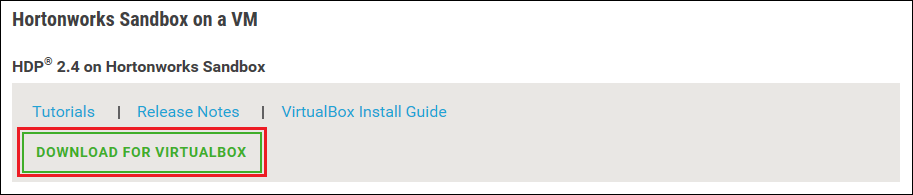

<properties
    pageTitle="Utilizzare una sandbox Hadoop per informazioni sulle Hadoop | Microsoft Azure"
    description="Per informazioni introduttive sull'utilizzo ecosistema Hadoop, è possibile impostare una sandbox Hadoop da Hortonworks in un computer virtuale Azure. "
    keywords="emulatore Hadoop, hadoop sandbox"
    editor="cgronlun"
    manager="jhubbard"
    services="hdinsight"
    authors="nitinme"
    documentationCenter=""
    tags="azure-portal"/>

<tags
    ms.service="hdinsight"
    ms.workload="big-data"
    ms.tgt_pltfrm="na"
    ms.devlang="na"
    ms.topic="article"
    ms.date="08/24/2016"
    ms.author="nitinme"/>

# Guida introduttiva a ecosistema Hadoop con una sandbox Hadoop in una macchina virtuale

Informazioni su come installare sandbox Hadoop da Hortonworks in una macchina virtuale per conoscere l'ecosistema Hadoop. La modalità sandbox offre un ambiente di sviluppo locale per informazioni sulle Hadoop, Hadoop Distributed File System (HDFS) e l'invio di processi.

## Prerequisiti

* [Oracle VirtualBox](https://www.virtualbox.org/)

Dopo avere acquisito familiarità con Hadoop, è possibile iniziare a usare Hadoop su Azure mediante la creazione di un cluster di HDInsight. Per ulteriori informazioni su come iniziare, vedere [Introduzione a Hadoop in HDInsight](hdinsight-hadoop-linux-tutorial-get-started.md).

## Scaricare e installare la macchina virtuale

1. Selezionare la voce di __DOWNLOAD per VIRTUALBOX__ per 2,4 HDP in modalità Hortonworks Sandbox [http://hortonworks.com/downloads/#sandbox](http://hortonworks.com/downloads/#sandbox). Verrà richiesto di eseguire la registrazione con Hortonworks prima di inizia il download.

    

2. Dalla stessa pagina web, selezionare la __Guida all'installazione di VirtualBox__ per 2,4 HDP in modalità Hortonworks Sandbox. Questa operazione verrà scaricato un file PDF contenente le istruzioni di installazione per la macchina virtuale.

    

## Avviare la macchina virtuale

1. Avviare VirtualBox, selezionare la modalità Hortonworks Sandbox, __avviare__e __Iniziare a normale__.

    

2. Al termine del processo di avvio la macchina virtuale, viene visualizzato istruzioni per l'accesso. Aprire un web browser e passare all'URL visualizzato (in genere http://127.0.0.1:8888).

## Impostare le password

1. Selezionare __Visualizzazione opzioni avanzate__della pagina Hortonworks Sandbox il passaggio __per iniziare__ . Usare le informazioni in questa pagina per l'accesso a sandbox utilizzando SSH. Usare il nome e la password forniti.

    > [AZURE.NOTE] Se non si dispone di un client SSH installato, è possibile usare SSH basato sul web fornite dalla macchina virtuale in __http://localhost:4200 /__.

    La prima volta che ci si connette utilizzando SSH, verrà richiesto di modificare la password dell'account principale. Immettere una nuova password, verrà utilizzata quando si accede utilizzando SSH in futuro.

2. Dopo aver effettuato l'accesso, immettere il comando seguente:

        ambari-admin-password-reset
    
    Quando richiesto, immettere una password per l'account dell'amministratore Ambari. Questa verrà utilizzata quando si accedere all'interfaccia utente Web Ambari.

## Usare il comando hive

1. Da un collegamento SSH per la modalità sandbox, utilizzare il comando seguente per avviare la shell Hive:

        hive

2. Una volta avviata la shell, utilizzare le operazioni seguenti per visualizzare le tabelle che vengono fornite con la modalità sandbox:

        show tables;

3. Utilizzare le operazioni seguenti per recuperare 10 righe dalla `sample_07` tabella:

        select * from sample_07 limit 10;

## Passaggi successivi

* [Informazioni su come utilizzare Visual Studio con la modalità Hortonworks Sandbox](hdinsight-hadoop-emulator-visual-studio.md)
* [Formazione cavi di Hortonworks Sandbox](http://hortonworks.com/hadoop-tutorial/learning-the-ropes-of-the-hortonworks-sandbox/)
* [Esercitazione Hadoop - Guida introduttiva a HDP](http://hortonworks.com/hadoop-tutorial/hello-world-an-introduction-to-hadoop-hcatalog-hive-and-pig/)