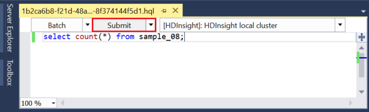
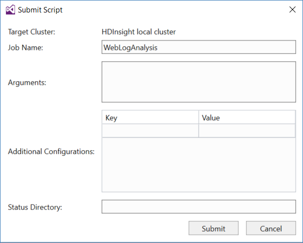

<properties
pageTitle="Utilizzare gli strumenti di Microsoft Azure dati Lake per Visual Studio con la modalità Sandbox Hortonworks | Microsoft Azure"
description="Informazioni su come usare Azure dati Lake Tools per VIsual Studio con la modalità sandbox Hortonworks (in esecuzione in una macchina virtuale locale). Con questi strumenti, è possibile creare ed eseguire processi Hive e maialino sandbox e visualizzare output processo e cronologia."
services="hdinsight"
documentationCenter=""
authors="Blackmist"
manager="paulettm"
editor="cgronlun"/>

<tags
ms.service="hdinsight"
ms.devlang="na"
ms.topic="article"
ms.tgt_pltfrm="na"
ms.workload="big-data"
ms.date="08/26/2016"
ms.author="larryfr"/>

# Utilizzare gli strumenti di Lake dati Azure per Visual Studio con la modalità Sandbox Hortonworks

Gli strumenti di Azure dati Lake per Visual Studio includono strumenti per l'utilizzo con i cluster Hadoop generico, oltre a strumenti per l'utilizzo di Azure dati Lake e HDInsight. Questo documento offre i passaggi necessari per utilizzare gli strumenti di Azure dati Lake con la modalità Hortonworks Sandbox in esecuzione in un computer virtuale locale.

Con la modalità Hortonworks Sandbox consente di lavorare con Hadoop in locale nel proprio ambiente di sviluppo. Dopo aver sviluppato una soluzione e si desidera distribuire in scala, quindi è possibile spostare a un cluster di HDInsight.

## Prerequisiti

* La modalità Hortonworks Sandbox in esecuzione in una macchina virtuale in un ambiente di sviluppo. In questo documento è stato scritto e testato con la modalità sandbox in esecuzione in Oracle VirtualBox, che è stata configurata con le informazioni nel documento [Guida introduttiva a ecosistema Hadoop](hdinsight-hadoop-emulator-get-started.md) .

* Visual Studio 2013 o 2015, qualsiasi edizione.

* [Azure SDK per .NET](https://azure.microsoft.com/downloads/) 2.7.1 o versioni successive

* [Dati di Azure Lake Tools per Visual Studio](https://www.microsoft.com/download/details.aspx?id=49504)

## Configurare le password per la modalità sandbox

Assicurarsi che la modalità Hortonworks Sandbox sia in esecuzione, quindi seguire le istruzioni nella [Guida introduttiva a ecosistema Hadoop](hdinsight-hadoop-emulator-get-started.md#set-passwords) per configurare la password per il SSH `root` account e il Ambari `admin` account. Verranno usate tali password quando ci si connette alla sandbox da Visual Studio.

## Connettere gli strumenti per la modalità sandbox

1. Aprire Visual Studio e selezionare __Visualizza__, quindi __Esplora Server__.

2. Da __Esplora Server__, fare clic con il pulsante destro sulla voce __HDInsight__ e scegliere __Connetti a emulatore HDInsight__.

    

3. Nella finestra di dialogo __Connetti a emulatore HDInsight__ immettere la password configurati per Ambari.

    

    Selezionare __Avanti__ per continuare.

4. Utilizzare il campo __Password__ immettere la password è configurato per il `root` account. Lasciare gli altri campi il valore predefinito.

    

    Selezionare __Avanti__ per continuare.

5. Attendere per la convalida dei servizi per completare. In alcuni casi, convalida potrebbe non riuscire ed è richiesto, è possibile aggiornare la configurazione. In questo caso, selezionare il pulsante __Aggiorna__ e attendere che la configurazione e la verifica completare il servizio.

    

    > [AZURE.NOTE] Il processo di aggiornamento utilizza Ambari per modificare la configurazione di Hortonworks Sandbox a quello previsto dagli strumenti di Azure dati Lake per Visual Studio.

    Al termine di convalida, selezionare __Fine__ per completare la configurazione.

    

    > [AZURE.NOTE] A seconda la velocità di un ambiente di sviluppo e la quantità di memoria disponibile per la macchina virtuale, è possibile richiedere alcuni minuti per configurare e convalidare i servizi.

Dopo la procedura seguente, è ora disponibile una voce "Cluster locale HDInsight" in Esplora Server nella sezione HDInsight.

## Scrivere una query di Hive

Hive fornisce un linguaggio di query SQL simili (HiveQL,) per l'utilizzo di dati strutturati. Utilizzare la procedura seguente per informazioni su come eseguire query ad hoc cluster locale.

1. In __Esplora Server__, pulsante destro del mouse sulla voce per il cluster locale aggiunto in precedenza e quindi selezionare __scrivere una query Hive__.

    

    Verrà aperta una nuova finestra query che consente di eseguire rapidamente digitare configurazione e invio di una query per il cluster locale.

2. Nella finestra della nuova query, immettere quanto segue:

        select count(*) from sample_08;
    
    Nella parte superiore della finestra della query, verificare che la configurazione per il cluster locale sia selezionato e quindi selezionare __Invia__. Lasciare gli altri valori (__Batch__ e nome server,) i valori predefiniti.

    

    Si noti che è possibile anche utilizzare sulla freccia accanto a __Invia__ a discesa per selezionare __Avanzate__. Verrà aperta una finestra di dialogo che consente di specificare altre opzioni quando si invia il processo.

    

3. Dopo l'invio di query, viene visualizzato lo stato del processo. Informazioni sul processo mentre viene elaborato da Hadoop. Voce di __Stato di processo__ fornisce lo stato corrente del processo. Lo stato verrà aggiornato periodicamente oppure è possibile usare l'icona Aggiorna per aggiornare manualmente lo stato.

    

    Una volta lo __Stato del processo__ viene modificato in __completato__, viene visualizzata un'indirizzati aciclici grafico (DAG). Descrive il percorso di esecuzione determinato da Tez (impostazione predefinita motore di esecuzione di Hive cluster locale.) 
    
    > [AZURE.NOTE] Tez è il valore predefinito quando si utilizza cluster basati su Linux HDInsight. Non è l'impostazione predefinita in basato su Windows HDInsight; Per utilizzarla, è necessario aggiungere la riga `set hive.execution.engine = tez;` all'inizio di una query Hive. 

    Utilizzare il collegamento di __Output processo__ per visualizzare l'output. In questo caso è __823__; il numero di righe nella tabella sample_08. È possibile visualizzare informazioni di diagnostica sul processo utilizzando i collegamenti __Del Log di processi__ e __Scaricare filati Log__ .

4. È anche possibile eseguire in modo interattivo Hive processi modificando il campo __Batch__ con __interattivo__e quindi selezionare __Esegui__. 

    

    Questo flusso del Registro di output generato durante l'elaborazione della finestra di __Output HiveServer2__ .
    
    > [AZURE.NOTE] Si tratta le stesse informazioni che sono disponibile sul collegamento __Log processi__ dopo il completamento di un processo.

    

## Creare un progetto Hive

È anche possibile creare un progetto che contiene più script Hive. Questo è utile quando esistono correlate script che è necessario tenere insieme o gestire utilizzando un sistemi di controllo delle versioni.

1. In Visual Studio, selezionare __File__, __Nuovo__e then__Project__.

2. Nell'elenco di progetti, espandere __modelli__, __Lake di dati di Azure__ e quindi selezionare __HIVE (HDInsight)__. Nell'elenco dei modelli, selezionare __Hive campione__. Immettere un nome e un percorso, quindi fare clic su __OK__.

    

Il progetto di __Esempio Hive__ contiene due script, __WebLogAnalysis.hql__ e __SensorDataAnalysis.hql__. È possibile inviare questi con lo stesso pulsante __Invia__ nella parte superiore della finestra.

## Creare un progetto maialino

Mentre Hive fornisce un linguaggio SQL per l'utilizzo di dati strutturati, maialino fornisce un linguaggio (alfabeto latino maialino), che consente di sviluppare una pipeline di trasformazioni che si applicano ai dati. Utilizzare la procedura seguente per utilizzare maialino con il cluster locale.

1. Aprire Visual Studio e selezionare __File__, __file__e quindi __progetto__. Nell'elenco di progetti, espandere __modelli__, __Lake di dati di Azure__e quindi selezionare __maialino (HDInsight)__. Nell'elenco di modelli, selezionare __Maialino applicazione__. Immettere un nome, percorso e fare clic su __OK__.

    

2. Immettere quanto segue come il contenuto del file __script.pig__ creato con il progetto.

        a = LOAD '/demo/data/Website/Website-Logs' AS (
            log_id:int, 
            ip_address:chararray, 
            date:chararray, 
            time:chararray, 
            landing_page:chararray, 
            source:chararray);
        b = FILTER a BY (log_id > 100);
        c = GROUP b BY ip_address;
        DUMP c;

    Benché maialino utilizza una lingua diversa rispetto Hive, come si eseguono i processi sono coerente tra entrambe le lingue tramite il pulsante __Invia__ . Selezionare l'elenco a discesa verso il basso accanto a __Invia__ consente di visualizzare una finestra di dialogo Impostazioni di invio avanzate per maialino.

    
    
3. Lo stato dei processi di output viene inoltre visualizzato lo stesso come query Hive.

    

## Visualizza processi

Azure Data Lake Tools consentono inoltre di visualizzare facilmente le informazioni sui processi che sono stati eseguito su Hadoop. Utilizzare la procedura seguente per visualizzare i processi di cui sono stato eseguito su cluster locale.

1. Da __Esplora Server__, fare clic su cluster locale e quindi selezionare __Visualizza processi__. Questa operazione verrà visualizzato un elenco dei processi che sono stati inviati al cluster.

    

2. Nell'elenco di processi, selezionarne uno per visualizzare i dettagli.

    

    Le informazioni visualizzate sono simile a quanto visualizzato dopo l'esecuzione di una query Hive o maialino con collegamenti per visualizzare l'output e registrare le informazioni.

3. È anche possibile modificare e inviarlo di nuovo da qui.

## Visualizzare i database Hive

1. In __Esplora Server__espandere la voce __HDInsight cluster locale__ e quindi espandere __Hive database__. Verrà visualizzato i database __predefinito__ e __xademo__ nel cluster locale. Espansione di un database, vengono visualizzate le tabelle all'interno del database.

    

2. Espansione di una tabella, vengono visualizzate le colonne per tale tabella. È possibile rapida di una tabella e selezionare __Visualizza prime 100 righe__ per visualizzare rapidamente i dati.

    

### Proprietà del database e tabella

Si sarà notato che è possibile scegliere di visualizzare le __proprietà__ in un database o una tabella. Questa operazione per visualizzare i dettagli per l'elemento selezionato nella finestra delle proprietà.

### Creare una tabella

Per creare una nuova tabella, destro di un database e quindi selezionare __Crea tabella__.

È quindi possibile creare la tabella mediante un modulo. È possibile vedere HiveQL non elaborati che verrà utilizzato per creare la tabella nella parte inferiore della pagina.

## Passaggi successivi

* [Formazione cavi di Hortonworks Sandbox](http://hortonworks.com/hadoop-tutorial/learning-the-ropes-of-the-hortonworks-sandbox/)
* [Esercitazione Hadoop - Guida introduttiva a HDP](http://hortonworks.com/hadoop-tutorial/hello-world-an-introduction-to-hadoop-hcatalog-hive-and-pig/)