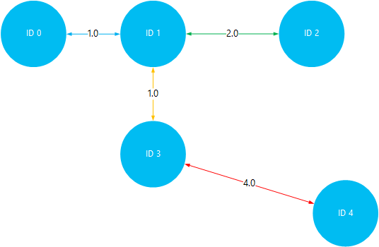

<properties
    pageTitle="Installare e usare Giraph nei cluster Hadoop in HDInsight | Microsoft Azure"
    description="Informazioni su come personalizzare cluster HDInsight con Giraph e come usare Giraph."
    services="hdinsight"
    documentationCenter=""
    authors="nitinme"
    manager="jhubbard"
    editor="cgronlun"
    tags="azure-portal"/>

<tags
    ms.service="hdinsight"
    ms.workload="big-data"
    ms.tgt_pltfrm="na"
    ms.devlang="na"
    ms.topic="article"
    ms.date="02/05/2016"
    ms.author="nitinme"/>

# Installare e usare Giraph in HDInsight

Informazioni su come personalizzare cluster HDInsight basato su Windows con Giraph tramite Script azione e come usare Giraph per l'elaborazione di grafici di grandi dimensioni. Per informazioni sull'utilizzo di Giraph con un cluster basato su Linux, vedere [Installare Giraph sui HDInsight Hadoop cluster (Linux)](hdinsight-hadoop-giraph-install-linux.md).
 
È possibile installare Giraph qualsiasi tipo di grafico (Hadoop, eccesso, HBase, motori) in Azure HDInsight tramite *Script azione*. Script di esempio per installare Giraph in un cluster di HDInsight è disponibile un blob di sola lettura Azure lo spazio di archiviazione in [https://hdiconfigactions.blob.core.windows.net/giraphconfigactionv01/giraph-installer-v01.ps1](https://hdiconfigactions.blob.core.windows.net/giraphconfigactionv01/giraph-installer-v01.ps1). Script di esempio funziona solo con la versione cluster HDInsight 3.1. Per ulteriori informazioni sulle versioni di cluster HDInsight, vedere [HDInsight cluster versioni](hdinsight-component-versioning.md).

**Articoli correlati**

- [Installare Giraph nei HDInsight Hadoop cluster (Linux)](hdinsight-hadoop-giraph-install-linux.md)
- [Creare Hadoop cluster in HDInsight](hdinsight-provision-clusters.md): informazioni generali sulla creazione di cluster HDInsight.
- [Personalizzare cluster HDInsight tramite Script azione][hdinsight-cluster-customize]: informazioni generali su come personalizzare cluster HDInsight tramite Script azione.
- [Script di sviluppare Script azione per HDInsight](hdinsight-hadoop-script-actions.md).

## Che cos'è Giraph?

<a href="http://giraph.apache.org/" target="_blank">Apache Giraph</a> consente di eseguire grafico elaborazione tramite Hadoop e può essere utilizzata con Azure HDInsight. Grafici del modello di relazioni tra gli oggetti, ad esempio le connessioni tra router in una rete di grandi dimensioni come Internet o relazioni tra le persone presenti social network (detta anche un grafico di social networking). Grafico elaborazione consente a motivo sulle relazioni tra gli oggetti in un grafico, ad esempio:

- Identificazione potenziali amici in base alle relazioni corrente.
- Identificare l'itinerario tra due computer in una rete.
- Calcolare il rango di pagina delle pagine Web.

## Installare Giraph nel portale

1. Iniziare a creare un cluster utilizzando l'opzione **Crea personalizzato** , come descritto nel [cluster di creare Hadoop in HDInsight](hdinsight-provision-clusters.md#portal).
2. Nella pagina di **Azioni di Script** della procedura guidata, fare clic su **Aggiungi azione script** per fornire dettagli sull'azione script come illustrato di seguito:

    ![Azione di usare Script per personalizzare un cluster] (./media/hdinsight-hadoop-giraph-install/hdi-script-action-giraph.png "Azione di usare Script per personalizzare un cluster")

    <table border='1'>
        <tr><th>Proprietà</th><th>Valore</th></tr>
        <tr><td>Nome</td>
            <td>Specificare un nome per l'azione script. Ad esempio, <b>Installare Giraph</b>.</td></tr>
        <tr><td>Script URI</td>
            <td>Specificare la risorsa identificatore URI (Uniform) per lo script richiamato per personalizzare il grafico. Ad esempio <i>https://hdiconfigactions.blob.core.windows.net/giraphconfigactionv01/giraph-installer-v01.ps1</i></td></tr>
        <tr><td>Tipo di nodo</td>
            <td>Specificare i nodi in cui viene eseguito lo script di personalizzazione. È possibile scegliere <b>tutti i nodi</b>, <b>solo i nodi di testa</b>o <b>solo i nodi di lavoro</b>.
        <tr><td>Parametri</td>
            <td>Specificare i parametri, se richiesto dallo script. Script per installare Giraph non richiede parametri, in modo che può essere lasciato vuoto.</td></tr>
    </table>

    È possibile aggiungere più di un'azione di script per installare componenti multipli nel cluster. Dopo aver aggiunto gli script, fare clic sul segno di spunta per avviare la creazione del cluster.

## Utilizzare Giraph

Nell'esempio SimpleShortestPathsComputation è utilizzato per illustrare l'implementazione di <a href = "http://people.apache.org/~edwardyoon/documents/pregel.pdf">Pregel</a> base per trovare il percorso più breve tra gli oggetti in un grafico. Utilizzare la procedura seguente per caricare i dati di esempio e vaso campione, eseguire un processo utilizzando l'esempio SimpleShortestPathsComputation e quindi visualizzare i risultati.

1. Caricare un file di dati di esempio in archiviazione Blob Azure. Creare un nuovo file denominato **tiny_graph.txt**sulla workstation locale. Deve contenere le righe seguenti:

        [0,0,[[1,1],[3,3]]]
        [1,0,[[0,1],[2,2],[3,1]]]
        [2,0,[[1,2],[4,4]]]
        [3,0,[[0,3],[1,1],[4,4]]]
        [4,0,[[3,4],[2,4]]]

    Caricare il file tiny_graph.txt lo spazio di archiviazione principale per il cluster HDInsight. Per istruzioni su come caricare dati, vedere [caricare dati per i processi di Hadoop in HDInsight](hdinsight-upload-data.md).

    Questi dati vengono illustrati una relazione tra gli oggetti in un grafico diretto, utilizzando il formato [origine\_id e origine\_valore, [[destinazione\_id], [bordo\_valore];...]]. Ogni riga rappresenta una relazione tra un **origine\_id** oggetto e uno o più **destinazione\_id** oggetti. Il **bordo\_valore** (o lo spessore) possono essere considerati come l'intensità o la distanza della connessione tra **source_id** e **destinazione\_id**.

    Disegnato, e utilizzando il valore (o lo spessore) come la distanza tra gli oggetti, i dati indicati potrebbe essere simile alla:

    

4. Eseguire l'esempio SimpleShortestPathsComputation. Utilizzare i cmdlet seguenti Azure PowerShell per eseguire l'esempio utilizzando il file tiny_graph.txt come input. 

    [AZURE.INCLUDE [upgrade-powershell](../../includes/hdinsight-use-latest-powershell.md)]

        $clusterName = "clustername"
        # Giraph examples jar
        $jarFile = "wasbs:///example/jars/giraph-examples.jar"
        # Arguments for this job
        $jobArguments = "org.apache.giraph.examples.SimpleShortestPathsComputation",
                        "-ca", "mapred.job.tracker=headnodehost:9010",
                        "-vif", "org.apache.giraph.io.formats.JsonLongDoubleFloatDoubleVertexInputFormat",
                        "-vip", "wasbs:///example/data/tiny_graph.txt",
                        "-vof", "org.apache.giraph.io.formats.IdWithValueTextOutputFormat",
                        "-op",  "wasbs:///example/output/shortestpaths",
                        "-w", "2"
        # Create the definition
        $jobDefinition = New-AzureHDInsightMapReduceJobDefinition
          -JarFile $jarFile
          -ClassName "org.apache.giraph.GiraphRunner"
          -Arguments $jobArguments

        # Run the job, write output to the Azure PowerShell window
        $job = Start-AzureHDInsightJob -Cluster $clusterName -JobDefinition $jobDefinition
        Write-Host "Wait for the job to complete ..." -ForegroundColor Green
        Wait-AzureHDInsightJob -Job $job
        Write-Host "STDERR"
        Get-AzureHDInsightJobOutput -Cluster $clusterName -JobId $job.JobId -StandardError
        Write-Host "Display the standard output ..." -ForegroundColor Green
        Get-AzureHDInsightJobOutput -Cluster $clusterName -JobId $job.JobId -StandardOutput

    Nell'esempio precedente, sostituire **nome cluster** con il nome del cluster HDInsight contenente Giraph installato.

5. Visualizzare i risultati. Al termine di processo, i risultati verranno archiviati in due file di output di __wasbs: / / / esempio/esterna/shotestpaths__ cartella. I file sono chiamati __parte-m-00001__ e __parte-m-00002__. Per scaricare e visualizzare l'output, procedere come segue:

        $subscriptionName = "<SubscriptionName>"       # Azure subscription name
        $storageAccountName = "<StorageAccountName>"   # Azure Storage account name
        $containerName = "<ContainerName>"             # Blob storage container name

        # Select the current subscription
        Select-AzureSubscription $subscriptionName

        # Create the Storage account context object
        $storageAccountKey = Get-AzureStorageKey $storageAccountName | %{ $_.Primary }
        $storageContext = New-AzureStorageContext -StorageAccountName $storageAccountName -StorageAccountKey $storageAccountKey

        # Download the job output to the workstation
        Get-AzureStorageBlobContent -Container $containerName -Blob example/output/shortestpaths/part-m-00001 -Context $storageContext -Force
        Get-AzureStorageBlobContent -Container $containerName -Blob example/output/shortestpaths/part-m-00002 -Context $storageContext -Force

    Verrà creare la struttura di directory di __output/esempio/shortestpaths__ nella directory corrente sulla workstation e scaricare i file di due output fino a tale posizione.

    Utilizzare il cmdlet __gatti__ per visualizzare il contenuto dei file:

        Cat example/output/shortestpaths/part*

    L'output dovrebbe essere simile al seguente:

        0   1.0
        4   5.0
        2   2.0
        1   0.0
        3   1.0

    SimpleShortestPathComputation esempio è hard-coded per iniziare con oggetto ID 1 e individuare il percorso più breve su altri oggetti. Per consentire l'output deve essere letto come `destination_id distance`, in cui è distanza di valore oppure lo spessore dei bordi è stati trasferiti tra oggetto ID 1 e l'ID di destinazione.

    La visualizzazione seguente, è possibile verificare i risultati viaggiando percorsi più brevi tra ID 1 e tutti gli altri oggetti. Si noti che il percorso più breve compreso tra 1 ID e ID 4 5. Questa è la distanza totale tra ID 1 e 3, quindi ID 3 e 4.

    

## Installare Giraph usando Aure PowerShell

Vedere [personalizzare HDInsight cluster tramite Script azione](hdinsight-hadoop-customize-cluster.md#call_scripts_using_powershell).  Nell'esempio viene illustrato come installare motori tramite PowerShell Azure. È necessario personalizzare lo script per utilizzare [https://hdiconfigactions.blob.core.windows.net/giraphconfigactionv01/giraph-installer-v01.ps1](https://hdiconfigactions.blob.core.windows.net/giraphconfigactionv01/giraph-installer-v01.ps1).

## Installare Giraph mediante .NET SDK

Vedere [personalizzare HDInsight cluster tramite Script azione](hdinsight-hadoop-customize-cluster.md#call_scripts_using_azure_powershell). Nell'esempio viene illustrato come installare motori utilizzando .NET SDK. È necessario personalizzare lo script per utilizzare [https://hdiconfigactions.blob.core.windows.net/giraphconfigactionv01/giraph-installer-v01.ps1](https://hdiconfigactions.blob.core.windows.net/giraphconfigactionv01/giraph-installer-v01.ps1).

## Vedere anche

- [Installare Giraph nei HDInsight Hadoop cluster (Linux)](hdinsight-hadoop-giraph-install-linux.md)
- [Creare Hadoop cluster in HDInsight](hdinsight-provision-clusters.md): informazioni generali sulla creazione di cluster HDInsight.
- [Personalizzare cluster HDInsight tramite Script azione][hdinsight-cluster-customize]: informazioni generali su come personalizzare cluster HDInsight tramite Script azione.
- [Script di sviluppare Script azione per HDInsight](hdinsight-hadoop-script-actions.md).
- [Installare e usare motori nei cluster HDInsight][hdinsight-install-spark]: esempio azione Script sull'installazione di motori.
- [Installare R nei cluster HDInsight][hdinsight-install-r]: esempio azione Script sull'installazione R.
- [Installare Solr sui HDInsight cluster](hdinsight-hadoop-solr-install.md): esempio azione Script sull'installazione Solr.

[tools]: https://github.com/Blackmist/hdinsight-tools
[aps]: http://azure.microsoft.com/documentation/articles/install-configure-powershell/

[powershell-install]: ../powershell-install-configure.md
[hdinsight-provision]: hdinsight-provision-clusters.md
[hdinsight-install-r]: hdinsight-hadoop-r-scripts.md
[hdinsight-install-spark]: hdinsight-hadoop-spark-install.md
[hdinsight-cluster-customize]: hdinsight-hadoop-customize-cluster.md
