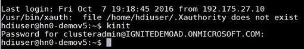

<properties
   pageTitle="Utilizzare chiavi SSH con basati su Linux Hadoop da Linux o Unix OS X | Microsoft Azure"
   description=" È possibile accedere HDInsight basati su Linux utilizzando Secure Shell (SSH). Questo documento vengono fornite informazioni sull'utilizzo di SSH con HDInsight dai client Linux o Unix OS X."
   services="hdinsight"
   documentationCenter=""
   authors="Blackmist"
   manager="jhubbard"
   editor="cgronlun"
    tags="azure-portal"/>

<tags
   ms.service="hdinsight"
   ms.devlang="na"
   ms.topic="get-started-article"
   ms.tgt_pltfrm="na"
   ms.workload="big-data"
   ms.date="09/13/2016"
   ms.author="larryfr"/>

#<a name="use-ssh-with-linux-based-hadoop-on-hdinsight-from-linux-unix-or-os-x"></a>Utilizzare SSH con basati su Linux Hadoop su HDInsight da Linux o Unix OS X

> [AZURE.SELECTOR]
- [Windows](hdinsight-hadoop-linux-use-ssh-windows.md)
- [Linux, Unix, OS X](hdinsight-hadoop-linux-use-ssh-unix.md)

[Secure Shell (SSH)](https://en.wikipedia.org/wiki/Secure_Shell) consente di eseguire in modalità remota operazioni su cluster basati su Linux HDInsight mediante un'interfaccia della riga di comando. In questo documento vengono fornite informazioni sull'utilizzo di SSH con HDInsight dai client Linux o Unix OS X.

> [AZURE.NOTE] I passaggi descritti in questo articolo si presuppongono che si utilizza un client Linux o Unix OS X. La procedura seguente possono essere eseguita in un client basato su Windows se è stato installato un pacchetto che fornisce `ssh` e `ssh-keygen`, ad esempio [Bash su Ubuntu su Windows](https://msdn.microsoft.com/commandline/wsl/about).
>
> Se non è installato nel client basato su Windows SSH, utilizzare la procedura in [Utilizzare SSH con basati su Linux HDInsight (Hadoop) da Windows](hdinsight-hadoop-linux-use-ssh-windows.md) per informazioni sull'installazione e utilizzo PuTTY.

##<a name="prerequisites"></a>Prerequisiti di

* **SSH keygen** e **ssh** per i client Linux, Unix e OS X. Questa utilità sono generalmente forniti con il sistema operativo o disponibili tramite il sistema di gestione del pacchetto.

* Browser web moderno che supporta HTML5.

OR

* [CLI azure](../xplat-cli-install.md).

    [AZURE.INCLUDE [use-latest-version](../../includes/hdinsight-use-latest-cli.md)] 

##<a name="what-is-ssh"></a>Che cos'è SSH?

SSH è un'utilità per l'accesso a e da postazione remota, esecuzione comandi in corso in un server remoto. Con HDInsight basati su Linux SSH stabilisce una connessione crittografata a headnode cluster e fornisce una riga di comando che consente di immettere i comandi. I comandi vengono quindi eseguiti direttamente nel server.

###<a name="ssh-user-name"></a>Nome dell'utente SSH

Un nome utente SSH è il nome utilizzato per l'autenticazione con il cluster HDInsight. Se si specifica un nome utente SSH durante la creazione di cluster, l'utente viene creato in tutti i nodi del cluster. Dopo aver creato il cluster, è possibile utilizzare questo nome utente per la connessione a headnodes il cluster HDInsight. Da headnodes, è quindi possibile connettere ai nodi singolo lavoratore.

###<a name="ssh-password-or-public-key"></a>SSH password o la chiave pubblica

Un utente SSH può utilizzare una password o una chiave pubblica per l'autenticazione. Password è semplicemente una stringa di testo che apportare verso l'alto, mentre una chiave pubblica fa parte di una coppia di chiavi crittografia generata per identificare in modo univoco l'utente.

Una chiave è maggiore protezione rispetto a una password, ma richiede passaggi aggiuntivi per generare la chiave e conservare i file che contiene la chiave in un luogo sicuro. Se tutti gli utenti riesce ad accedere ai file di chiave, si accedere al proprio account. O, se si perdono file della chiave, non sarà in grado di accedere al proprio account.

Una coppia di chiavi è costituita da una chiave pubblica (che viene inviata al server HDInsight) e una chiave privata (che verrà mantenuta nel computer client.) Quando si connette al server HDInsight utilizzando SSH, il client SSH utilizzerà la chiave privata nel computer in uso per l'autenticazione con il server.

##<a name="create-an-ssh-key"></a>Creare una chiave SSH

Utilizzare le informazioni seguenti se si prevede di utilizzo dei tasti SSH con il cluster. Se si prevede di utilizzare una password, è possibile ignorare questa sezione.

1. Aprire una sessione terminal e utilizzare il comando seguente per verificare se è presente alcuna chiave SSH esistente:

        ls -al ~/.ssh

    Cercare i file seguenti nell'elenco delle directory. Si tratta di nomi comuni per le chiavi pubbliche SSH.

    * ID\_dsa.pub
    * ID\_ecdsa.pub
    * ID\_ed25519.pub
    * ID\_rsa.pub

2. Se non si desidera utilizzare un file esistente oppure è non necessario alcun chiavi SSH esistenti, utilizzare la seguente per generare un nuovo file:

        ssh-keygen -t rsa

    Verrà richiesto di immettere le informazioni seguenti:

    * Il percorso del file - la posizione predefinita per ~/.ssh/id\_rsa.
    * Una passphrase - verrà richiesto di immettere di nuovo questo.

        > [AZURE.NOTE] È consigliabile utilizzare una passphrase sicura per la chiave. Tuttavia, se si dimentica la passphrase, non è possibile effettuare il ripristino.

    Al termine dell'esecuzione del comando, si disporrà di due nuovi file, la chiave privata (ad esempio, **id\_rsa**) e la chiave pubblica (ad esempio, **id\_rsa.pub**).

##<a name="create-a-linux-based-hdinsight-cluster"></a>Creare un cluster HDInsight basati su Linux

Quando si crea un cluster HDInsight basati su Linux, è necessario fornire la chiave pubblica creata in precedenza. Da client Linux o Unix OS X, esistono due modi per creare un cluster HDInsight:

* **Portale di azure** - utilizza un portale basato su web per creare il cluster.

* **CLI azure per Windows, Mac e Linux** - utilizza i comandi della riga di comando per creare il cluster.

Ognuno di questi metodi sarà necessaria una password o una chiave pubblica. Per informazioni complete su come creare un cluster HDInsight basati su Linux, vedere [i gruppi basati su Linux provisioning HDInsight](hdinsight-hadoop-provision-linux-clusters.md).

###<a name="azure-portal"></a>Portale di Azure

Quando si utilizza il [Portale di Azure] [ preview-portal] per creare un cluster HDInsight basati su Linux, è necessario immettere un **Nome di utente SSH**e selezionare questa opzione per immettere una **PASSWORD** o una **Chiave pubblica SSH**.

Se si seleziona **Chiave pubblica SSH**, è possibile incollare la chiave pubblica (contenuta nel file con estensione **. pub** ) nel campo __SSH PublicKey__ o scegliere __Selezionare un file__ di individuare e selezionare il file di chiave pubblica.


> [AZURE.NOTE] Il file della chiave è semplicemente un file di testo. Il contenuto dovrebbe essere simile al seguente:
> ```
ssh-rsa AAAAB3NzaC1yc2EAAAADAQABAAABAQCelfkjrpYHYiks4TM+r1LVsTYQ4jAXXGeOAF9Vv/KGz90pgMk3VRJk4PEUSELfXKxP3NtsVwLVPN1l09utI/tKHQ6WL3qy89WVVVLiwzL7tfJ2B08Gmcw8mC/YoieT/YG+4I4oAgPEmim+6/F9S0lU2I2CuFBX9JzauX8n1Y9kWzTARST+ERx2hysyA5ObLv97Xe4C2CQvGE01LGAXkw2ffP9vI+emUM+VeYrf0q3w/b1o/COKbFVZ2IpEcJ8G2SLlNsHWXofWhOKQRi64TMxT7LLoohD61q2aWNKdaE4oQdiuo8TGnt4zWLEPjzjIYIEIZGk00HiQD+KCB5pxoVtp user@system
> ```

Consente di creare un account di accesso dell'utente specificato utilizzando la password o la chiave pubblica che forniscono.

###<a name="azure-command-line-interface-for-mac-linux-and-windows"></a>Azure interfaccia della riga di comando di Windows, Mac e Linux

È possibile utilizzare [CLI Azure per Windows, Mac e Linux](../xplat-cli-install.md) per creare un nuovo cluster utilizzando il `azure hdinsight cluster create` comando.

Per ulteriori informazioni sull'utilizzo di questo comando, vedere [i gruppi di provisioning Hadoop Linux nel HDInsight utilizzando le opzioni personalizzate](hdinsight-hadoop-provision-linux-clusters.md).

##<a name="connect-to-a-linux-based-hdinsight-cluster"></a>Connettersi a un cluster HDInsight basati su Linux

Da una sessione di Terminal Server, utilizzare il comando SSH per la connessione a headnode cluster fornendo il nome utente e all'indirizzo:

* **Indirizzo SSH** - sono disponibili due indirizzi che possono essere utilizzati per connettersi a un cluster utilizzando SSH:

    * **Connessione al headnode**: il nome del cluster, seguito da **-ssh.azurehdinsight.net**. Ad esempio, **miocluster ssh.azurehdinsight.net**.
    
    * **Connessione al nodo di server perimetrali**: se il cluster di Server R HDInsight, il cluster sarà incluse anche un nodo di server perimetrali che è possibile accedere tramite **RServer.CLUSTERNAME.ssh.azurehdinsight.net**, dove __nome cluster__ è il nome del cluster.

* **Nome utente** - il SSH nome utente fornito al momento della creazione del cluster.

Nell'esempio seguente viene connesso alla headnode principale di **miocluster** come utente **me**:

    ssh me@mycluster-ssh.azurehdinsight.net

Se è stata utilizzata una password per l'account utente, verrà richiesto di immettere la password.

Se è stata utilizzata una chiave SSH protetta con una passphrase, verrà richiesto di immettere la passphrase. In caso contrario, SSH tenterà di automaticamente l'autenticazione utilizzando una delle chiavi private locale nel client.

> [AZURE.NOTE] Se SSH non autentica automaticamente con la chiave privata corretta, utilizzare il parametro **-i** e specificare il percorso della chiave privata. Nell'esempio seguente viene caricare la chiave privata dal `~/.ssh/id_rsa`:
>
> `ssh -i ~/.ssh/id_rsa me@mycluster-ssh.azurehdinsight.net`

Se si effettua la connessione con l'indirizzo per il headnode e viene specificata alcuna porta, SSH verranno automaticamente alla porta 22, che consente di connettersi a headnode principale del cluster HDInsight. Se si utilizza la porta 23, si eseguirà la connessione al server secondario. Per ulteriori informazioni sulla headnodes, vedere [disponibilità e l'affidabilità del cluster Hadoop in HDInsight](hdinsight-high-availability-linux.md).

###<a name="connect-to-worker-nodes"></a>Connettersi ai nodi di lavoro

I nodi di lavoro non sono direttamente accessibili dall'esterno del datacenter Azure, ma è possibile accedere dalla headnode cluster tramite SSH.

Se si utilizza una chiave SSH per autenticare l'account utente, è necessario completare i passaggi seguenti nel client:

1. Utilizzando un editor di testo aprire `~/.ssh/config`. Se il file non esiste, è possibile creare immettendo `touch ~/.ssh/config` in aeroporto.

2. Aggiungere quanto segue nel file. Sostituire *nome cluster* con il nome del cluster HDInsight.

        Host CLUSTERNAME-ssh.azurehdinsight.net
          ForwardAgent yes

    Consente di configurare SSH agente di inoltro per i cluster HDInsight.

3. Eseguire il test SSH agente di inoltro tramite il comando seguente dal terminal:

        echo "$SSH_AUTH_SOCK"

    Deve restituire informazioni simili alle seguenti:

        /tmp/ssh-rfSUL1ldCldQ/agent.1792

    Se non viene restituita alcuna informazione, significa che **ssh agente** non è in esecuzione. Consultare la documentazione del sistema operativo per i passaggi specifici sull'installazione e configurazione di **ssh agente**o fare riferimento a [utilizzo ssh-agente con ssh](http://mah.everybody.org/docs/ssh).

4. Dopo avere verificato che **ssh agent** sia in esecuzione, utilizzare la seguente per aggiungere la chiave privata SSH all'agente:

        ssh-add ~/.ssh/id_rsa

    Se la chiave privata è memorizzata in un file diverso, sostituire `~/.ssh/id_rsa` con il percorso del file.

Utilizzare la procedura seguente per connettersi ai nodi lavoro per il cluster.

> [AZURE.IMPORTANT] Se si utilizza una chiave SSH per l'autenticazione dell'account, è necessario completare i passaggi precedenti per verificare il funzionamento di cui gli agenti di inoltro.

1. Connettersi al cluster di HDInsight SSH come descritto in precedenza.

2. Una volta che si è connessi, utilizzare la seguente per recuperare un elenco dei nodi del cluster. Sostituire *ADMINPASSWORD* con la password per l'account di amministrazione cluster. Sostituire *nome cluster* con il nome del cluster.

        curl --user admin:ADMINPASSWORD https://CLUSTERNAME.azurehdinsight.net/api/v1/hosts

    Restituirà informazioni nel formato JSON per i nodi del cluster, tra cui `host_name`, che contiene il nome di dominio completo (FQDN) per ogni nodo. Di seguito è riportato un esempio di un `host_name` restituito dal comando **voltare** :

        "host_name" : "workernode0.workernode-0-e2f35e63355b4f15a31c460b6d4e1230.j1.internal.cloudapp.net"

3. Dopo avere creato un elenco dei nodi di lavoro che si desidera connettersi al, utilizzare il comando seguente dalla sessione SSH per il server per aprire una connessione a un nodo di lavoro:

        ssh USERNAME@FQDN

    Sostituire *il nome utente* con il nome utente SSH e il *nome FQDN* con il nome FQDN per il nodo di lavoro. Ad esempio `workernode0.workernode-0-e2f35e63355b4f15a31c460b6d4e1230.j1.internal.cloudapp.net`.

    > [AZURE.NOTE] Se si utilizza una password per l'autenticazione di sessione SSH, verrà richiesto di immettere nuovamente la password. Se si utilizza una chiave SSH, senza alcuna richiesta verrà eseguita la connessione.

4. Una volta stabilita la sessione, terminal prompt dei comandi verrà sostituito da `username@hn#-clustername` a `username@wk#-clustername` per indicare che si è connessi al nodo del lavoro. I comandi in che esecuzione a questo punto verranno eseguito il nodo di lavoro.

4. Al termine dell'esecuzione di azioni il nodo di lavoro, utilizzare la `exit` comando per chiudere la sessione al nodo del lavoro. È possibile restituisce il `username@hn#-clustername` prompt dei comandi.

## <a name="connect-to-a-domain-joined-hdinsight-cluster"></a>Connettersi a un cluster HDInsight aggiunto al dominio

[HDInsight dominio](hdinsight-domain-joined-introduction.md) Kerberos si integra con Hadoop in HDInsight. Poiché l'utente SSH non è un utente di dominio Active Directory, questo account utente non può eseguire Hadoop comandi dalla shell di SSH in un cluster di dominio direttamente. È necessario eseguire innanzitutto *kinit* . 

**Per eseguire Hive esegue una query in un cluster HDInsight dominio tramite SSH**

1. Connettersi a un cluster HDInsight aggiunto al dominio utilizzando SSH.  Per instrocutions, vedere [Connect a un cluster HDInsight basati su Linux](#connect-to-a-linux-based-hdinsight-cluster).
2. Eseguire kinit. Verrà chiesto di un nome utente di dominio e password dell'utente di dominio. Per ulteriori informazioni su configurare gli utenti del dominio per i cluster HDInsight aggiunto al dominio, vedere [configurare dominio HDInisight cluster](hdinsight-domain-joined-configure.md).

    
3. Aprire nell'Hive console da immettere:

        hive

    È quindi possibile eseguire i comandi Hive.

##<a name="add-more-accounts"></a>Aggiungere più account

1. Generare una nuova chiave pubblica e la chiave privata per il nuovo account utente, come descritto nella sezione [creare una chiave SSH](#create-an-ssh-key-optional) .

    > [AZURE.NOTE] La chiave privata deve essere generata in un client che l'utente verrà utilizzato per connettersi al cluster o in modo sicuro trasferita a un client dopo la creazione.

1. Da una sessione SSH al cluster, aggiungere il nuovo utente con il comando seguente:

        sudo adduser --disabled-password <username>

    Verrà creato un nuovo account utente, ma verrà disabilitata l'autenticazione tramite password.

2. Creare la directory e i file per tenere premuto il tasto utilizzando i comandi seguenti:

        sudo mkdir -p /home/<username>/.ssh
        sudo touch /home/<username>/.ssh/authorized_keys
        sudo nano /home/<username>/.ssh/authorized_keys

3. Quando viene aperto l'editor aspetti, copiare e incollare il contenuto della chiave pubblica per il nuovo account utente. Infine, è possibile utilizzare **Ctrl + X** per salvare il file e chiudere l'editor.

    

4. Utilizzare il comando seguente per modificare la proprietà della cartella .ssh e contenuto per il nuovo account utente:

        sudo chown -hR <username>:<username> /home/<username>/.ssh

5. A questo punto dovrà essere in grado di eseguire l'autenticazione per il server con il nuovo account utente e la chiave privata.

##<a id="tunnel"></a>SSH tunnel

SSH può essere utilizzato per tunnel richieste locali, ad esempio le richieste web, al cluster di HDInsight. La richiesta quindi instradata alla risorsa richiesta come se fosse proviene da headnode il cluster HDInsight.

> [AZURE.IMPORTANT] Un tunnel SSH è un requisito per l'accesso web dell'interfaccia utente per alcuni servizi Hadoop. Ad esempio, l'interfaccia utente di cronologia processo o Manager delle risorse dell'interfaccia utente da accessibili solo tramite un tunnel SSH.

Per ulteriori informazioni sulla creazione e utilizzo di un tunnel SSH, vedere [Utilizzo SSH tunnel per accedere a web Ambari dell'interfaccia utente, ResourceManager, JobHistory, NameNode, Oozie e altri web dell'interfaccia utente](hdinsight-linux-ambari-ssh-tunnel.md).

##<a name="next-steps"></a>Passaggi successivi

Ora che è comprendere come eseguire l'autenticazione utilizzando una chiave SSH, informazioni su come utilizzare MapReduce con Hadoop in HDInsight.

* [Utilizzare Hive con HDInsight](hdinsight-use-hive.md)

* [Utilizzare suino con HDInsight](hdinsight-use-pig.md)

* [Utilizzare i processi MapReduce con HDInsight](hdinsight-use-mapreduce.md)

[preview-portal]: https://portal.azure.com/
