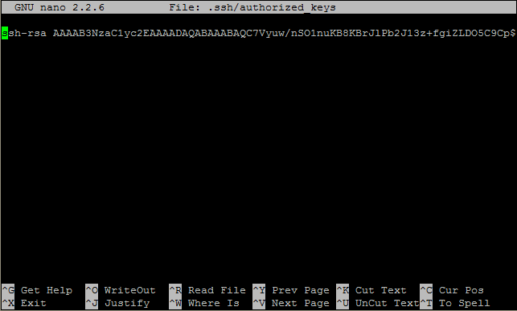

<properties
   pageTitle="Usare i tasti di SSH con Hadoop nei cluster basati su Linux da Windows | Microsoft Azure"
   description="Informazioni su come creare e utilizzare i tasti SSH per eseguire l'autenticazione a cluster basati su Linux HDInsight. Connettere cluster dal client basati su Windows utilizzando il client PuTTY SSH."
   services="hdinsight"
   documentationCenter=""
   authors="Blackmist"
   manager="jhubbard"
   editor="cgronlun"
    tags="azure-portal"/>

<tags
   ms.service="hdinsight"
   ms.devlang="na"
   ms.topic="get-started-article"
   ms.tgt_pltfrm="na"
   ms.workload="big-data"
   ms.date="08/30/2016"
   ms.author="larryfr"/>

#Usare SSH con basati su Linux Hadoop in HDInsight da Windows

> [AZURE.SELECTOR]
- [Windows](hdinsight-hadoop-linux-use-ssh-windows.md)
- [Linux, Unix, OS X](hdinsight-hadoop-linux-use-ssh-unix.md)

[Secure Shell (SSH)](https://en.wikipedia.org/wiki/Secure_Shell) consente di eseguire in modalità remota operazioni nei cluster basati su Linux HDInsight mediante un'interfaccia della riga di comando. In questo documento vengono fornite informazioni sulla connessione a HDInsight da client basati su Windows utilizzando il client PuTTY SSH.

> [AZURE.NOTE] La procedura descritta in questo articolo presuppone che si utilizza un client basato su Windows. Se si utilizza un client Linux, Unix o OS X, vedere [Usare SSH con basati su Linux Hadoop in HDInsight da Linux, Unix o OS X](hdinsight-hadoop-linux-use-ssh-unix.md).
>
> Se si dispone di Windows 10 e Usa [Bash su Ubuntu in Windows](https://msdn.microsoft.com/commandline/wsl/about), è possibile utilizzare la procedura descritta nel documento [Usare SSH con basati su Linux Hadoop in HDInsight da Linux, Unix o OS X](hdinsight-hadoop-linux-use-ssh-unix.md) .

##Prerequisiti

* **PuTTY** e **PuTTYGen** per i client basati su Windows. Queste utilità sono disponibili da [http://www.chiark.greenend.org.uk/~sgtatham/putty/download.html](http://www.chiark.greenend.org.uk/~sgtatham/putty/download.html).

* Un moderno browser che supporti HTML5.

OR

* [Azure CLI](../xplat-cli-install.md).

    [AZURE.INCLUDE [use-latest-version](../../includes/hdinsight-use-latest-cli.md)] 

##Che cos'è SSH?

SSH è un'utilità per l'accesso a e quando in modalità remota comandi, su un server remoto. Con HDInsight basati su Linux SSH stabilisce una connessione crittografata al nodo principale cluster e fornisce una riga di comando che consente di immettere i comandi. Comandi vengono quindi eseguiti direttamente nel server.

###Nome utente SSH

Un nome utente SSH è il nome usato per eseguire l'autenticazione a cluster HDInsight. Quando si specifica un nome utente SSH durante la creazione di cluster, tale utente viene creato in tutti i nodi del cluster. Dopo aver creato il grafico, è possibile usare il nome utente a cui connettersi i nodi di testa cluster HDInsight. Dei nodi di testa è quindi possibile connettersi a nodi lavoro singoli.

###Password SSH o chiave pubblica

Un utente SSH può utilizzare una password o una chiave pubblica per l'autenticazione. Una password è solo una stringa di testo che apportare verso l'alto, mentre una chiave pubblica fa parte di una coppia di chiavi crittografia generata per l'identificazione in modo univoco.

Una chiave è più sicura una password, tuttavia richiede l'esecuzione di operazioni aggiuntive per generare la chiave ed è necessario mantenere i file che contiene la chiave in un percorso sicuro. Se tutti gli utenti accedono ai file di chiave, vengono accedere al proprio account. Oppure, se si perdono i file di chiave, non sarà possibile accedere al proprio account.

Una coppia di una chiave pubblica (che viene inviata al server HDInsight) e una chiave privata (che verrà mantenuta nel computer client.) Quando effettua la connessione al server HDInsight utilizzando SSH, il client SSH utilizzerà la chiave privata nel computer in uso per eseguire l'autenticazione con il server.

##Creare una chiave SSH

Se si prevede di utilizzo dei tasti SSH con i cluster, utilizzare le seguenti informazioni. Se si prevede di utilizzare una password, è possibile ignorare questa sezione.

1. Aprire PuTTYGen.

2. Per **tipo di chiave per la creazione**, selezionare **RSA SSH 2**e quindi fare clic su **Genera**.

    

3. Spostare il puntatore del mouse nell'area sotto la barra di stato di avanzamento, fino a quando non viene compilato sulla barra. Spostare il puntatore del mouse genera dati casuali che verrà usati per generare il tasto.

    

    Dopo la chiave è stata generata, verrà visualizzata la chiave pubblica.

4. Per una maggiore protezione, è possibile immettere una frase nel campo **chiave passphrase** e quindi digitare lo stesso valore nel campo **Conferma passphrase** .

    

    > [AZURE.NOTE] È consigliabile utilizzare una frase sicura per la chiave. Tuttavia, se si dimentica la passphrase, è possibile recuperarlo.

5. Fare clic su **Salva chiave privata** per salvare la chiave in un file **.ppk** . Questa chiave verrà utilizzata per eseguire l'autenticazione per il cluster basati su Linux HDInsight.

    > [AZURE.NOTE] Memorizzare questo tasto in un percorso sicuro come possono essere utilizzato per accedere i cluster basati su Linux HDInsight.

6. Fare clic su **Salva chiave pubblica** per salvare la chiave come file **con estensione txt** . In questo modo è possibile riutilizzare in futuro la chiave pubblica quando si crea ulteriori cluster basati su Linux HDInsight.

    > [AZURE.NOTE] Chiave pubblica viene visualizzata anche nella parte superiore della PuTTYGen. È possibile rapida questo campo, copiare il valore e quindi incollarlo in un modulo durante la creazione di un cluster tramite il portale di Azure.

##Creare un cluster basati su Linux HDInsight

Quando si crea un cluster HDInsight basati su Linux, è necessario specificare la chiave pubblica creata in precedenza. Da client basati su Windows, esistono due modi per creare un cluster HDInsight basati su Linux:

* **Portale di azure** - utilizza un portale basato sul web per creare il cluster.

* **Azure CLI per Mac, Linux e Windows** - Usa riga di comando per creare il cluster.

Ognuno di questi metodi richiede la chiave pubblica. Per informazioni sulla creazione di un cluster basati su Linux HDInsight, vedere [cluster basati su Linux disposizione HDInsight](hdinsight-hadoop-provision-linux-clusters.md).

###Portale di Azure

Quando si usa il [Portale di Azure] [ preview-portal] per creare un cluster HDInsight basati su Linux, è necessario immettere un **Nome utente SSH**e selezionare questa opzione per immettere una **PASSWORD** o una **Chiave pubblica SSH**.

Se si seleziona una **Chiave pubblica SSH**, è possibile incollare uno la chiave pubblica (visualizzato nella __chiave pubblica per incollata nella finestra di OpenSSH autorizzato\_file chiavi__ campo PuttyGen,) nel campo __SSH PublicKey__ oppure selezionare __Selezionare un file__ per individuare e selezionare il file che contiene la chiave pubblica.

Crea un account di accesso per l'utente specificato e consente l'autenticazione tramite password o l'autenticazione a chiave SSH.

###Azure interfaccia della riga di comando per Mac, Linux e Windows

È possibile utilizzare [CLI Azure per Mac, Linux e Windows](../xplat-cli-install.md) per creare un nuovo cluster utilizzando il `azure hdinsight cluster create` comando.

Per ulteriori informazioni sull'uso di questo comando, vedere [cluster di provisioning Hadoop Linux in HDInsight usando le opzioni personalizzate](hdinsight-hadoop-provision-linux-clusters.md).

##Connettersi a un cluster basati su Linux HDInsight

1. Aprire PuTTY.

    

2. Se una chiave SSH durante la creazione dell'account utente, è necessario eseguire il passaggio successivo per selezionare la chiave privata da utilizzare per l'autenticazione al cluster:

    Nella **categoria**, espandere **connessione**, espandere **SSH**e selezionare **Auth**. Infine, fare clic su **Sfoglia** e selezionare il file .ppk che contiene la chiave privata.

    

3. In **categoria**selezionare **sessione**. Nella schermata **Opzioni di base per la sessione PuTTY** immettere l'indirizzo SSH HDInsight del server di posta nel campo **nome Host (o l'indirizzo IP)** . Ci sono due possibili indirizzi SSH che è possibile utilizzare quando ci si connette a un cluster:

    * __Indirizzo del nodo testa__: per connettere il nodo principale del cluster, usare il nome di cluster, quindi **-ssh.azurehdinsight.net**. Ad esempio **miocluster ssh.azurehdinsight.net**.
    
    * __Indirizzo del nodo di bordo__: se si è connessi a un Server R cluster HDInsight, è possibile connettersi al nodo edge Server R usando l'indirizzo __RServer.CLUSTERNAME.ssh.azurehdinsight.net__, dove nome cluster è il nome del cluster. Ad esempio __RServer.mycluster.ssh.azurehdinsight.net__.

    

4. Per salvare le informazioni di connessione per utilizzi futuri, immettere un nome per la connessione in **Sessioni salvato**e quindi fare clic su **Salva**. La connessione verrà aggiunto all'elenco delle sessioni salvate.

5. Fare clic su **Apri** per connettersi al cluster.

    > [AZURE.NOTE] Se si tratta la prima volta che si è connessi a cluster, verrà visualizzato un avviso di sicurezza. Questo è normale. Selezionare **Sì** per memorizzare nella cache chiave RSA2 del server per continuare.

6. Quando richiesto, immettere il nome utente che è stata immessa al momento della creazione del cluster. Se è stata specificata una password per l'utente, verrà richiesto di immettere anche.

> [AZURE.NOTE] I passaggi indicati presuppongono che si usa la porta 22, si connetterà headnode primaria cluster HDInsight. Se si usa la porta 23, si è connessi a quello secondario. Per ulteriori informazioni sulla sede nodi, vedere [disponibilità e l'affidabilità dei cluster Hadoop in HDInsight](hdinsight-high-availability-linux.md).

###Connettersi a nodi di lavoro

I nodi di lavoro non sono direttamente dall'esterno del Data Center del Azure, ma è possibile accedervi dal nodo principale cluster tramite SSH.

Se una chiave SSH durante la creazione dell'account utente, è necessario eseguire la procedura seguente per utilizzare la chiave privata per l'autenticazione al cluster se si desidera connettere i nodi di lavoro.

1. Installare Sfilata in maschera da [http://www.chiark.greenend.org.uk/~sgtatham/putty/download.html](http://www.chiark.greenend.org.uk/~sgtatham/putty/download.html). Questa utilità viene utilizzata per memorizzare nella cache chiavi SSH per PuTTY.

2. Eseguire Sfilata in maschera. Verrà ridotta a icona nella barra di stato. Pulsante destro del mouse sull'icona e selezionare **Aggiungi chiave**.

    

3. Quando viene visualizzata la finestra di dialogo Sfoglia, selezionare il file .ppk che contiene la chiave e quindi fare clic su **Apri**. Verrà aggiunto il tasto Sfilata in maschera, che fornirà a PuTTY quando ci si connette al cluster.

    > [AZURE.IMPORTANT] Se si utilizza un tasto SSH per proteggere l'account, è necessario completare i passaggi precedenti prima sarà possibile connettersi a nodi di lavoro.

4. Aprire PuTTY.

5. Se si usa una chiave SSH per eseguire l'autenticazione, nella sezione **categoria** espandere **connessione**, espandere **SSH**e quindi selezionare **Auth**.

    Nella sezione **parametri di autenticazione** , abilita **agente Consenti inoltro**. In questo modo PuTTY passare automaticamente l'autenticazione certificato mediante la connessione al nodo principale cluster quando ci si connette a nodi di lavoro.

    

6. Connettersi al cluster come descritto in precedenza. Se si usa una chiave SSH per l'autenticazione, non è necessario selezionare la chiave - SSH aggiungere la chiave al Sfilata in maschera verrà usata per eseguire l'autenticazione al cluster.

7. Dopo la creazione di connessione, utilizzare le operazioni seguenti per recuperare un elenco dei nodi del cluster. Sostituire *ADMINPASSWORD* con la password per l'account di amministratore cluster. Sostituire *nome cluster* con il nome del cluster.

        curl --user admin:ADMINPASSWORD https://CLUSTERNAME.azurehdinsight.net/api/v1/hosts

    Verrà restituito informazioni nel formato JSON per i nodi del cluster, tra cui `host_name`, che contiene il nome di dominio completo (FQDN) per ogni nodo. Di seguito è un esempio di un `host_name` voce restituito dal comando **voltare** :

        "host_name" : "workernode0.workernode-0-e2f35e63355b4f15a31c460b6d4e1230.j1.internal.cloudapp.net"

8. Dopo avere inserito un elenco dei nodi di lavoro che si desidera connettersi, utilizzare il comando seguente dalla sessione PuTTY per aprire una connessione a un nodo di lavoro:

        ssh USERNAME@FQDN

    Sostituire *nomeutente* con il nome utente SSH e il *nome di dominio completo* con il nome di dominio completo del nodo di lavoro. Ad esempio `workernode0.workernode-0-e2f35e63355b4f15a31c460b6d4e1230.j1.internal.cloudapp.net`.

    > [AZURE.NOTE] Se si usa una password per l'autenticazione la sessione SSH, verrà richiesto di immettere nuovamente la password. Se si usa una chiave SSH, deve completare la connessione senza alcuna richiesta.

9. Dopo la sessione, prompt dei comandi per la sessione PuTTY cambierà da `username@hn#-clustername` a `username@wn#-clustername` per indicare che si è connessi a quello di lavoro. Comandi che eseguire a questo punto verranno eseguito sul nodo lavoro.

10. Dopo avere la possibilità di eseguire azioni sul nodo di lavoro, utilizzare la `exit` comando per chiudere la sessione al livello di nodo lavoro. Per tornare al `username@hn#-clustername` prompt dei comandi.

##Aggiungere altri account

Se è necessario aggiungere altri account per il cluster, procedere come segue:

1. Generare una nuova chiave pubblica e la chiave privata per il nuovo account utente, come descritto in precedenza.

2. Da una sessione SSH al cluster, aggiungere il nuovo utente con il comando seguente:

        sudo adduser --disabled-password <username>

    Verrà creato un nuovo account utente, ma verrà disabilitata autenticazione tramite password.

3. Creare la directory e file a tenere premuto il tasto, utilizzare i comandi seguenti:

        sudo mkdir -p /home/<username>/.ssh
        sudo touch /home/<username>/.ssh/authorized_keys
        sudo nano /home/<username>/.ssh/authorized_keys

4. Quando si apre l'editor di aspetti, copiare e incollare il contenuto della chiave pubblica per il nuovo account utente. Infine, usare **Ctrl + X** per salvare il file e chiudere l'editor.

    

5. Usare il comando seguente per modificare il proprietario della cartella .ssh e contenuto per il nuovo account utente:

        sudo chown -hR <username>:<username> /home/<username>/.ssh

6. A questo punto dovrebbe essere possibile autenticare al server con il nuovo account utente e la chiave privata.

##Tunneling SSH

SSH può essere utilizzato per tunnel richieste locali, ad esempio richieste web, al cluster HDInsight. La richiesta quindi instradata alla risorsa richiesta come se fosse originari sul nodo principale cluster HDInsight.

> [AZURE.IMPORTANT] Un tunnel SSH è un requisito per l'accesso web dell'interfaccia utente per alcuni servizi Hadoop. Ad esempio, sia l'interfaccia utente della cronologia di processo o Manager delle risorse dell'interfaccia utente è solo possibile accedervi utilizzando un tunnel SSH.

Per ulteriori informazioni sulla creazione e utilizzo di un tunnel SSH, vedere [Usare SSH connettersi accesso web Ambari dell'interfaccia utente, ResourceManager, JobHistory, NameNode, Oozie e altre web dell'interfaccia utente](hdinsight-linux-ambari-ssh-tunnel.md).

##Passaggi successivi

Dopo avere appreso come eseguire l'autenticazione tramite un tasto di SSH, informazioni su come usare MapReduce con Hadoop in HDInsight.

* [Usare Hive con HDInsight](hdinsight-use-hive.md)

* [Utilizzare maialino con HDInsight](hdinsight-use-pig.md)

* [Utilizzare processi MapReduce con HDInsight](hdinsight-use-mapreduce.md)

[preview-portal]: https://portal.azure.com/
