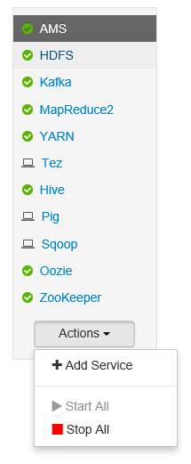

<properties
   pageTitle="Monitorare e gestire i cluster HDInsight tramite l'interfaccia utente Web Ambari Apache | Microsoft Azure"
   description="Informazioni su come utilizzare Ambari per monitorare e gestire i cluster basati su Linux HDInsight. In questo documento si imparerà a utilizzare l'interfaccia utente Web Ambari incluso con i cluster HDInsight."
   services="hdinsight"
   documentationCenter=""
   authors="Blackmist"
   manager="jhubbard"
   editor="cgronlun"
    tags="azure-portal"/>

<tags
   ms.service="hdinsight"
   ms.devlang="na"
   ms.topic="article"
   ms.tgt_pltfrm="na"
   ms.workload="big-data"
   ms.date="09/27/2016"
   ms.author="larryfr"/>

#Gestire i cluster HDInsight tramite l'interfaccia utente Web Ambari

[AZURE.INCLUDE [ambari-selector](../../includes/hdinsight-ambari-selector.md)]

Apache Ambari semplifica la gestione e il controllo di un cluster Hadoop fornendo un semplice utilizzare l'interfaccia utente web e API REST. Ambari è incluso nei cluster basati su Linux HDInsight e viene utilizzata per monitorare il cluster e apportare le modifiche alla configurazione.

In questo documento si imparerà a utilizzare l'interfaccia utente Web Ambari con un cluster di HDInsight.

##Che cos'è Ambari?

<a href="http://ambari.apache.org" target="_blank">Apache Ambari</a> semplice gestione Hadoop fornendo un web di semplice utilizzo dell'interfaccia utente che può essere utilizzato per eseguire il provisioning, gestire e monitorare i cluster Hadoop. Gli sviluppatori possono integrare queste funzionalità nelle applicazioni tramite le <a href="https://github.com/apache/ambari/blob/trunk/ambari-server/docs/api/v1/index.md" target="_blank">API REST Ambari</a>.

L'interfaccia utente Web Ambari viene fornito con i cluster basati su Linux HDInsight per impostazione predefinita. 

##Connettività

L'interfaccia utente Web Ambari è disponibile il cluster HDInsight in HTTPS://CLUSTERNAME.azurehdidnsight.net, dove __nome cluster__ è il nome del cluster. 

> [AZURE.IMPORTANT] La connessione a Ambari in HDInsight richiede HTTPS. È anche necessario autenticare Ambari utilizzando il nome di account di amministratore (il valore predefinito è __amministratore__) e la password forniti quando il cluster è stato creato.

##Proxy SSH

> [AZURE.NOTE] Mentre Ambari per il cluster è accessibile direttamente tramite Internet, alcuni collegamenti dall'interfaccia utente Web Ambari (ad esempio il JobTracker) non viene esposto su internet. Pertanto viene visualizzato "server non trovata" quando si tenta di accedere a queste funzionalità a meno che non si utilizza un tunnel Secure Shell (SSH) per inoltrare il traffico web per il nodo principale cluster.

Per informazioni sulla creazione di un tunnel SSH per l'uso con Ambari, vedere [Usare SSH connettersi accesso web Ambari dell'interfaccia utente, ResourceManager, JobHistory, NameNode, Oozie e altre web dell'interfaccia utente](hdinsight-linux-ambari-ssh-tunnel.md).

##Interfaccia utente Web Ambari

Quando ci si connette all'interfaccia utente Web Ambari, verrà richiesto per eseguire l'autenticazione alla pagina. Utilizzare utente amministratore cluster (impostazione predefinita amministrazione) e la password utilizzati durante la creazione di cluster.

Quando si apre la pagina, tenere presente sulla barra nella parte superiore. Questa pagina contiene le informazioni e i controlli seguenti:

* **Logo Ambari** - apre il dashboard, può essere utilizzato per monitorare il cluster.

* **Operazioni di # nome cluster** - consente di visualizzare il numero di operazioni Ambari in corso. Selezionare il nome o **operazioni #** verrà visualizzato un elenco di operazioni in background.

* **avvisi #** - avvisi o avvisi critici, se disponibile, per il cluster. La selezione di questa verrà visualizzato un elenco di avvisi.

* **Dashboard** - consente di visualizzare il dashboard.

* **Servizi** - informazioni e impostazioni di configurazione per i servizi del cluster.

* **Host** - informazioni e impostazioni di configurazione per i nodi del cluster.

* **Avvisi** - un file di log di informazioni, avvisi e avvisi critici.

* **Amministrazione** - stack/servizi di Software che vengono installate su cluster, le informazioni sull'account di servizio e protezione Kerberos.

* **Pulsante di amministrazione** - gestione Ambari, le impostazioni utente e la disconnessione.

##Monitoraggio

###Avvisi

Ambari sono disponibili numerosi avvisi, che ora avrà una delle operazioni seguenti come lo stato:

* **Ok**

* **Avviso**

* **CRITICA**

* **SCONOSCIUTO**

Avvisi diverso da **OK** impedirà la voce **avvisi #** nella parte superiore della pagina per visualizzare il numero di avvisi. Selezionando questa voce verrà visualizzato il relativo stato e gli avvisi.

Avvisi sono organizzati in diversi gruppi predefiniti, che possono essere visualizzati nella pagina **avvisi** .

È possibile gestire i gruppi utilizzando il menu **Azioni** e selezionare **Gestisci gruppi di avviso**. In questo modo è possibile modificare gruppi esistenti o crearne di nuovi gruppi.

È anche possibile creare le notifiche di avviso dal menu **Azioni** . In questo modo è possibile creare i trigger per inviare le notifiche tramite **posta elettronica** o **SNMP** quando si verificano le combinazioni di avviso/gravità specifico. Ad esempio, è possibile inviare un avviso quando uno degli avvisi nel gruppo **Filati predefinito** è impostato su **critico**.

###Cluster

La scheda **metriche** del dashboard contiene una serie di widget che semplificano controllare lo stato del cluster a colpo d'occhio. Widget diverse, ad esempio **L'utilizzo della CPU**, fornire informazioni aggiuntive quando si fa clic su.

La scheda **Heatmaps** Visualizza metriche come heatmaps colorato, dal verde al rosso.

Per informazioni più dettagliate sui nodi all'interno del cluster, selezionare **host**e quindi selezionare il nodo specifico che interessa.

###Servizi

La barra laterale **Services** nel dashboard di fornisce rapido approfondimenti lo stato dei servizi in esecuzione nel cluster. Icone diversi vengono utilizzate per indicare lo stato o le azioni da eseguire, ad esempio un simbolo giallo Cestino se un servizio deve essere riutilizzata.

Selezione di un servizio visualizzerà informazioni più dettagliate sul servizio.

####Collegamenti rapidi

Alcuni servizi visualizzato un collegamento **Collegamenti rapidi** nella parte superiore della pagina. Può essere utilizzato per accedere a specifiche del servizio web interfacce utente, ad esempio:

* **Cronologia dei processi** - MapReduce cronologia.

* **Manager delle risorse** - interfaccia utente di ResourceManager filati.

* **NameNode** - Hadoop Distributed File System (HDFS) NameNode dell'interfaccia utente.

* **Interfaccia utente Web Oozie** - Oozie interfaccia utente.

Se si seleziona uno di questi collegamenti aprirà una nuova scheda del browser in cui verrà visualizzata la pagina selezionata.

> [AZURE.NOTE] Selezione di un collegamento **Collegamenti rapidi** per ogni servizio verrà generato un errore di "server non trovata" a meno che non si utilizza un tunnel Secure Sockets Layer (SSL) per inoltrare il traffico web al cluster. Ciò avviene perché le applicazioni web consente di visualizzare queste informazioni non viene esposto su internet.
>
> Per informazioni sull'utilizzo di un tunnel SSL con HDInsight, vedere [Usare SSH connettersi accesso web Ambari dell'interfaccia utente, ResourceManager, JobHistory, NameNode, Oozie e altre web dell'interfaccia utente](hdinsight-linux-ambari-ssh-tunnel.md)

##Gestione

###Ambari utenti, gruppi e autorizzazioni

Gestione di utenti, gruppi e autorizzazioni non deve essere utilizzata con cluster HDInsight.

###Host

Nella pagina **hosts in cui** sono elencati tutti i cluster host. Per gestire host, seguire questa procedura.

> [AZURE.NOTE] Aggiunta, eliminazione o recommissioning un host non dovrebbe essere usata con i cluster HDInsight.

1. Selezionare i host che si desiderano gestire.

2. Usare il menu **Azioni** per selezionare l'azione che si desidera eseguire:

    * **Iniziare a tutti i componenti** - iniziare a tutti i componenti nell'host.

    * **Interrompere tutti i componenti** , interrompere tutti i componenti nell'host.

    * **Riavviare tutti i componenti** - Interrompi e iniziare a tutti i componenti nell'host.

    * **Attivare la modalità di manutenzione** - Elimina gli avvisi per l'host. Questa operazione deve essere attivata se si siano eseguendo le azioni che generano avvisi, ad esempio il riavvio di un servizio che si basano servizi in esecuzione su.

    * **Disattivare la modalità di manutenzione** - restituisce all'host di avviso normale.

    * **Interrompere** - interruzioni DataNode o NodeManagers nell'host.

    * **Avviare** - inizia DataNode o NodeManagers nell'host.

    * **Riavviare** - arresta e avvia DataNode o NodeManagers nell'host.

    * **Decommission** - rimuove un host dal cluster.

        > [AZURE.NOTE] Non usare questa azione sui cluster HDInsight.

    * **Recommission** - aggiunge un host precedentemente eliminato al cluster.

        > [AZURE.NOTE] Non usare questa azione sui cluster HDInsight.

###Servizi

Dalla pagina **Dashboard** o **servizi** , utilizzare il pulsante **Azioni** nella parte inferiore dell'elenco dei servizi per interrompere e avviare tutti i servizi.

> [AZURE.WARNING] Mentre __Aggiungi servizio__ è elencati in questo menu, che dovrebbe non usato per aggiungere servizi a cluster HDInsight. Nuovi servizi devono essere aggiunti tramite un'azione Script durante il provisioning di cluster. Per ulteriori informazioni sull'utilizzo di azioni di Script, vedere [personalizzare HDInsight cluster utilizzo di azioni di Script](hdinsight-hadoop-customize-cluster-linux.md).

Mentre il pulsante **Azioni** possibile riavviare tutti i servizi, spesso si desidera avviare, interrompere o riavviare un servizio specifico. Per eseguire azioni su un singolo servizio, procedere come segue:

1. Dalla pagina **Dashboard** o **servizi** , selezionare un servizio.

2. Nella parte superiore della scheda **Riepilogo** , utilizzare il pulsante **Azioni di servizio** e selezionare l'azione da eseguire. Questa operazione verrà riavviare il servizio in tutti i nodi.

    

    > [AZURE.NOTE] Il riavvio di alcuni servizi mentre è in esecuzione il cluster potrebbe generare avvisi. Per evitare il problema, è possibile utilizzare il pulsante **Azioni di servizio** per attivare **la modalità di manutenzione** per il servizio prima di eseguire il riavvio.

3. Dopo aver selezionata un'azione, incrementare la voce **operazione #** nella parte superiore della pagina per indicare che è in corso un'operazione in background. Se configurato per la visualizzazione, viene visualizzato l'elenco delle operazioni in background.

    > [AZURE.NOTE] Se è attivata **la modalità di manutenzione** per il servizio, è necessario disattivare con il pulsante **Azioni servizio** al termine dell'operazione.

Per configurare un servizio, utilizzare la procedura seguente:

1. Dalla pagina **Dashboard** o **servizi** , selezionare un servizio.

2. Selezionare la scheda **configurazioni** . Verrà visualizzata la configurazione corrente. È inoltre visualizzato un elenco di configurazioni precedenti.

    

3. Utilizzare i campi visualizzati per modificare la configurazione e quindi selezionare **Salva**. O selezionare una configurazione precedente e quindi **apportare corrente** per ripristinare le impostazioni precedenti.

##Visualizzazioni Ambari

Visualizzazioni Ambari consentono agli sviluppatori di collegare elementi dell'interfaccia utente nell'interfaccia utente Web Ambari utilizzando il [Framework visualizzazioni Ambari](https://cwiki.apache.org/confluence/display/AMBARI/Views). HDInsight sono disponibili le seguenti viste con tipi di cluster Hadoop:

* Gestione di code filati: il gestore di coda fornisce una semplice interfaccia utente per la visualizzazione e modifica di code filati.
* Visualizzazione hive: Visualizzazione Hive consente di eseguire query Hive direttamente da un web browser. Si salvare le query, visualizzare i risultati, salvare i risultati all'archiviazione cluster o scaricare i risultati nel sistema locale. Per ulteriori informazioni su come utilizzare Hive visualizzazioni, vedere [Utilizzare le visualizzazioni Hive con HDInsight](hdinsight-hadoop-use-hive-ambari-view.md).
* Visualizzazione Tez: La visualizzazione Tez consente di comprendere meglio e ottimizzare processi visualizzando informazioni sull'esecuzione dei processi Tez e le risorse utilizzate dal processo.
