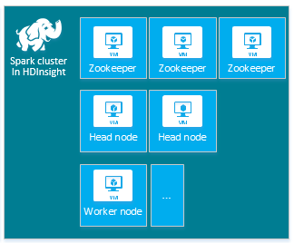
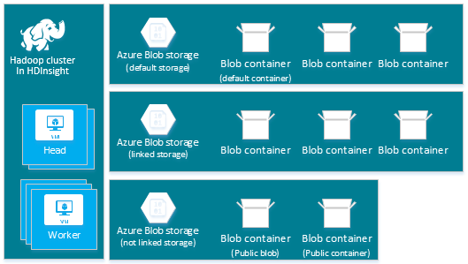

<properties
    pageTitle="Creare cluster Hadoop, HBase, eccesso o motori su Linux in HDInsight | Microsoft Azure"
    description="Informazioni su come creare Hadoop, HBase, eccesso o riguardo cluster su Linux per HDInsight con un browser, CLI Azure PowerShell di Azure, resto, o tramite un SDK."
    services="hdinsight"
    documentationCenter=""
    authors="mumian"
    manager="jhubbard"
    editor="cgronlun"
    tags="azure-portal"/>

<tags
    ms.service="hdinsight"
    ms.devlang="na"
    ms.topic="article"
    ms.tgt_pltfrm="na"
    ms.workload="big-data"
    ms.date="10/18/2016"
    ms.author="jgao"/>

# Creare i cluster basati su Linux Hadoop in HDInsight

[AZURE.INCLUDE [selector](../../includes/hdinsight-selector-create-clusters.md)]

Un cluster di Hadoop è costituito da diversi macchine virtuali (nodi) che vengono utilizzate per l'elaborazione distribuita delle attività nel cluster. Azure estrae i dettagli di implementazione dell'installazione e configurazione dei singoli nodi, pertanto è necessario fornire le informazioni di configurazione generale. In questo articolo, informazioni su queste impostazioni di configurazione.

## Requisiti di controllo accesso

[AZURE.INCLUDE [access-control](../../includes/hdinsight-access-control-requirements.md)]

## Tipi di grafico

Azure HDInsight attualmente, sono disponibili cinque diversi tipi di cluster, ognuna con una serie di componenti per offrire alcune funzionalità.

| Tipo di grafico | Funzionalità |
| ------------ | ----------------------------- |
| Hadoop       | Progettazione query e analisi (processi batch)     |
| HBase        | Archiviazione di dati NoSQL            |
| Eccesso        | Elaborazione eventi in tempo reale |
| Motori        | Elaborazione in memoria, le query interattive elaborazione batch micro flusso |
| [Hive interattivi (Preview)](hdinsight-hadoop-use-interactive-hive.md) | Memorizzazione nella cache in memoria per le query Hive interattive e processore|
| R Server ad (Preview) | Diverse statistiche di dati, modellazione previsione e le funzionalità di apprendimento automatico |

Il proprio numero di nodi all'interno del cluster, terminologia di nodi all'interno del cluster e le dimensioni di macchine Virtuali predefinite per ogni tipo di nodo ogni tipo di grafico. Nella tabella seguente, il numero dei nodi per ogni tipo di nodo è racchiuso tra parentesi.

| Tipo| Nodi | Diagramma|
|-----|------|--------|
|Hadoop| Testa nodo (2), dati (1 +)||
|HBase|Testa server di (2), l'area geografica (1 +), il nodo schema/Zookeeper (3)||
|Eccesso|Nimbus nodo (2), server Supervisore (1 +), Zookeeper (3)||
|Motori|Testa nodo (2), lavoro (1 +), il nodo Zookeeper (3) (gratuito per dimensione memoria virtuale Zookeepers A1)||

Nella tabella seguente sono elencate le dimensioni di macchine Virtuali predefinite per HDInsight:

- Tutte supportate aree ad eccezione di Brasile Sud e Ovest Giappone:

  	|Tipo di grafico                     | Hadoop               | HBase                | Eccesso                | Motori                                                                 | R Server |
  	|---------------------------------|----------------------|----------------------|----------------------|-----------------------------------------------------------------------|-----------------------------------------------------------------------|
  	|Testa – predefinito dimensione memoria virtuale           | V2 D3                | V2 D3                | A3                   | D12 v2                                                                | D12 v2                                                                |
  	|Testa-macchine Virtuali dimensioni consigliate      | V2 D3, D4 v2, D12 v2 | V2 D3, D4 v2, D12 v2 | A3, A4, A5           | V2 D12, D13 v2, D14 v2                                                | V2 D12, D13 v2, D14 v2                                                |
  	|Lavoro – predefinito dimensione memoria virtuale         | V2 D3                | V2 D3                | V2 D3                | Windows: D12 v2. Linux: D4 v2                                         | Windows: D12 v2. Linux: D4 v2                                         |
  	|Lavoro – macchine Virtuali dimensioni consigliate    | V2 D3, D4 v2, D12 v2 | V2 D3, D4 v2, D12 v2 | V2 D3, D4 v2, D12 v2 | Windows: D12 v2 D13 v2, D14 v2. Linux: D4 v2 v2 D12, D13 v2, D14 v2 | Windows: D12 v2 D13 v2, D14 v2. Linux: D4 v2 v2 D12, D13 v2, D14 v2 |
  	|Zookeeper – predefinito dimensione memoria virtuale      |                      | A3                   | A2                   |                                                                       |
  	|Zookeeper-macchine Virtuali dimensioni consigliate |                      | A3, A4, A5           | A2, A3 E A4           |                                                                       |
  	|Bordo - predefiniti dimensione memoria virtuale           |                      |                      |                      |                                                                       | Windows: D12 v2. Linux: D4 v2                                         |
  	|Bordo - consigliato dimensione memoria virtuale       |                      |                      |                      |                                                                       | Windows: D12 v2 D13 v2, D14 v2. Linux: D4 v2 v2 D12, D13 v2, D14 v2 |

- Brasile Sud e Ovest Giappone solo (senza v2 dimensioni qui):

  	|Tipo di grafico                     | Hadoop      | HBase       | Eccesso      | Motori                                          |R Server|
  	|---------------------------------|-------------|-------------|------------|------------------------------------------------|--------|
  	|Testa – predefinito dimensione memoria virtuale           | D3          | D3          | A3         | D12                                            | D12|
  	|Testa-macchine Virtuali dimensioni consigliate      | D12 D3, D4, | D12 D3, D4, | A3, A4, A5 | D14 D12, D13,                                  | D14 D12, D13,|
  	|Lavoro – predefinito dimensione memoria virtuale         | D3          | D3          | D3         | Windows: D12; Linux: D4                        | Windows: D12; Linux: D4|
  	|Lavoro – macchine Virtuali dimensioni consigliate    | D12 D3, D4, | D12 D3, D4, | D12 D3, D4,| Windows: D12, D13, D14; Linux: D4, D14 D12, D13,| Windows: D12, D13, D14; Linux: D4, D14 D12, D13,|
  	|Zookeeper – predefinito dimensione memoria virtuale      |             | A2          | A2         |                                                | |
  	|Zookeeper-macchine Virtuali dimensioni consigliate |             | A2, A3 E A4  | A2, A3 E A4 |                                                | |
  	|Bordo-predefinito dimensioni macchine Virtuali          |             |             |            |                                                | Windows: D12; Linux: D4 |
  	|Bordo-macchine Virtuali dimensioni consigliate      |             |             |            |                                                | Windows: D12, D13, D14; Linux: D4, D14 D12, D13, |

Si noti che testa è noto come *Nimbus* per il tipo di cluster eccesso. Lavoro è nota come *area* per il tipo di cluster HBase e come *Supervisore* per il tipo di cluster eccesso.

> [AZURE.IMPORTANT] Se si intende con più di 32 nodi di lavoro, al momento della creazione cluster o modificando il cluster dopo la creazione, è necessario selezionare una dimensione di nodo principale con almeno 8 core e 14 GB di RAM.

È possibile aggiungere altri componenti, ad esempio tonalità o R a questi tipi di base utilizzando [Le azioni Script](#customize-clusters-using-script-action).

> [AZURE.IMPORTANT] HDInsight cluster siano disponibili numerosi tipi corrispondono al carico di lavoro o la tecnologia che il cluster è ottimizzato per. Non esiste alcun metodo supportato per creare un cluster che combina più tipi, ad esempio eccesso e HBase in un cluster. 

Se la soluzione richiede tecnologie sono suddivisi in più tipi di cluster HDInsight, è necessario creare una rete virtuale Azure e i tipi di cluster necessari all'interno della rete virtuale. In questo modo i cluster e il codice che si distribuisce ad essi per comunicare direttamente tra loro.

Per ulteriori informazioni sull'utilizzo di una rete virtuale Azure con HDInsight, vedere [Estendere HDInsight con le reti virtuali Azure](hdinsight-extend-hadoop-virtual-network.md).

Per un esempio dell'uso di due tipi di grafico all'interno di una rete virtuale Azure, vedere [dati sensore Analizza con eccesso e HBase](hdinsight-storm-sensor-data-analysis.md).

## Livelli di raggruppamento

Azure HDInsight fornisce le offerte cloud di dati in due categorie: Standard e [Premium](hdinsight-component-versioning.md#hdinsight-standard-and-hdinsight-premium). HDInsight Premium include R e altri componenti aggiuntivi. HDInsight Premium è supportata solo su HDInsight versione 3.4.

Nella tabella seguente sono elencati il tipo di cluster HDInsight e matrice di supporto HDInsight Premium.

| Tipo di grafico | Standard | Premium  |
|--------------|---------------|--------------|
| Hadoop       | Sì           | Sì          |
| Motori        | Sì           | Sì          |
| HBase        | Sì           | No           |
| Eccesso        | Sì           | No           |
| R Server ad | No | Sì |

Questa tabella verrà aggiornata mentre altri tipi di grafico sono incluse in HDInsight Premium. La schermata seguente mostra le informazioni del portale Azure per la scelta di tipi di grafico.

## Opzioni di configurazione di base

Di seguito sono le opzioni di configurazione di base usate per creare un cluster di HDInsight.

### Nome cluster ###

Nome cluster viene utilizzato per identificare un cluster. Nome cluster deve essere univoco globale, e deve essere conformi agli convenzioni di denominazione seguenti:

- Il campo deve essere una stringa contenente da 3 a 63 caratteri.
- Il campo può contenere solo lettere, numeri e trattini.

### Tipo di grafico###

Vedere [i tipi di grafico](#cluster-types) e [livelli di raggruppamento](#cluster-tiers).

### Sistema operativo ###

È possibile creare cluster HDInsight su uno dei due sistemi operativi seguenti:

- HDInsight su Linux.  HDInsight offre la possibilità di configurare cluster Linux in Azure. Configurare un cluster Linux se si ha familiarità con Linux o Unix, la migrazione da una soluzione basata su Linux Hadoop esistente, o da semplificare l'integrazione con i componenti ecosistema Hadoop generati per Linux. Per ulteriori informazioni, vedere [Introduzione a Hadoop su Linux in HDInsight](hdinsight-hadoop-linux-tutorial-get-started.md).
- HDInsight in Windows (Windows Server 2012 R2 Data Center).

### Versione HDInsight###

Viene utilizzato per determinare la versione di HDInsight necessarie per questo cluster. Per ulteriori informazioni, vedere [Hadoop cluster versioni e componenti di HDInsight](https://go.microsoft.com/fwLink/?LinkID=320896&clcid=0x409).

### Nome dell'abbonamento###

Ogni cluster HDInsight è collegata a una sottoscrizione di Azure.

### Nome gruppo di risorse ###

Consente di [Gestione risorse di Azure](../azure-resource-manager/resource-group-overview.md) di lavorare con le risorse dell'applicazione come un gruppo, indicato come un gruppo di risorse Azure. Si distribuire, aggiornare, monitorare o eliminare tutte le risorse per l'applicazione in una singola operazione coordinata.

### Credenziali###

Con i cluster HDInsight, è possibile configurare due account utente durante la creazione di cluster:

- Utenti HTTP. Il nome utente predefinito è *amministratore* tramite la configurazione di base nel portale di Azure. A volte è denominato "Cluster utente".
- Utenti di SSH (Linux cluster). Viene utilizzato per connettersi al cluster utilizzando SSH. È possibile creare account utente SSH aggiuntivi dopo aver creato il cluster eseguendo la procedura descritta in [Uso SSH con basati su Linux Hadoop in HDInsight da Linux, Unix o OS X](hdinsight-hadoop-linux-use-ssh-unix.md) o [Usare SSH con basati su Linux Hadoop in HDInsight da Windows](hdinsight-hadoop-linux-use-ssh-unix.md).

    >[AZURE.NOTE] Per i cluster basato su Windows, è possibile creare un utente RDP per connettersi al cluster tramite RDP.

### Origine dati###

Originale Hadoop distribuita file system (HDFS) utilizza molti dischi locali sul cluster. HDInsight utilizza archiviazione Blob Azure per l'archiviazione di dati. Archiviazione Blob Azure è una soluzione di archiviazione efficaci e generiche che si integra perfettamente con HDInsight. Tramite un'interfaccia HDFS, l'elenco completo dei componenti HDInsight può agire direttamente sui dati strutturati o non strutturati in archiviazione Blob. Archiviazione dei dati in archiviazione Blob consente di eliminare i cluster HDInsight che verranno usati per il calcolo senza perdere i propri dati.

Durante la configurazione, è necessario specificare un account Azure dello spazio di archiviazione e un contenitore di spazio di archiviazione Blob Azure nella pagina account di archiviazione Azure. Alcuni processi di creazione richiedono l'account di archiviazione Azure e creare prima il contenitore di spazio di archiviazione Blob. Il contenitore di spazio di archiviazione Blob viene usato come posizione di archiviazione predefinita dal cluster. Facoltativamente, è possibile specificare altri account di archiviazione Azure (spazio di archiviazione collegata) che saranno accessibili dal cluster. Cluster di accedere a qualsiasi contenitori di archiviazione Blob sono configurati con accesso in lettura pubblica completa o pubblico accesso in lettura per BLOB solo.  Per ulteriori informazioni, vedere [Gestire l'accesso alle risorse di archiviazione Azure](../storage/storage-manage-access-to-resources.md).

>[AZURE.NOTE] Un contenitore di spazio di archiviazione Blob fornisce un raggruppamento di un insieme di BLOB come illustrato nell'immagine seguente.

Non è consigliabile utilizzare il contenitore di spazio di archiviazione Blob predefinito per l'archiviazione dei dati business. L'eliminazione del contenitore di spazio di archiviazione Blob predefinito dopo ogni utilizzo per ridurre lo spazio di archiviazione è buona norma. Si noti che il contenitore predefinito contiene applicazioni e sistema registri. Assicurarsi che recuperare i registri prima di eliminare il contenitore.

>[AZURE.WARNING] La condivisione di un contenitore di spazio di archiviazione Blob per più cluster non è supportata.

Per ulteriori informazioni sull'uso di archiviazione Blob secondario, vedere [Utilizzo di archiviazione Blob Azure con HDInsight](hdinsight-hadoop-use-blob-storage.md).

Oltre al sistema di archiviazione Blob Azure, è possibile utilizzare [Archivio Lake dati di Azure](../data-lake-store/data-lake-store-overview.md) come un account di archiviazione predefinito per i cluster HBase in HDInsight e come archiviazione collegato per tutti i quattro tipi di grafico HDInsight. Per ulteriori informazioni, vedere [creare un cluster di HDInsight con archivio Lake dati tramite il portale di Azure](../data-lake-store/data-lake-store-hdinsight-hadoop-use-portal.md).

### Posizione (area) ###

Il cluster HDInsight e il relativo account di archiviazione predefinito deve trovarsi nella stessa posizione Azure.

Per un elenco delle aree supportate, fare clic sull'elenco di riepilogo a discesa **area** sui [prezzi HDInsight](https://go.microsoft.com/fwLink/?LinkID=282635&clcid=0x409).

### Nodo prezzi livelli###

Fatturazione per l'utilizzo di tali nodi per la durata di vita del cluster. Avvia la fatturazione quando viene creato un cluster e si interrompe quando il cluster viene eliminato. Cluster non è possibile deselezionare assegnato o mettere in attesa.

Tipi diversi cluster sono diversi tipi di nodo, i numeri di nodi e le dimensioni di nodo. Ad esempio, un tipo di cluster Hadoop contiene due _nodi testa_ e predefinito di quattro _nodi di dati_, mentre un tipo di cluster eccesso ha due _nodi nimbus_, tre _nodi zookeeper_e un valore predefinito di quattro _nodi Supervisore_. Il costo di HDInsight cluster è il numero dei nodi e le dimensioni di macchine virtuali per i nodi. Ad esempio, se si è sicuri che si eseguono operazioni che richiedono una quantità elevata di memoria, può essere necessario selezionare una risorsa di calcolo con più memoria. Scopo didattico, è consigliabile utilizzare un nodo di dati. Per ulteriori informazioni sui prezzi HDInsight, vedere [prezzi HDInsight](https://go.microsoft.com/fwLink/?LinkID=282635&clcid=0x409).

>[AZURE.NOTE] Il limite di dimensioni cluster varia a seconda dei Azure abbonamenti. Contattare il supporto di fatturazione per aumentare il limite.

>I nodi utilizzati per il cluster non contano come macchine virtuali perché le immagini di macchina virtuale utilizzate per i nodi sono un dettaglio di implementazione del servizio HDInsight. Core calcolo usati dai nodi contare in base al numero totale di elaborazione core disponibili per l'abbonamento. È possibile visualizzare il numero di core disponibili e core che verranno utilizzati dal cluster nella sezione Riepilogo della stessa e nodo prezzi livelli durante la creazione di un cluster di HDInsight.

Quando si utilizza il portale di Azure per configurare il cluster, la dimensione del nodo è disponibile tramite e il __Livello di nodo prezzi__ . È anche possibile visualizzare il costo associato le dimensioni di nodo diverso. La schermata seguente mostra le opzioni per un cluster di base Linux Hadoop.

Nelle tabelle seguenti vengono visualizzati i formati supportati da HDInsight cluster e le capacità che forniscono.

#### Livello standard: serie####

Nel modello di distribuzione classico, alcune dimensioni macchine Virtuali sono leggermente diverse in PowerShell e CLI.
* Standard_A3 è grande
* Standard_A4 è ExtraLarge

|Dimensioni |Core CPU|Memoria|NIC (Max)|Max. dimensione del disco|Max. dischi di dati (1023 GB ogni)|Max. IOPS (500 per disco)|
|---|---|---|---|---|---|---|
|Standard_A3\Large|4|7 GB|2|Temporaneo = 285 GB |8|8 x 500|
|Standard_A4\ExtraLarge|8|14 GB|4|Temporaneo = 605 GB |16|16 x 500|
|Standard_A6|4|28 GB|2|Temporaneo = 285 GB |8|8 x 500|
|Standard_A7|8|GB 56|4|Temporaneo = 605 GB |16|16 x 500|

#### Livello standard: serie D####

|Dimensioni |Core CPU|Memoria|NIC (Max)|Max. dimensione del disco|Max. dischi di dati (1023 GB ogni)|Max. IOPS (500 per disco)|
|---|---|---|---|---|---|---|
|Standard_D3 |4|14 GB|4|Temporaneo (SSD) = 200 GB |8|8 x 500|
|Standard_D4 |8|28 GB|8|Temporaneo (SSD) = 400 GB |16|16 x 500|
|Standard_D12 |4|28 GB|4|Temporaneo (SSD) = 200 GB |8|8 x 500|
|Standard_D13 |8|GB 56|8|Temporaneo (SSD) = 400 GB |16|16 x 500|
|Standard_D14 |16|GB 112|8|Temporaneo (SSD) = 800 GB |32|32 x 500|

#### Livello standard: Dv2 serie####

|Dimensioni |Core CPU|Memoria|NIC (Max)|Max. dimensione del disco|Max. dischi di dati (1023 GB ogni)|Max. IOPS (500 per disco)|
|---|---|---|---|---|---|---|
|Standard_D3_v2 |4|14 GB|4|Temporaneo (SSD) = 200 GB |8|8 x 500|
|Standard_D4_v2 |8|28 GB|8|Temporaneo (SSD) = 400 GB |16|16 x 500|
|Standard_D12_v2 |4|28 GB|4|Temporaneo (SSD) = 200 GB |8|8 x 500|
|Standard_D13_v2 |8|GB 56|8|Temporaneo (SSD) = 400 GB |16|16 x 500|
|Standard_D14_v2 |16|GB 112|8|Temporaneo (SSD) = 800 GB |32|32 x 500|    

Per distribuzione considerazioni da tenere presenti quando si prevede di usare queste risorse, vedere [le dimensioni per macchine virtuali](../virtual-machines/virtual-machines-windows-sizes.md). Per informazioni sui prezzi di varie dimensioni, vedere [Prezzi HDInsight](https://azure.microsoft.com/pricing/details/hdinsight).   

> [AZURE.IMPORTANT] Se si intende con più di 32 nodi di lavoro, al momento della creazione cluster o modificando il cluster dopo la creazione, è necessario selezionare una dimensione di nodo principale con almeno 8 core e 14 GB di RAM.

Viene avviata la fatturazione quando viene creato un cluster e si arresta quando il cluster viene eliminato. Per ulteriori informazioni sui prezzi, vedere [informazioni sui prezzi HDInsight](https://azure.microsoft.com/pricing/details/hdinsight/).

## Utilizzare spazio di archiviazione aggiuntivo

In alcuni casi, che si desidera aggiungere ulteriore spazio di archiviazione al cluster. Ad esempio, potrebbe essere più account Azure dello spazio di archiviazione per le aree geografiche diverse o diversi servizi di, ma si vuole analizzarli tutti con HDInsight.

Quando si crea un cluster di HDInsight o dopo la creazione di un cluster, è possibile aggiungere gli account di archiviazione.  Vedere [cluster basati su Linux personalizzare HDInsight tramite Script azione](hdinsight-hadoop-customize-cluster-linux.md).

Per ulteriori informazioni sull'archiviazione Blob secondario, vedere [lo spazio di archiviazione Blob Azure utilizzando con HDInsight](hdinsight-hadoop-use-blob-storage.md). Per ulteriori informazioni sull'archiviazione Lake dati secondaria, vedere [creare HDInsight cluster con archivio Lake dati tramite il portale di Azure](../data-lake-store/data-lake-store-hdinsight-hadoop-use-portal.md).

## Utilizzare Hive/Oozie metastore

È consigliabile utilizzare un metastore personalizzato se si desidera mantenere le tabelle Hive dopo aver eliminato il cluster HDInsight. Sarà possibile allegare tale metastore a un altro cluster HDInsight.

> [AZURE.IMPORTANT] Metastore HDInsight creato per una versione cluster HDInsight, non possono essere condivisi tra diverse versioni di cluster HDInsight. Per un elenco delle versioni HDInsight, vedere [versioni supportata HDInsight](hdinsight-component-versioning.md#supported-hdinsight-versions).

La metastore contiene metadati Hive e Oozie, ad esempio Hive tabelle, le partizioni, schemi e colonne. Il metastore consente di mantenere i metadati Hive e Oozie in modo che non è necessario ricreare Hive tabelle o processi Oozie quando si crea un nuovo cluster. Per impostazione predefinita, Hive utilizza un database SQL Azure incorporato per archiviare queste informazioni. Database incorporato non consente di mantenere i metadati quando il cluster viene eliminato. Quando si crea tabella Hive in un cluster di HDInsight con un metastore Hive configurato, tali tabelle verranno mantenuti quando si ricrea il cluster utilizzando la stessa metastore Hive.

Configurazione di Metastore non è disponibile per i tipi di grafico HBase.

> [AZURE.IMPORTANT] Quando si crea un metastore personalizzato, non usare un nome di database che contiene trattini o trattini. In questo modo il processo di creazione cluster l'esito negativo.

## Utilizzare le reti virtuali Azure

Con una [rete virtuale Azure](https://azure.microsoft.com/documentation/services/virtual-network/), è possibile creare una rete sicura, persistente contenente le risorse che necessarie per la soluzione. Con una rete virtuale, è possibile:

* Connettere le risorse cloud insieme in una rete privata (basata solo su cloud).

    

* Connettere le risorse cloud alla rete Data Center locale (da sito o punto al sito) tramite una rete privata virtuale (VPN).

| Configurazione del sito al sito | Configurazione del punto di sito |
| -------------------------- | --------------------------- |
| Con la configurazione del sito al sito, è possibile connettersi più risorse dal centro dati per la rete virtuale Azure tramite VPN hardware o di Routing e accesso remoto.  | Con la configurazione del punto di sito, è possibile connettersi alla rete virtuale Azure una risorsa specifica usando un software VPN.  |

Basato su Windows cluster richiedono un v1 (classico) virtuali, mentre i cluster basati su Linux richiedono una rete virtuale (Azure Manager delle risorse) v2. Se non è il tipo corretto di rete, non sarà utilizzabile quando si crea il cluster.

Per ulteriori informazioni sull'utilizzo di HDInsight con una rete virtuale, inclusi i requisiti di configurazione specifiche per la rete virtuale, vedere [funzionalità estendere HDInsight tramite una rete virtuale Azure](hdinsight-extend-hadoop-virtual-network.md).

## Personalizzare cluster mediante la personalizzazione di cluster HDInsight (avvio)

In alcuni casi si desidera configurare i file di configurazione seguenti:

- clusterIdentity.xml
- principali site.xml
- gateway.Xml
- hbase env.xml
- hbase site.xml
- hdfs site.xml
- hive env.xml
- hive site.xml
- sito mapred
- oozie site.xml
- oozie env.xml
- eccesso site.xml
- tez site.xml
- webhcat site.xml
- filati site.xml

Per mantenere le modifiche per tutta la durata di un cluster, è possibile utilizzare la personalizzazione di cluster HDInsight durante il processo di creazione oppure è possibile usare Ambari in cluster basati su Linux. Per ulteriori informazioni, vedere [personalizzare HDInsight cluster tramite avvio](hdinsight-hadoop-customize-cluster-bootstrap.md).

>[AZURE.NOTE] I cluster basato su Windows non è possibile mantenere le modifiche a causa di ricreare l'immagine. Per ulteriori informazioni, vedere [Ruolo istanza riavvia scadenza agli aggiornamenti del sistema operativo](http://blogs.msdn.com/b/kwill/archive/2012/09/19/role-instance-restarts-due-to-os-upgrades.aspx).  Per mantenere le modifiche per tutta la durata i cluster, è necessario utilizzare la personalizzazione di cluster HDInsight durante il processo di creazione.

## Personalizzare cluster tramite Script azione

È possibile installare componenti aggiuntivi o personalizzare configurazione cluster tramite script durante la creazione. Tali script vengono richiamati tramite **Script azione**, ovvero un'opzione di configurazione che può essere usata dal portale di Azure, cmdlet di Windows PowerShell HDInsight o HDInsight .NET SDK. Per ulteriori informazioni, vedere [personalizzare HDInsight cluster tramite Script azione](hdinsight-hadoop-customize-cluster-linux.md).

Alcuni componenti di linguaggio nativi, ad esempio Mahout e CSS, possono essere eseguiti sul cluster come file di archivio Java (VASO). Questi file VASO possono essere distribuiti a archiviazione Blob Azure e inviare HDInsight cluster tramite meccanismi di invio processo Hadoop. Per ulteriori informazioni, vedere [inviare Hadoop processi a livello di programmazione](hdinsight-submit-hadoop-jobs-programmatically.md).

>[AZURE.NOTE] Se si sono verificati problemi per cluster HDInsight distribuzione VASO file o la chiamata file VASO su cluster HDInsight, contattare il [Supporto tecnico Microsoft](https://azure.microsoft.com/support/options/).

> CSS non è supportato da HDInsight, non è idoneo per il supporto Microsoft. Per gli elenchi dei componenti supportati, vedere [quali sono le novità in versioni cluster fornite da HDInsight?](hdinsight-component-versioning.md)

## Utilizzare nodo del bordo

 Un nodo del bordo vuoto è una macchina virtuale Linux con gli stessi strumenti client installato e configurato come il headnodes. È possibile utilizzare il nodo del bordo per l'accesso del cluster, la verifica delle applicazioni client e le applicazioni client di hosting. Per ulteriori informazioni, vedere [uso bordo vuoto nodi in HDInsight](hdinsight-apps-use-edge-node.md).
 
## Metodi di creazione cluster

In questo articolo sono state fornite informazioni di base sulla creazione di un cluster basati su Linux HDInsight. Utilizzare la tabella seguente per trovare informazioni specifiche su come creare un cluster utilizzando il metodo più adatto alle proprie esigenze.

| Creati con i cluster | Browser Web | Opzioni della riga | API REST | SDK | Linux, Mac OS X o Unix | Windows |
| ------------------------------- |:----------------------:|:--------------------:|:------------------:|:------------:|:-----------------------------:|:------------:|
| [Portale di Azure](hdinsight-hadoop-create-linux-clusters-portal.md) | ✔     | &nbsp; | &nbsp; | &nbsp; | ✔      | ✔ |
| [Dati di Azure Factory](hdinsight-hadoop-create-linux-clusters-adf.md) | ✔     | ✔  | ✔  |✔  | ✔      | ✔ |
| [CLI Azure](hdinsight-hadoop-create-linux-clusters-azure-cli.md)         | &nbsp; | ✔     | &nbsp; | &nbsp; | ✔      | ✔ |
| [PowerShell Azure](hdinsight-hadoop-create-linux-clusters-azure-powershell.md) | &nbsp; | ✔     | &nbsp; | &nbsp; | ✔ | ✔ |
| [Curvatura](hdinsight-hadoop-create-linux-clusters-curl-rest.md) | &nbsp; | ✔     | ✔ | &nbsp; | ✔      | ✔ |
| [.NET SDK](hdinsight-hadoop-create-linux-clusters-dotnet-sdk.md) | &nbsp; | &nbsp; | &nbsp; | ✔ | ✔      | ✔ |
| [Modelli di gestione risorse di Azure](hdinsight-hadoop-create-linux-clusters-arm-templates.md) | &nbsp; | ✔     | &nbsp; | &nbsp; | ✔      | ✔ |
