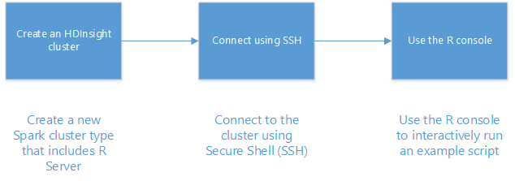

<properties
   pageTitle="Guida introduttiva a Server R HDInsight (preview) | Azure"
   description="Informazioni su come creare un ad Apache cluster HDInsight (Hadoop) che include R Server (preview) e quindi inviare uno script R sul cluster."
   services="HDInsight"
   documentationCenter=""
   authors="jeffstokes72"
   manager="jhubbard"
   editor="cgronlun"
/>

<tags
   ms.service="HDInsight"
   ms.devlang="R"
   ms.topic="article"
   ms.tgt_pltfrm="na"
   ms.workload="data-services"
   ms.date="08/19/2016"
   ms.author="jeffstok"
/>

# Introduzione all'utilizzo di Server R su HDInsight (preview)

Il livello di premium che offre la possibilità di HDInsight include Server R come parte del cluster HDInsight (preview). In questo modo script R usare MapReduce e motori per eseguire calcoli distribuiti. In questo documento si imparerà a creare un nuovo Server R in HDInsight, quindi eseguire uno script di R viene illustrato come utilizzare motori per i calcoli R distribuiti.

## Prerequisiti

* __Azure un abbonamento__: prima di iniziare questa esercitazione, è necessario un abbonamento a Azure. Per ulteriori informazioni, vedere [ottenere Azure versione di valutazione gratuita](https://azure.microsoft.com/documentation/videos/get-azure-free-trial-for-testing-hadoop-in-hdinsight/) .

* __Client A Secure Shell (SSH)__: un SSH client viene utilizzato in modalità remota connettersi al cluster HDInsight ed eseguire i comandi direttamente nel cluster. Sistemi Linux, Unix e OS X forniscono un client SSH tramite il `ssh` comando. Per i sistemi Windows, è consigliabile [PuTTY](http://www.chiark.greenend.org.uk/~sgtatham/putty/download.html).

    * __Chiavi SSH (facoltative)__: È possibile proteggere l'account SSH utilizzato per connettersi al cluster utilizzando una password o una chiave pubblica. Con una password è più semplice ed è possibile iniziare senza la necessità di creare una coppia di chiavi pubblico/privato; utilizzo di una chiave è più sicura.
    
        La procedura descritta in questo documento presuppone che si sta utilizzando una password. Per informazioni su come creare e utilizzare i tasti SSH con HDInsight, vedere i documenti seguenti:
        
        * [Usare SSH con HDInsight da client Linux, Unix o OS X](hdinsight-hadoop-linux-use-ssh-unix.md)
        
        * [Usare SSH con HDInsight dai client Windows](hdinsight-hadoop-linux-use-ssh-windows.md)

### Requisiti di controllo accesso

[AZURE.INCLUDE [access-control](../../includes/hdinsight-access-control-requirements.md)]

## Creare il cluster

> [AZURE.NOTE] La procedura descritta in questo documento crea un Server R su HDInsight utilizzando le informazioni di configurazione di base. Per altre impostazioni di configurazione cluster (ad esempio l'aggiunta di account di spazio di archiviazione aggiuntivo, tramite una rete virtuale Azure o creazione di un metastore per Hive), vedere [cluster basati su Linux creare HDInsight](hdinsight-hadoop-provision-linux-clusters.md).

1. Accedere al [portale di Azure](https://portal.azure.com).

2. Selezionare __Nuovo__, __dati + Analitica__e quindi __HDInsight__.

    

3. Immettere un nome per il cluster nel campo __Nome Cluster__ . Se si hanno più abbonamenti Azure, utilizzare la voce della __sottoscrizione__ di selezionare quello che si desidera utilizzare.

    

4. Seleziona __tipo di grafico__. Nella e __Tipo di grafico__ , selezionare le opzioni seguenti:

    * __Tipo di cluster__: Server R motori
    
    * __Livello di cluster__: Premium

    Lasciare le altre opzioni in base ai valori predefiniti, quindi usare il pulsante __selezione__ per salvare il tipo di grafico.
    
    
    
    > [AZURE.NOTE] È anche possibile aggiungere Server R ad altri tipi di cluster HDInsight (ad esempio Hadoop o HBase,) selezionando il tipo di grafico e quindi selezionando __Premium__.

5. Selezionare **Il gruppo di risorse** per visualizzare un elenco di gruppi di risorse esistenti e quindi selezionare l'opzione per creare il cluster in. In alternativa, è possibile selezionare **Crea nuovo** e quindi immettere il nome del nuovo gruppo di risorse. Verrà visualizzato un segno di spunta verde per indicare che il nome del nuovo gruppo è disponibile.

    > [AZURE.NOTE] Questa voce verrà automaticamente a uno dei gruppi di risorse esistenti, se disponibili.
    
    Utilizzare il pulsante __selezione__ per salvare il gruppo di risorse.

6. Selezionare **le credenziali**e quindi immettere un **Nome utente accesso Cluster** e la **Password di accesso al Cluster**.

    Immettere un __nome utente SSH__.  SSH viene utilizzato per collegarsi al cluster tramite un client __Secure Shell (SSH)__ . È possibile specificare l'utente SSH in questa finestra di dialogo o dopo aver creato il grafico (scheda configurazione per il cluster). R Server è configurato in modo da richiedere un __nome utente SSH__ di "remoteuser".  Se si usa un nome utente diverso, sarà necessario eseguire un'operazione aggiuntiva dopo aver creato il grafico.
    
    

    __Tipo di autenticazione SSH__: selezionare __PASSWORD__ il tipo di autenticazione, a meno che non si preferisce utilizzare di una chiave pubblica.  È necessario una coppia di chiavi pubblico/privato se si vuole accedere R Server cluster tramite un client remoto, ad esempio RTVS, RStudio o un altro desktop IDE.   

    Per creare e utilizzare una chiave pubblica/privata coppia seleziona 'Chiave pubblica' e procedura come segue.  Queste istruzioni si suppone che Cygwin con ssh keygen o equivalente installato.

    -    Generare una coppia di chiavi pubblico/privato dal prompt dei comandi sul portatile:
      
            SSH keygen - t rsa -b 2048 – f < nomefile di chiave privata >
      
    -    Per creare un file di chiave privata e un file di chiave pubblica in pub nome < nomefile di chiave privata >, ad esempio  davec e davec.pub.  Quindi specificare il file di chiave pubblica (*. pub) quando si assegnano le credenziali cluster HDI:
      
          
      
    -    Modificare le autorizzazioni per il file di chiavi private nel computer portatile
      
            chmod 600 < nomefile di chiave privata >
      
    -    Usare i file di chiave privata con SSH per l'accesso remoto, ad esempio
      
            SSH – i < nomefile di chiave privata >remoteuser@<hostname public ip>
      
      o come parte la definizione del contesto calcolo Hadoop Spark R Server sul client (vedere Using Microsoft R Server come Hadoop Client nella sezione [creazione di un contesto calcolare per motori](https://msdn.microsoft.com/microsoft-r/scaler-spark-getting-started#creating-a-compute-context-for-spark) della linea [RevoScaleR Hadoop ad Guida introduttiva](https://msdn.microsoft.com/microsoft-r/scaler-spark-getting-started)).

7. Selezionare l' **Origine dati** per selezionare un'origine dati per il cluster. Selezionare un account di archiviazione esistente selezionando __selezionare account di archiviazione__ , quindi selezionare l'account oppure creare un nuovo account tramite il collegamento di __Nuovo__ nella sezione __selezionare account di archiviazione__ .

    Se si seleziona __Nuovo__, è necessario immettere un nome per il nuovo account di archiviazione. Se il nome viene accettato, verrà visualizzato un segno di spunta verde.

    Il __Contenitore predefinito__ viene impostato sul nome del cluster. Lasciare come valore.
    
    Selezionare la __posizione__ per selezionare l'area per creare l'account di archiviazione in.
    
    > [AZURE.IMPORTANT] Selezionare la posizione per l'origine dati predefinita verrà impostato anche il percorso del cluster HDInsight. L'origine di dati predefiniti e cluster deve trovarsi nella stessa regione.

    Utilizzare il pulsante **selezione** per salvare la configurazione dell'origine dati.
    
    

8. Selezionare **Nodo prezzi livelli** da visualizzare informazioni su nodi che verranno creati per questo cluster. A meno che non si sa che è necessario un cluster di dimensioni maggiore, lasciare il numero dei nodi di lavoro l'impostazione predefinita di `4`. Verrà visualizzato il costo previsto del cluster all'interno e il.

    > [AZURE.NOTE] Se necessario, è possibile ridimensionare il cluster in un secondo momento tramite il portale (Cluster -> Impostazioni -> scala Cluster) per aumentare o ridurre il numero dei nodi di lavoro.  Può essere utile per minimo verso il basso il cluster quando non è in uso o per l'aggiunta di capacità per soddisfare le esigenze di attività più grandi.

    Alcuni fattori da tenere presenti quando ridimensionamento il cluster, i nodi di dati e il nodo del bordo:  
   
    - Le prestazioni di analisi R Server distribuite in motori sono proporzionale al numero dei nodi di lavoro quando i dati sono di grandi dimensioni.  
    - Le prestazioni di analisi R Server non lineari usando le dimensioni dei dati da analizzare. Per esempio:  
        - Dati di piccole limitata prestazioni occorre migliore durante l'analisi in un contesto di elaborazione locale del nodo di bordo.  Per ulteriori informazioni sugli scenari in cui la locale e contesti di elaborazione ad ideali per vedere Opzioni di contesto di calcolo per R Server su HDInsight. 
        - Se accedere nodo del bordo ed Esegui script R sono quindi tutte le funzioni di ricezione ridimensionamento verranno eseguito <strong>in locale</strong> nel nodo del bordo in modo memoria e il numero di core del nodo di bordo devono essere ridimensionate di conseguenza. Lo stesso vale se si utilizza R Server come un contesto di elaborazione remota HDI dal portatile.
    
    

    Utilizzare il pulsante **selezione** per salvare il nodo prezzi configurazione.
    
9. Scegliere e il **Nuovo HDInsight Cluster** , assicurarsi che sia selezionato **Aggiungi a Startboard** e quindi selezionare **Crea**. Questa operazione verrà creare il cluster e aggiungere un riquadro per renderla alla Startboard del portale Azure. L'icona indica che il cluster consiste nel creare e verrà modificato per visualizzare l'icona HDInsight dopo il completamento della creazione.

  	| Durante la creazione di | Creazione completata |
  	| ------------------ | --------------------- |
  	|  |  |

    > [AZURE.NOTE] Richiederà molto tempo per il cluster da creare, in genere circa 15 minuti. Utilizzare il riquadro la Startboard o la voce di **notifiche** sul lato sinistro della pagina per verificare se il processo di creazione.

## Connettersi al livello di nodo edge Server R

Connettersi al Server R bordo nodo del cluster HDInsight utilizzando SSH:

    ssh USERNAME@r-server.CLUSTERNAME-ssh.azurehdinsight.net
    
> [AZURE.NOTE] È inoltre possibile trovare il `R-Server.CLUSTERNAME-ssh.azurehdinsight.net` indirizzo nel portale di Azure selezionando il cluster, quindi __Tutte le impostazioni__, __applicazioni__e __RServer__. Verranno visualizzati le informazioni sull'Endpoint SSH per il nodo del bordo.
>
> 
    
Se è stata usata una password per proteggere il proprio account utente SSH, verrà richiesto di immetterla. Se è stata utilizzata una chiave pubblica, è necessario utilizzare la `-i` parametro per specificare la chiave privata corrispondente. Ad esempio `ssh -i ~/.ssh/id_rsa USERNAME@R-Server.CLUSTERNAME-ssh.azurehdinsight.net`.
    
Per ulteriori informazioni sull'utilizzo di SSH con basati su Linux HDInsight, vedere gli articoli seguenti:

* [Usare SSH con basati su Linux Hadoop in HDInsight da Linux, Unix o OS X](hdinsight-hadoop-linux-use-ssh-unix.md)

* [Usare SSH con basati su Linux Hadoop in HDInsight da Windows](hdinsight-hadoop-linux-use-ssh-windows.md)

Una volta connessa, verranno recapitati al prompt dei comandi simile al seguente.

    username@ed00-myrser:~$

## Utilizzare la console R

1. Da sessione SSH, usare il comando seguente per avviare la console R.

        R
    
    Verrà visualizzato output simile al seguente.
    
        R version 3.2.2 (2015-08-14) -- "Fire Safety"
        Copyright (C) 2015 The R Foundation for Statistical Computing
        Platform: x86_64-pc-linux-gnu (64-bit)

        R is free software and comes with ABSOLUTELY NO WARRANTY.
        You are welcome to redistribute it under certain conditions.
        Type 'license()' or 'licence()' for distribution details.

        Natural language support but running in an English locale

        R is a collaborative project with many contributors.
        Type 'contributors()' for more information and
        'citation()' on how to cite R or R packages in publications.

        Type 'demo()' for some demos, 'help()' for on-line help, or
        'help.start()' for an HTML browser interface to help.
        Type 'q()' to quit R.

        Microsoft R Server version 8.0: an enhanced distribution of R
        Microsoft packages Copyright (C) 2016 Microsoft Corporation

        Type 'readme()' for release notes.

        >

2. Dal `>` prompt dei comandi, è possibile immettere il codice R. Server R include i pacchetti che consentono di interagire con Hadoop ed eseguire calcoli distribuiti facilmente. Ad esempio, utilizzare il comando seguente per visualizzare la radice del sistema di file predefinito per il cluster HDInsight.

        rxHadoopListFiles("/")
    
    È inoltre possibile utilizzare l'indirizzamento di stile WASB.
    
        rxHadoopListFiles("wasbs:///")

## Utilizzo di Server R nella HDI da un'istanza remota di Microsoft R Server o Microsoft R Client

Per ogni sezione sopra relativi utilizzo di coppie di parole chiave pubblica/privata per accedere al cluster, è possibile accedere imposta il contesto di elaborazione HDI Hadoop ad da un'istanza remota di Microsoft R Server o Microsoft R Client in esecuzione su un computer desktop o portatile (vedere Using Microsoft R Server come Hadoop Client nella sezione [creazione di un contesto calcolare per motori](https://msdn.microsoft.com/microsoft-r/scaler-spark-getting-started#creating-a-compute-context-for-spark) della linea [RevoScaleR Hadoop ad Guida introduttiva](https://msdn.microsoft.com/microsoft-r/scaler-spark-getting-started)).  A tale scopo è necessario specificare le opzioni seguenti quando si definisce il RxSpark calcolano contesto sul portatile: hdfsShareDir, shareDir, sshUsername, sshHostname, sshSwitches e sshProfileScript. Per esempio:

    
    myNameNode <- "default"
    myPort <- 0 
 
    mySshHostname  <- 'rkrrehdi1-ssh.azurehdinsight.net'  # HDI secure shell hostname
    mySshUsername  <- 'remoteuser'# HDI SSH username
    mySshSwitches  <- '-i /cygdrive/c/Data/R/davec'   # HDI SSH private key
 
    myhdfsShareDir <- paste("/user/RevoShare", mySshUsername, sep="/")
    myShareDir <- paste("/var/RevoShare" , mySshUsername, sep="/")
 
    mySparkCluster <- RxSpark(
      hdfsShareDir = myhdfsShareDir,
      shareDir     = myShareDir,
      sshUsername  = mySshUsername,
      sshHostname  = mySshHostname,
      sshSwitches  = mySshSwitches,
      sshProfileScript = '/etc/profile',
      nameNode     = myNameNode,
      port         = myPort,
      consoleOutput= TRUE
    )

    
 
## Utilizzare un contesto di calcolo

Un contesto di elaborazione consente di controllare se calcolo verrà eseguita in locale nel nodo del bordo o se verrà distribuito tra i nodi del cluster HDInsight.
        
1. Dalla console di R, utilizzare le operazioni seguenti per caricare i dati di esempio in spazio di archiviazione predefinito per HDInsight.

        # Set the HDFS (WASB) location of example data
        bigDataDirRoot <- "/example/data"
        # create a local folder for storaging data temporarily
        source <- "/tmp/AirOnTimeCSV2012"
        dir.create(source)
        # Download data to the tmp folder
        remoteDir <- "http://packages.revolutionanalytics.com/datasets/AirOnTimeCSV2012"
        download.file(file.path(remoteDir, "airOT201201.csv"), file.path(source, "airOT201201.csv"))
        download.file(file.path(remoteDir, "airOT201202.csv"), file.path(source, "airOT201202.csv"))
        download.file(file.path(remoteDir, "airOT201203.csv"), file.path(source, "airOT201203.csv"))
        download.file(file.path(remoteDir, "airOT201204.csv"), file.path(source, "airOT201204.csv"))
        download.file(file.path(remoteDir, "airOT201205.csv"), file.path(source, "airOT201205.csv"))
        download.file(file.path(remoteDir, "airOT201206.csv"), file.path(source, "airOT201206.csv"))
        download.file(file.path(remoteDir, "airOT201207.csv"), file.path(source, "airOT201207.csv"))
        download.file(file.path(remoteDir, "airOT201208.csv"), file.path(source, "airOT201208.csv"))
        download.file(file.path(remoteDir, "airOT201209.csv"), file.path(source, "airOT201209.csv"))
        download.file(file.path(remoteDir, "airOT201210.csv"), file.path(source, "airOT201210.csv"))
        download.file(file.path(remoteDir, "airOT201211.csv"), file.path(source, "airOT201211.csv"))
        download.file(file.path(remoteDir, "airOT201212.csv"), file.path(source, "airOT201212.csv"))
        # Set directory in bigDataDirRoot to load the data into
        inputDir <- file.path(bigDataDirRoot,"AirOnTimeCSV2012") 
        # Make the directory
        rxHadoopMakeDir(inputDir)
        # Copy the data from source to input
        rxHadoopCopyFromLocal(source, bigDataDirRoot)

2. Successivamente, verrà creato alcune informazioni di dati e definire due origini dati in modo che possiamo lavorare con i dati.

        # Define the HDFS (WASB) file system
        hdfsFS <- RxHdfsFileSystem()
        # Create info list for the airline data
        airlineColInfo <- list(
            DAY_OF_WEEK = list(type = "factor"),
            ORIGIN = list(type = "factor"),
            DEST = list(type = "factor"),
            DEP_TIME = list(type = "integer"),
            ARR_DEL15 = list(type = "logical"))

        # get all the column names
        varNames <- names(airlineColInfo)

        # Define the text data source in hdfs
        airOnTimeData <- RxTextData(inputDir, colInfo = airlineColInfo, varsToKeep = varNames, fileSystem = hdfsFS)
        # Define the text data source in local system
        airOnTimeDataLocal <- RxTextData(source, colInfo = airlineColInfo, varsToKeep = varNames)

        # formula to use
        formula = "ARR_DEL15 ~ ORIGIN + DAY_OF_WEEK + DEP_TIME + DEST"

3. Eseguiamo una regressione logistica sopra i dati utilizzando locale calcolare contesto.

        # Set a local compute context
        rxSetComputeContext("local")
        # Run a logistic regression
        system.time(
            modelLocal <- rxLogit(formula, data = airOnTimeDataLocal)
        )
        # Display a summary 
        summary(modelLocal)

    È necessario vedere output che termina con righe simile al seguente.

        Data: airOnTimeDataLocal (RxTextData Data Source)
        File name: /tmp/AirOnTimeCSV2012
        Dependent variable(s): ARR_DEL15
        Total independent variables: 634 (Including number dropped: 3)
        Number of valid observations: 6005381
        Number of missing observations: 91381
        -2*LogLikelihood: 5143814.1504 (Residual deviance on 6004750 degrees of freedom)

        Coefficients:
                        Estimate Std. Error z value Pr(>|z|)
        (Intercept)   -3.370e+00  1.051e+00  -3.208  0.00134 **
        ORIGIN=JFK     4.549e-01  7.915e-01   0.575  0.56548
        ORIGIN=LAX     5.265e-01  7.915e-01   0.665  0.50590
        ......
        DEST=SHD       5.975e-01  9.371e-01   0.638  0.52377
        DEST=TTN       4.563e-01  9.520e-01   0.479  0.63172
        DEST=LAR      -1.270e+00  7.575e-01  -1.676  0.09364 .
        DEST=BPT         Dropped    Dropped Dropped  Dropped
        ---
        Signif. codes:  0 ‘***’ 0.001 ‘**’ 0.01 ‘*’ 0.05 ‘.’ 0.1 ‘ ’ 1

        Condition number of final variance-covariance matrix: 11904202
        Number of iterations: 7

4. Quindi, possibile eseguire la stessa regressione logistica utilizzando il contesto di motori. Il contesto di motori distribuisce l'elaborazione tutti i nodi di lavoro cluster HDInsight.

        # Define the Spark compute context 
        mySparkCluster <- RxSpark()
        # Set the compute context 
        rxSetComputeContext(mySparkCluster)
        # Run a logistic regression 
        system.time(  
            modelSpark <- rxLogit(formula, data = airOnTimeData)
        )
        # Display a summary
        summary(modelSpark)

    > [AZURE.NOTE] È anche possibile utilizzare MapReduce per la distribuzione di calcolo tra nodi cluster. Per ulteriori informazioni sul contesto di calcolo, vedere [calcolare le opzioni di scelta rapida per Server R premium HDInsight](hdinsight-hadoop-r-server-compute-contexts.md).

## Distribuire il codice R a più nodi

Con Server R è possibile eseguire il codice R esistente facilmente ed eseguito in più nodi del cluster utilizzando `rxExec`. Ciò è utile quando si esegue un Organizza di parametro o simulazioni. Nell'esempio è illustrato un esempio di utilizzo `rxExec`.

    rxExec( function() {Sys.info()["nodename"]}, timesToRun = 4 )
    
Se si sta ancora utilizzando il contesto di motori o MapReduce, restituirà il valore di NomeNodo dei nodi di lavoro che il codice (`Sys.info()["nodename"]`) eseguito su. In un cluster di quattro nodi, ad esempio, si verifichi output simile al seguente.

    $rxElem1
        nodename
    "wn3-myrser"

    $rxElem2
        nodename
    "wn0-myrser"

    $rxElem3
        nodename
    "wn3-myrser"

    $rxElem4
        nodename
    "wn3-myrser"

## Installare pacchetti R

Se si desidera installare pacchetti R aggiuntivi sul nodo del bordo, è possibile utilizzare `install.packages()` direttamente dalla console all'interno di R quando la connessione al livello di nodo bordo tramite SSH. Tuttavia, se è necessario installare pacchetti R nei nodi del cluster di lavoro, è necessario utilizzare un'azione Script.

Azioni di script sono script Bash utilizzati per apportare modifiche alla configurazione al cluster HDInsight o per installare software aggiuntivo. In questo caso, per installare R aggiuntive pacchetti. Per installare pacchetti aggiuntivi con un'azione Script, utilizzare la procedura seguente.

> [AZURE.IMPORTANT] Utilizzo di azioni di Script per installare pacchetti R aggiuntivi può essere usata solo dopo aver creato il cluster. Essa non deve essere utilizzato durante la creazione di cluster, lo script si basa sul Server R completamente installato e configurato.

1. Dal [portale di Azure](https://portal.azure.com), selezionare il Server R cluster HDInsight.

2. Selezionare __Tutte le impostazioni__e __Le azioni Script__e il raggruppamento. Selezionare __Nuovo invio__ per inviare una nuova azione Script e __l'Azioni Script__ .

    

3. Da e __l'azione script invia__ , fornire le informazioni seguenti.

  - __Nome__: un nome descrittivo per identificare questo script
  - __Bash script URI__:`http://mrsactionscripts.blob.core.windows.net/rpackages-v01/InstallRPackages.sh`
  - __Testa__: deve essere __deselezionata__
  - __Lavoro__: deve essere __selezionata__
  - __Zookeeper__: deve essere __deselezionata__
  - __Parametri__: pacchetti R il da installare. Per esempio`bitops stringr arules`
  - __Persistente questo script....__: tale valore deve essere __selezionata__  

    > [AZURE.NOTE] 1. per impostazione predefinita, tutti i pacchetti R vengono installati da uno snapshot dell'archivio MRAN Microsoft coerenza con la versione del Server R che è stata installata.  Se si desidera installare versioni più recenti di pacchetti non vi è rischio di problemi di compatibilità, tuttavia questa operazione è possibile specificando `useCRAN` come ad esempio il primo elemento del pacchetto di elenco  `useCRAN bitops, stringr, arules`.  
    > 2. Alcuni pacchetti R richiederà altre librerie di sistema Linux. Per maggiore comodità, è stato preinstallato dipendenze necessari per prime 100 più popolari R pacchetti. Tuttavia, se i pacchetti R che l'installazione richiedono librerie oltre a questi, quindi è necessario scaricare lo script di base utilizzato qui e aggiungere i passaggi per installare le librerie di sistema. È quindi necessario caricare script modificato in un contenitore di blob pubblica in archiviazione Azure e utilizzare lo script modificato per installare i pacchetti.
    > Per ulteriori informazioni sullo sviluppo azioni di Script, vedere [sviluppo di Script azione](hdinsight-hadoop-script-actions-linux.md).  

    

4. Selezionare __Crea__ per eseguire lo script. Al termine dell'esecuzione di script, i pacchetti R sarà disponibili in tutti i nodi di lavoro.
    
## Passaggi successivi

Dopo avere appreso come creare un nuovo cluster HDInsight che include Server R e Introduzione all'utilizzo console R da una sessione SSH, utilizzare le operazioni seguenti per scoprire altri modi di utilizzo di Server R HDInsight.

- [Aggiungere RStudio Server HDInsight premium](hdinsight-hadoop-r-server-install-r-studio.md)

- [Calcolare le opzioni di contesto di Server R in HDInsight premium](hdinsight-hadoop-r-server-compute-contexts.md)

- [Opzioni relative all'archiviazione Azure per Server R nella HDInsight premium](hdinsight-hadoop-r-server-storage.md)

### Modelli di Azure Manager delle risorse

Se è interessati a automatizzare la creazione del Server R in uso dei modelli di gestione di risorse Azure HDInsight, vedere modelli di esempio seguenti.

* [Crea un Server R su cluster HDInsight utilizzando una chiave pubblica SSH](http://go.microsoft.com/fwlink/p/?LinkID=780809)
* [Creare un Server R cluster HDInsight utilizzando una password SSH](http://go.microsoft.com/fwlink/p/?LinkID=780810)

Entrambi i modelli di creare un nuovo cluster HDInsight e un account di archiviazione associato e possono essere utilizzati da CLI Azure, PowerShell Azure o il portale di Azure.

Per informazioni generali sull'utilizzo dei modelli Manager delle risorse di Azure, vedere [Hadoop basati su Linux creare cluster in uso dei modelli di gestione risorse di Azure HDInsight](hdinsight-hadoop-create-linux-clusters-arm-templates.md).
