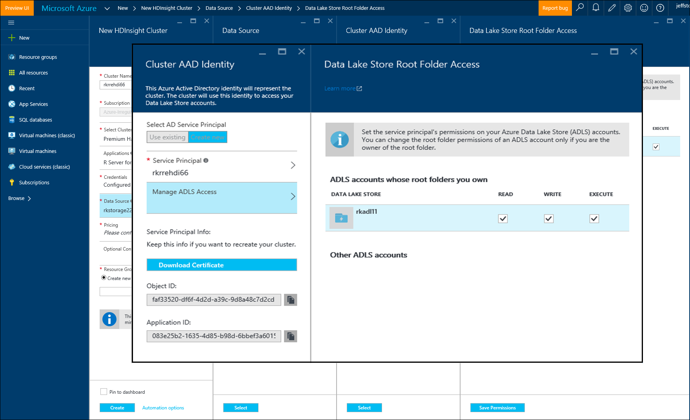

<properties
   pageTitle="Opzioni relative all'archiviazione Azure per Server R su HDInsight (preview) | Microsoft Azure"
   description="Informazioni sulle opzioni di archiviazione diversi disponibili per gli utenti con Server R su HDInsight (preview)"
   services="HDInsight"
   documentationCenter=""
   authors="jeffstokes72"
   manager="jhubbard"
   editor="cgronlun"
/>

<tags
   ms.service="HDInsight"
   ms.devlang="R"
   ms.topic="article"
   ms.tgt_pltfrm="na"
   ms.workload="data-services"
   ms.date="09/01/2016"
   ms.author="jeffstok"
/>

# <a name="azure-storage-options-for-r-server-on-hdinsight-preview"></a>Opzioni relative all'archiviazione Azure per Server R su HDInsight (preview)

Microsoft R Server HDInsight (preview) ha accesso a entrambi Blob Azure e [Lo spazio di archiviazione di Azure dati Lake](https://azure.microsoft.com/services/data-lake-store/)come mezzo di dati permanenti e codice, risultato oggetti Analysis e così via.

Quando si crea un cluster di Hadoop in HDInsight, specificare un account di archiviazione Azure. Un contenitore di spazio di archiviazione Blob specifico da tale account contiene il file system per il cluster che creare (ad esempio, Hadoop Distributed File System). Per migliorare le prestazioni, cluster HDInsight viene creato nell'interfaccia di dati stesso come account di archiviazione principale impostati. Per ulteriori informazioni, vedere [lo spazio di archiviazione Blob Azure usare con HDInsight](hdinsight-hadoop-use-blob-storage.md "archiviazione Blob Azure usare con HDInsight").   


## <a name="use-multiple-azure-blob-storage-accounts"></a>Utilizzare più account di archiviazione Blob Azure

Se necessario, è possibile accedere più account di archiviazione Azure o contenitori con i cluster HDI. A tale scopo, è necessario specificare gli account di spazio di archiviazione aggiuntivo nell'interfaccia utente quando si crea il cluster e quindi seguono la procedura seguente per usarli in R.  

1.  Creare un cluster di HDInsight con un nome di account di archiviazione di **storage1** e un contenitore predefinito denominato **container1**.
2. Specificare un account di spazio di archiviazione aggiuntivo denominato **storage2**.  
3. Copiare il file mycsv.csv alla directory /share ed eseguire analisi su tale file.  

    ````
    hadoop fs –mkdir /share
    hadoop fs –copyFromLocal myscsv.scv /share  
    ````

3.  Nel codice R, impostare il nodo name per **impostazione predefinita** e la directory e file per l'elaborazione.  

    ````
    myNameNode <- "default"
    myPort <- 0
    ````

  Posizione dei dati:  

    bigDataDirRoot <-"/ condividere"  

  Definire il contesto di elaborazione ad:

    mySparkCluster <-RxSpark(consoleOutput=TRUE)

  Impostare il contesto di calcolo:

    rxSetComputeContext(mySparkCluster)

  Definire il sistema di file Hadoop Distributed File System (HDFS):

    hdfsFS <-RxHdfsFileSystem (hostName = myNameNode, porta = myPort)

  Specificare il file di input per analizzare in HDFS:

    file di input <-file.path(bigDataDirRoot,"mycsv.csv")

Tutti i riferimenti di directory del file e scegliere l'account di archiviazione wasbs://container1@storage1.blob.core.windows.net. Questo è l' **account di archiviazione predefinito** associato a cluster HDInsight.

A questo punto, si supponga di voler per l'elaborazione di un file denominato mySpecial.csv che si trova nel /private directory di **container2** in **storage2**.

Nel codice R, scegliere il riferimento al nodo nome per l'account di archiviazione **storage2** .

    myNameNode <- "wasbs://container2@storage2.blob.core.windows.net"
    myPort <- 0

  Posizione dei dati:

    bigDataDirRoot <- "/private"

  Definire il contesto di elaborazione ad:

    mySparkCluster <- RxSpark(consoleOutput=TRUE, nameNode=myNameNode, port=myPort)

  Impostare il contesto di calcolo:

    rxSetComputeContext(mySparkCluster)

  Definire HDFS file sistema:

    hdfsFS <- RxHdfsFileSystem(hostName=myNameNode, port=myPort)

  Specificare il file di input per analizzare in HDFS:

    inputFile <-file.path(bigDataDirRoot,"mySpecial.csv")

Tutti i riferimenti di file e directory ora scegliere l'account di archiviazione wasbs://container2@storage2.blob.core.windows.net. Questo è il **Nome del nodo** specificati.

Nota che sarà necessario configurare /user/RevoShare/<SSH username> directory **storage2** come indicato di seguito:

    hadoop fs -mkdir wasbs://container2@storage2.blob.core.windows.net/user
    hadoop fs -mkdir wasbs://container2@storage2.blob.core.windows.net/user/RevoShare
    hadoop fs -mkdir wasbs://container2@storage2.blob.core.windows.net/user/RevoShare/<RDP username>

## <a name="use-an-azure-data-lake-store"></a>Utilizzare un archivio Lake di dati di Azure

Per utilizzare dati Lake archivi con l'account HDInsight, è necessario concedere l'accesso cluster a ogni archivio di Azure dati Lake che si desidera utilizzare. Usare l'archivio in uno script R molto come si usa un account di archiviazione secondario (come descritto nella procedura precedente).

## <a name="add-cluster-access-to-your-azure-data-lake-stores"></a>Aggiungere l'accesso cluster ai negozi Lake di dati di Azure

Accedere a un archivio Lake dati utilizzando un capitale servizio Azure Active Directory (Azure Active Directory) che ha associato il cluster HDInsight.

### <a name="to-add-a-service-principal"></a>Per aggiungere un'entità di servizio
1. Quando si crea il cluster HDInsight, selezionare **Cluster AAD identità** dalla scheda **Origine dati** .
2. In **Selezionare principale del servizio Active Directory**, finestra di dialogo **Cluster AAD identità** selezionare **Crea nuovo**.

Dopo aver specificare un nome per il capitale di servizio e creazione di una password per renderla, verrà visualizzata una nuova scheda nel punto in cui è possibile associare il capitale servizio Negozi Lake dati.

Nota che è possibile anche aggiungere l'accesso a un archivio dati Lake in un secondo momento, aprire l'archivio dati Lake nel portale di Azure e passare alla **Data Explorer** > **accesso**.  Di seguito è illustrato un esempio di una finestra di dialogo in cui viene illustrato come creare un'entità di servizio e associare con l'archivio di dati Lake "rkadl11".




## <a name="use-the-data-lake-store-with-r-server"></a>Usare l'archivio dati Lake con Server R
Una volta è stato concesso l'accesso a un archivio dati Lake, è possibile usare l'archivio in Server R su HDInsight si farebbe con un account di archiviazione di Azure secondario. L'unica differenza è che il prefisso **wasb: / /** assume la forma di **adl: / /** come indicato di seguito:

````
# Point to the ADL store (e.g. ADLtest)
myNameNode <- "adl://rkadl1.azuredatalakestore.net"
myPort <- 0

# Location of the data (assumes a /share directory on the ADL account)
bigDataDirRoot <- "/share"  

# Define Spark compute context
mySparkCluster <- RxSpark(consoleOutput=TRUE, nameNode=myNameNode, port=myPort)

# Set compute context
rxSetComputeContext(mySparkCluster)

# Define HDFS file system
hdfsFS <- RxHdfsFileSystem(hostName=myNameNode, port=myPort)

# Specify the input file in HDFS to analyze
inputFile <-file.path(bigDataDirRoot,"AirlineDemoSmall.csv")

# Create factors for days of the week
colInfo <- list(DayOfWeek = list(type = "factor",
               levels = c("Monday", "Tuesday", "Wednesday", "Thursday",
                          "Friday", "Saturday", "Sunday")))

# Define the data source
airDS <- RxTextData(file = inputFile, missingValueString = "M",
                    colInfo  = colInfo, fileSystem = hdfsFS)

# Run a linear regression
model <- rxLinMod(ArrDelay~CRSDepTime+DayOfWeek, data = airDS)
````

Di seguito sono i comandi che consentono di configurare l'account di archiviazione dati Lake con la directory RevoShare e aggiungere il file CSV di esempio dell'esempio precedente:

````
hadoop fs -mkdir adl://rkadl1.azuredatalakestore.net/user
hadoop fs -mkdir adl://rkadl1.azuredatalakestore.net/user/RevoShare
hadoop fs -mkdir adl://rkadl1.azuredatalakestore.net/user/RevoShare/<user>

hadoop fs -mkdir adl://rkadl1.azuredatalakestore.net/share

hadoop fs -copyFromLocal /usr/lib64/R Server-7.4.1/library/RevoScaleR/SampleData/AirlineDemoSmall.csv adl://rkadl1.azuredatalakestore.net/share

hadoop fs –ls adl://rkadl1.azuredatalakestore.net/share
````

## <a name="use-azure-files-on-the-edge-node"></a>Usare i file di Azure in nodo del bordo

È inoltre disponibile un'opzione di archiviazione dati efficace per l'utilizzo del nodo di bordo denominati [File Azure](../storage/storage-how-to-use-files-linux.md "Azure file"). Consente di installare una condivisione file di archiviazione Azure nel file System Linux. Può essere utile per l'archiviazione dei file di dati, R script e oggetti risultato che potrebbero essere necessari in un secondo momento, quando è opportuno usare il file system nativo sul nodo del bordo anziché HDFS.

Dei vantaggi principale di Azure file è che condivisioni file possono essere installate e utilizzate da qualsiasi sistema che contiene un sistema operativo supportato, ad esempio Windows o Linux. Ad esempio, può essere utilizzato da un altro cluster HDInsight si o dai membri del team con una macchina virtuale Azure o anche da un sistema locale.


## <a name="next-steps"></a>Passaggi successivi

Dopo avere appreso le nozioni di base di come utilizzare la console R da una sessione SSH e come creare un nuovo cluster HDInsight che include R Server, utilizzare i collegamenti seguenti per scoprire altri modi di utilizzo di Server R HDInsight.

- [Panoramica dei Server R HDInsight](hdinsight-hadoop-r-server-overview.md)
- [Guida introduttiva a server R Hadoop](hdinsight-hadoop-r-server-get-started.md)
- [Aggiungere RStudio Server HDInsight premium](hdinsight-hadoop-r-server-install-r-studio.md)
- [Calcolare le opzioni di contesto di Server R in HDInsight](hdinsight-hadoop-r-server-compute-contexts.md)
