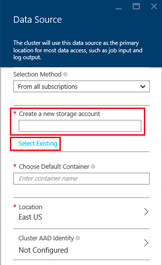

<properties
    pageTitle="Eseguire query sui dati dallo spazio di archiviazione Blob compatibile con HDFS | Microsoft Azure"
    description="HDInsight utilizza un archivio Blob Azure come archivio dati grande per HDFS. Informazioni su come eseguire query sui dati dallo spazio di archiviazione Blob e archiviare i risultati dell'analisi."
    keywords="BLOB lo spazio di archiviazione, hdfs, dati strutturati, dati non strutturati"
    services="hdinsight,storage"
    documentationCenter=""
    tags="azure-portal"
    authors="mumian"
    manager="jhubbard"
    editor="cgronlun"/>

<tags
    ms.service="hdinsight"
    ms.workload="big-data"
    ms.tgt_pltfrm="na"
    ms.devlang="na"
    ms.topic="get-started-article"
    ms.date="09/06/2016"
    ms.author="jgao"/>

# Utilizzare lo spazio di archiviazione Blob Azure HDFS compatibile con Hadoop in HDInsight

Informazioni su come utilizzare lo spazio di archiviazione Blob Azure economico con HDInsight, creare account di archiviazione Azure e contenitore di spazio di archiviazione Blob e risolvere i dati all'interno.

Archiviazione Blob Azure è una soluzione di archiviazione efficaci e generiche che si integra perfettamente con HDInsight. Tramite un'interfaccia di Hadoop distributed file system (HDFS), l'elenco completo dei componenti HDInsight può agire direttamente sui dati strutturati o non strutturati in archiviazione Blob.

Archiviazione dei dati in archiviazione Blob consente di eliminare i cluster HDInsight che verranno usati per il calcolo senza perdere i propri dati.

> [AZURE.IMPORTANT] HDInsight supporta solo BLOB di blocco. Non pagina del supporto tecnico o accodare BLOB.

Per informazioni sulla creazione di un cluster di HDInsight, vedere [Introduzione a HDInsight] [ hdinsight-get-started] o [creare HDInsight cluster][hdinsight-creation].

## Architettura di archiviazione HDInsight
Nel diagramma seguente fornisce una visualizzazione astratta per l'architettura di archiviazione HDInsight:

![Hadoop cluster utilizzare l'API HDFS per accedere e archiviare i dati strutturati in archiviazione Blob.] (./media/hdinsight-hadoop-use-blob-storage/HDI.WASB.Arch.png "Architettura di archiviazione HDInsight")

HDInsight fornisce l'accesso per il file system distribuito collegate in locale dei nodi di elaborazione. Questo file system è possibile accedervi utilizzando URI completo, ad esempio:

    hdfs://<namenodehost>/<path>

Inoltre, HDInsight offre la possibilità di accedere ai dati archiviati in archiviazione Blob Azure. La sintassi è:

    wasb[s]://<containername>@<accountname>.blob.core.windows.net/<path>

> [AZURE.NOTE] Nelle versioni precedenti a 3.0, di HDInsight `asv://` utilizzate al posto di `wasb://`. `asv://`non deve essere utilizzato con i cluster HDInsight 3.0 o versione successiva, verrà generato un errore.

Hadoop supporta un concetto di sistema di file predefinito. Il file system predefinito implica una combinazione predefinita e autorità. Può inoltre essere utilizzato per risolvere i percorsi relativi. Durante il processo di creazione HDInsight, un account di archiviazione Azure e un'archiviazione Blob Azure contenitore da tale account viene designato come il sistema di file predefinito.

Oltre a questo account di archiviazione, è possibile aggiungere account di ulteriore spazio di archiviazione dall'abbonamento Azure stesso o diversi abbonamenti Azure durante il processo di creazione o dopo la creazione di un cluster. Per istruzioni sull'aggiunta di account di spazio di archiviazione aggiuntivo, vedere [creare HDInsight cluster][hdinsight-creation].

- **Contenitori nella finestra account di archiviazione connessa a un cluster:** Poiché il nome dell'account e la chiave sono associati al cluster durante la creazione, avere accesso completo alle BLOB in tali contenitori.

- **Contenitori pubblici o pubblico BLOB nell'account di archiviazione che non si è connessi a un cluster:** Si dispone dell'autorizzazione di sola lettura per i BLOB nei contenitori.

    > [AZURE.NOTE]
        > Contenitori pubblici consentono di ottenere un elenco di tutti i blob che sono disponibili in tale contenitore e ottenere i metadati contenitore. BLOB pubblico consentono di accedere i BLOB solo se si conosce l'URL esatto. Per ulteriori informazioni, vedere <a href="http://msdn.microsoft.com/library/windowsazure/dd179354.aspx">limitare l'accesso a contenitori ed BLOB</a>.

- **Privati contenitori nell'account di archiviazione che non si è connessi a un cluster:** Non è possibile accedere BLOB nei contenitori a meno che non si definisce l'account di archiviazione quando si inviano i processi di WebHCat. Questo è spiegheremo più avanti in questo articolo.

Gli account di archiviazione definiti nel processo di creazione e le chiavi sono archiviati in %HADOOP_HOME%/conf/core-site.xml nei nodi del cluster. Il comportamento predefinito di HDInsight consiste nell'usare gli account di archiviazione definiti nel file di base site.xml. Non è consigliabile modificare il file core site.xml perché il node(master) testa cluster possono essere ricostruire l'immagine o viene eseguita la migrazione in qualsiasi momento e tutte le modifiche ai file andranno perse.

Più WebHCat processi, inclusi Hive, MapReduce, Hadoop streaming e animale, possono svolgere per una descrizione dell'account di archiviazione e i metadati con loro. (Questa attualmente funziona per maialino con un account di archiviazione, ma non per i metadati). Nella sezione [BLOB accesso tramite PowerShell Azure](#powershell) di questo articolo è disponibile un esempio di questa funzionalità. Per ulteriori informazioni, vedere [utilizzo di un Cluster di HDInsight con gli account di archiviazione alternativo e Metastores](http://social.technet.microsoft.com/wiki/contents/articles/23256.using-an-hdinsight-cluster-with-alternate-storage-accounts-and-metastores.aspx).

Archiviazione BLOB può essere utilizzato per dati strutturati. Contenitori di archiviazione BLOB memorizzare i dati come coppie chiave/valore e non c'è alcun gerarchia directory. Tuttavia il carattere barra (/) utilizzabile all'interno del nome chiave per ingrandirne la visualizzazione come se un file è archiviato all'interno di una struttura di directory. Tasto del blob, ad esempio, potrebbe essere *input/log1.txt*. È presente alcuna directory effettivo di tipo *input* , ma a causa di presenza del carattere barra nel nome della chiave, ha l'aspetto di un percorso file.

###Vantaggi dell'archiviazione Blob
Il costo di prestazioni implicita di non condivisa individuazione cluster di elaborazione e le risorse di archiviazione è ridotto dal modo in cui vengono creati i cluster di elaborazione Chiudi per le risorse di account di archiviazione all'interno dell'area di Azure, in cui la rete ad alta velocità rende efficiente i nodi di calcolo accedere ai dati all'interno di archiviazione Blob Azure.

Esistono vari vantaggi associati alla memorizzazione dei dati in archiviazione Blob Azure anziché HDFS:

* **Il riutilizzo dei dati e la condivisione:** I dati in HDFS si trovano all'interno di cluster di elaborazione. Solo le applicazioni che hanno accesso al cluster di elaborazione è possono utilizzare i dati utilizzando API HDFS. I dati in archiviazione Blob Azure accessibili tramite l'API HDFS o le [API REST di spazio di archiviazione Blob][blob-storage-restAPI]. In questo modo, è possibile utilizzare una quantità elevata di applicazioni (inclusi altri cluster HDInsight) e strumenti per produrre e utilizzare i dati.
* **Archiviazione dei dati:** Archiviazione dei dati in archiviazione Blob Azure consente cluster HDInsight utilizzato per il calcolo per essere eliminati senza perdere i propri dati.
* **Costo di archiviazione di dati:** Archiviazione di dati in DFS a lungo termine è più costosa di archiviazione dei dati in archiviazione Blob Azure perché il costo di un cluster di elaborazione è superiore al costo di un contenitore di spazio di archiviazione Blob Azure. Inoltre, poiché i dati non è necessario ricaricare per ogni generazione di un cluster di elaborazione, si stanno salvando i costi di caricamento dei dati.
* **Scalabilità flessibile:** Sebbene HDFS consente di ottenere un scalabilità orizzontale file system, la scala è il numero dei nodi creati per il cluster. Modificare la scala può diventare un processo più complicato basarsi su elastici ridimensionamento delle funzionalità che viene visualizzato automaticamente nell'archiviazione Blob Azure.
* **Geografico replica:** I contenitori di spazio di archiviazione Blob Azure possono essere replicate geografico. Anche se si ottiene così il ripristino geografico e la ridondanza dei dati, caso di errore nella posizione replicato geografico influisce negativamente sulle prestazioni e può comportare costi aggiuntivi. È consigliabile scegliere con attenzione la replica geografico e solo se il valore dei dati è opportuno costi aggiuntivi.

Alcuni pacchetti e processi MapReduce potrebbero creare risultati intermedi che non si desidera archiviare in archiviazione Blob Azure. In questo caso, è possibile decidere di memorizzazione dei dati in locale HDFS. Infatti, HDInsight utilizza DFS per più di questi risultati intermedi in processi Hive e altri processi.

> [AZURE.NOTE] La maggior parte dei comandi HDFS (ad esempio, <b>ls</b>, <b>copyFromLocal</b> e <b>mkdir</b>) continua a funzionare come previsto. Solo i comandi specifici per HDFS implementazione nativa (che viene considerato DFS), ad esempio <b>fschk</b> e <b>dfsadmin</b>, verranno visualizzato un comportamento diverso in archiviazione Blob Azure.

## Creare Blob contenitori

Per utilizzare BLOB, si crea un [account di archiviazione di Azure][azure-storage-create]. Durante il processo, specificare un'area di Azure in cui verrà archiviati gli oggetti creati tramite questo account. Il cluster e l'account di archiviazione deve trovarsi nella stessa regione. Il database di SQL Server metastore Hive e Oozie metastore SQL Server deve trovarsi nella stessa regione.

Nel punto in cui si trova, ogni blob create appartiene a un contenitore nell'account di archiviazione Azure. In questo contenitore può essere un blob esistente che è stato creato all'esterno di HDInsight o può essere un contenitore in cui verrà creato un cluster di HDInsight.

Il contenitore di Blob predefinito archivia informazioni specifiche cluster, ad esempio cronologia dei processi e registri. Non condividere un contenitore di Blob predefinito con più cluster HDInsight. Questo danneggiare cronologia dei processi e il cluster verrà misbehave. È consigliabile usare un contenitore diverso per ogni cluster e i dati condivisi vengono inseriti in un account di archiviazione collegato specificato nella distribuzione di tutti i cluster pertinenti piuttosto che l'account di archiviazione predefinito. Per ulteriori informazioni sulla configurazione di account di archiviazione collegate, vedere [creare HDInsight cluster][hdinsight-creation]. È tuttavia possibile riutilizzare un contenitore di spazio di archiviazione predefinito dopo l'eliminazione di cluster HDInsight originale. Per i cluster HBase, è possibile mantenere effettivamente lo schema della tabella HBase e dati per creare un nuovo cluster HBase utilizzando il contenitore di spazio di archiviazione blob predefinito usato da un cluster di HBase che è stato eliminato.

### Tramite il portale di Azure

Quando si crea un cluster HDInsight dal portale, sono disponibili le opzioni per usare un account di archiviazione esistente oppure creare un nuovo account di archiviazione:

###Usa CLI Azure

[AZURE.INCLUDE [use-latest-version](../../includes/hdinsight-use-latest-cli.md)]

Se si è [installato e configurato CLI Azure](../xplat-cli-install.md), è possibile utilizzare il comando seguente a un account di archiviazione e contenitore.

    azure storage account create <storageaccountname> --type LRS

> [AZURE.NOTE] Il `--type` parametro indica come replicare account di archiviazione. Per ulteriori informazioni, vedere [Replica di spazio di archiviazione Azure](../storage/storage-redundancy.md). Non utilizzare ZRS come ZRS non supporta blob di pagine, file, tabella o coda.

Viene chiesto di specificare l'area geografica presenti nell'account di archiviazione. È necessario creare account di archiviazione nella stessa area che si intende creare il cluster HDInsight.

Dopo aver creato l'account di archiviazione, utilizzare il comando seguente per recuperare i tasti di account di archiviazione:

    azure storage account keys list <storageaccountname>

Per creare un contenitore, utilizzare il comando seguente:

    azure storage container create <containername> --account-name <storageaccountname> --account-key <storageaccountkey>

### Utilizzo di PowerShell Azure

Se è [installato e configurato Azure PowerShell][powershell-install], è possibile utilizzare le operazioni seguenti dal prompt dei comandi PowerShell di Azure per creare un account di archiviazione e di un contenitore:

[AZURE.INCLUDE [upgrade-powershell](../../includes/hdinsight-use-latest-powershell.md)]

    $SubscriptionID = "<Your Azure Subscription ID>"
    $ResourceGroupName = "<New Azure Resource Group Name>"
    $Location = "EAST US 2"
    
    $StorageAccountName = "<New Azure Storage Account Name>"
    $containerName = "<New Azure Blob Container Name>"
    
    Add-AzureRmAccount
    Select-AzureRmSubscription -SubscriptionId $SubscriptionID
    
    # Create resource group
    New-AzureRmResourceGroup -name $ResourceGroupName -Location $Location
    
    # Create default storage account
    New-AzureRmStorageAccount -ResourceGroupName $ResourceGroupName -Name $StorageAccountName -Location $Location -Type Standard_LRS 
    
    # Create default blob containers
    $storageAccountKey = (Get-AzureRmStorageAccountKey -ResourceGroupName $resourceGroupName -StorageAccountName $StorageAccountName)[0].Value
    $destContext = New-AzureStorageContext -StorageAccountName $storageAccountName -StorageAccountKey $storageAccountKey  
    New-AzureStorageContainer -Name $containerName -Context $destContext

## File in archiviazione Blob

Lo schema URI per l'accesso ai file in archiviazione Blob da HDInsight è:

    wasb[s]://<BlobStorageContainerName>@<StorageAccountName>.blob.core.windows.net/<path>

Lo schema URI fornisce l'accesso non crittografato (con il *wasb:* prefisso) e SSL crittografato di access (con *wasbs*). È consigliabile usare *wasbs* laddove possibile, anche quando l'accesso ai dati che si trovano all'interno della stessa regione Azure.

Il &lt;BlobStorageContainerName&gt; identifica il nome del contenitore nell'archiviazione Blob Azure.
Il &lt;StorageAccountName&gt; identifica il nome dell'account Azure lo spazio di archiviazione. È necessario un nome di dominio completo (FQDN).

Se nessuna delle due &lt;BlobStorageContainerName&gt; né &lt;StorageAccountName&gt; è stata specificata, viene utilizzato il sistema di file predefinito. Per i file nel file system predefinito, è possibile usare un percorso relativo o assoluto. Ad esempio, il file *hadoop-mapreduce-examples.jar* fornito con i cluster HDInsight possibile fare riferimento a usando una delle operazioni seguenti:

    wasbs://mycontainer@myaccount.blob.core.windows.net/example/jars/hadoop-mapreduce-examples.jar
    wasbs:///example/jars/hadoop-mapreduce-examples.jar
    /example/jars/hadoop-mapreduce-examples.jar

> [AZURE.NOTE] Il nome del file è <i>hadoop examples.jar</i> cluster versioni 2.1 e 1.6 HDInsight.

Il &lt;percorso&gt; è il nome del percorso HDFS directory o file. Poiché i contenitori di archiviazione Blob Azure sono archivi semplicemente chiave-valore, non è sistema file gerarchici true. Un carattere barra (/) all'interno di una chiave blob viene interpretato come un separatore di directory. Ad esempio, il nome blob per *examples.jar di mapreduce hadoop* è:

    example/jars/hadoop-mapreduce-examples.jar

> [AZURE.NOTE] Quando si utilizzano BLOB all'esterno di HDInsight, la maggior parte delle utilità non riconosce il formato WASB e prevede invece un formato di percorso di base, ad esempio `example/jars/hadoop-mapreduce-examples.jar`.

## BLOB Access usa CLI Azure

Usare il comando seguente per visualizzare un elenco di comandi correlati blob:

    azure storage blob

**Esempio dell'uso di Azure CLI per caricare un file**

    azure storage blob upload <sourcefilename> <containername> <blobname> --account-name <storageaccountname> --account-key <storageaccountkey>

**Esempio dell'uso di Azure CLI per scaricare un file**

    azure storage blob download <containername> <blobname> <destinationfilename> --account-name <storageaccountname> --account-key <storageaccountkey>

**Esempio dell'uso di Azure CLI per eliminare un file**

    azure storage blob delete <containername> <blobname> --account-name <storageaccountname> --account-key <storageaccountkey>

**Esempio dell'uso di Azure CLI per elencare i file**

    azure storage blob list <containername> <blobname|prefix> --account-name <storageaccountname> --account-key <storageaccountkey>

## Utilizzo di PowerShell Azure BLOB di Access

> [AZURE.NOTE] I comandi in questa sezione forniscono un esempio di utilizzo di PowerShell per accedere ai dati archiviati in BLOB base. Per un esempio più completo che è stato personalizzato per l'utilizzo di HDInsight, vedere gli [Strumenti di HDInsight](https://github.com/Blackmist/hdinsight-tools).

Utilizzare il comando seguente per elencare i cmdlet blob correlate:

    Get-Command *blob*

![Elenco dei cmdlet di PowerShell correlati blob.][img-hdi-powershell-blobcommands]

###Caricare i file

Vedere [caricare dati da HDInsight][hdinsight-upload-data].

###Scaricare i file

Scripting seguenti consente di scaricare un blob di blocco della cartella corrente. Prima di eseguire script, passare alla directory in una cartella in cui si dispone delle autorizzazioni di scrittura.

    $resourceGroupName = "<AzureResourceGroupName>"
    $storageAccountName = "<AzureStorageAccountName>"   # The storage account used for the default file system specified at creation.
    $containerName = "<BlobStorageContainerName>"  # The default file system container has the same name as the cluster.
    $blob = "example/data/sample.log" # The name of the blob to be downloaded.
    
    # Use Add-AzureAccount if you haven't connected to your Azure subscription
    Login-AzureRmAccount 
    Select-AzureRmSubscription -SubscriptionID "<Your Azure Subscription ID>"
    
    Write-Host "Create a context object ... " -ForegroundColor Green
    $storageAccountKey = (Get-AzureRmStorageAccountKey -ResourceGroupName $resourceGroupName -Name $storageAccountName)[0].Value
    $storageContext = New-AzureStorageContext -StorageAccountName $storageAccountName -StorageAccountKey $storageAccountKey  
    
    Write-Host "Download the blob ..." -ForegroundColor Green
    Get-AzureStorageBlobContent -Container $ContainerName -Blob $blob -Context $storageContext -Force
    
    Write-Host "List the downloaded file ..." -ForegroundColor Green
    cat "./$blob"

Fornire il nome del gruppo di risorse e il nome del cluster, è possibile utilizzare il codice seguente:

    $resourceGroupName = "<AzureResourceGroupName>"
    $clusterName = "<HDInsightClusterName>"
    $blob = "example/data/sample.log" # The name of the blob to be downloaded.
    
    $cluster = Get-AzureRmHDInsightCluster -ResourceGroupName $resourceGroupName -ClusterName $clusterName
    $defaultStorageAccount = $cluster.DefaultStorageAccount -replace '.blob.core.windows.net'
    $defaultStorageAccountKey = (Get-AzureRmStorageAccountKey -ResourceGroupName $resourceGroupName -Name $defaultStorageAccount)[0].Value
    $defaultStorageContainer = $cluster.DefaultStorageContainer
    $storageContext = New-AzureStorageContext -StorageAccountName $defaultStorageAccount -StorageAccountKey $defaultStorageAccountKey 
    
    Write-Host "Download the blob ..." -ForegroundColor Green
    Get-AzureStorageBlobContent -Container $defaultStorageContainer -Blob $blob -Context $storageContext -Force

###Eliminare i file

    Remove-AzureStorageBlob -Container $containerName -Context $storageContext -blob $blob

###Elencare i file

    Get-AzureStorageBlob -Container $containerName -Context $storageContext -prefix "example/data/"

###Eseguire query Hive usando un account di archiviazione non definito

In questo esempio viene illustrato come una cartella dall'account di archiviazione non definite durante il processo di creazione dell'elenco.
$clusterName = "<HDInsightClusterName>"

    $undefinedStorageAccount = "<UnboundedStorageAccountUnderTheSameSubscription>"
    $undefinedContainer = "<UnboundedBlobContainerAssociatedWithTheStorageAccount>"

    $undefinedStorageKey = Get-AzureStorageKey $undefinedStorageAccount | %{ $_.Primary }

    Use-AzureRmHDInsightCluster $clusterName

    $defines = @{}
    $defines.Add("fs.azure.account.key.$undefinedStorageAccount.blob.core.windows.net", $undefinedStorageKey)

    Invoke-AzureRmHDInsightHiveJob -Defines $defines -Query "dfs -ls wasbs://$undefinedContainer@$undefinedStorageAccount.blob.core.windows.net/;"

## Passaggi successivi

In questo articolo è stato illustrato come utilizzare archiviazione Blob Azure HDFS compatibile con HDInsight e acquisite che archiviazione Blob Azure è un componente fondamentale di HDInsight. In questo modo è possibile creare soluzioni di acquisizione di dati a lungo termine, archiviazione scalable con archiviazione Blob Azure e utilizzare HDInsight per sbloccare le informazioni contenute in dati strutturati e archiviati.

Per ulteriori informazioni, vedere:

* [Guida introduttiva di Azure HDInsight][hdinsight-get-started]
* [Caricare dati HDInsight][hdinsight-upload-data]
* [Usare Hive con HDInsight][hdinsight-use-hive]
* [Utilizzare maialino con HDInsight][hdinsight-use-pig]
* [Utilizzare le firme di Access condiviso lo spazio di archiviazione Azure per limitare l'accesso ai dati con HDInsight][hdinsight-use-sas]

[hdinsight-use-sas]: hdinsight-storage-sharedaccesssignature-permissions.md
[powershell-install]: ../powershell-install-configure.md
[hdinsight-creation]: hdinsight-provision-clusters.md
[hdinsight-get-started]: hdinsight-hadoop-tutorial-get-started-windows.md
[hdinsight-upload-data]: hdinsight-upload-data.md
[hdinsight-use-hive]: hdinsight-use-hive.md
[hdinsight-use-pig]: hdinsight-use-pig.md

[blob-storage-restAPI]: http://msdn.microsoft.com/library/windowsazure/dd135733.aspx
[azure-storage-create]: ../storage/storage-create-storage-account.md

[img-hdi-powershell-blobcommands]: ./media/hdinsight-hadoop-use-blob-storage/HDI.PowerShell.BlobCommands.png
[img-hdi-quick-create]: ./media/hdinsight-hadoop-use-blob-storage/HDI.QuickCreateCluster.png
[img-hdi-custom-create-storage-account]: ./media/hdinsight-hadoop-use-blob-storage/HDI.CustomCreateStorageAccount.png  
