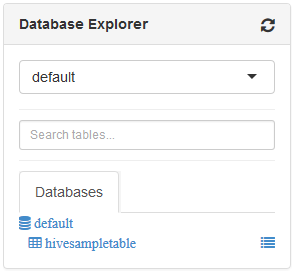

<properties
   pageTitle="Utilizzare le visualizzazioni Ambari per lavorare con Hive nel HDInsight (Hadoop) | Microsoft Azure"
   description="Informazioni su come usare la visualizzazione Hive dal web browser per inviare query Hive. La visualizzazione Hive fa parte dell'interfaccia utente Web Ambari fornita con i cluster basati su Linux HDInsight."
   services="hdinsight"
   documentationCenter=""
   authors="Blackmist"
   manager="jhubbard"
   editor="cgronlun"
    tags="azure-portal"/>

<tags
   ms.service="hdinsight"
   ms.devlang="na"
   ms.topic="article"
   ms.tgt_pltfrm="na"
   ms.workload="big-data"
   ms.date="10/28/2016"
   ms.author="larryfr"/>

#Utilizzare la visualizzazione Hive con Hadoop in HDInsight

[AZURE.INCLUDE [hive-selector](../../includes/hdinsight-selector-use-hive.md)]

Ambari è una gestione e monitoraggio utilità fornita con i cluster basati su Linux HDInsight. Una delle funzionalità disponibili tramite Ambari è un'interfaccia utente Web che può essere utilizzato per eseguire query Hive. Si tratta della __Visualizzazione Hive__, parte delle visualizzazioni Ambari disponibili con i cluster HDInsight.

> [AZURE.NOTE] Ambari sono presenti molte funzionalità non illustrate in questo documento. Per ulteriori informazioni, vedere [gestire HDInsight cluster tramite l'interfaccia utente Web Ambari](hdinsight-hadoop-manage-ambari.md).

##Prerequisiti

- Un cluster di HDInsight basati su Linux. Per informazioni sulla creazione di un nuovo cluster, vedere [Introduzione a HDInsight basati su Linux](hdinsight-hadoop-linux-tutorial-get-started.md).

##Aprire la visualizzazione di Hive

È possibile Ambari visualizzazioni dal portale di Azure; Selezionare il cluster HDInsight e quindi selezionare __Ambari visualizzazioni__ nella sezione __Collegamenti rapidi__ .

Si può anche passare direttamente al Ambari facendo clic su https://CLUSTERNAME.azurehdinsight.net in un web browser (dove __nome cluster__ è il nome del cluster HDInsight) e quindi selezionare il set di quadrati dal menu della pagina (accanto a collegamento __amministratore__ e pulsante sul lato sinistro della pagina) le visualizzazioni elenco disponibile. Selezionare __Hive visualizzazione__.

.

> [AZURE.NOTE] Quando si accede Ambari, verrà richiesto per eseguire l'autenticazione al sito. Immettere l'amministratore (impostazione predefinita `admin`,) nome dell'account e password usati per creare il cluster.

Verrà visualizzata una pagina simile al seguente:

##Tabelle di visualizzazione

Nella sezione __Esplora Database__ della pagina, selezionare la voce __predefinita__ nella scheda __database__ . Questa operazione verrà visualizzato un elenco di tabelle nel database predefinito. Per un nuovo cluster HDInsight, deve essere presente solo una tabella; __hivesampletable__.

Con l'aggiungono di nuove tabelle tramite i passaggi descritti in questo documento, è possibile utilizzare l'icona di aggiornamento nell'angolo superiore destro della finestra di esplorazione di Database per aggiornare l'elenco delle tabelle disponibili.

##Editor di query

Utilizzare la procedura seguente dalla visualizzazione Hive per eseguire una query Hive dati inclusi con i cluster.

1. Incollare le seguenti istruzioni HiveQL nella sezione __Dell'Editor di Query__ della pagina del foglio di lavoro:

        DROP TABLE log4jLogs;
        CREATE EXTERNAL TABLE log4jLogs(t1 string, t2 string, t3 string, t4 string, t5 string, t6 string, t7 string)
        ROW FORMAT DELIMITED FIELDS TERMINATED BY ' '
        STORED AS TEXTFILE LOCATION 'wasbs:///example/data/';
        SELECT t4 AS sev, COUNT(*) AS cnt FROM log4jLogs WHERE t4 = '[ERROR]' GROUP BY t4;

    Queste istruzioni eseguono le operazioni seguenti:

    - **Istruzione DROP TABLE** - Elimina la tabella e il file di dati, nel caso in cui la tabella esiste già.
    - **Creazione di tabelle esterne** - crea una nuova tabella "esterna" nell'Hive. Tabelle esterne archiviare solo la definizione della tabella in Hive; i dati siano a sinistra nella posizione originale.
    - **Formato di riga** - indica Hive modalità di formattazione. In questo caso, i campi in ogni log sono separati da uno spazio.
    - **ARCHIVIATI come file di testo percorso** - indica Hive nel punto in cui i dati sono archiviate (directory/dati di esempio) e che non viene memorizzato come testo.
    - **Selezionare** - seleziona un conteggio di tutte le righe in cui t4 colonna contiene il valore [errore].

    >[AZURE.NOTE] Tabelle esterne devono essere utilizzate quando si prevede che i dati sottostanti per essere aggiornati tramite un'origine esterna, ad esempio un processo di caricamento automatica dei dati o da un'altra operazione MapReduce, ma si desidera sempre Hive query per utilizzare i dati più recenti. Eliminazione di una tabella esterna indica *non* Elimina i dati, solo la definizione della tabella.

2. Utilizzare il pulsante __Esegui__ nella parte inferiore dell'Editor di Query per avviare la query. È necessario disattivare arancione e il testo verrà modificato per __interrompere l'esecuzione__. Una sezione __Query processo risultati__ dovrà essere visualizzato sotto l'Editor di Query e visualizzare informazioni sul processo.

    > [AZURE.IMPORTANT] Alcuni browser non venga aggiornata correttamente le informazioni del log o risultati. Se si esegue un processo e viene visualizzato per l'esecuzione tempi lunghissimi senza aggiornare il registro o i risultati vengono restituiti, provare a utilizzare Mozilla FireFox o Google Chrome.

3. Al termine di query, la sezione __Query processo risultati__ visualizzerà i risultati dell'operazione. Pulsante __Interrompi__ cambierà anche a un pulsante __Esegui__ verde. Nella scheda __risultati__ deve contenere le informazioni seguenti:

        sev       cnt
        [ERROR]   3

    Scheda __log__ può essere utilizzata per visualizzare le informazioni di registrazione create dal processo. È possibile utilizzare per la risoluzione dei problemi se si sono verificati problemi con una query.

    > [AZURE.TIP] Finestra di dialogo Nota __salvare i risultati della__ elenco a discesa nell'angolo superiore sinistro della sezione dei __Risultati della Query processo__ ; è possibile utilizzare per scaricare i risultati oppure salvarli in HDInsight lo spazio di archiviazione in un file CSV.

3. Selezionare le prime quattro righe della query, quindi selezionare __Esegui__. Si noti che non sono presenti risultati al completamento del processo. In questo modo con il pulsante __Esegui__ quando è selezionata una parte della query verrà eseguita solo le istruzioni selezionate. In questo caso, la selezione non includere l'istruzione finale che recupera le righe della tabella. Se si seleziona solo la riga e utilizza __Execute__, è necessario verificare i risultati previsti.

3. Usare il pulsante __Nuovo foglio di lavoro__ nella parte inferiore dell' __Editor di Query__ per creare un nuovo foglio di lavoro. Nel nuovo foglio di lavoro, immettere le seguenti istruzioni HiveQL:

        CREATE TABLE IF NOT EXISTS errorLogs (t1 string, t2 string, t3 string, t4 string, t5 string, t6 string, t7 string) STORED AS ORC;
        INSERT OVERWRITE TABLE errorLogs SELECT t1, t2, t3, t4, t5, t6, t7 FROM log4jLogs WHERE t4 = '[ERROR]';

    Queste istruzioni eseguono le operazioni seguenti:

    - **Creare la tabella se non esiste** - crea una tabella, se non esiste già. Poiché non viene utilizzata la parola chiave **esterna** , si tratta di una tabella interna, che verrà archiviata nel data warehouse Hive e gestita completamente da Hive. A differenza di tabelle esterne, l'eliminazione di una tabella interna eliminerà dati sottostanti.
    - **ARCHIVIATI come ORCO** - sono archiviati i dati nel formato ottimizzato riga colonne (ORCO). Si tratta di un formato altamente ottimizzato ed efficiente per l'archiviazione dei dati Hive.
    - **Inserisci SOVRASCRIVI... Selezionare** - seleziona le righe dalla tabella **log4jLogs** contenenti [errore] e quindi inserire i dati nella tabella **errorLogs** .

    Usare il pulsante __Esegui__ per eseguire la query. Nella scheda __risultati__ non conterrà tutte le informazioni come la query non restituisce alcuna riga, ma lo stato deve essere visualizzata come __completato__.

###Impostazioni di hive

Selezionare l'icona __Impostazioni__ a destra dell'editor.

Impostazioni possono essere utilizzate per modificare diverse impostazioni Hive, ad esempio la modifica il motore di esecuzione per Hive da Tez (impostazione predefinita,) per MapReduce.

###Spiegare Visual

Selezionare l'icona __Spiegare Visual__ a destra dell'editor.

Si tratta della visualizzazione __Spiegare visiva__ della query, può essere utile per la comprensione del flusso di query complesse. È possibile visualizzare un equivalente testuale della visualizzazione con il pulsante __Descrizione__ nell'Editor di Query.

###Tez

Selezionare l'icona di __Tez__ a destra dell'editor.

Verrà visualizzata l'indirizzati aciclici grafico (DAG) utilizzato da Tez per la query, se disponibile. Se si desidera visualizzare DAG per le query è stato eseguito in uso passato o debug processo Tez [Tez visualizzazione](hdinsight-debug-ambari-tez-view.md) alternativa.

###Notifiche

Selezionare l'icona di __notifiche__ a destra dell'editor.

Le notifiche sono messaggi generati durante l'esecuzione di query. Ad esempio, si riceverà una notifica quando viene inviata una query oppure quando si verifica un errore.

##Query salvate

1. Dall'Editor di Query, creare un nuovo foglio di lavoro e immettere la query seguente:

        SELECT * from errorLogs;

    Eseguire la query per verificare il funzionamento. I risultati saranno come indicato di seguito:

        errorlogs.t1    errorlogs.t2    errorlogs.t3    errorlogs.t4    errorlogs.t5    errorlogs.t6    errorlogs.t7
        2012-02-03  18:35:34    SampleClass0    [ERROR]     incorrect   id  
        2012-02-03  18:55:54    SampleClass1    [ERROR]     incorrect   id  
        2012-02-03  19:25:27    SampleClass4    [ERROR]     incorrect   id

2. Usare il pulsante __Salva con nome__ nella parte inferiore dell'editor. Assegnare un nome a questa query __Errorlogs__ e fare clic su __OK__. Si noti che il nome del foglio di lavoro cambia in __Errorlogs__.

3. Selezionare la scheda __Query salvate__ nella parte superiore della pagina Hive visualizzazione. Si noti che __Errorlogs__ viene elencato come una query salvata. Rimarrà in questo elenco finché non viene rimosso. Scegliendo il nome, verrà visualizzata la query nell'Editor di Query.

##Cronologia delle query

Pulsante __cronologia__ nella parte superiore della visualizzazione Hive consente di visualizzare query è stato eseguito in precedenza. Utilizzare l'ora e seleziona alcune delle query che è stata eseguita in precedenza. Quando si seleziona una query, viene aperta nell'Editor di Query.

##(Utente) le funzioni definite dall'utente

È anche possibile estendere hive mediante **le funzioni definite dall'utente (utente)**. Un'utente è possibile implementare funzionalità o logica che non è facilmente modellare in HiveQL.

Non è possibile aggiungere un'utente come parte delle istruzioni HiveQL nella query, la scheda utente nella parte superiore della visualizzazione Hive consente di dichiarare e salvare un set di funzioni definite dall'utente che può essere utilizzata con l' __Editor di Query__.

Dopo aver aggiunto un'utente per la visualizzazione Hive, verrà visualizzato un pulsante __Inserisci funzioni definite dall'utente__ nella parte inferiore dell' __Editor di Query__. La selezione di questa verrà visualizzato un elenco a discesa di funzioni definite dall'utente definite nella visualizzazione Hive. Selezione di un'utente, istruzioni HiveQL verrà aggiunto alla query per abilitare l'utente.

Ad esempio, se è stato definito un'utente con le proprietà seguenti:

* Nome risorsa: myudfs
* Percorso della risorsa: wasbs:///myudfs.jar
* Nome utente: myawesomeudf
* Nome della classe utente: com.myudfs.Awesome

Utilizzo del pulsante __Inserisci funzioni definite dall'utente__ visualizzerà una voce denominata __myudfs__con un altro elenco a discesa per ogni utente definito per tale risorsa. In questo caso, __myawesomeudf__. Selezionando questa voce aggiungerà seguenti all'inizio della query:

    add jar wasbs:///myudfs.jar;

    create temporary function myawesomeudf as 'com.myudfs.Awesome';

È quindi possibile utilizzare l'utente nella query. Ad esempio `SELECT myawesomeudf(name) FROM people;`.

Per ulteriori informazioni sull'utilizzo di funzioni definite dall'utente con Hive nel HDInsight, vedere le operazioni seguenti:

* [Utilizzo di Python con Hive e maialino in HDInsight](hdinsight-python.md)

* [Come aggiungere un utente Hive personalizzato a HDInsight](http://blogs.msdn.com/b/bigdatasupport/archive/2014/01/14/how-to-add-custom-hive-udfs-to-hdinsight.aspx)

##Passaggi successivi

Per informazioni generali sull'Hive in HDInsight:

* [Usare Hive con Hadoop in HDInsight](hdinsight-use-hive.md)

Per informazioni su altri modi è possibile utilizzare le Hadoop su HDInsight:

* [Utilizzare maialino con Hadoop in HDInsight](hdinsight-use-pig.md)

* [Utilizzare MapReduce con Hadoop in HDInsight](hdinsight-use-mapreduce.md)
