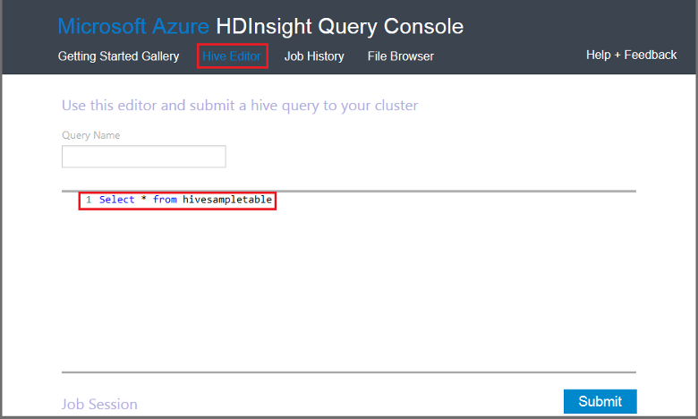

<properties
   pageTitle="Utilizzare Hive Hadoop nella Console di Query in HDInsight | Microsoft Azure"
   description="Informazioni su come utilizzare la Console di Query basata sul web per eseguire query Hive in un cluster di HDInsight Hadoop dal browser."
   services="hdinsight"
   documentationCenter=""
   authors="Blackmist"
   manager="jhubbard"
   editor="cgronlun"
    tags="azure-portal"/>

<tags
   ms.service="hdinsight"
   ms.devlang="na"
   ms.topic="article"
   ms.tgt_pltfrm="na"
   ms.workload="big-data"
   ms.date="09/20/2016"
   ms.author="larryfr"/>

# Eseguire query Hive tramite la Console di Query

[AZURE.INCLUDE [hive-selector](../../includes/hdinsight-selector-use-hive.md)]

In questo articolo si imparerà a utilizzare la Console di Query HDInsight per eseguire query Hive in un cluster di HDInsight Hadoop dal browser.

> [AZURE.IMPORTANT] Console di Query HDInsight è disponibile solo nei cluster HDInsight basato su Windows. Se si utilizza un cluster basati su Linux HDInsight, vedere [eseguire Hive query utilizzando la visualizzazione Hive](hdinsight-hadoop-use-hive-ambari-view.md).

##Prerequisiti

Per completare la procedura descritta in questo articolo, è necessario quanto segue.

* Un cluster basato su Windows HDInsight Hadoop

* Un browser web moderna

##Eseguire query Hive tramite la Console di Query

1. Aprire un web browser e passare a __https://CLUSTERNAME.azurehdinsight.net__, dove __nome cluster__ è il nome del cluster HDInsight. Se richiesto, immettere il nome utente e la password utilizzati al momento della creazione del cluster.

2. I collegamenti nella parte superiore della pagina, selezionare **Editor Hive**. Verrà visualizzata una maschera che può essere utilizzata per immettere le istruzioni HiveQL che si desidera eseguire il cluster HDInsight.

    

    Sostituire il testo `Select * from hivesampletable` con le istruzioni HiveQL seguenti:

        set hive.execution.engine=tez;
        DROP TABLE log4jLogs;
        CREATE EXTERNAL TABLE log4jLogs (t1 string, t2 string, t3 string, t4 string, t5 string, t6 string, t7 string)
        ROW FORMAT DELIMITED FIELDS TERMINATED BY ' '
        STORED AS TEXTFILE LOCATION 'wasbs:///example/data/';
        SELECT t4 AS sev, COUNT(*) AS count FROM log4jLogs WHERE t4 = '[ERROR]' AND INPUT__FILE__NAME LIKE '%.log' GROUP BY t4;

    Queste istruzioni eseguono le operazioni seguenti:

    * **Istruzione DROP TABLE**: consente di eliminare la tabella e il file di dati se la tabella esiste già.
    * **Creazione di tabelle esterne**: crea una nuova tabella 'esterna' nell'Hive. Tabelle esterne archiviare solo la definizione della tabella in Hive; i dati siano a sinistra nella posizione originale.

    > [AZURE.NOTE] Tabelle esterne devono essere utilizzate quando si prevede che i dati sottostanti dovranno essere aggiornati da un'origine esterna (ad esempio un processo di caricamento automatica dei dati) o da un'altra operazione MapReduce, ma si desidera sempre Hive query per utilizzare i dati più recenti.
    >
    > Eliminazione di una tabella esterna indica **non** Elimina i dati, solo la definizione della tabella.

    * **Formato di riga**: indica Hive modalità di formattazione. In questo caso, i campi in ogni log sono separati da uno spazio.
    * **Percorso di file di testo come ARCHIVIATO**: indica Hive nel punto in cui i dati sono archiviate (directory/dati di esempio) e memorizzati come testo
    * **Selezionare**: selezionare un conteggio di tutte le righe in cui colonna **t4** contengono il valore **[errore]**. In questo modo il valore **3** sono disponibili tre righe che contengono il valore.
    * **INPUT__FILE__NAME come '%.log'** - indica Hive che si bisogna restituiscono solo dati da file che terminano con. log. Limita la ricerca del file sample.log che contiene i dati e continua da restituire dati da altri esempio file di dati che non corrispondono allo schema che è definiti.

2. Fare clic su **Invia**. La **Sessione di processo** nella parte inferiore della pagina deve visualizzare i dettagli per il processo.

3. Quando il campo **stato** è impostato su **completata**, selezionare **Visualizza dettagli** per il processo. Nella pagina dettagli **Output processo** contiene `[ERROR]   3`. È possibile utilizzare il pulsante **Download** in questo campo per scaricare un file che contiene l'output del processo.

##Riepilogo

Come si può notare, la Console di Query fornisce un modo semplice per eseguire query Hive in un cluster di HDInsight, monitorare lo stato del processo e recuperare l'output.

Per ulteriori informazioni sull'utilizzo Hive Console di Query per eseguire i processi di Hive, selezionare **Guida introduttiva** nella parte superiore della Console di Query, quindi utilizzare gli esempi in cui vengono forniti. Ogni campione sono illustrati i passaggi dell'utilizzo Hive per analizzare i dati, inclusi spiegazioni sulle istruzioni HiveQL utilizzate nel campione.

##Passaggi successivi

Per informazioni generali su Hive in HDInsight:

* [Usare Hive con Hadoop in HDInsight](hdinsight-use-hive.md)

Per informazioni su altri modi è possibile utilizzare le Hadoop su HDInsight:

* [Utilizzare maialino con Hadoop in HDInsight](hdinsight-use-pig.md)

* [Utilizzare MapReduce con Hadoop in HDInsight](hdinsight-use-mapreduce.md)

Se si utilizza Tez con Hive, vedere i documenti per le informazioni di debug seguenti:

* [Utilizzare l'interfaccia utente Tez in HDInsight basato su Windows](hdinsight-debug-tez-ui.md)

* [Utilizzare la visualizzazione di Ambari Tez in HDInsight basati su Linux](hdinsight-debug-ambari-tez-view.md)

[1]: ../HDInsight/hdinsight-hadoop-visual-studio-tools-get-started.md

[hdinsight-sdk-documentation]: http://msdnstage.redmond.corp.microsoft.com/library/dn479185.aspx

[azure-purchase-options]: http://azure.microsoft.com/pricing/purchase-options/
[azure-member-offers]: http://azure.microsoft.com/pricing/member-offers/
[azure-free-trial]: http://azure.microsoft.com/pricing/free-trial/

[apache-tez]: http://tez.apache.org
[apache-hive]: http://hive.apache.org/
[apache-log4j]: http://en.wikipedia.org/wiki/Log4j
[hive-on-tez-wiki]: https://cwiki.apache.org/confluence/display/Hive/Hive+on+Tez
[import-to-excel]: http://azure.microsoft.com/documentation/articles/hdinsight-connect-excel-power-query/

[hdinsight-use-oozie]: hdinsight-use-oozie.md
[hdinsight-analyze-flight-data]: hdinsight-analyze-flight-delay-data.md

[hdinsight-storage]: hdinsight-hadoop-use-blob-storage.md

[hdinsight-provision]: hdinsight-provision-clusters.md
[hdinsight-submit-jobs]: hdinsight-submit-hadoop-jobs-programmatically.md
[hdinsight-upload-data]: hdinsight-upload-data.md
[hdinsight-get-started]: hdinsight-hadoop-linux-tutorial-get-started.md

[Powershell-install-configure]: powershell-install-configure.md
[powershell-here-strings]: http://technet.microsoft.com/library/ee692792.aspx

[img-hdi-hive-powershell-output]: ./media/hdinsight-use-hive/HDI.Hive.PowerShell.Output.png
