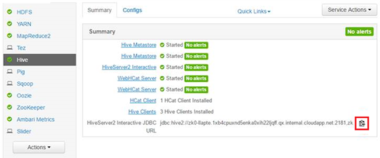

<properties
    pageTitle="Utilizzare Hive interattivi in HDInsight | Microsoft Azure"
    description="Informazioni su come utilizzare interattivi Hive (Hive nel LLAP) in HDInsight."
    keywords=""
    services="hdinsight"
    documentationCenter=""
    tags="azure-portal"
    authors="mumian" 
    manager="jhubbard"
    editor="cgronlun"/>

<tags
    ms.service="hdinsight"
    ms.workload="big-data"
    ms.tgt_pltfrm="na"
    ms.devlang="na"
    ms.topic="article"
    ms.date="10/27/2016"
    ms.author="jgao"/>

# Utilizzare Hive interattivi in HDInsight (Preview)

Interattiva Hive (noto anche [Long live e processo]( https://cwiki.apache.org/confluence/display/Hive/LLAP)) è un nuovo [tipo di cluster]( hdinsight-hadoop-provision-linux-clusters.md#cluster-types)di HDInsight.  Consente la memorizzazione nella cache che risulta Hive query molto più interattivi e processore Hive interattivi. Questa nuova caratteristica rende HDInsight di tutto il mondo la maggior parte delle prestazioni, flessibili, e soluzione dati aperta nel cloud con in memoria memorizzata nella cache (con Hive e motori) e avanzate analitica attraverso l'integrazione completa con i servizi di R. 

Il cluster Hive interattivi è diverso dal cluster Hadoop. Contiene solo il servizio Hive. 

> [AZURE.NOTE] MapReduce, maialino, Sqoop, Oozie e altri servizi verranno rimosso da questo tipo di cluster breve.
Il servizio Hive cluster Hive interattivi accessibile solo tramite la visualizzazione Ambari Hive, Beeline e Hive ODBC. Non è possibile accedervi tramite console Hive, Templeton, CLI Azure e Azure PowerShell. 

 

## Creare un cluster Hive interattivi

Interattiva Hive cluster è supportato solo nei cluster basati su Linux. Per informazioni sulla creazione di cluster HDInsight, vedere [cluster basati su Linux creare Hadoop in HDInsight](hdinsight-hadoop-provision-linux-clusters.md).

## Eseguire Hive dall'Hive interattivi

Sono disponibili diverse opzioni di come è possibile eseguire query di Hive:

- Eseguire Hive utilizzando la visualizzazione Ambari Hive

    Per informazioni sull'uso della visualizzazione Hive, vedere [usare la visualizzazione Hive con Hadoop in HDInsight]( hdinsight-hadoop-use-hive-ambari-view.md).

- Eseguire Hive utilizzando Beeline

    Per informazioni sull'utilizzo di Beeline su HDInsight, vedere [Usare Hive con Hadoop in HDInsight con Beeline](hdinsight-hadoop-use-hive-beeline.md).

    Si utilizza Beeline dalla headnode o un nodo del bordo vuoto.  È consigliabile utilizzare Beeline da un nodo del bordo vuoto.  Per informazioni sulla creazione di un cluster di HDInsight con un edgenode vuoto, vedere [uso bordo vuoto nodi in HDInsight](hdinsight-apps-use-edge-node.md).

- Eseguire Hive utilizzando Hive ODBC

    Per informazioni sull'utilizzo di Hive ODBC, vedere [Connettere Excel a Hadoop con il driver ODBC Hive Microsoft](hdinsight-connect-excel-hive-odbc-driver.md).

**Per trovare la stringa di connessione JDBC:**

1.  Effettuare l'accesso a Ambari utilizzando l'URL seguente: https://<ClusterName>. AzureHDInsight.net.
2.  Fare clic su **Hive** dal menu a sinistra.
3.  Fare clic sull'icona evidenziato per copiare l'URL:

    

## Vedere anche
-   [Cluster basati su Linux creare Hadoop in HDInsight](hdinsight-hadoop-provision-linux-clusters.md): informazioni su come creare cluster Hive interattivi in HDInsight.
-   [Utilizzare Hive con Hadoop in HDInsight con Beeline](hdinsight-hadoop-use-hive-beeline.md): informazioni su come usare Beeline per inviare query Hive.
-   [Connettere Excel a Hadoop con il driver ODBC Hive Microsoft](hdinsight-connect-excel-hive-odbc-driver.md): informazioni su come connettere Excel a Hive.
