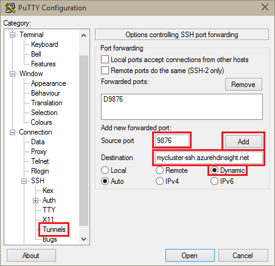
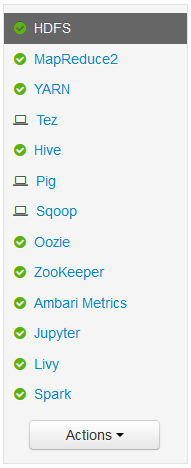

<properties
pageTitle="Utilizzare Tunneling SSH per accedere a web Ambari dell'interfaccia utente, ResourceManager, JobHistory, NameNode, Oozie e altre web dell'interfaccia utente"
description="Informazioni su come utilizzare un tunnel SSH per esplorare in modo sicuro risorse web ospitate nei nodi del HDInsight basati su Linux."
services="hdinsight"
documentationCenter=""
authors="Blackmist"
manager="jhubbard"
editor="cgronlun"/>

<tags
ms.service="hdinsight"
ms.devlang="na"
ms.topic="article"
ms.tgt_pltfrm="na"
ms.workload="big-data"
ms.date="10/17/2016"
ms.author="larryfr"/>

# Utilizzare Tunneling SSH per accedere a interfaccia utente web Ambari, JobHistory, NameNode, Oozie e altre web dell'interfaccia utente

Cluster HDInsight basati su Linux fornire l'accesso a interfaccia utente Ambari web su Internet, ma alcune funzionalità dell'interfaccia utente non sono. Ad esempio, l'interfaccia web per altri servizi che vengono resi disponibili tramite Ambari. Per tutte le funzionalità del web Ambari dell'interfaccia utente, è necessario utilizzare un tunnel SSH all'intestazione cluster.

## Che cos'è necessario un tunnel SSH?

Molti dei menu in Ambari verrà non completamente compilato senza un tunnel SSH, come si basano su siti web e servizi esposti da altri servizi Hadoop eseguite nel cluster. Spesso, questi siti web non sono protetti, pertanto non è consigliabile esporre direttamente su internet. In alcuni casi e viene eseguito il sito web in un altro servizio cluster, ad esempio un nodo Zookeeper.

Di seguito sono services che utilizza l'interfaccia utente web Ambari, che non sono accessibili senza un tunnel SSH:

* JobHistory,
* NameNode,
* Stack di thread
* Interfaccia utente web Oozie
* Interfaccia utente HBase schema e dei log

Se si utilizza le azioni Script per personalizzare il cluster, tutti i servizi o utilità installati che espongono un'interfaccia utente web richiederà un tunnel SSH. Ad esempio, se si installa tonalità usando un'azione Script, è necessario utilizzare un tunnel SSH per accedere al web tonalità dell'interfaccia utente.

## Che cos'è un tunnel SSH?

[Secure Shell (SSH) tunneling](https://en.wikipedia.org/wiki/Tunneling_protocol#Secure_Shell_tunneling) indirizza il traffico inviato alla porta sulla workstation locale, tramite una connessione SSH per il nodo principale cluster HDInsight, in cui la richiesta viene risolto come se fosse inviata sul nodo principale. La risposta viene indirizzata attraverso il tunnel workstation in uso.

## Prerequisiti

Quando si utilizza un tunnel SSH per il traffico web, è necessario disporre le operazioni seguenti:

* Un client SSH. Per distribuzioni Linux e Unix o Mac OS X, il `ssh` comando viene fornito con il sistema operativo. Per Windows, è consigliabile [PuTTY](http://www.chiark.greenend.org.uk/~sgtatham/putty/download.html)

    > [AZURE.NOTE] Se si desidera utilizzare diverso da un client SSH `ssh` o PuTTY, consultare la documentazione per i client su come stabilire un tunnel SSH.

* Un browser che può essere configurato per utilizzare un proxy SOCKS

## Creare un tunnel con il comando SSH

Usare il comando seguente per creare un SSH tunnel utilizzando il `ssh` comando. Sostituire __nomeutente__ con un utente SSH per il cluster HDInsight e __nome cluster__ con il nome del cluster HDInsight

    ssh -C2qTnNf -D 9876 USERNAME@CLUSTERNAME-ssh.azurehdinsight.net

In questo modo si crea una connessione che indirizza il traffico a porta locale 9876 al cluster su SSH. Le opzioni sono:

* **D 9876** - porta locale che indirizza il traffico attraverso il tunnel.

* **C** - Comprimi tutti i dati, poiché il traffico web prevalentemente testo.

* **2** - forza SSH per provare la versione 2 di protocollo.

* **domande** - invisibile.

* **T** - allocazione pseudo tty disabilita, poiché è sufficiente stiamo inoltro di una porta.

* **n** - impedisce la lettura di STDIN, poiché è sufficiente stiamo inoltro di una porta.

* **N** - non viene eseguito un comando remoto, poiché è sufficiente stiamo inoltro di una porta.

* **f** - esecuzione in background.

Se il cluster è configurato con un tasto di SSH, potrebbe essere necessario usare la `-i` parametro e specificare il percorso per la chiave privata SSH.

Una volta al termine del comando, il traffico inviato alla porta 9876 sul computer locale instradati su Secure Sockets Layer (SSL) al cluster sede nodo e origine non esiste.

## Creare un tunnel con PuTTY

Utilizzare la procedura seguente per creare un tunnel SSH utilizzando PuTTY.

1. Aprire PuTTY e immettere le informazioni di connessione. Se non ha familiarità con PuTTY, vedere [Utilizzare SSH con basati su Linux Hadoop in HDInsight da Windows](hdinsight-hadoop-linux-use-ssh-windows.md) per informazioni su come usarlo con HDInsight.

2. Nella sezione **categoria** a sinistra della finestra di dialogo espandere **connessione**, espandere **SSH**e quindi selezionare **tunnel**.

3. Specificare le informazioni seguenti nel modulo **Opzioni che controllano l'inoltro di porta SSH** :

    * **Porta di origine** - porta sul client che si desidera inoltrare. Ad esempio **9876**.

    * Indirizzo di **destinazione** - The SSH per il cluster basati su Linux HDInsight. Ad esempio **miocluster ssh.azurehdinsight.net**.

    * **Dinamico** - proxy SOCKS dinamiche consente il routing.

    

4. Fare clic su **Aggiungi** per aggiungere le impostazioni e quindi fare clic su **Apri** per aprire un collegamento SSH.

5. Quando richiesto, accedere al server. Per stabilire una sessione SSH e abilitare il tunnel.

## Utilizzare il tunnel dal browser

> [AZURE.NOTE] La procedura descritta in questa sezione utilizza il browser FireFox, in quanto è disponibile gratuitamente per sistemi Linux, Unix, Mac OS X e Windows. Altri browser moderni che supportano l'utilizzo di un proxy SOCKS funzionano anche.

1. Configurare il browser per utilizzare **localhost:9876** come proxy **SOCKS v5** . Ecco l'aspetto delle impostazioni di Firefox. Se è stata utilizzata una porta diversa da quella 9876, cambiare la porta a quello usato:

    

    > [AZURE.NOTE] Selezione **DNS remoto** risolverà le richieste di sistema DNS (Domain Name) utilizzando il cluster HDInsight. Se non è selezionata, DNS verrà risolto in locale.

2. Verificare che il traffico viene instradato tunnel da vising un sito, ad esempio [http://www.whatismyip.com/](http://www.whatismyip.com/) con le impostazioni proxy abilitata e disabilitata in Firefox. Se le impostazioni sono attivate, l'indirizzo IP sarà per una macchina nel centro di dati di Microsoft Azure.

##Verificare con web Ambari dell'interfaccia utente

Una volta stabilito cluster, utilizzare la procedura seguente per verificare che sia possibile accedere web service interfacce utente dal Ambari Web:

1. Nel browser andare all'http://headnodehost:8080. Il `headnodehost` indirizzo verranno inviati sul tunnel al cluster e risolvere headnode che Ambari è in esecuzione. Quando richiesto, immettere il nome utente di amministratore (amministratore) e la password per il cluster. Potrebbe essere richiesto una seconda volta dal web Ambari dell'interfaccia utente. In caso affermativo, immettere nuovamente le informazioni.
    
    > [AZURE.NOTE] Quando si usa l'indirizzo http://headnodehost:8080 per connettersi al cluster, si è connessi direttamente sul tunnel per il nodo principale che Ambari è in esecuzione tramite HTTP e la comunicazione è protetto con tunnel SSH. Quando ci si connette tramite internet senza l'utilizzo di un tunnel, comunicazioni sono protetto tramite HTTPS. Per connettersi tramite internet con HTTPS, utilizzare https://CLUSTERNAME.azurehdinsight.net, dove __nome cluster__ è il nome del cluster.

2. L'interfaccia utente Web Ambari, selezionare HDFS dall'elenco sul lato sinistro della pagina.

    

3. Dopo aver visualizzati le informazioni sul servizio HDFS, selezionare __Collegamenti rapidi__. Verrà visualizzato un elenco dei nodi di testa del cluster. Selezionare uno dei nodi di testa e quindi selezionare __NameNode dell'interfaccia utente__.

    

    > [AZURE.NOTE] Se si dispone di una connessione internet lenta o il nodo principale è occupato, potrebbe essere visualizzato un indicatore di attesa invece di un menu quando si seleziona __Collegamenti rapidi__. In questo caso, attendere qualche minuto o due per i dati che verrà ricevuto dal server, quindi provare di nuovo l'elenco.
    >
    > Se si dispone di un monitor con risoluzione inferiore o finestra del browser non è ingrandita, alcune voci nel menu __Collegamenti rapidi__ potrebbero essere troncati dal lato destro dello schermo. In caso affermativo, espandere il menu con il mouse, quindi usare il tasto freccia destra per scorrere la schermata a destra per visualizzare il resto del menu.

4. Dovrebbero essere visualizzate una pagina simile al seguente:

    

    > [AZURE.NOTE] Si noti l'URL della pagina. dovrebbe essere simile a __http://hn1-CLUSTERNAME.randomcharacters.cx.internal.cloudapp.net:8088/cluster__. Usa il nome di dominio interno completo (FQDN) del nodo e non è accessibile senza utilizzare un tunnel SSH.

## Passaggi successivi

Ora che è stato illustrato come creare e utilizzare un tunnel SSH, vedere la procedura seguente per informazioni su monitorare e gestire il cluster tramite Ambari:

* [Gestire i cluster HDInsight utilizzando Ambari](hdinsight-hadoop-manage-ambari.md)

Per ulteriori informazioni sull'utilizzo di SSH con HDInsight, vedere le operazioni seguenti:

* [Usare SSH con basati su Linux Hadoop in HDInsight da Linux, Unix o OS X](hdinsight-hadoop-linux-use-ssh-unix.md)

* [Usare SSH con basati su Linux Hadoop in HDInsight da Windows](hdinsight-hadoop-linux-use-ssh-windows.md)
