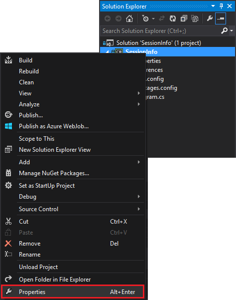

<properties
 pageTitle="Correlare eventi nel tempo con eccesso e HBase in HDInsight"
 description="Informazioni su come creare una relazione tra gli eventi che arrivano orari tramite eccesso e HBase su HDInsight."
 services="hdinsight"
 documentationCenter=""
 authors="Blackmist"
 manager="jhubbard"
 editor="cgronlun"
 tags="azure-portal"/>

<tags
 ms.service="hdinsight"
 ms.devlang="dotnet"
 ms.topic="article"
 ms.tgt_pltfrm="na"
 ms.workload="big-data"
 ms.date="10/27/2016"
 ms.author="larryfr"/>

# Correlare eventi nel tempo con eccesso e HBase in HDInsight

Utilizzando un archivio dati permanente con eccesso Apache, è possibile correlare le voci di dati che arrivano orari. Ad esempio, il collegamento eventi di accesso e disconnessione di una sessione utente calcolare quanto tempo la durata della sessione.

In questo documento si imparerà creare una base topologia c# eccesso che tiene traccia degli eventi di accesso e disconnessione per le sessioni utente e viene calcolata la durata della sessione. La topologia utilizza HBase come archivio dati permanenti. HBase consente anche di eseguire query in batch sui dati cronologici per generare le informazioni supplementari, ad esempio il numero di sessioni utente sono stato avviato o terminato durante un periodo di tempo specifico.

## Prerequisiti

- Visual Studio e gli strumenti di HDInsight per Visual Studio: per informazioni sull'installazione, vedere [iniziare a utilizzare gli strumenti di HDInsight per Visual Studio](../HDInsight/hdinsight-hadoop-visual-studio-tools-get-started.md) .

- Eccesso Apache nella HDInsight cluster (basato su Windows). Verrà eseguito topologia eccesso, che consente di elaborare dati in arrivo e viene archiviato in HBase.

    > [AZURE.IMPORTANT] Mentre SCP.NET topologie sono supportate nei cluster basati su Linux eccesso creati dopo il 28/10/2016, SDK HBase del pacchetto .NET disponibile a partire dal 28/10/2016 non funziona correttamente su Linux.

- HBase Apache cluster HDInsight (Linux o basato su Windows). Questo è l'archivio di dati per questo esempio.

## Architettura

Correlare eventi richiede un identificatore comune per l'origine eventi. Ad esempio, un ID utente, ID sessione o altre parti di dati) univoci e b) incluso in tutti i dati inviati per eccesso. In questo esempio viene utilizzato un valore GUID per rappresentare un ID sessione.

In questo esempio è costituito da due cluster HDInsight:

-   HBase: archivio di dati permanenti per i dati cronologici

-   Eccesso: utilizzato per acquisire i dati in arrivo

I dati in modo casuale generati da topologia eccesso e include gli elementi seguenti:

-   ID sessione: GUID che identifica in modo univoco ogni sessione

-   Evento: un inizio o alla fine evento. In questo esempio, inizio si verifica sempre prima fine

-   Ora: l'ora dell'evento.

Questi dati vengono elaborati e archiviati in HBase.

### Topologia eccesso

Avvio di una sessione di un evento **iniziale** è ricevuto tramite la topologia e ha eseguito l'accesso a HBase. Quando si riceve un evento **finale** , la topologia recupera evento **iniziale** e calcola il tempo tra due eventi. Questo valore **durata** verrà quindi archiviato in HBase insieme le informazioni sugli eventi di **Fine** .

> [AZURE.IMPORTANT] Mentre questa topologia di seguito viene illustrato il modello di base, una soluzione di produzione dovrebbe prestare progettazione per gli scenari seguenti:
>
> - Eventi ricevuti fuori ordine
> - Duplicare gli eventi
> - Eventi ignorati

La topologia di esempio è costituita da componenti seguenti:

-   Session.cs: simula una sessione utente tramite la creazione di un ID sessione casuale, inizio temporali e la durata della sessione a lungo termine

-   Spout.cs: crea 100 sessioni, genera un evento di avvio, attesa timeout casuale per ogni sessione e quindi genera un evento finale. Quindi ricicli Termina sessioni per generare nuovi file.

-   HBaseLookupBolt.cs: utilizza l'ID di sessione per cercare informazioni sessione HBase. Durante l'elaborazione di un evento finale, viene rilevato l'evento START corrispondente e viene calcolata la durata della sessione.

-   HBaseBolt.cs: Archivia le informazioni in HBase.

-   TypeHelper.cs: Consente di conversione di tipi quando lettura / scrittura in HBase.

### Schema HBase

In HBase, i dati vengono archiviati in una tabella con impostazioni di schema seguenti:

-   Chiave riga: la sessione ID viene utilizzato come chiave per le righe in questa tabella

-   Famiglia di colonna: il nome della famiglia è 'cf'. Colonne archiviate in questa famiglia sono:

    -   evento: inizio o alla fine

    -   ora: il tempo in millisecondi che si è verificato l'evento

    -   durata: la lunghezza tra inizio e fine evento

-   VERSIONI: famiglia 'cf' è impostata per la conservazione di 5 versioni di ogni riga

    > [AZURE.NOTE] Le versioni sono un file di log dei valori precedentemente memorizzati per una chiave di riga specifico. Per impostazione predefinita, HBase solo restituirà il valore per la versione più recente di una riga. In questo caso, sulla stessa riga viene usata per tutti gli eventi (inizio, fine.) ogni versione di una riga è identificato dal valore timestamp. Fornisce una visualizzazione cronologica di tutti gli eventi registrati per uno specifico ID.

## Scaricare il progetto

Il progetto di esempio può essere scaricato dal [https://github.com/Azure-Samples/hdinsight-storm-dotnet-event-correlation](https://github.com/Azure-Samples/hdinsight-storm-dotnet-event-correlation).

Questo download contiene i progetti c# seguenti:

-   CorrelationTopology: Topologia c# eccesso che genera in modo casuale gli eventi di inizio e di fine per le sessioni utente. Ogni sessione dura compreso tra 1 e 5 minuti.

-   SessionInfo: Applicazione di console c# che consente di creare la tabella HBase e fornisce query di esempio per ottenere informazioni archiviati i dati della sessione.

## Creare la tabella

1. Aprire il progetto **SessionInfo** in Visual Studio.

2. In **Esplora soluzioni**fare clic sul progetto **SessionInfo** e scegliere **proprietà**.

    

3. Selezionare **Impostazioni**e quindi impostare i valori seguenti:

    -   HBaseClusterURL: l'URL per il cluster HBase. Ad esempio https://myhbasecluster.azurehdinsight.net

    -   HBaseClusterUserName: l'amministratore/HTTP account utente per il cluster

    -   HBaseClusterPassword: la password per l'account utente di amministrazione/HTTP

    -   HBaseTableName: il nome della tabella da utilizzare con questo esempio

    -   HBaseTableColumnFamily: Il nome della famiglia colonna

    

5. Eseguire la soluzione. Quando richiesto, selezionare la chiave "c" per creare la tabella sul cluster HBase.

## Compilare e distribuire la topologia eccesso

1.  Aprire la soluzione **CorrelationTopology** in Visual Studio.

2.  In **Esplora soluzioni**fare clic con il pulsante destro del progetto **CorrelationTopology** e scegliere Proprietà.

3.  Nella finestra delle proprietà, selezionare **Impostazioni** e fornire le informazioni seguenti. Il primo 5 deve essere gli stessi valori utilizzati dal progetto **SessionInfo** :

    -   HBaseClusterURL: l'URL per il cluster HBase. Ad esempio https://myhbasecluster.azurehdinsight.net

    -   HBaseClusterUserName: l'amministratore/HTTP account utente per il cluster

    -   HBaseClusterPassword: la password per l'account utente di amministrazione/HTTP

    -   HBaseTableName: il nome della tabella da utilizzare con questo esempio. Questa operazione deve contenere lo stesso nome di tabella di utilizzate nel progetto SessionInfo

    -   HBaseTableColumnFamily: Il nome della famiglia colonna. Questa operazione deve contenere lo stesso nome colonna usata nel progetto SessionInfo

    > [AZURE.IMPORTANT] Non modificare HBaseTableColumnNames, come i valori predefiniti sono i nomi utilizzati da **SessionInfo** per recuperare i dati.

4.  Salvare le proprietà e quindi compilare il progetto.

5.  In **Esplora soluzioni**fare clic con il pulsante destro del progetto e selezionare **Invia per eccesso in HDInsight**. Se richiesto, immettere le credenziali per l'abbonamento Azure.

    

6.  Nella finestra di dialogo **Invia topologia** , selezionare il cluster eccesso che verrà eseguita questa topologia.

    > [AZURE.NOTE] La prima volta che si invia una topologia potrebbero essere necessari alcuni secondi per recuperare il nome dei cluster HDInsight.

7.  Dopo la topologia è stata caricata e inviata al cluster, la **Visualizzazione della topologia eccesso** verrà aperto e visualizzerà la topologia in esecuzione. Selezionare **CorrelationTopology** e usare il pulsante Aggiorna nella parte superiore destra della pagina per aggiornare le informazioni sulla topologia.

    

    Quando la topologia inizia la generazione di dati, viene incrementato il valore nella colonna **emessa** .

    > [AZURE.NOTE] Se la **Vista della topologia eccesso** non viene aperto automaticamente, utilizzare la procedura seguente per aprirlo:
    >
    > 1. In **Esplora soluzioni**espandere **Azure**e quindi espandere **HDInsight**.
    >
    > 2. Fare clic con il pulsante destro del cluster eccesso che la topologia è in esecuzione su e quindi selezionare **Visualizza eccesso topologie**

## I dati della query

Una volta dati sono stati creati, utilizzare la procedura seguente per i dati della query.

1. Tornare al progetto **SessionInfo** . Se non è in esecuzione, iniziare una nuova istanza.

2. Quando richiesto, selezionare **s** cercare gli eventi di avvio. Verrà richiesto di immettere ora di inizio e fine per definire un intervallo di tempo, verranno restituiti solo gli eventi tra le due volte.

    Utilizzare il seguente formato quando si immettono ore di inizio e fine: hh.mm e "sto" o "pm". Ad esempio 11:20 pm.

    Poiché la topologia è appena iniziato, usare un avvio ora prima che è stata distribuita e un'ora di fine dell'ora. Questa operazione deve acquisire la maggior parte degli eventi di avvio generate quando avviato. Quando si esegue la query, verrà visualizzato un elenco di voci simile al seguente:

        Session e6992b3e-79be-4991-afcf-5cb47dd1c81c started at 6/5/2015 6:10:15 PM. Timestamp = 1433527820737

Ricerca di eventi END funziona come eventi di avvio. Tuttavia, gli eventi di fine vengono generati in modo casuale compreso tra 1 e 5 minuti dopo l'evento START. Pertanto è necessario provare alcuni intervalli di tempo per individuare gli eventi di fine. Eventi END conterrà anche la durata della sessione - la differenza tra l'ora di eventi di inizio e fine evento. Ecco un esempio di dati per gli eventi di fine:

    Session fc9fa8e6-6892-4073-93b3-a587040d892e lasted 2 minutes, and ended at 6/5/2015 6:12:15 PM

> [AZURE.NOTE] Mentre i valori di ora che immessi in ora locale, l'ora restituita dalla query saranno ora UTC.

##Interrompere la topologia

Quando si è pronti interrompere la topologia, tornare al progetto **CorrelationTopology** in Visual Studio. Nella **Vista della topologia eccesso**, selezionare la topologia e quindi utilizzare il pulsante di **interruzione** nella parte superiore della visualizzazione della topologia.

##Eliminare il cluster

[AZURE.INCLUDE [delete-cluster-warning](../../includes/hdinsight-delete-cluster-warning.md)]

##Passaggi successivi

Per altri esempi eccesso, vedere [topologie di esempio per eccesso in HDInsight](hdinsight-storm-example-topology.md).
 
