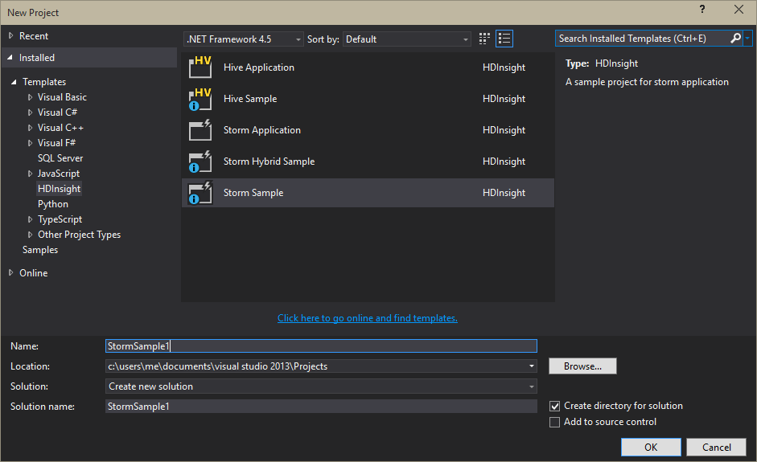
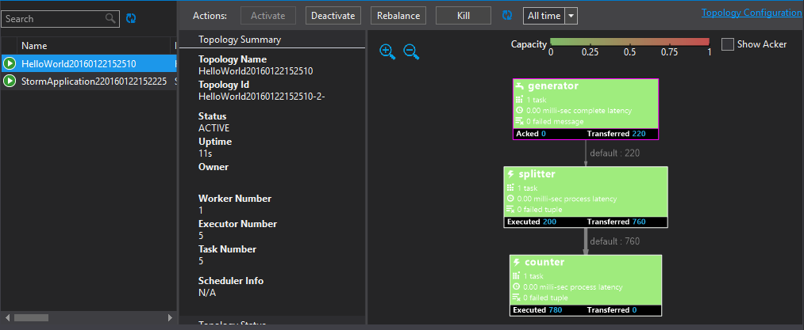

<properties
   pageTitle="Distribuire e gestire topologie Apache eccesso nella HDInsight | Microsoft Azure"
   description="Informazioni su come distribuire, monitorare e gestire topologie Apache eccesso tramite il Dashboard eccesso su HDInsight. Usare Hadoop tools per Visual Studio."
   services="hdinsight"
   documentationCenter=""
   authors="Blackmist"
   manager="jhubbard"
   editor="cgronlun"
    tags="azure-portal"/>

<tags
   ms.service="hdinsight"
   ms.devlang="java"
   ms.topic="article"
   ms.tgt_pltfrm="na"
   ms.workload="big-data"
   ms.date="10/11/2016"
   ms.author="larryfr"/>

#Distribuire e gestire topologie Apache eccesso nella HDInsight basato su Windows

Dashboard di eccesso consente di distribuire facilmente e mostrarli topologie eccesso Apache al cluster HDInsight tramite un web browser. Utilizzare il dashboard per monitorare e gestire topologie in esecuzione. Se si utilizza Visual Studio, gli strumenti di HDInsight per Visual Studio forniscono caratteristiche analoghe in Visual Studio.

Dashboard eccesso e le caratteristiche di eccesso negli strumenti di HDInsight si basano su API REST eccesso, che possono essere utilizzati per creare la propria monitoraggio soluzioni di gestione.

> [AZURE.IMPORTANT] La procedura descritta in questo documento richiesta un eccesso basato su Windows cluster HDInsight. Per informazioni sull'utilizzo di un cluster basato su Linux, vedere [Distribuisci e gestire topologie Apache eccesso su basati su Linux HDInsight](hdinsight-storm-deploy-monitor-topology-linux.md)

##Prerequisiti

* **Eccesso Apache su HDInsight** , vedere <a href="../hdinsight-storm-getting-started/" target="_blank">Guida introduttiva a eccesso Apache su HDInsight</a> per istruzioni sulla creazione di un cluster

* Per **Il Dashboard**: un moderno browser che supporti HTML5

* Per **Visual Studio** - Azure SDK 2.5.1 o versioni successive e gli strumenti di HDInsight per Visual Studio. Vedere <a href="../hdinsight-hadoop-visual-studio-tools-get-started/" target="_blank">Introduzione all'utilizzo HDInsight Tools per Visual Studio</a> per installare e configurare gli strumenti di HDInsight per Visual Studio.

    Uno dei seguenti versioni di Visual Studio:

    * Visual Studio 2012 con <a href="http://www.microsoft.com/download/details.aspx?id=39305" target="_blank">aggiornamento 4</a>

    * Visual Studio 2013 con <a href="http://www.microsoft.com/download/details.aspx?id=44921" target="_blank">aggiornamento 4</a> o <a href="http://go.microsoft.com/fwlink/?LinkId=517284" target="_blank">Visual Studio 2013 Community</a>

    * <a href="http://visualstudio.com/downloads/visual-studio-2015-ctp-vs" target="_blank">Visual Studio 2015 CTP6</a>

    > [AZURE.NOTE] Gli strumenti di HDInsight per Visual Studio supportano attualmente solo eccesso nella versione cluster HDInsight 3,2.

##Dashboard eccesso

Il Dashboard eccesso è una pagina web disponibile sul cluster eccesso. L'URL è **https://&lt;nome cluster >.azurehdinsight.net/**, dove **nome cluster** è il nome dell'eccesso cluster HDInsight.

Nella parte superiore del Dashboard eccesso, selezionare **Invia topologia**. Seguire le istruzioni nella pagina per l'esecuzione di una topologia di esempio o per caricare ed eseguire una topologia creato.

![pagina Invia topologia][storm-dashboard-submit]

###Eccesso dell'interfaccia utente

Dal Dashboard eccesso, selezionare il collegamento **Dell'interfaccia utente eccesso** . Verrà visualizzata informazioni relative al cluster, oltre a qualsiasi topologie in esecuzione.

![l'interfaccia utente eccesso][storm-dashboard-ui]

> [AZURE.NOTE] In alcune versioni di Internet Explorer, si potrebbe scoprire che l'interfaccia utente eccesso non aggiornate dopo che si visitati prima di tutto. Ad esempio, potrebbe non viene topologie nuove invio oppure, potrebbe essere visualizzato una topologia come attiva quando è stata disattivata. Microsoft è presente il problema e lavorando a una soluzione.

####Pagina principale

Nella pagina principale dell'interfaccia utente eccesso sono le seguenti informazioni:

* **Cluster riepilogo**: informazioni di base su cluster eccesso.

* **Topologia riepilogo**: un elenco di esecuzione topologie. Utilizzare i collegamenti in questa sezione per visualizzare ulteriori informazioni sulle topologie specifiche.

* **Supervisore riepilogo**: informazioni su Supervisore eccesso.

* **Configurazione di nimbus**: configurazione Nimbus per il cluster.

####Topologia di riepilogo

Selezione di un collegamento nella sezione **topologia di riepilogo** vengono visualizzate le seguenti informazioni sulla topologia:

* **Topologia riepilogo**: informazioni di base sulla topologia.

* **Azioni topologia**: azioni di gestione che è possibile eseguire per la topologia.

    * **Attiva**: elaborazione di curriculum di una topologia disattivata.

    * **Disattiva**: sospende una topologia in esecuzione.

    * **Ribilanciare**: consente di regolare il parallelismo della topologia. Dopo avere modificato il numero dei nodi del cluster, si devono ribilanciare topologie in esecuzione. In questo modo la topologia regolare parallelismo a compensa il numero maggiore o minore di nodi del cluster.

        Per ulteriori informazioni, vedere <a href="http://storm.apache.org/documentation/Understanding-the-parallelism-of-a-Storm-topology.html" target="_blank">informazioni sul parallelismo di una topologia eccesso</a>.

    * **Eliminare**: e termina con una topologia eccesso il timeout specificato.

* **Stat topologia**: statistiche sulla topologia. Utilizzare i collegamenti nella colonna della **finestra** per impostare il periodo di tempo per le voci rimanenti nella pagina.

* **Spouts**: spouts utilizzato per la topologia. Utilizzare i collegamenti in questa sezione per visualizzare ulteriori informazioni sugli spouts specifico.

* **Bulloni**: bulloni utilizzati per la topologia. Utilizzare i collegamenti in questa sezione per visualizzare ulteriori informazioni su bulloni specifici.

* **Configurazione della topologia**: configurazione della topologia selezionata.

####Beccuccio e bulloni riepilogo

Selezione di un beccuccio dalla sezione **Spouts** o **bulloni** vengono visualizzate le informazioni seguenti sull'elemento selezionato:

* **Componente riepilogo**: informazioni di base sulla beccuccio o bulloni.

* **Stat beccuccio/bulloni**: statistiche sulla beccuccio o bulloni. Utilizzare i collegamenti nella colonna della **finestra** per impostare il periodo di tempo per le voci rimanenti nella pagina.

* **Statistiche di input** (solo bullone): informazioni sui flussi di input consumata dai bulloni.

* **Statistiche di output**: informazioni sui flussi emesso da questo spout o bullone.

* **Esecutori**: informazioni sulle istanze del beccuccio o bulloni. Selezionare la voce di **porta** per un esecutore specifico visualizzare un elenco delle informazioni di diagnostica per questa istanza.

* **Errori**: le informazioni sugli errori per questo spout o bullone.

##HDInsight Tools per Visual Studio

Gli strumenti di HDInsight può essere utilizzati per inviare c# o ibrido topologie al cluster eccesso. La procedura seguente usa un'applicazione di esempio. Per informazioni sulla creazione di propri topologie usando gli strumenti di HDInsight, vedere [c# sviluppare topologie usando gli strumenti di HDInsight per Visual Studio](hdinsight-storm-develop-csharp-visual-studio-topology.md).

Utilizzare la procedura seguente per distribuire un campione l'eccesso cluster HDInsight, quindi visualizzare e gestire la topologia.

1. Se non è già installato la versione più recente degli strumenti HDInsight per Visual Studio, vedere <a href="../hdinsight-hadoop-visual-studio-tools-get-started/" target="_blank">Introduzione all'utilizzo HDInsight Tools per Visual Studio</a>.

2. Aprire Visual Studio, selezionare **il File** > **Nuovo** > **progetto**.

3. Nella finestra di dialogo **Nuovo progetto** espandere **installati** > **modelli**e quindi selezionare **HDInsight**. Nell'elenco dei modelli, selezionare **Il campione**. Nella parte inferiore della finestra di dialogo, digitare un nome per l'applicazione.

    

1. In **Esplora soluzioni**fare clic sul progetto e selezionare **Invia per eccesso in HDInsight**.

    > [AZURE.NOTE] Se richiesto, immettere le credenziali di accesso per l'abbonamento Azure. Se si dispone di più di una sottoscrizione, accedere a quella che contiene l'eccesso cluster HDInsight.

2. Selezionare l'eccesso cluster HDInsight dall'elenco a discesa **Il Cluster** e quindi selezionare **Invia**. È possibile controllare se la presentazione viene eseguita correttamente utilizzando la finestra di **Output** .

3. Quando la topologia è stata inviata, dovrebbero essere visualizzate **Topologie eccesso** per il cluster. Selezionare la topologia dall'elenco per visualizzare informazioni sulla topologia di esecuzione.

    

    > [AZURE.NOTE] È inoltre possibile visualizzare **Il topologie** da **Esplora Server** , espandere **Azure** > **HDInsight**e quindi facendo clic su un eccesso cluster HDInsight e selezione **Visualizzazione eccesso topologie**.

    Selezionare la forma per il spouts o bulloni per visualizzare informazioni su questi componenti. Verrà aperta una nuova finestra per ogni elemento selezionato.
    
    > [AZURE.NOTE] Il nome della topologia è il nome della classe della topologia (in questo caso, `HelloWord`,) con un timestamp aggiunto.

4. Dalla visualizzazione **Riepilogo topologia** selezionare **interruzione** per interrompere la topologia.

    > [AZURE.NOTE] Topologie eccesso continuano a utilizzare fino a quando non sono interrotte o il cluster viene eliminato.

##API REST

L'interfaccia utente eccesso è basato su API REST, per poter eseguire Gestione e il monitoraggio delle funzionalità tramite l'API REST simili. È possibile utilizzare l'API REST per creare strumenti personalizzati per la gestione e monitoraggio topologie eccesso.

Per ulteriori informazioni, vedere [API REST di eccesso dell'interfaccia utente](https://github.com/apache/storm/blob/0.9.3-branch/STORM-UI-REST-API.md). Le informazioni seguenti sono specifiche per l'utilizzo di API REST con eccesso Apache su HDInsight.

###URI base

URI di base per l'API REST nei cluster HDInsight è **https://&lt;nome cluster >.azurehdinsight.net/stormui/api/v1/**, dove **nome cluster** è il nome dell'eccesso cluster HDInsight.

###Autenticazione

Richieste di assistenza all'API REST necessario utilizzare **l'autenticazione di base**, in modo che si usa il nome dell'amministratore cluster HDInsight e la password.

> [AZURE.NOTE] Poiché l'autenticazione di base viene inviato tramite testo non crittografato, è necessario utilizza **sempre** HTTPS per proteggere le comunicazioni con i cluster.

###Valori restituiti

I dati restituiti dall'API REST possono essere solo utilizzabili da all'interno del cluster o macchine virtuali di Azure della stessa rete cluster. Ad esempio, il nome di dominio completo (FQDN) restituito per server Zookeeper non essere accessibile da Internet.

##Passaggi successivi

Dopo aver appreso come distribuire e monitorare topologie utilizzando il Dashboard eccesso, informazioni su come:

* [Sviluppare c# topologie usando gli strumenti di HDInsight per Visual Studio](hdinsight-storm-develop-csharp-visual-studio-topology.md)

* [Sviluppare topologie basato su Java utilizzando Maven](hdinsight-storm-develop-java-topology.md)

Per un elenco di altre topologie di esempio, vedere [topologie di esempio per eccesso in HDInsight](hdinsight-storm-example-topology.md).

[hdinsight-dashboard]: ./media/hdinsight-storm-deploy-monitor-topology/dashboard-link.png
[storm-dashboard-submit]: ./media/hdinsight-storm-deploy-monitor-topology/submit.png
[storm-dashboard-ui]: ./media/hdinsight-storm-deploy-monitor-topology/storm-ui-summary.png
