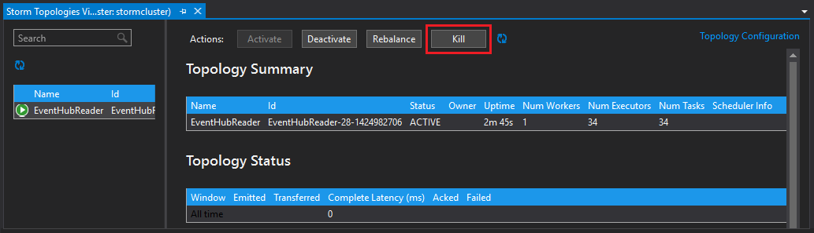

<properties
   pageTitle="Elaborare gli eventi da hub di eventi con eccesso nella HDInsight | Microsoft Azure"
   description="Informazioni su come elaborare i dati di evento hub con una topologia c# eccesso creata in Visual Studio utilizzando gli strumenti di HDInsight per Visual Studio."
   services="hdinsight,notification hubs"
   documentationCenter=""
   authors="Blackmist"
   manager="jhubbard"
   editor="cgronlun"/>

<tags
   ms.service="hdinsight"
   ms.devlang="dotnet"
   ms.topic="article"
   ms.tgt_pltfrm="na"
   ms.workload="big-data"
   ms.date="10/27/2016"
   ms.author="larryfr"/>

# Elaborare gli eventi da Azure evento hub con eccesso su HDInsight (c#)

Hub evento Azure consente di elaborare grandi quantità di dati da siti Web, applicazioni e dispositivi. Beccuccio evento hub rende eccesso Apache facile da usare in HDInsight per analizzare i dati in tempo reale. Inoltre, è possibile scrivere dati a un hub di evento da eccesso tramite bulloni hub evento.

In questa esercitazione si imparerà a utilizzare i modelli di Visual Studio installati con HDInsight Tools per Visual Studio per creare due topologie che funzionano con gli hub evento Azure.

* **EventHubWriter**: genera dati e scrive a un hub di evento in modo casuale

* **EventHubReader**: legge i dati da hub di eventi e registrare i dati per i registri eccesso

> [AZURE.NOTE] Durante la procedura descritta in questo documento si basa su un ambiente di sviluppo di Windows con Visual Studio, è possibile inviare il progetto compilato cluster HDInsight basato su Windows o Linux. Solo i cluster basati su Linux creati dopo il supporto di 28/10/2016 topologie SCP.NET.
>
> Per utilizzare una topologia c# con un cluster basato su Linux, è necessario aggiornare il pacchetto Microsoft.SCP.Net.SDK NuGet usato dal progetto alla versione 0.10.0.6 o versione successiva. La versione del pacchetto deve corrispondere anche la versione principale di eccesso installato HDInsight. Ad esempio eccesso nelle versioni HDInsight 3.3 e 3.4 utilizzare eccesso versione 0.10.x, mentre HDInsight 3.5 utilizza eccesso 1.0.
> 
> C# topologie nei cluster basati su Linux devono usare .NET 4.5 e usare Mono da eseguire in cluster HDInsight. Maggior parte delle caratteristiche funzionano, tuttavia è necessario archiviare il documento [Mono compatibilità](http://www.mono-project.com/docs/about-mono/compatibility/) per le possibili incompatibilità.
>
> Per una versione di linguaggio del progetto, che funziona anche in un cluster basato su Windows o Linux, vedere [elaborare eventi da Azure evento hub con eccesso su HDInsight (Java)](hdinsight-storm-develop-java-event-hub-topology.md).

## Prerequisiti

* Un [Eccesso Apache cluster HDInsight](hdinsight-apache-storm-tutorial-get-started.md)

* Un [Hub evento Azure](../event-hubs/event-hubs-csharp-ephcs-getstarted.md)

* [.NET Azure SDK](http://azure.microsoft.com/downloads/)

* [HDInsight Tools per Visual Studio](hdinsight-hadoop-visual-studio-tools-get-started.md)

## Progetto completato

È possibile scaricare una versione completa di progetto creato in questa esercitazione da GitHub: [ibrido di eccesso eventhub](https://github.com/Azure-Samples/hdinsight-dotnet-java-storm-eventhub). Tuttavia, è comunque necessario fornire le impostazioni di configurazione eseguendo la procedura descritta in questa esercitazione.

## Bulloni e beccuccio hub di evento

Gli hub di evento spout e bolt sono componenti di linguaggio che consentono di lavorare con gli hub di evento da Apache eccesso. Anche se questi componenti scritte in linguaggio, gli strumenti di HDInsight per Visual Studio consentono di creare topologie ibrido che combinano c# e componenti Java.

I beccuccio e bulloni sono distribuiti come file di archivio (JAR) Java singolo denominato **eventhubs-storm-spout-#.#-jar-with-dependencies.jar**, dove #. # è la versione del file.

### Scaricare il file JAR

La versione più recente del file vaso è incluso nel progetto [HDInsight eccesso esempi](https://github.com/hdinsight/hdinsight-storm-examples) nella cartella **raccolta/eventhubs** . Per scaricare il file, usare uno dei metodi descritti di seguito.

> [AZURE.NOTE] La beccuccio e bulloni sono state inviate da includere nel progetto Apache eccesso. Per ulteriori informazioni, vedere [eccesso 583: iniziale Archivia per hub eccesso evento](https://github.com/apache/storm/pull/336/files) in GitHub.

* **Scaricare un file ZIP**: dal sito [HDInsight eccesso esempi](https://github.com/hdinsight/hdinsight-storm-examples) selezionare **ZIP di Download** nel riquadro destro per scaricare un file zip contenente il progetto.

    

    Dopo il download del file, è possibile estrarre nell'archivio e il file verrà nella directory **raccolta** .

* **Duplicato del progetto**: se si dispone [fra](http://git-scm.com/) installato, usare il comando seguente per duplicare l'archivio locale, quindi individuare il file nella directory **raccolta** .

        git clone https://github.com/hdinsight/hdinsight-storm-examples

## Configurare gli hub di evento

Hub evento rappresenta l'origine dati per questo esempio. Usare le informazioni nella sezione __creare un Hub di eventi__ del documento [Guida introduttiva a hub di evento](../event-hubs/event-hubs-csharp-ephcs-getstarted.md) .

3. Dopo aver creato l'hub di evento, visualizzare e il EventHub nel portale di Azure e selezionare __accesso condivisi criteri__. Utilizzare la voce __+ Aggiungi__ per aggiungere i criteri seguenti:

  	| Nome | Autorizzazioni |
  	| ----- | ----- |
  	| writer | Invia |
  	| utilità per la lettura | Ascolto |

    

5. Selezionare i criteri di __utilità per la lettura__ e __scrittura__ . Copiare e salvare il valore di __Chiave primaria__ per entrambi i criteri, come verranno utilizzati in un secondo momento.

## Configurare il EventHubWriter

1. Se non è già installato la versione più recente degli strumenti HDInsight per Visual Studio, vedere [Introduzione all'utilizzo HDInsight Tools per Visual Studio](hdinsight-hadoop-visual-studio-tools-get-started.md).

2. Scaricare la soluzione da [ibrido di eccesso eventhub](https://github.com/Azure-Samples/hdinsight-dotnet-java-storm-eventhub). Aprire la soluzione e richiedere alcuni minuti per esaminare il codice per il progetto __EventHubWriter__ .

4. Nel progetto __EventHubWriter__ aprire il file __App__ . Usare le informazioni dall'Hub evento configurato in precedenza per immettere il valore per le chiavi seguenti:

  	| Chiave | Valore |
  	| ----- | ----- |
  	| EventHubPolicyName | Writer (se si utilizza un nome diverso per il criterio con l'autorizzazione _Invia_ , usare quest'ultima.) |
  	| EventHubPolicyKey | Il tasto per il criterio di scrittura |
  	| EventHubNamespace | Spazio dei nomi che contiene l'Hub di evento |
  	| EventHubName | Il nome di Hub di evento |
  	| EventHubPartitionCount | Il numero delle partizioni l'Hub di evento |

4. Salvare e chiudere il file **App** .

## Configurare il EventHubReader

1. Aprire il progetto __EventHubReader__ ed eseguire alcuni momoents per esaminare il codice.

2. Aprire l' __App__ per __EventHubWriter__. Usare le informazioni dall'Hub evento configurato in precedenza per immettere il valore per le chiavi seguenti:

  	| Chiave | Valore |
  	| ----- | ----- |
  	| EventHubPolicyName | utilità per la lettura (se si utilizza un nome diverso per il criterio con autorizzazione _ascoltare_ usare quest'ultima.) |
  	| EventHubPolicyKey | Il tasto per il criterio di lettura |
  	| EventHubNamespace | Spazio dei nomi che contiene l'Hub di evento |
  	| EventHubName | Il nome di Hub di evento |
  	| EventHubPartitionCount | Il numero delle partizioni l'Hub di evento |

3. Salvare e chiudere il file **App** .

## Distribuire le topologie

1. Da **Esplora soluzioni**fare clic sul progetto **EventHubReader** e selezionare **Invia per eccesso in HDInsight**.

    

2. Nella schermata di **Inviare topologia** , selezionare il **Cluster eccesso**. Espandere **Configurazioni aggiuntive**, selezionare **I percorsi di File di linguaggio**, selezionare **…** e selezionare la directory che contiene il file **eventhubs-storm-spout-0.9-jar-with-dependencies.jar** scaricato in precedenza. Infine, fare clic su **Invia**.

    

3. Quando la topologia è stata inviata, verrà visualizzato il **Visualizzatore di topologie eccesso** . Selezionare la topologia di **EventHubReader** nel riquadro a sinistra per visualizzare le statistiche per la topologia. In, non deve corso poiché gli eventi non sono stati scritti evento hub ancora.

    

4. Da **Esplora soluzioni**fare clic sul progetto **EventHubWriter** e selezionare **Invia per eccesso in HDInsight**.

2. Nella schermata di **Inviare topologia** , selezionare il **Cluster eccesso**. Espandere **Configurazioni aggiuntive**, selezionare **I percorsi di File di linguaggio**, selezionare **…** e selezionare la directory che contiene il file **eventhubs-storm-spout-0.9-jar-with-dependencies.jar** scaricato in precedenza. Infine, fare clic su **Invia**.

5. Quando è stata inviata la topologia, aggiornare l'elenco di topologia in **Eccesso topologie Visualizzatore** per verificare che entrambe le topologie sono in esecuzione nel cluster.

6. In **Eccesso topologie Visualizzatore**, selezionare la topologia di **EventHubReader** .

4. Nella visualizzazione Diagramma, fare doppio clic sul componente __LogBolt__ . Verrà aperta la pagina di __Riepilogo dei componenti__ per i bulloni.

3. Nella sezione __esecutori__ selezionare uno dei collegamenti nella colonna __Port__ . Verrà visualizzata informazioni registrate dal componente. Le informazioni registrate sono simile al seguente:

        2016-10-20 13:26:44.186 m.s.s.b.ScpNetBolt [INFO] Processing tuple: source: com.microsoft.eventhubs.spout.EventHubSpout:7, stream: default, id: {5769732396213255808=520853934697489134}, [{"deviceId":3,"deviceValue":1379915540}]
        2016-10-20 13:26:44.234 m.s.s.b.ScpNetBolt [INFO] Processing tuple: source: com.microsoft.eventhubs.spout.EventHubSpout:7, stream: default, id: {7154038361491319965=4543766486572976404}, [{"deviceId":3,"deviceValue":459399321}]
        2016-10-20 13:26:44.335 m.s.s.b.ScpNetBolt [INFO] Processing tuple: source: com.microsoft.eventhubs.spout.EventHubSpout:6, stream: default, id: {513308780877039680=-7571211415704099042}, [{"deviceId":5,"deviceValue":845561159}]
        2016-10-20 13:26:44.445 m.s.s.b.ScpNetBolt [INFO] Processing tuple: source: com.microsoft.eventhubs.spout.EventHubSpout:7, stream: default, id: {-2409895457033895206=5479027861202203517}, [{"deviceId":8,"deviceValue":2105860655}]

## Interrompere le topologie

Per interrompere la topologie, selezionare ogni topologia nel **Visualizzatore di topologia eccesso**, quindi fare clic su **interruzione**.

## Eliminare il cluster

[AZURE.INCLUDE [delete-cluster-warning](../../includes/hdinsight-delete-cluster-warning.md)]

## Note

### Arresto

Il EventHubSpout lettura periodica di punti di controllo del proprio stato per il nodo Zookeeper, che consente di salvare l'offset corrente per i messaggi dalla coda. In questo modo il componente avviare la ricezione di messaggi in corrispondenza dell'offset salvata negli scenari seguenti:

* L'istanza del componente ha esito negativo e viene riavviata.

* Aumentare o ridurre del cluster aggiungendo o rimuovendo i nodi.

* La topologia viene eliminata e si riavvia **con lo stesso nome**.

È anche possibile esportare e importare i punti di controllo persistente a WASB (l'archiviazione Azure utilizzato per il cluster HDInsight.) Gli script per eseguire questa operazione si trovano in eccesso cluster HDInsight in **c:\apps\dist\storm-0.9.3.2.2.1.0-2340\zkdatatool-1.0\bin**.

>[AZURE.NOTE] Il numero di versione nel percorso può essere diverso, perché la versione di eccesso installato sul cluster può cambiare in futuro.

Gli script in questa directory sono:

* **stormmeta_import.cmd**: importare Zookeeper tutti i metadati eccesso del contenitore di spazio di archiviazione cluster predefinito.

* **stormmeta_export.cmd**: tutti i metadati eccesso Zookeeper esportare il contenitore di spazio di archiviazione cluster predefinito.

* **stormmeta_delete.cmd**: eliminare tutti i metadati eccesso da Zookeeper.

Esportazione che un'importazione consente di mantenere i dati di verifica quando è necessario eliminare il cluster, ma si vuole riprendere l'elaborazione di offset corrente nell'hub quando si crea un nuovo cluster in linea.

> [AZURE.NOTE] Poiché i dati vengono mantenuti nel contenitore di sezioni di spazio di archiviazione predefinito, cluster nuovo **deve** utilizzare la stessa account di archiviazione e contenitore come cluster precedente.

## Passaggi successivi

In questo documento sono state fornite come utilizzare il linguaggio evento hub Spout e bulloni da una topologia c# per gestire i dati di Azure evento Hub. Per ulteriori informazioni sulla creazione di c# topologie, vedere gli articoli seguenti.

* [Sviluppare c# topologie per eccesso Apache su HDInsight utilizzando Visual Studio](hdinsight-storm-develop-csharp-visual-studio-topology.md)

* [Guida di programmazione SCP](hdinsight-storm-scp-programming-guide.md)

* [Esempi di topologie per eccesso in HDInsight](hdinsight-storm-example-topology.md)
 
