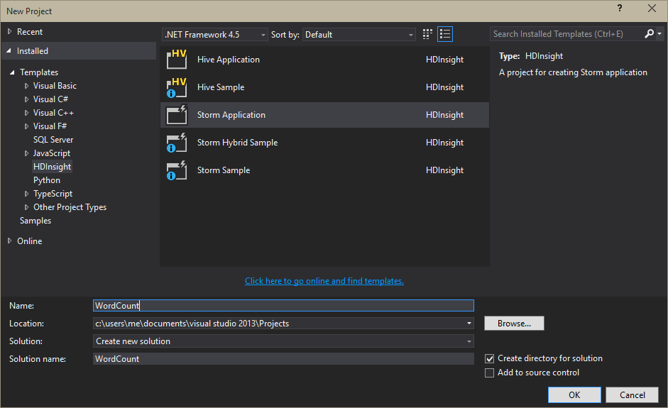
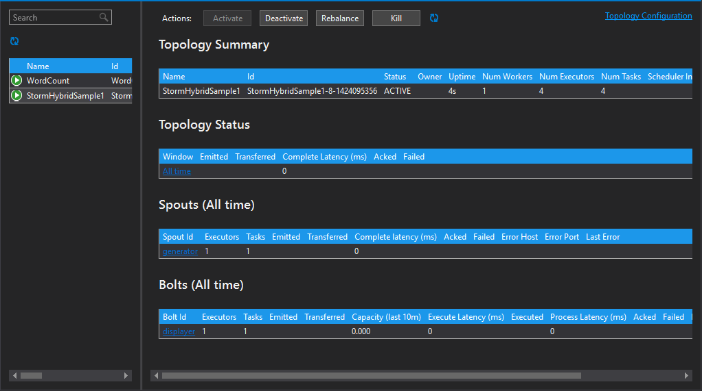

<properties
    pageTitle="Introduzione a eccesso Apache nella HDInsight | Microsoft Azure"
    description="Per un'introduzione alle eccesso Apache e informazioni su come utilizzare in HDInsight eccesso per creare soluzioni analitica dati in tempo reale nel cloud."
    services="hdinsight"
    documentationCenter=""
    authors="Blackmist"
    manager="jhubbard"
    editor="cgronlun"
    tags="azure-portal"/>

<tags
   ms.service="hdinsight"
   ms.devlang="na"
   ms.topic="get-started-article"
   ms.tgt_pltfrm="na"
   ms.workload="big-data"
   ms.date="10/11/2016"
   ms.author="larryfr"/>

#Introduzione a eccesso Apache in HDInsight: analitica in tempo reale per Hadoop

Eccesso Apache nella HDInsight consente di creare soluzioni analitica distribuito e in tempo reale nell'ambiente di Azure utilizzando [Apache Hadoop](http://hadoop.apache.org).

##Che cos'è il Apache?

Apache eccesso è un sistema di calcolo distribuito, tolleranza, Apri origine che consente di elaborare dati in tempo reale con Hadoop. Soluzioni eccesso anche possibile garantito elaborazione dei dati, la possibilità di riprodurre i dati non elaborati correttamente la prima volta.

##Perché utilizzare eccesso su HDInsight?

Eccesso Apache in HDInsight è integrato con l'ambiente di Azure gestito. Fornisce i seguenti vantaggi:

* Esegue come servizio gestito con un contratto di servizio del 99,9% di tempo

* Utilizzo della lingua di propria scelta: fornisce supporto per i componenti di eccesso scritti in **linguaggio** **c#**e **Python**

    * Supporta una combinazione di linguaggi di programmazione: leggere i dati utilizzando linguaggio, quindi elaborarlo C#
    
        > [AZURE.NOTE] C# topologie sono supportate solo nei cluster HDInsight basato su Windows.

    * Utilizzare l'interfaccia di linguaggio **Trident** per creare topologie eccesso che supportano "esattamente una volta" elaborazione di messaggi, persistenza archivio dati "transazione" e un set di operazioni analitica flusso comuni

* Include funzionalità scalabilità e verso il basso scala: ridimensionare un cluster di HDInsight senza alcun impatto sia in esecuzione topologie eccesso

* Integrazione con altri servizi di Azure, inclusi Hub di evento, virtuali Azure, Database SQL, archiviazione Blob e DocumentDB

    * Combinare le funzionalità di cluster HDInsight multipli utilizzando virtuali Azure: creare pipeline analitiche che utilizzano i cluster HDInsight, HBase o Hadoop

Per un elenco di aziende che usano il Apache per le soluzioni analitica in tempo reale, vedere [Società utilizzando Apache eccesso](https://storm.apache.org/documentation/Powered-By.html).

Per iniziare a usare eccesso, vedere [Guida introduttiva a eccesso su HDInsight][gettingstarted].

###Facilità di provisioning

È possibile eseguire il provisioning di un nuovo eccesso cluster HDInsight in minuti. Specificare il nome del cluster, le dimensioni, account di amministratore e account di archiviazione. Azure creerà cluster, tra cui topologie di esempio e un dashboard di gestione web.

> [AZURE.NOTE] È anche possibile eseguire il provisioning cluster eccesso tramite [CLI Azure](../xplat-cli-install.md) o [Azure PowerShell](../powershell-install-configure.md).

All'interno di 15 minuti di invio della richiesta, si verificherà un nuovo cluster eccesso in esecuzione e pipeline pronto per la prima analitica in tempo reale.

###Facilità d'uso

__Basati su Linux per eccesso sui cluster HDInsight__, è possibile connettersi a cluster utilizzando SSH e l'utilizzo di `storm` comando per avviare e gestire topologie. Inoltre, è possibile utilizzare Ambari per monitorare il servizio eccesso e l'interfaccia utente eccesso per monitorare e gestire topologie in esecuzione.

Per ulteriori informazioni sull'uso con i cluster basati su Linux eccesso, vedere [Guida introduttiva a eccesso Apache nella HDInsight basati su Linux](hdinsight-apache-storm-tutorial-get-started-linux.md).

__Basato su Windows per eccesso sui cluster HDInsight__, gli strumenti di HDInsight per Visual Studio consentono di creare c# e ibridi c# / topologie linguaggio e quindi inviarli all'eccesso cluster HDInsight.  

HDInsight Tools per Visual Studio offre un'interfaccia che consente di controllare e gestire topologie eccesso in un cluster.

Per un esempio dell'utilizzo di strumenti HDInsight per creare un'applicazione eccesso, vedere [topologie sviluppare c# eccesso con gli strumenti di HDInsight per Visual Studio](hdinsight-storm-develop-csharp-visual-studio-topology.md).

Per ulteriori informazioni sugli strumenti HDInsight per Visual Studio, vedere [iniziare a utilizzare gli strumenti di HDInsight per Visual Studio](../HDInsight/hdinsight-hadoop-visual-studio-tools-get-started.md).

Ogni eccesso cluster HDInsight vengono forniti anche un Dashboard eccesso basata sul web che consente di inviare, monitorare e gestire topologie eccesso eseguite nel cluster.

Per ulteriori informazioni sull'uso di Dashboard eccesso, vedere [Distribuisci e gestire topologie Apache eccesso su HDInsight](hdinsight-storm-deploy-monitor-topology.md).

Eccesso nel HDInsight vengono forniti anche integrazione con gli hub di evento Azure attraverso l' **Evento Hub Spout**. La versione più recente del componente è disponibile in [https://github.com/hdinsight/hdinsight-storm-examples/tree/master/lib/eventhubs](https://github.com/hdinsight/hdinsight-storm-examples/tree/master/lib/eventhubs). Per ulteriori informazioni sull'uso di questo componente, vedere i documenti seguenti.

* [Sviluppare una topologia c# che utilizza hub evento Azure](hdinsight-storm-develop-csharp-event-hub-topology.md)

* [Sviluppare una topologia di linguaggio che utilizza hub evento Azure](hdinsight-storm-develop-java-event-hub-topology.md)

###Affidabilità

Apache eccesso sempre garantisce che ogni messaggio in arrivo verrà completamente elaborato, anche quando l'analisi dei dati viene distribuito su centinaia di nodi.

Il **nodo Nimbus** fornisce una funzionalità simile a Hadoop JobTracker e assegna attività ad altri nodi cluster tramite **Zookeeper**. I nodi zookeeper coordinare per il cluster e semplificano le comunicazioni tra Nimbus e il processo di **Supervisore** nei nodi del lavoro. Se un nodo di elaborazione si blocca, il nodo Nimbus viene informato e assegna le attività e dati associati a un altro nodo.

La configurazione predefinita per eccesso Apache è necessario un solo nodo Nimbus. Eccesso nella HDInsight esegue due nodi Nimbus. Se il nodo principale non riesce, cluster HDInsight passerà al nodo secondario mentre viene ripristinato il nodo principale.

###Scala

Sebbene sia possibile specificare il numero dei nodi del cluster durante la creazione, è consigliabile aumentare o ridurre il cluster in modo che corrisponda carico di lavoro. Tutti i cluster HDInsight consentono di modificare il numero dei nodi del cluster, anche durante l'elaborazione dei dati.

> [AZURE.NOTE] Per usufruire di nuovi nodi aggiunti tramite il ridimensionamento, sarà necessario ribilanciare topologie avviate prima che è stata aumentare la dimensione cluster.

###Supporto tecnico

Eccesso in HDInsight viene fornito con il supporto di 24/7 completo a livello di organizzazione. Eccesso nella HDInsight dispone di un contratto di servizio del 99,9%. In questo modo che si garantisce che il cluster connettività esterna almeno 99,9% del tempo.

##Casi di utilizzo comuni per analitica in tempo reale

Di seguito sono illustrati alcuni scenari comuni per il quale è possibile utilizzare eccesso Apache su HDInsight. Per informazioni su scenari reali, leggere [come aziende che utilizzano eccesso](https://storm.apache.org/documentation/Powered-By.html).

* Internet aspetti (IoT)
* Rilevamento frodi
* Analitica social networking
* Estrarre, trasformare, caricamento (ETL)
* Il monitoraggio della rete
* Ricerca
* Impegno per dispositivi mobili

##La modalità di elaborazione dati in eccesso HDInsight?

Apache eccesso esegue **topologie** anziché i processi di MapReduce che potrebbero avere familiarità con HDInsight o Hadoop. Eccesso cluster HDInsight contiene due tipi di nodi: testa nodi che eseguono **Nimbus** e lavoro nodi che eseguono **Supervisore**.

* **Nimbus**: simile a JobTracker in Hadoop, è responsabile per la distribuzione di codice con i cluster, l'assegnazione di attività in macchine virtuali e il monitoraggio dell'errore. HDInsight fornisce due nodi Nimbus, in modo che nessun singolo punto di errore per eccesso in HDInsight

* **Supervisore**: Supervisore per ogni nodo di lavoro è responsabile per avviare e arrestare **processi di lavoro** sul nodo.

* **Processo di lavoro**: viene eseguito un sottoinsieme di una **topologia**. Una topologia in esecuzione è distribuita in numerosi processi di lavoro in tutto il cluster.

* **Topologia**: consente di definire un grafico di calcolo che elabora **flussi** di dati. Diversamente da quanto succede MapReduce processi, topologie eseguire finché non si interrompe.

* **Flusso**: un insieme di **Tuple**non associato. Flussi di prodotti da **spouts** e **bulloni**e vengono utilizzate da **bulloni**.

* **Tupla**: un elenco di valori digitati in modo dinamico denominato.

* **Spout**: fruisce dei dati da un'origine dati e genera uno o più **flussi**.

    > [AZURE.NOTE] In molti casi sono leggere i dati da una coda, ad esempio Kafka, code Bus di servizio Azure o hub evento. Coda garantisce che i dati vengono mantenuti nel caso di un'interruzione.

* **Bulloni**: elabora **flussi**, esegue elaborazione di **Tuple**e potrebbe generare **flussi**. Bulloni responsabile anche per la scrittura di dati a un'archiviazione esterna, ad esempio una coda, HDInsight, HBase, un blob o altro archivio di dati.

* **Apache Thrift**: una struttura di software per lo sviluppo di scalable servizio di più lingue. Consente di creare servizi che utilizzano C++, Java, Python, PHP, trascrizione, Erlang, Perl, Haskell, c#, cacao, JavaScript, Node, Smalltalk e altre lingue.

    * **Nimbus** è un servizio di Thrift e una **topologia** è una definizione di Thrift, pertanto è possibile sviluppare topologie con una vasta gamma di linguaggi di programmazione.

Per ulteriori informazioni sui componenti eccesso, vedere l' [esercitazione eccesso] [ apachetutorial] in apache.org.

##Quali lingue programmazione è possibile usare?

Eccesso cluster HDInsight fornisce supporto per c#, Java e Python.

### C & #35;

Gli strumenti di HDInsight per Visual Studio consentono agli sviluppatori di .NET progettare e implementare una topologia in c#. È anche possibile creare topologie ibrido che utilizzano componenti Java e c#.

Per ulteriori informazioni, vedere [c# sviluppare topologie per eccesso Apache su HDInsight utilizzando Visual Studio](hdinsight-storm-develop-csharp-visual-studio-topology.md).

###Java

Maggior parte degli esempi di linguaggio che si verificano sarà Java normale o Trident. Trident è un'astrazione di alto livello che rendono più semplice eseguire operazioni, ad esempio join, aggregazioni, raggruppamento e filtro. Tuttavia, Trident agisce batch di tuple, mentre in una soluzione di linguaggio non elaborata elabora una flusso di una tupla alla volta.

Per ulteriori informazioni su Trident, vedere l' [esercitazione Trident](https://storm.apache.org/documentation/Trident-tutorial.html) in apache.org.

Per alcuni esempi di linguaggio e Trident topologie, vedere l' [elenco di esempi di topologie eccesso](hdinsight-storm-example-topology.md) o esempi eccesso starter il cluster HDInsight.

Gli esempi eccesso starter si trovano nella directory __/usr/hdp/current/storm-client/contrib/storm-starter__ nei cluster basati su Linux e la directory **%storm_home%\contrib\storm-starter** nei cluster basati su Windows.

##Quali sono alcuni modelli di sviluppo comuni?

###Elaborazione dei messaggi garantito

Eccesso offrono diversi livelli di elaborazione dei messaggi garantito. Ad esempio, un'applicazione di eccesso base può garantire l'elaborazione di una volta al minimo e Trident può garantire esattamente-l'elaborazione di una sola volta.

Per ulteriori informazioni, vedere [garanzie sull'elaborazione di dati](https://storm.apache.org/about/guarantees-data-processing.html) in apache.org.

###IBasicBolt

Il modello di lettura di una tupla di input, la creazione di zero o più tuple e quindi acking tupla di input immediatamente alla fine del metodo execute è molto comune ed eccesso fornisce l'interfaccia [IBasicBolt](https://storm.apache.org/apidocs/backtype/storm/topology/IBasicBolt.html) per automatizzare questo modello.

###Linee di join

Partecipare a flussi di dati di due variano tra le applicazioni. Ad esempio possibile unire ogni tupla da più flussi in un nuovo flusso o è possibile aggiungere solo batch di tuple per una specifica finestra. In entrambi i casi, partecipare a risultato può essere ottenuto utilizzando [fieldsGrouping](http://javadox.com/org.apache.storm/storm-core/0.9.1-incubating/backtype/storm/topology/InputDeclarer.html#fieldsGrouping%28java.lang.String,%20backtype.storm.tuple.Fields%29), che consente di definire come tuple vengono instradate alle bulloni.

Nell'esempio seguente di linguaggio, fieldsGrouping viene utilizzato per instradare tuple provenienti dai componenti "1", "2" e "3" bulloni **MyJoiner** .

    builder.setBolt("join", new MyJoiner(), parallelism) .fieldsGrouping("1", new Fields("joinfield1", "joinfield2")) .fieldsGrouping("2", new Fields("joinfield1", "joinfield2")) .fieldsGrouping("3", new Fields("joinfield1", "joinfield2"));

###La divisione in batch

Il batch può essere eseguito diversi modi. Con una topologia il linguaggio di base, si potrebbe usare contatore semplice al numero di batch X di tuple prima di emissione loro, oppure un meccanismo interno dell'intervallo noto come "graduazione tupla" per creare un batch di ogni X secondi.

Per un esempio di utilizzo dei segni di graduazione tuple, vedere [analisi dei dati sensore con eccesso e HBase su HDInsight](hdinsight-storm-sensor-data-analysis.md).

Se si utilizza Trident, si basa sull'elaborazione batch di tuple.

###La memorizzazione nella cache

Memorizzazione nella cache in memoria viene spesso usato come meccanismo per velocizzare l'elaborazione perché tiene spesso usato risorse in memoria. Poiché in una topologia è distribuita più nodi e più processi all'interno di ogni nodo, è consigliabile usare [fieldsGrouping](http://javadox.com/org.apache.storm/storm-core/0.9.1-incubating/backtype/storm/topology/InputDeclarer.html#fieldsGrouping%28java.lang.String,%20backtype.storm.tuple.Fields%29) per garantire che tuple contenente i campi che vengono utilizzati per la ricerca nella cache vengono sempre inviate lo stesso processo. Consente di evitare la duplicazione voci della cache tra processi.

###Streaming primi N

Quando la topologia dipende dal calcolo di un valore di "primi N", ad esempio le prime 5 tendenze su Twitter, è necessario calcolare il valore primi N in parallelo e quindi di unire l'output di questi calcoli in un valore globale. Ciò è possibile utilizzando [fieldsGrouping](http://javadox.com/org.apache.storm/storm-core/0.9.1-incubating/backtype/storm/topology/InputDeclarer.html#fieldsGrouping%28java.lang.String,%20backtype.storm.tuple.Fields%29) route campo bulloni in parallelo (che suddivide i dati dal valore campo) e quindi traceroute a un bulloni che globalmente determinano il valore primi N.

Per un esempio, vedere l'esempio [RollingTopWords](https://github.com/nathanmarz/storm-starter/blob/master/src/jvm/storm/starter/RollingTopWords.java) .

##Quali tipi di registrazione Storm usare?

Eccesso utilizza Apache Log4j per registrare le informazioni. Per impostazione predefinita, una grande quantità di dati è stato effettuato l'accesso e può essere difficile da gestire le informazioni. È possibile includere un file di configurazione di registrazione come parte della topologia di eccesso al controllo funzionamento della registrazione.

Per una topologia di esempio che illustra come configurare la registrazione, vedere esempio [WordCount basato su Java](hdinsight-storm-develop-java-topology.md) per eccesso in HDInsight.

##Passaggi successivi

Ulteriori informazioni sulle soluzioni analitica in tempo reale con eccesso Apache in HDInsight:

* [Guida introduttiva a eccesso su HDInsight][gettingstarted]

* [Esempi di topologie per eccesso in HDInsight](hdinsight-storm-example-topology.md)

[stormtrident]: https://storm.apache.org/documentation/Trident-API-Overview.html
[samoa]: http://yahooeng.tumblr.com/post/65453012905/introducing-samoa-an-open-source-platform-for-mining
[apachetutorial]: https://storm.apache.org/documentation/Tutorial.html
[gettingstarted]: hdinsight-apache-storm-tutorial-get-started-linux.md
