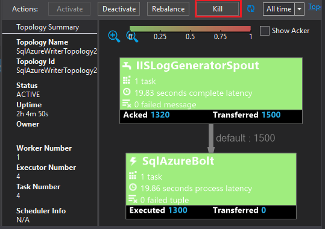

<properties
 pageTitle="Utilizzare Apache eccesso con Power BI | Microsoft Azure"
 description="Creare un report di Power BI tramite dati da una topologia c# in esecuzione in un cluster di Apache eccesso nel HDInsight."
 services="hdinsight"
 documentationCenter=""
 authors="Blackmist"
 manager="jhubbard"
 editor="cgronlun"
    tags="azure-portal"/>

<tags
 ms.service="hdinsight"
 ms.devlang="dotnet"
 ms.topic="article"
 ms.tgt_pltfrm="na"
 ms.workload="big-data"
 ms.date="10/27/2016"
 ms.author="larryfr"/>

# Usare Power BI per visualizzare i dati da una topologia Apache eccesso

Power BI consente di visualizzare visivamente i dati come report. Utilizzare i modelli di Visual Studio per eccesso in HDInsight, è possibile utilizzare facilmente archiviare i dati da una topologia in esecuzione su un eccesso Apache cluster HDInsight in SQL Azure e quindi visualizzare i dati con Power BI.

In questo documento si imparerà a usare Power BI per creare un report dai dati generati da una topologia eccesso Apache e archiviati nel Database di SQL Azure.

> [AZURE.NOTE] Durante la procedura descritta in questo documento si basa su un ambiente di sviluppo di Windows con Visual Studio, è possibile inviare il progetto compilato cluster HDInsight basato su Windows o Linux. Solo i cluster basati su Linux creati dopo il supporto di 28/10/2016 topologie SCP.NET.
>
> Per utilizzare una topologia c# con un cluster basato su Linux, è necessario aggiornare il pacchetto Microsoft.SCP.Net.SDK NuGet usato dal progetto alla versione 0.10.0.6 o versione successiva. La versione del pacchetto deve corrispondere anche la versione principale di eccesso installato HDInsight. Ad esempio eccesso nelle versioni HDInsight 3.3 e 3.4 utilizzare eccesso versione 0.10.x, mentre HDInsight 3.5 utilizza eccesso 1.0.
> 
> C# topologie nei cluster basati su Linux devono usare .NET 4.5 e usare Mono da eseguire in cluster HDInsight. Maggior parte delle caratteristiche funzionano, tuttavia è necessario archiviare il documento [Mono compatibilità](http://www.mono-project.com/docs/about-mono/compatibility/) per le possibili incompatibilità.
>
> Per una versione di linguaggio del progetto, che funziona anche in un cluster basato su Windows o Linux, vedere [elaborare eventi da Azure evento hub con eccesso su HDInsight (Java)](hdinsight-storm-develop-java-event-hub-topology.md).

## Prerequisiti

- Un abbonamento Azure. Vedere [ottenere Azure versione di valutazione gratuita](https://azure.microsoft.com/documentation/videos/get-azure-free-trial-for-testing-hadoop-in-hdinsight/).

* Un utente di Azure Active Directory con accesso [Power BI](https://powerbi.com)

* Visual Studio (uno dei seguenti versioni)

    * Visual Studio 2012 con [aggiornamento 4](http://www.microsoft.com/download/details.aspx?id=39305)

    * Visual Studio 2013 con [aggiornamento 4](http://www.microsoft.com/download/details.aspx?id=44921) o [Visual Studio 2013 Community](http://go.microsoft.com/fwlink/?linkid=517284&clcid=0x409)

    * [Visual Studio 2015](https://www.visualstudio.com/downloads/download-visual-studio-vs.aspx)

* Gli strumenti di HDInsight per Visual Studio: per informazioni sulle informazioni di installazione, vedere [iniziare a utilizzare gli strumenti di HDInsight per Visual Studio](../HDInsight/hdinsight-hadoop-visual-studio-tools-get-started.md) .

## Come funziona

In questo esempio contiene una topologia c# eccesso che genera casuale dati del Registro di Internet Information Services (IIS). Questi dati quindi è scritto in un Database SQL e da tale posizione viene utilizzato per generare i report di Power BI.

Di seguito è un elenco di file che implementare la funzionalità principale dell'esempio.

* **SqlAzureBolt.cs**: scrive informazioni prodotte nella topologia di eccesso al Database SQL.

* **IISLogsTable.sql**: istruzioni di Transact-SQL utilizzate per generare il database che i dati vengono archiviati in.

> [AZURE.WARNING] È necessario creare la tabella nel Database di SQL prima di iniziare la topologia il cluster HDInsight.

## Scaricare l'esempio

Scaricare l' [esempio HDInsight c# eccesso Power BI](https://github.com/Azure-Samples/hdinsight-dotnet-storm-powerbi). Per scaricarlo, divisione/duplicato mediante [fra](http://git-scm.com/)o utilizzare il collegamento **Download** per scaricare un file zip dell'archivio.

## Creare un database

1. Utilizzare la procedura descritta nel documento [esercitazione con Database di SQL](../sql-database/sql-database-get-started.md) per creare un nuovo Database SQL.

2. Connetti a database eseguendo la procedura descritta nel documento di [connettersi a un Database SQL con Visual Studio](../sql-database/sql-database-connect-query.md) per connettersi al database.

4. Creare una __Nuova Query__fare clic con il pulsante destro sul database in Esplora oggetti. Incollare il contenuto del file __IISLogsTable.sql__ incluso nel progetto scaricato nella finestra di query e quindi usare Ctrl + MAIUSC + E per eseguire la query. Verrà visualizzato un messaggio che i comandi è stato completato correttamente.

    Una volta completata l'attivazione, si verificherà una nuova tabella denominata __IISLOGS__ nel database.

## Configurare il campione

1. Selezionare il database SQL [Azure portale](https://portal.azure.com). Dalla sezione __Nozioni di base__ della stessa e database SQL, selezionare __Mostra le stringhe di connessione di database__. Nell'elenco visualizzato, copiare le informazioni di __ADO.NET (autenticazione di SQL Server)__ .

1. Aprire l'esempio in Visual Studio. Da **Esplora soluzioni**, aprire il file **App** e quindi individuare la voce seguente:

        <add key="SqlAzureConnectionString" value="##TOBEFILLED##" />
    
    Sostituire il valore __TOBEFILLED # # # #__ con la stringa di connessione di database copiata nel passaggio precedente. Sostituire __{il\_username}__ e __{il\_password}__ con il nome utente e la password del database.

2. Salvare e chiudere i file.

## Distribuire il campione

1. Da **Esplora soluzioni**fare clic sul progetto **StormToSQL** e selezionare **Invia per eccesso in HDInsight**. Selezionare il cluster HDInsight dalla finestra di dialogo elenco a discesa **Il Cluster** .

    > [AZURE.NOTE] Possono richiedere alcuni secondi per l'elenco a discesa **Il Cluster** per popolare con i nomi dei server.
    >
    > Se richiesto, immettere le credenziali di accesso per l'abbonamento Azure. Se si dispone di più di una sottoscrizione, accedere a quella che contiene l'eccesso cluster HDInsight.

2. Quando la topologia è stata inviata, dovrebbero essere visualizzate topologie eccesso per il cluster. Selezionare la voce SqlAzureWriterTopology dall'elenco per visualizzare informazioni sulla topologia di esecuzione.

    

    È possibile utilizzare questa visualizzazione per visualizzare informazioni sulla topologia di oppure fare doppio clic sulle voci (ad esempio SqlAzureBolt) per visualizzare informazioni specifiche di un componente della topologia.

3. Dopo che la topologia è eseguita per alcuni minuti, tornare alla finestra della query SQL utilizzata per creare il database. Sostituire le istruzioni esistenti con le operazioni seguenti.

        select * from iislogs;
    
    Usa Ctrl + MAIUSC + E per eseguire la query e si riceveranno risultati simili al seguente.
    
        1   2016-05-27 17:57:14.797 255.255.255.255 /bar    GET 200
        2   2016-05-27 17:57:14.843 127.0.0.1   /spam/eggs  POST    500
        3   2016-05-27 17:57:14.850 123.123.123.123 /eggs   DELETE  200
        4   2016-05-27 17:57:14.853 127.0.0.1   /foo    POST    404
        5   2016-05-27 17:57:14.853 10.9.8.7    /bar    GET 200
        6   2016-05-27 17:57:14.857 192.168.1.1 /spam   DELETE  200

    Si tratta di dati che sono stato scritto da topologia eccesso.

## Creare un report

1. La connessione al [Database SQL Azure connettore](https://app.powerbi.com/getdata/bigdata/azure-sql-database-with-live-connect) Power BI.

2. All'interno di __database__, selezionare __Ottieni__.

3. Selezionare __Il Database di SQL Azure__e quindi scegliere __Connetti__.

4. Immettere le informazioni per la connessione al Database SQL Azure. È possibile trovare ciò che visitano il [portale di Azure](https://portal.azure.com) e selezionando il database SQL.

    > [AZURE.NOTE] Utilizzando __Abilitare opzioni avanzate__ nella finestra di dialogo connessione, è possibile impostare l'intervallo di aggiornamento e filtri personalizzati.

5. Dopo aver collegato, verrà visualizzato un nuovo set di dati con lo stesso nome del database a che connesso. Selezionare il set di dati per iniziare la progettazione di un report.

3. __Campi__, espandere la voce __IISLOGS__ . Selezionare la casella di controllo per __URISTEM__. Verrà creato un nuovo report in cui sono elencati i temi URI (/ foo, / barra così via) eseguito l'accesso al database.

    

5. Successivamente, trascinare __metodo__ al report. Il report verrà aggiornata per elencare i temi e il corrispondente metodo HTTP utilizzato per la richiesta HTTP.

    

4. Dalla colonna __visualizzazioni__ , selezionare l'icona di __campi__ e quindi selezionare la freccia in giù accanto al __metodo__ nell'area __valori__ . Nell'elenco visualizzato, selezionare __conteggio__. Verrà modificato il report per visualizzare un elenco di un conteggio del numero di volte in cui si è avuto un URI specifico.

    

6. Selezionare il __grafico a colonne in pila__ per modificare la modalità di visualizzazione di informazioni.

    

7. Dopo avere inserito il report come si desidera, utilizzare la voce __Salva__ dal menu per immettere un nome e salvare il report.

## Interrompere la topologia

La topologia continuerà a eseguire fino a quando non si interrompe la registrazione o Elimina eccesso cluster HDInsight. Per interrompere la topologia, procedere come segue.

1. In Visual Studio, tornare alla visualizzazione topologia e selezionare la topologia.

2. Selezionare il pulsante di **interruzione** per interrompere la topologia.

    

## Eliminare il cluster

[AZURE.INCLUDE [delete-cluster-warning](../../includes/hdinsight-delete-cluster-warning.md)]

## Passaggi successivi

In questo documento è stato descritto come inviare i dati da una topologia eccesso al Database SQL, quindi visualizzare i dati con Power BI. Per informazioni su come lavorare con altre tecnologie di Azure in eccesso HDInsight, vedere le operazioni seguenti:

* [Esempi di topologie per eccesso in HDInsight](hdinsight-storm-example-topology.md)
