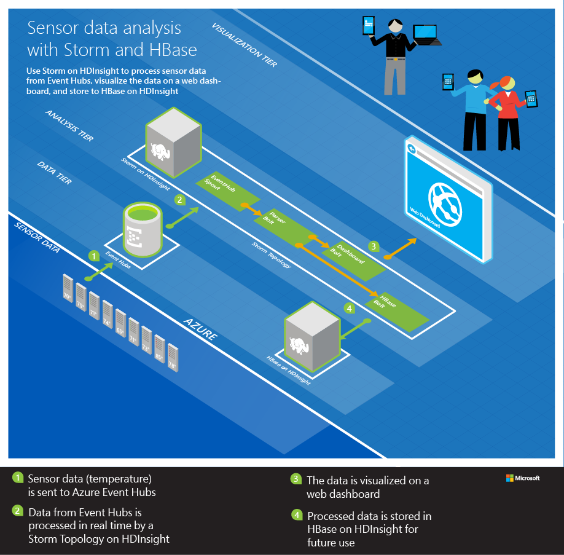
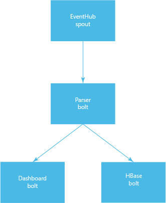
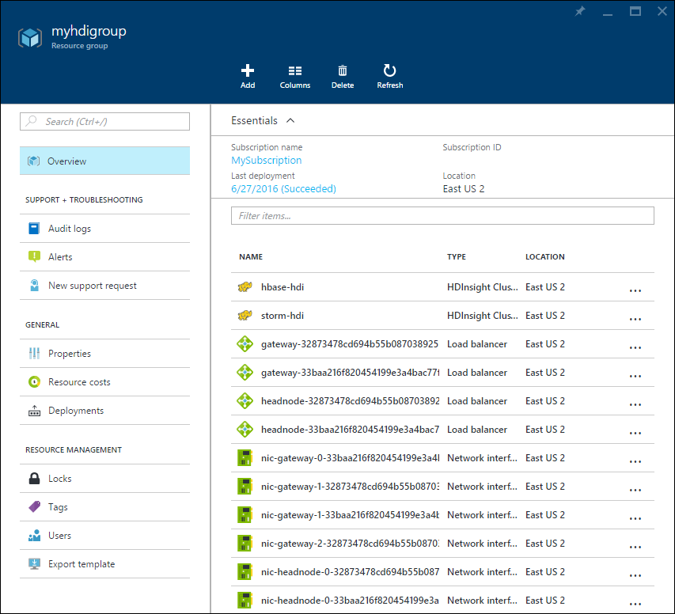

<properties
   pageTitle="Analizzare i dati sensore con eccesso Apache e HBase | Microsoft Azure"
   description="Informazioni su come connettersi a Apache eccesso con una rete virtuale. Usare eccesso con HBase per elaborare sensore i dati da un hub di eventi e visualizzare con D3.js."
   services="hdinsight"
   documentationCenter=""
   authors="Blackmist"
   manager="jhubbard"
   editor="cgronlun"/>

<tags
   ms.service="hdinsight"
   ms.devlang="java"
   ms.topic="article"
   ms.tgt_pltfrm="na"
   ms.workload="big-data"
   ms.date="09/20/2016"
   ms.author="larryfr"/>

# Analizzare i dati sensore con eccesso Apache, Hub di eventi e HBase in HDInsight (Hadoop) 

Informazioni su come utilizzare il Apache in HDInsight per elaborare i dati sensore dall'Hub evento Azure, archiviarlo in Apache HBase su HDInsight e visualizzare utilizzando D3.js in esecuzione come un'App Web di Azure.

Il modello di gestione di risorse Azure utilizzato in questo documento viene illustrato come creare più Azure risorse in un gruppo di risorse. In particolare, crea una rete virtuale Azure, due cluster HDInsight (eccesso e HBase) e un'App Web di Azure. Un'implementazione Node di un dashboard in tempo reale web viene distribuita automaticamente in web app.

> [AZURE.NOTE] Le informazioni contenute in questo documento e l'esempio fornito, sono stati testati con basati su Linux HDInsight 3.3 e 3.4 cluster versioni.

## Prerequisiti

* Un abbonamento Azure. Vedere [ottenere Azure versione di valutazione gratuita](http://azure.microsoft.com/documentation/videos/get-azure-free-trial-for-testing-hadoop-in-hdinsight/).

    > [AZURE.IMPORTANT] Non è necessario un cluster HDInsight esistente; la procedura descritta in questo documento creerà le risorse seguenti:
    >
    > * Una rete virtuale Azure
    > * Eccesso cluster HDInsight (basate su Linux 2 nodi di lavoro)
    > * Un HBase cluster HDInsight (basate su Linux 2 nodi di lavoro)
    > * Un'App Web di Azure che ospita i dashboard web

* [Node](http://nodejs.org/): viene utilizzato per visualizzare in anteprima dashboard web in locale in un ambiente di sviluppo.

* [Linguaggio e 1.7 JDK](http://www.oracle.com/technetwork/java/javase/downloads/index.html): utilizzato per sviluppare la topologia eccesso.

* [Maven](http://maven.apache.org/what-is-maven.html): utilizzata per creare e compilare il progetto.

* [Fra](http://git-scm.com/): utilizzato per il download del progetto da GitHub.

* Un client __SSH__ : usati per connettersi a cluster basati su Linux HDInsight. Per ulteriori informazioni sull'utilizzo di SSH con HDInsight, vedere i documenti seguenti.

    * [Usare SSH con HDInsight da un client di Windows](hdinsight-hadoop-linux-use-ssh-windows.md)

    * [Usare SSH con HDInsight da un client Linux, Unix o Mac](hdinsight-hadoop-linux-use-ssh-unix.md)

    > [AZURE.NOTE] È inoltre l'accesso per la `scp` comando, che consente di copiare i file tra l'ambiente di sviluppo locale e il cluster HDInsight utilizzando SSH.

## Architettura

In questo esempio è costituito da componenti seguenti:

* **Azure evento hub**: contiene i dati raccolti dai sensori. In questo esempio, un'applicazione viene fornita che genera i dati.

* **Eccesso su HDInsight**: consente di elaborazione in tempo reale di dati dall'Hub evento.

* **HBase in HDInsight**: fornisce un archivio di dati NoSQL persistente per i dati dopo che è stata elaborata per eccesso.

* **Servizio di rete virtuale Azure**: consente la comunicazione sicura tra eccesso su HDInsight e HBase sui cluster HDInsight.

    > [AZURE.NOTE] Una rete virtuale è necessaria per utilizzare l'API del client di linguaggio HBase, mentre non viene esposto su gateway pubblico per cluster HBase. L'installazione di cluster HBase ed eccesso alla stessa rete virtuale consente cluster eccesso o altri sistemi in rete virtuale accedere direttamente alla HBase mediante API del client.

* **Sito Web del dashboard**: un dashboard di esempio che illustra i dati in tempo reale.

    * Il sito Web è implementato in Node, in modo che possa essere eseguita dal sistema operativo client per il testing o può essere distribuito ai siti Web di Azure.

    * [Socket.IO](http://socket.io/) viene utilizzato per la comunicazione in tempo reale tra la topologia eccesso e il sito Web.

        > [AZURE.NOTE] Questo è un dettaglio di implementazione. È possibile utilizzare qualsiasi framework delle comunicazioni, ad esempio WebSockets non elaborato o SignalR.

    * [D3.js](http://d3js.org/) viene utilizzato per creare un grafico dati che viene inviati al sito Web.

> [AZURE.IMPORTANT] Due cluster sono obbligatorie, poiché non è supportato alcun metodo per creare un cluster di HDInsight per eccesso e HBase.

La topologia di legge i dati da Hub di evento utilizzando la classe [org.apache.storm.eventhubs.spout.EventHubSpout](http://storm.apache.org/releases/0.10.1/javadocs/org/apache/storm/eventhubs/spout/class-use/EventHubSpout.html) e inserisce dati HBase utilizzando la classe [org.apache.storm.hbase.bolt.HBaseBolt](https://storm.apache.org/javadoc/apidocs/org/apache/storm/hbase/bolt/class-use/HBaseBolt.html) . La comunicazione con il sito Web utilizzando [socket.io client.java](https://github.com/nkzawa/socket.io-client.java).

Di seguito è un diagramma della topologia.

> [AZURE.NOTE] Si tratta di una versione molto semplificata della topologia. In fase di esecuzione, viene creata un'istanza di ogni componente per ogni partizione per l'Hub di eventi che si sta leggendo. Queste istanze vengono distribuite tra i nodi del cluster e dati vengano instradati tra di esse come indicato di seguito:
>
> * Dati da beccuccio al parser sono il bilanciamento del carico.
> * I dati dal parser il Dashboard e HBase sono raggruppati per ID dispositivo, in modo che i messaggi dalla stessa periferica flusso sempre allo stesso componente.

### Componenti della topologia

* **EventHub beccuccio**: beccuccio viene fornito come parte della versione eccesso Apache 0.10.0 e versioni successive.

    > [AZURE.NOTE] Beccuccio hub evento utilizzato in questo esempio richiede un eccesso nella versione cluster HDInsight 3.3 o 3.4. Per informazioni su come utilizzare evento hub con una versione precedente di eccesso su HDInsight, vedere [elaborare eventi da Azure evento hub con eccesso su HDInsight](hdinsight-storm-develop-java-event-hub-topology.md).

* **ParserBolt.java**: I dati emesso dal beccuccio sono JSON non elaborati e talvolta più di un evento viene generato alla volta. La può essere viene illustrato come leggere i dati emessi dal beccuccio ed esportarli in un nuovo flusso come una tupla che contiene più campi.

* **DashboardBolt.java**: seguente viene illustrato come utilizzare la libreria di client Socket.io per Java per inviare dati in tempo reale al dashboard di web.

Questo esempio viene usata framework [luminoso](https://storm.apache.org/releases/0.10.0/flux.html) in modo che la definizione della topologia è contenuta nei file YAML. Vi sono due:

* __Nessun hbase.yaml__ - usare questo file durante la verifica della topologia nel proprio ambiente di sviluppo. Non utilizza componenti HBase, poiché non è possibile accedere l'API di linguaggio HBase da all'esterno della rete virtuale in cui si trova il cluster.

* __con hbase.yaml__ - usare questo file quando si distribuisce la topologia al cluster eccesso. Utilizza componenti HBase poiché viene eseguito nella stessa rete virtuale cluster HBase.

## Preparare l'ambiente

Prima di utilizzare questo esempio, è necessario creare un Hub di evento Azure, la topologia eccesso letta.

### Configurare Hub di evento

Evento Hub è l'origine dati per questo esempio. Utilizzare la procedura seguente per creare un nuovo evento Hub.

1. Dal [portale di Azure](https://portal.azure.com), selezionare **+ Nuovo** -> __Internet di elementi__ -> __Hub evento__.

2. Nella e __Namespace creare__ , eseguire le operazioni seguenti:

    1. Immettere un __nome__ per lo spazio dei nomi.
    2. Selezionare un livello prezzo. __Base__ è sufficiente per questo esempio.
    3. Selezionare __l'abbonamento__ di Azure da utilizzare.
    4. Selezionare un gruppo di risorse esistente o crearne uno nuovo.
    5. Selezionare il __percorso__ per l'Hub di evento.
    6. Selezionare __Aggiungi a dashboard__e quindi fare clic su __Crea__.

3. Dopo avere completato il processo di creazione, viene visualizzato e l'evento hub dello spazio dei nomi. Da qui, selezionare __Aggiungi evento Hub +__. Nella e __Creare Hub evento__ , immettere un nome di __sensordata__ e quindi selezionare __Crea__. Lasciare gli altri campi i valori predefiniti.

4. Pala evento hub dello spazio dei nomi, selezionare __Gli hub di evento__. Selezionare la voce __sensordata__ .

5. Blade per sensordata Hub di evento, selezionare __i criteri di accesso condivisi__. Utilizzare il collegamento __Aggiungi +__ per aggiungere i criteri seguenti:

  	| Nome del criterio | Sulle attestazioni |
  	| ----- | ----- |
  	| dispositivi | Invia |
  	| eccesso | Ascolto |

5. Selezionare entrambi i criteri e prendere nota del valore della __Chiave primaria__ . È necessario il valore per entrambi i criteri in passaggi futuri.

## Scaricare e configurare il progetto

Utilizzare le operazioni seguenti per scaricare il progetto da GitHub.

    git clone https://github.com/Blackmist/hdinsight-eventhub-example

Al termine dell'esecuzione del comando, si avrà la struttura di directory seguente:

    hdinsight-eventhub-example/
        TemperatureMonitor/ - this contains the topology
            resources/
                log4j2.xml - set logging to minimal
                no-hbase.yaml - topology definition for local testing
                with-hbase.yaml - topology definition that uses HBase in a virutal network
            src/ - the Java bolts
            dev.properties - contains configuration values for your environment
        dashboard/nodejs/ - this is the node.js web dashboard
        SendEvents/ - utilities to send fake sensor data

> [AZURE.NOTE] In questo documento non va a tutti i dettagli del codice inclusi in questo esempio. Tuttavia, il codice completamente commenti.

Aprire il file **hdinsight-eventhub-example/TemperatureMonitor/dev.properties** e aggiungere le informazioni di evento Hub per le righe seguenti:

    eventhub.read.policy.name: storm
    eventhub.read.policy.key: KeyForTheStormPolicy
    eventhub.namespace: YourNamespace
    eventhub.name: sensordata

> [AZURE.NOTE] In questo esempio si presuppone utilizzato __eccesso__ come il nome del criterio contenente una richiesta di rimborso __ascoltare__ e che l'Hub di evento è denominato __sensordata__.

 Salvare il file dopo avere aggiunto queste informazioni.

## Compilare e provare localmente

Prima del test, è necessario avviare il dashboard per visualizzare l'output della topologia e generare i dati da archiviare nell'Hub evento.

> [AZURE.IMPORTANT] Il componente HBase di questa topologia non è attivo quando si verifica locale, come l'API di linguaggio per il cluster HBase non sono accessibili da all'esterno della rete virtuale Azure che contiene i cluster.

### Avviare l'applicazione web

1. Aprire un prompt dei comandi di nuovo o terminale e passare a **hdinsight-eventhub-/ dashboard di esempio**e quindi utilizzare il comando seguente per installare le dipendenze necessarie per l'applicazione web:

        npm install

2. Usare il comando seguente per avviare l'applicazione web:

        node server.js

    Viene visualizzato un messaggio simile al seguente:

        Server listening at port 3000

2. Aprire un web browser e immettere **http://localhost:3000 /** come indirizzo. Verrà visualizzata una pagina simile al seguente:

    

    Lasciare aperto il prompt dei comandi o terminal. Dopo aver provato, usare Ctrl + C per interrompere il server web.

### Avviare la generazione di dati

> [AZURE.NOTE] La procedura descritta in questa sezione utilizza Node in modo che può essere usate su qualsiasi piattaforma. Per altri esempi di lingua, vedere la directory **SendEvents** .

1. Aprire un prompt dei comandi di nuovo, shell o terminale e passare alla **hdinsight-eventhub-esempio/SendEvents/nodejs**, quindi utilizzare il comando seguente per installare le dipendenze necessarie per l'applicazione:

        npm install

2. Aprire il file **app.js** in un editor di testo e aggiungere le informazioni di evento Hub ottenuto in precedenza:

        // ServiceBus Namespace
        var namespace = 'YourNamespace';
        // Event Hub Name
        var hubname ='sensordata';
        // Shared access Policy name and key (from Event Hub configuration)
        var my_key_name = 'devices';
        var my_key = 'YourKey';
    
    > [AZURE.NOTE] In questo esempio si presuppone che è stato utilizzato __sensordata__ come nome dei __dispositivi__ e Hub di evento, come il nome del criterio contenente una richiesta di __INVIO__ .

2. Utilizzare il comando seguente per inserire nuove voci nell'Hub evento:

        node app.js

    Verrà visualizzato diverse righe di output che contengono i dati inviati all'evento Hub. Queste ultime verranno visualizzate simile al seguente:

        {"TimeStamp":"2015-02-10T14:43.05.00320Z","DeviceId":"0","Temperature":7}
        {"TimeStamp":"2015-02-10T14:43.05.00320Z","DeviceId":"1","Temperature":39}
        {"TimeStamp":"2015-02-10T14:43.05.00320Z","DeviceId":"2","Temperature":86}
        {"TimeStamp":"2015-02-10T14:43.05.00320Z","DeviceId":"3","Temperature":29}
        {"TimeStamp":"2015-02-10T14:43.05.00320Z","DeviceId":"4","Temperature":30}
        {"TimeStamp":"2015-02-10T14:43.05.00320Z","DeviceId":"5","Temperature":5}
        {"TimeStamp":"2015-02-10T14:43.05.00320Z","DeviceId":"6","Temperature":24}
        {"TimeStamp":"2015-02-10T14:43.05.00320Z","DeviceId":"7","Temperature":40}
        {"TimeStamp":"2015-02-10T14:43.05.00320Z","DeviceId":"8","Temperature":43}
        {"TimeStamp":"2015-02-10T14:43.05.00320Z","DeviceId":"9","Temperature":84}

### Avviare la topologia

2. Aprire un nuovo prompt, shell o terminale e modificare elenchi di __Esempio di eventhub hdinsight/TemperatureMonitor__e quindi utilizzare il comando seguente per avviare la topologia:

        mvn compile exec:java -Dexec.args="--local -R /no-hbase.yaml --filter dev.properties"
    
    Se si utilizza PowerShell, utilizzare invece le operazioni seguenti:

        mvn compile exec:java "-Dexec.args=--local -R /no-hbase.yaml --filter dev.properties"

    > [AZURE.NOTE] Se si sono in un sistema Linux/Unix/OS X e che sia [installato eccesso nel proprio ambiente di sviluppo](http://storm.apache.org/releases/0.10.0/Setting-up-development-environment.html), è possibile utilizzare invece i comandi seguenti:
    >
    > `mvn compile package`
    > `storm jar target/WordCount-1.0-SNAPSHOT.jar org.apache.storm.flux.Flux --local -R /no-hbase.yaml`

    Verrà avviata la topologia definita nel file __n hbase.yaml__ in modalità locale. I valori contenuti nel file __dev.properties__ forniscano le informazioni di connessione per hub evento. Una volta avviato, la topologia di legge voci dall'Hub di eventi e li invia al dashboard in esecuzione nel computer locale. Verranno visualizzate righe vengono visualizzati nel dashboard web, simile al seguente:

    

3. Mentre è in esecuzione nel dashboard, utilizzare la `node app.js` comando nei passaggi precedenti per inviare nuovi dati a un hub di evento. Perché i valori di temperatura vengono generati in modo casuale, è necessario aggiornare il grafico per visualizzare le modifiche di grandi dimensioni in temperatura.

    > [AZURE.NOTE] È necessario essere nella directory __Hdinsight-eventhub-esempio/SendEvents/Nodejs__ quando si usa il `node app.js` comando.

3. Dopo aver verificato che questo metodo funziona, interrompere la topologia premere Ctrl + c. È possibile usare Ctrl + C per interrompere il server web locale anche.

## Creare un cluster eccesso e HBase

Per eseguire la topologia su HDInsight e abilitare bulloni HBase, è necessario creare un nuovo cluster eccesso e cluster HBase. La procedura descritta in questa sezione utilizza un [modello di gestione risorse di Azure](../resource-group-template-deploy.md) per creare un nuovo cluster virtuali Azure ed eccesso e HBase sulla rete virtuale. Il modello anche creata un'App Web di Azure e lo distribuisce una copia del dashboard al suo interno.

> [AZURE.NOTE] Una rete virtuale viene utilizzata in modo che la topologia in esecuzione su cluster eccesso può comunicare direttamente con il cluster HBase tramite l'API di linguaggio HBase.

Il modello di Manager delle risorse utilizzato in questo documento si trova in un contenitore di blob pubblica in __https://hditutorialdata.blob.core.windows.net/armtemplates/create-linux-based-hbase-storm-cluster-in-vnet.json__.

1. Fare clic sul pulsante seguente per accedere a Azure e aprire il modello di gestione risorse nel portale di Azure.

    

2. Da e il **parametri** immettere quanto segue:

    
    
    * **BASECLUSTERNAME**: questo valore verrà utilizzato come nome di base per l'eccesso e HBase cluster. Ad esempio l'immissione di __hdi__ creerà un cluster di eccesso denominato __eccesso hdi__ e un cluster di HBase denominato __hbase hdi__.
    * __CLUSTERLOGINUSERNAME__: il nome utente di amministratore per i cluster eccesso e HBase.
    * __CLUSTERLOGINPASSWORD__: la password di amministratore per i cluster eccesso e HBase.
    * __SSHUSERNAME__: il SSH utente di creare per i cluster eccesso e HBase.
    * __SSHPASSWORD__: la password per l'utente SSH per i cluster eccesso e HBase.
    * __Posizione__: l'area creata in cluster.
    
    Fare clic su __OK__ per salvare i parametri.
    
3. Usare la sezione __gruppo di risorse__ per creare un nuovo gruppo di risorse o selezionarne uno esistente.

4. Nel menu a discesa __percorso gruppo di risorse__ , selezionare nella stessa posizione come selezionati per il parametro di __posizione__ .

5. Selezionare __note legali__e quindi selezionare __Crea__.

6. Infine, selezionare __Aggiungi a dashboard__ , quindi scegliere __Crea__. Sarà necessaria circa 20 minuti per creare i cluster.

Dopo avere create le risorse, si verrà reindirizzati alla blade per il gruppo di risorse che contiene i cluster e del dashboard web.

> [AZURE.IMPORTANT] Si noti che i nomi dei cluster HDInsight siano __Eccesso base__ e __Hbase base__, in cui il nome specificato per il modello di base. Utilizzare i nomi seguenti nei passaggi successivi quando ci si connette ai cluster. Si noti inoltre che il nome del sito dashboard __dashboard di base__. Utilizzare questa operazione in un secondo momento quando si visualizza il dashboard.

## Configurare bulloni Dashboard

Per inviare dati al dashboard distribuiti come un'app web, è necessario modificare la riga seguente nel file __dev.properties__ :

    dashboard.uri: http://localhost:3000

Modifica `http://localhost:3000` a `http://BASENAME-dashboard.azurewebsites.net` e salvare il file. Sostituire __base__ con il nome di base che è specificato nel passaggio precedente. È anche possibile usare il gruppo di risorse creato in precedenza per selezionare il dashboard e visualizzare l'URL.

## Creare la tabella HBase

Per archiviare dati in HBase, è innanzitutto necessario creare una tabella. In genere si desidera pre-creazione di risorse necessarie per eccesso a scrivere, come si tenta di creare le risorse all'interno di una topologia eccesso causando, distribuite copie del codice si tenta di creare la stessa risorsa. Creare le risorse di fuori della topologia e usare eccesso per la lettura/scrittura e analitica.

1. Consente di connettersi al cluster HBase con l'utente SSH e la password forniti al modello durante la creazione di cluster SSH. Ad esempio, se la connessione tramite il `ssh` comando, utilizzare la sintassi seguente:

        ssh USERNAME@hbase-BASENAME-ssh.azurehdinsight.net
    
    In questo comando, sostituire __nomeutente__ con il nome utente SSH specificato quando si creano cluster e __base__ con il nome di base che è specificato. Quando richiesto, immettere la password per l'utente SSH.

2. Iniziare shell HBase sessione SSH.

        hbase shell
    
    Dopo aver caricato la shell, si vedrà un `hbase(main):001:0>` prompt dei comandi.

3. Dalla shell HBase immettere il comando seguente per creare una tabella per archiviare i dati sensore:

        create 'SensorData', 'cf'

4. Verificare che la tabella sia stata creata utilizzando il comando seguente:

        scan 'SensorData'
        
    Restituisce informazioni simili all'esempio seguente, che indica che sono presenti 0 righe nella tabella.
    
        ROW                   COLUMN+CELL                                       0 row(s) in 0.1900 seconds

5. Immettere le operazioni seguenti per uscire dalla shell HBase:

        exit

## Configurare bulloni HBase

Per scrivere HBase dal cluster eccesso, è necessario fornire bulloni HBase con i dettagli di configurazione del cluster HBase. Il modo più semplice per eseguire questa operazione consiste nel scaricare __hbase site.xml__ dal cluster e includere nel progetto. È anche necessario rimuovere il commento diverse dipendenze nel file __pom.xml__ , caricare il componente eccesso hbase e dipendenze obbligatorie.

> [AZURE.IMPORTANT] È anche necessario scaricare il file eccesso hbase.jar fornito sull'eccesso cluster cluster 3.3 o 3.4 HDInsight; Questa versione è compilata per l'utilizzo con HBase 1.1.x, che viene utilizzato per HBase HDInsight 3.3 e 3.4 cluster. Se si utilizza un componente eccesso hbase da un' posizione, potrebbe essere compilato rispetto a una versione precedente di HBase.

### Scaricare il site.xml hbase

Dal prompt dei comandi, utilizzare SCP per scaricare il file __hbase site.xml__ dal cluster. Nell'esempio seguente, sostituire __nomeutente__ con il SSH dall'utente quando si creano cluster e __base__ con il nome di base fornito in precedenza. Quando richiesto, immettere la password per l'utente SSH. Sostituire il `/path/to/TemperatureMonitor/resources/hbase-site.xml` con il percorso del file di progetto TemperatureMonitor.

    scp USERNAME@hbase-BASENAME-ssh.azurehdinsight.net:/etc/hbase/conf/hbase-site.xml /path/to/TemperatureMonitor/resources/hbase-site.xml

Questa operazione verrà scaricate __hbase site.xml__ nel percorso specificato.

### Scaricare e installare il componente eccesso hbase

1. Dal prompt dei comandi, utilizzare SCP per scaricare il file __eccesso hbase.jar__ dal cluster eccesso. Nell'esempio seguente, sostituire __nomeutente__ con il SSH dall'utente quando si creano cluster e __base__ con il nome di base fornito in precedenza. Quando richiesto, immettere la password per l'utente SSH.

        scp USERNAME@storm-BASENAME-ssh.azurehdinsight.net:/usr/hdp/current/storm-client/contrib/storm-hbase/storm-hbase*.jar .

    Questa operazione verrà scaricato un file denominato `storm-hbase-####.jar`, dove # è il numero di versione di eccesso per questo cluster. Prendere nota del numero, viene utilizzato in un secondo momento.

2. Utilizzare il comando seguente per installare questo componente repository Maven locale nel proprio ambiente di sviluppo. In questo modo Maven trovare il pacchetto durante la compilazione del progetto. Sostituire __####__ con il numero di versione incluso nel nome del file.

        mvn install:install-file -Dfile=storm-hbase-####.jar -DgroupId=org.apache.storm -DartifactId=storm-hbase -Dversion=#### -Dpackaging=jar
    
    Se si utilizza PowerShell, utilizzare il comando seguente:

        mvn install:install-file "-Dfile=storm-hbase-####.jar" "-DgroupId=org.apache.storm" "-DartifactId=storm-hbase" "-Dversion=####" "-Dpackaging=jar"

### Attivare il componente eccesso hbase del progetto

1. Aprire il file __TemperatureMonitor/pom.xml__ ed eliminare le righe seguenti:

        <!-- uncomment this section to enable the hbase-bolt
        end comment for hbase-bolt section -->
    
    > [AZURE.IMPORTANT] Eliminare solo queste due righe; non eliminare alcun delle linee tra di esse.
    
    In questo modo diversi componenti necessari per la comunicazione con HBase con bulloni hbase.

2. Trovare le righe seguenti e quindi sostituire __####__ con il numero di versione del file eccesso hbase scaricato in precedenza.

        <dependency>
            <groupId>org.apache.storm</groupId>
            <artifactId>storm-hbase</artifactId>
            <version>####</version>
        </dependency>

    > [AZURE.IMPORTANT] Il numero di versione deve corrispondere alla versione utilizzate durante l'installazione del componente al repository Maven locale, come Maven queste informazioni vengono utilizzate per caricare il componente durante la creazione del progetto.

2. Salvare il file __pom.xml__ .

## Pacchetto compilare e distribuire la soluzione a HDInsight

Nel proprio ambiente di sviluppo, utilizzare la procedura seguente per distribuire la topologia eccesso a cluster eccesso.

1. Dalla directory __TemperatureMonitor__ , utilizzare il comando seguente per eseguire una nuova compilazione e creare un pacchetto VASO dal progetto:

        mvn clean compile package

    Verrà creato un file denominato **SNAPSHOT.jar di 1.0 TemperatureMonitor** nella directory di **destinazione** del progetto.

2. Consente di caricare il file __SNAPSHOT.jar di 1.0 TemperatureMonitor__ al cluster eccesso scp. Nell'esempio seguente, sostituire __nomeutente__ con il SSH dall'utente quando si creano cluster e __base__ con il nome di base fornito in precedenza. Quando richiesto, immettere la password per l'utente SSH.

        scp target\TemperatureMonitor-1.0-SNAPSHOT.jar USERNAME@storm-BASENAME-ssh.azurehdinsight.net:TemperatureMonitor-1.0-SNAPSHOT.jar
    
    > [AZURE.NOTE] Può richiedere diversi minuti per caricare il file che si otterrà diversi MB.

    Utilizzare scp per caricare il file __dev.properties__ come questa pagina contiene informazioni usati per connettersi all'evento hub e dashboard.

        scp dev.properties USERNAME@storm-BASENAME-ssh.azurehdinsight.net:dev.properties

3. Dopo che sono stati caricati i file, connettersi al cluster utilizzando SSH.

        ssh USERNAME@storm-BASENAME-ssh.azurehdinsight.net

4. Da sessione SSH, utilizzare il comando seguente per avviare la topologia.

        storm jar TemperatureMonitor-1.0-SNAPSHOT.jar org.apache.storm.flux.Flux --remote -R /with-hbase.yaml --filter dev.properties
    
    Verrà avviata la topologia di utilizzando la definizione della topologia nel file __con hbase.yaml__ e i valori di configurazione nel file __dev.properties__ .

3. Iniziata la topologia, aprire un browser al sito Web pubblicato in Azure, utilizzare la `node app.js` comando per inviare dati a Hub di evento. Verrà visualizzato nel dashboard web aggiornato per visualizzare le informazioni.

    

## Visualizzare i dati HBase

Dopo l'invio di dati per l'utilizzo della topologia `node app.js`, utilizzare la procedura seguente per connettersi a HBase e verificare che i dati siano stati scritti alla tabella creata in precedenza.

1. Consente di connettersi al cluster HBase SSH.

        ssh USERNAME@hbase-BASENAME-ssh.azurehdinsight.net

2. Iniziare shell HBase sessione SSH.

        hbase shell
    
    Dopo aver caricato la shell, si vedrà un `hbase(main):001:0>` prompt dei comandi.

2. Visualizzare le righe della tabella:

        scan 'SensorData'
        
    In questo modo informazioni simili alle seguenti, che indica che sono presenti 0 righe nella tabella.
    
        hbase(main):002:0> scan 'SensorData'
        ROW                             COLUMN+CELL
        \x00\x00\x00\x00               column=cf:temperature, timestamp=1467290788277, value=\x00\x00\x00\x04
        \x00\x00\x00\x00               column=cf:timestamp, timestamp=1467290788277, value=2015-02-10T14:43.05.00320Z
        \x00\x00\x00\x01               column=cf:temperature, timestamp=1467290788348, value=\x00\x00\x00M
        \x00\x00\x00\x01               column=cf:timestamp, timestamp=1467290788348, value=2015-02-10T14:43.05.00320Z
        \x00\x00\x00\x02               column=cf:temperature, timestamp=1467290788268, value=\x00\x00\x00R
        \x00\x00\x00\x02               column=cf:timestamp, timestamp=1467290788268, value=2015-02-10T14:43.05.00320Z
        \x00\x00\x00\x03               column=cf:temperature, timestamp=1467290788269, value=\x00\x00\x00#
        \x00\x00\x00\x03               column=cf:timestamp, timestamp=1467290788269, value=2015-02-10T14:43.05.00320Z
        \x00\x00\x00\x04               column=cf:temperature, timestamp=1467290788356, value=\x00\x00\x00>
        \x00\x00\x00\x04               column=cf:timestamp, timestamp=1467290788356, value=2015-02-10T14:43.05.00320Z
        \x00\x00\x00\x05               column=cf:temperature, timestamp=1467290788326, value=\x00\x00\x00\x0D
        \x00\x00\x00\x05               column=cf:timestamp, timestamp=1467290788326, value=2015-02-10T14:43.05.00320Z
        \x00\x00\x00\x06               column=cf:temperature, timestamp=1467290788253, value=\x00\x00\x009
        \x00\x00\x00\x06               column=cf:timestamp, timestamp=1467290788253, value=2015-02-10T14:43.05.00320Z
        \x00\x00\x00\x07               column=cf:temperature, timestamp=1467290788229, value=\x00\x00\x00\x12
        \x00\x00\x00\x07               column=cf:timestamp, timestamp=1467290788229, value=2015-02-10T14:43.05.00320Z
        \x00\x00\x00\x08               column=cf:temperature, timestamp=1467290788336, value=\x00\x00\x00\x16
        \x00\x00\x00\x08               column=cf:timestamp, timestamp=1467290788336, value=2015-02-10T14:43.05.00320Z
        \x00\x00\x00\x09               column=cf:temperature, timestamp=1467290788246, value=\x00\x00\x001
        \x00\x00\x00\x09               column=cf:timestamp, timestamp=1467290788246, value=2015-02-10T14:43.05.00320Z
        10 row(s) in 0.1800 seconds

    > [AZURE.NOTE] Questa operazione di analisi restituirà solo un massimo di 10 righe dalla tabella.

## Eliminare i cluster

[AZURE.INCLUDE [delete-cluster-warning](../../includes/hdinsight-delete-cluster-warning.md)]

Per eliminare i cluster, lo spazio di archiviazione e web app in una sola volta, eliminare il gruppo di risorse che li contiene.

## Passaggi successivi

Come usare eccesso per leggere i dati da hub di evento, archiviarlo in HBase e visualizzare le informazioni in un dashboard esterno tramite Socket.io e D3.js appreso.

* Per altri esempi di topologie eccesso con HDInsight, vedere:

    * [Esempi di topologie per eccesso in HDInsight](hdinsight-storm-example-topology.md)

* Per ulteriori informazioni su Apache eccesso, vedere il sito [Apache eccesso](https://storm.incubator.apache.org/) .

* Per ulteriori informazioni sui HBase HDInsight, vedere [HBase con HDInsight Panoramica](hdinsight-hbase-overview.md).

* Per ulteriori informazioni su Socket.io, vedere il sito [socket.io](http://socket.io/) .

* Per ulteriori informazioni su D3.js, vedere [D3.js - dati basate su documenti](http://d3js.org/).

* Per informazioni sulla creazione di topologie in linguaggio, vedere [linguaggio sviluppare topologie per eccesso Apache su HDInsight](hdinsight-storm-develop-java-topology.md).

* Per informazioni sulla creazione di topologie in .NET, vedere [c# sviluppare topologie per eccesso Apache su HDInsight utilizzando Visual Studio](hdinsight-storm-develop-csharp-visual-studio-topology.md).

[azure-portal]: https://portal.azure.com
