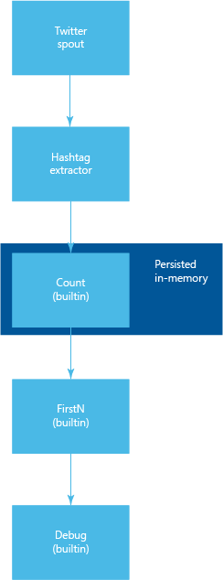

<properties
   pageTitle="Twitter tendenza argomenti con eccesso Apache nella HDInsight | Microsoft Azure"
   description="Informazioni su come usare Trident per creare una topologia eccesso Apache che determina la tendenza argomenti su Twitter in base a hashtags."
   services="hdinsight"
   documentationCenter=""
   authors="Blackmist"
   manager="jhubbard"
   editor="cgronlun"
    tags="azure-portal"/>

<tags
   ms.service="hdinsight"
   ms.devlang="java"
   ms.topic="article"
   ms.tgt_pltfrm="na"
   ms.workload="big-data"
   ms.date="09/27/2016"
   ms.author="larryfr"/>

#Determinare gli argomenti della tendenze Twitter con eccesso Apache in HDInsight

Informazioni su come usare Trident per creare una topologia eccesso che determina la tendenza argomenti (tag hash) su Twitter.

Trident è un'astrazione di alto livello che fornisce strumenti, ad esempio join, aggregazioni, raggruppamento, funzioni e i filtri. Inoltre, Trident aggiunge primitive per eseguire un'elaborazione incrementale informazioni sullo stato. In questo esempio viene illustrato come è possibile creare una topologia utilizzando un beccuccio personalizzato, la funzione e diverse funzioni integrate fornite dal Trident.

> [AZURE.NOTE] In questo esempio è molto in base [all'Eccesso Trident](https://github.com/jalonsoramos/trident-storm) esempio da Juan Alonso.

##Requisiti

* <a href="http://www.oracle.com/technetwork/java/javase/downloads/index.html" target="_blank">Java e JDK 1.7</a>

* <a href="http://maven.apache.org/what-is-maven.html" target="_blank">Maven</a>

* <a href="http://git-scm.com/" target="_blank">Operazioni</a>

* Un account di sviluppo di Twitter

##Scaricare il progetto

Utilizzare il codice seguente per duplicare il progetto in locale.

    git clone https://github.com/Blackmist/TwitterTrending

##Topologia

La topologia per questo esempio è il seguente:

> [AZURE.NOTE] Si tratta di una versione semplificata della topologia. Più istanze dei componenti verranno distribuite tra i nodi del cluster.

Il codice Trident di implementazione della topologia è il seguente:

    topology.newStream("spout", spout)
        .each(new Fields("tweet"), new HashtagExtractor(), new Fields("hashtag"))
        .groupBy(new Fields("hashtag"))
        .persistentAggregate(new MemoryMapState.Factory(), new Count(), new Fields("count"))
        .newValuesStream()
        .applyAssembly(new FirstN(10, "count"))
        .each(new Fields("hashtag", "count"), new Debug());

Questo codice esegue le operazioni seguenti:

1. Crea un nuovo flusso da beccuccio. Beccuccio recupera TWEET da Twitter e li Filtra per parole chiave specifiche (amore, musica e caffè in questo esempio).

2. HashtagExtractor, una funzione personalizzata viene usata per estrarre il tag hash da ogni tweet. Questi emesso nel flusso di.

3. Il flusso è raggruppati in base al tag hash e passare a un aggregatore. Questo aggregatore consente di creare un conteggio del numero di volte in cui si è verificato ogni tag hash. Questi dati viene mantenuti in memoria. Infine, viene creato un nuovo flusso che contiene il tag hash e il conteggio.

4. Poiché si desidera solo il tag hash più diffusi per un determinato batch TWEET, assembly **FirstN** viene applicato per restituire solo i primi 10 valori, in base al campo conteggio.

> [AZURE.NOTE] Diversa da quella beccuccio e HashtagExtractor, si sta utilizzando la funzionalità incorporata Trident.
>
> Per informazioni sulle operazioni predefinite, vedere <a href="https://storm.apache.org/apidocs/storm/trident/operation/builtin/package-summary.html" target="_blank">storm.trident.operation.builtin pacchetto</a>.
>
> Per implementazioni dello stato di Trident diversa da quella MemoryMapState, vedere le operazioni seguenti:
>
> * <a href="https://github.com/fhussonnois/storm-trident-elasticsearch" target="_blank">Ricerca flessibile Trident eccesso</a>
>
> * <a href="https://github.com/kstyrc/trident-redis" target="_blank">Trident redis</a>

###Beccuccio

Beccuccio **TwitterSpout**utilizza <a href="http://twitter4j.org/en/" target="_blank">Twitter4j</a> per recuperare TWEET da Twitter. Viene creato un filtro (amore, musica e caffè in questo esempio) e TWEET posta in arrivo (stato) che corrispondono al filtro vengono archiviate in una coda di blocco collegata. (Per ulteriori informazioni, vedere <a href="http://docs.oracle.com/javase/7/docs/api/java/util/concurrent/LinkedBlockingQueue.html" target="_blank">Classe LinkedBlockingQueue</a>). Infine, gli elementi sono rimosso dalla coda ed emesso della topologia.

###Il HashtagExtractor

Per estrarre il tag hash, <a href="http://twitter4j.org/javadoc/twitter4j/EntitySupport.html#getHashtagEntities--" target="_blank">getHashtagEntities</a> viene utilizzato per recuperare tutti i contrassegni hash contenuti nel tweet. Questi sono quindi emesso nel flusso di.

##Abilitare Twitter

Per registrare una nuova applicazione Twitter e ottenere le informazioni di token consumer e accesso necessarie per leggere Twitter, procedere come segue:

1. Passare a <a href="https://apps.twitter.com" target="_blank">Twitter App</a> e fare clic sul pulsante **Crea nuova app** . Durante la compilazione del modulo, lasciare vuoto il campo **Callback URL** .

2. Dopo avere creato l'app, fare clic sulla scheda **tasti e token di accesso** .

3. Copiare le informazioni **Chiave Consumer** e **Segreto Consumer** .

4. Nella parte inferiore della pagina, selezionare **Crea i token di accesso** , se è presente alcun token. Quando sono stati creati i token, copiare le informazioni di **Token di accesso** e **Segreto Token di accesso** .

5. Nel progetto **TwitterSpoutTopology** in precedenza duplicati, aprire il file **resources/twitter4j.properties** , aggiungere le informazioni raccolte nei passaggi precedenti e quindi salvare il file.

##La creazione della topologia

Utilizzare il codice seguente per generare il progetto:

        cd [directoryname]
        mvn compile

##Testare la topologia

Utilizzare il comando seguente per verificare la topologia in locale:

    mvn compile exec:java -Dstorm.topology=com.microsoft.example.TwitterTrendingTopology

Verrà avviata la topologia di vedere le informazioni di debug che contiene l'hash tag e conta create tramite la topologia. L'output dovrebbe essere simile al seguente:

    DEBUG: [Quicktellervalentine, 7]
    DEBUG: [GRAMMYs, 7]
    DEBUG: [AskSam, 7]
    DEBUG: [poppunk, 1]
    DEBUG: [rock, 1]
    DEBUG: [punkrock, 1]
    DEBUG: [band, 1]
    DEBUG: [punk, 1]
    DEBUG: [indonesiapunkrock, 1]

##Passaggi successivi

Ora che il test della topologia in locale, ecco come ottenere la topologia: [Distribuisci e gestire topologie Apache eccesso su HDInsight](hdinsight-storm-deploy-monitor-topology.md).

Potrebbero anche interessare gli argomenti eccesso seguenti:

* [Sviluppare topologie Java per eccesso in HDInsight utilizzando Maven](hdinsight-storm-develop-java-topology.md)

* [Sviluppare c# topologie per eccesso in HDInsight utilizzando Visual Studio](hdinsight-storm-develop-csharp-visual-studio-topology.md)

Per altri esempi eccesso per HDinsight:

* [Esempi di topologie per eccesso in HDInsight](hdinsight-storm-example-topology.md)
