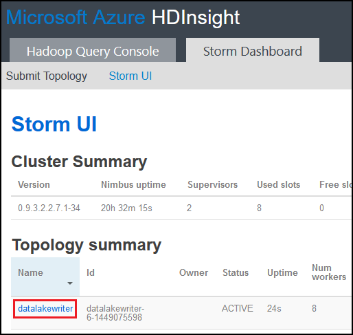

<properties
pageTitle="Usare Azure Lake di archivio dati eccesso Apache su Azure HDInsight"
description="Informazioni su come scrivere i dati all'archivio Lake dati di Azure da una topologia Apache eccesso su HDInsight. Questo documento ed esempio associato illustrato come utilizzare il componente HdfsBolt a scrivere dati Lake archivio."
services="hdinsight"
documentationCenter="na"
authors="Blackmist"
manager="jhubbard"
editor="cgronlun"/>

<tags
ms.service="hdinsight"
ms.devlang="na"
ms.topic="article"
ms.tgt_pltfrm="na"
ms.workload="big-data"
ms.date="09/06/2016"
ms.author="larryfr"/>

#Usare Azure Lake di archivio dati eccesso Apache con HDInsight

Archivio Lake dati di Azure è un servizio di archiviazione cloud compatibile HDFS che fornisce alta velocità, disponibilità, durata e affidabilità per i dati. Nel documento, si verrà informazioni su come utilizzare una topologia eccesso basato su Java per scrivere dati Azure dati Lake archivio utilizzando il componente [HdfsBolt](http://storm.apache.org/javadoc/apidocs/org/apache/storm/hdfs/bolt/HdfsBolt.html) , fornito come parte di Apache eccesso.

> [AZURE.IMPORTANT] La topologia di esempio utilizzata in questo documento è basato sui componenti inclusi in eccesso nei HDInsight cluster che possono richiedere la modifica per l'uso con Azure dati Lake Store se utilizzata con altri cluster Apache eccesso.

##Prerequisiti

* [Java JDK 1.7](https://www.oracle.com/technetwork/java/javase/downloads/jdk7-downloads-1880260.html) o versione successiva
* [Maven 3. x](https://maven.apache.org/download.cgi)
* Una sottoscrizione di Azure
* Eccesso nella versione cluster HDInsight 3,2. Per creare un nuovo eccesso cluster HDInsight, utilizzare la procedura descritta nel documento [usare HDInsight con archivio Lake dati utilizzando Azure](../data-lake-store/data-lake-store-hdinsight-hadoop-use-portal.md) . La procedura descritta in questo documento consentono all'utente la creazione di un nuovo cluster HDInsight e archivio Lake dati di Azure.  

    > [AZURE.IMPORTANT] Quando si crea cluster HDInsight, è necessario selezionare __eccesso__ come il tipo di grafico e __3.2__ della versione. Il sistema operativo può essere Windows o Linux.  

###Configurare le variabili di ambiente

Le variabili di ambiente seguenti possono essere impostate durante l'installazione di Java e JDK nella workstation di sviluppo. Tuttavia, è necessario verificare che siano già presenti e che contengono i valori corretti per i singoli sistemi.

* __JAVA_HOME__ - deve fare riferimento alla directory in cui è installato l'ambiente di runtime del linguaggio (JRE). Ad esempio, in una distribuzione Unix o Linux deve avere un valore simile a `/usr/lib/jvm/java-7-oracle`. In Windows, ha un valore simile a `c:\Program Files (x86)\Java\jre1.7`.

* __Percorso__ - deve contenere i seguenti percorsi:

    * __Linguaggio\_HOME__ (o il percorso equivalente)
    
    * __Linguaggio\_HOME\bin__ (o il percorso equivalente)
    
    * Directory in cui è installato Maven

##Implementazione della topologia

Nell'esempio utilizzato in questo documento è scritto in linguaggio e utilizza i componenti seguenti:

* __TickSpout__: genera dati usati da altri componenti della topologia.

* __PartialCount__: conta eventi generati da TickSpout.

* __FinalCount__: contare le aggregazioni dati da PartialCount.

* __ADLStoreBolt__: scrive i dati di Azure dati Lake archivio tramite il componente [HdfsBolt](http://storm.apache.org/javadoc/apidocs/org/apache/storm/hdfs/bolt/HdfsBolt.html) .

Il progetto che contiene questa topologia è disponibile per il download da [https://github.com/Azure-Samples/hdinsight-storm-azure-data-lake-store](https://github.com/Azure-Samples/hdinsight-storm-azure-data-lake-store).

###Informazioni sulle ADLStoreBolt

Il ADLStoreBolt è il nome usato per l'istanza HdfsBolt nella topologia di che scrive Lake di dati di Azure. Non si tratta di una versione speciale di HdfsBolt creato da Microsoft; Tuttavia, si basa sui valori di configurazione del sito principale, nonché componenti Hadoop che sono inclusi in Azure HDInsight per la comunicazione con Lake dati.

In particolare, quando si crea un cluster di HDInsight, è possibile associarlo un archivio di Lake dati di Azure. Consente di scrivere voci nel sito principale per l'archivio Lake dati selezionato, vengono utilizzate dai componenti, ad esempio client hadoop e hadoop hdfs per consentire la comunicazione con dati Lake archivio.

> [AZURE.NOTE] Microsoft ha contribuito codice per i progetti di eccesso e Apache Hadoop che consente la comunicazione con l'archiviazione di Azure Lake archivio dati e Blob Azure, ma questa funzionalità non può essere inclusi per impostazione predefinita in altre distribuzioni Hadoop ed eccesso.

La configurazione per HdfsBolt nella topologia è come indicato di seguito:

    // 1. Create sync and rotation policies to control when data is synched
    //    (written) to the file system and when to roll over into a new file.
    SyncPolicy syncPolicy = new CountSyncPolicy(1000);
    FileRotationPolicy rotationPolicy = new FileSizeRotationPolicy(0.5f, Units.KB);
    // 2. Set the format. In this case, comma delimited
    RecordFormat recordFormat = new DelimitedRecordFormat().withFieldDelimiter(",");
    // 3. Set the directory name. In this case, '/stormdata/'
    FileNameFormat fileNameFormat = new DefaultFileNameFormat().withPath("/stormdata/");
    // 4. Create the bolt using the previously created settings,
    //    and also tell it the base URL to your Data Lake Store.
    // NOTE! Replace 'MYDATALAKE' below with the name of your data lake store.
    HdfsBolt adlsBolt = new HdfsBolt()
        .withFsUrl("adl://MYDATALAKE.azuredatalakestore.net/")
        .withRecordFormat(recordFormat)
        .withFileNameFormat(fileNameFormat)
        .withRotationPolicy(rotationPolicy)
        .withSyncPolicy(syncPolicy);
    // 4. Give it a name and wire it up to the bolt it accepts data
    //    from. NOTE: The name used here is also used as part of the
    //    file name for the files written to Data Lake Store.
    builder.setBolt("ADLStoreBolt", adlsBolt, 1)
      .globalGrouping("finalcount");
      
Se si ha familiarità con l'uso di HdfsBolt, si noterà che si tratta di tutte le configurazioni di un'operazione molto semplice fatta eccezione per l'URL. L'URL fornisce il percorso per la radice di archivio di Azure Lake dati.

Poiché la scrittura all'archivio dati Lake utilizza HdfsBolt e solo modifica dell'URL, dovrebbe essere possibile eseguire qualsiasi topologia esistente che scrive HDFS o WASB utilizzando HdfsBolt e facilmente sostituirla con utilizza archivio Lake dati di Azure.

##Compilare e assemblare la topologia

1. Scaricare il progetto di esempio da [https://github.com/Azure-Samples/hdinsight-storm-azure-data-lake-store](https://github.com/Azure-Samples/hdinsight-storm-azure-data-lake-store
) all'ambiente di sviluppo.

2. Aprire la `StormToDataLake\src\main\java\com\microsoft\example\StormToDataLakeStore.java` dei file in un editor e individuare la riga contenente `.withFsUrl("adl://MYDATALAKE.azuredatalakestore.net/")`. Modifica __MYDATALAKE__ del nome dell'archivio Lake Azure è utilizzata per la creazione del server HDInsight.

3. Un comando prompt dei comandi, terminale o sessione shell, passare alla radice del progetto scaricato dal eseguire i comandi seguenti per creare e creare un pacchetto della topologia.

        mvn compile
        mvn package
    
    Una volta completata la compilazione e confezioni per i prodotti, si verificherà una nuova directory denominata `target`, che contiene un file denominato `StormToDataLakeStore-1.0-SNAPSHOT.jar`. Questa pagina contiene la topologia compilata.

##Distribuire ed eseguire basati su Linux HDInsight

Se è stato creato un eccesso basati su Linux cluster HDInsight, utilizzare la procedura seguente per distribuire ed eseguire la topologia.

1. Utilizzare il comando seguente per copiare la topologia cluster HDInsight. Sostituire __l'utente__ con il nome utente SSH usato per creare il cluster. Sostituire __nome cluster__ con il nome del cluster.

        scp target\StormToDataLakeStore-1.0-SNAPSHOT.jar USER@CLUSTERNAME-ssh.azurehdinsight.net:StormToDataLakeStore-1.0-SNAPSHOT.jar
    
    Quando richiesto, immettere la password usata quando si crea utente SSH per il cluster. Se è stata utilizzata una chiave pubblica anziché una password, potrebbe essere necessario utilizzare la `-i` parametro per specificare il percorso per la chiave privata corrispondente.
    
    > [AZURE.NOTE] Se si utilizza un client di Windows per lo sviluppo, potrebbe non essere un `scp` comando. Se, è possibile utilizzare `pscp`, disponibile da [http://www.chiark.greenend.org.uk/~sgtatham/putty/download.html](http://www.chiark.greenend.org.uk/~sgtatham/putty/download.html).

2. Dopo avere completato il caricamento, utilizzare le operazioni seguenti per connettersi al cluster HDInsight utilizzando SSH. Sostituire __l'utente__ con il nome utente SSH usato per creare il cluster. Sostituire __nome cluster__ con il nome del cluster.

        ssh USER@CLUSTERNAME-ssh.azurehdinsight.net

    Quando richiesto, immettere la password usata quando si crea utente SSH per il cluster. Se è stata utilizzata una chiave pubblica anziché una password, potrebbe essere necessario utilizzare la `-i` parametro per specificare il percorso per la chiave privata corrispondente.
    
    > [AZURE.NOTE] Se si utilizza un client di Windows per lo sviluppo, seguire le informazioni in [connessione a basati su Linux HDInsight con SSH da Windows](hdinsight-hadoop-linux-use-ssh-windows.md) per informazioni su utilizzando il client PuTTY per connettersi al cluster.
    
3. Una volta connessa, utilizzare le operazioni seguenti per avviare la topologia:

        storm jar StormToDataLakeStore-1.0-SNAPSHOT.jar com.microsoft.example.StormToDataLakeStore datalakewriter
    
    Verrà avviata la topologia con un nome descrittivo del `datalakewriter`.

##Distribuire ed eseguire HDInsight basato su Windows

1. Aprire un web browser e passare alla HTTPS://CLUSTERNAME.azurehdinsight.net, dove __nome cluster__ è il nome del cluster HDInsight. Quando richiesto, immettere il nome utente di amministratore (`admin`) e la password utilizzati per l'account quando il cluster è stato creato.

2. Dal Dashboard eccesso selezionare __Sfoglia__ dall'elenco a discesa __Jar File__ , quindi selezionare il file SNAPSHOT.jar di 1.0 StormToDataLakeStore il `target` directory. Per le altre voci nella maschera, utilizzare i valori seguenti:

    * Nome della classe: com.microsoft.example.StormToDataLakeStore
    * Altri parametri: datalakewriter
    
    

3. Selezionare il pulsante __Invia__ per caricare e avviare la topologia. Il campo risultato sotto il pulsante __Invia__ deve essere visualizzato informazioni simile al seguente se è già iniziato la topologia:

        Process exit code: 0
        Currently running topologies:
        Topology_name        Status     Num_tasks  Num_workers  Uptime_secs
        -------------------------------------------------------------------
        datalakewriter       ACTIVE     68         8            10        

##Visualizzare i dati di output

Esistono diversi modi per visualizzare i dati. In questa sezione viene utilizzato il portale di Azure e `hdfs` comando per visualizzare i dati.

> [AZURE.NOTE] È consigliabile consentire topologie da eseguire per alcuni minuti prima di archiviare i dati di output, in modo che i dati sono stati sincronizzati a più file archivio Lake dati di Azure.

* __Dal [Portale di Azure](https://portal.azure.com)__: nel portale, selezionare l'archivio Lake di dati di Azure utilizzati con HDInsight.

    > [AZURE.NOTE] Se non si blocca archivio Lake dati al dashboard di portale Azure, è possibile trovare scegliendo __Sfoglia__ nella parte inferiore dell'elenco a sinistra, quindi __Archivio Lake dati__, e infine selezionare l'archivio.
    
    Le icone nella parte superiore dell'archivio dati Lake, selezionare __Data Explorer__.
    
    
    
    Selezionare la cartella __stormdata__ . Un elenco di file di testo deve essere visualizzato.
    
    
    
    Selezionare uno dei file per visualizzarne il contenuto.

* __Dal cluster__: se si è connessi a cluster HDInsight utilizzando SSH (cluster Linux) o Desktop remoto (cluster di Windows), è possibile utilizzare le operazioni seguenti per visualizzare i dati. Sostituire __DATALAKE__ con il nome dell'archivio dati Lake

        hdfs dfs -cat adl://DATALAKE.azuredatalakestore.net/stormdata/*.txt

    Questa operazione verrà concatena i file di testo archiviati nella directory e le informazioni di visualizzazione simile al seguente:
    
        406000000
        407000000
        408000000
        409000000
        410000000
        411000000
        412000000
        413000000
        414000000
        415000000
        
##Interrompere la topologia

Topologie eccesso eseguiranno fino a interruzione o il cluster viene eliminato. Per interrompere la topologie, utilizzare le seguenti informazioni.

__Per HDInsight basati su Linux__:

Da una sessione SSH al cluster, utilizzare il comando seguente:

    storm kill datalakewriter

__Per HDInsight basato su Windows__:

1. Il dashboard (https://CLUSTERNAME.azurehdinsight.net), selezionare il collegamento __Dell'interfaccia utente eccesso__ nella parte superiore della pagina.

2. Dopo l'interfaccia utente il caricamento, selezionare il collegamento __datalakewriter__ .

    

3. Nella sezione __Azioni della topologia__ selezionare __eliminare__ e quindi selezionare OK nella finestra di dialogo visualizzata.

    

## Eliminare il cluster

[AZURE.INCLUDE [delete-cluster-warning](../../includes/hdinsight-delete-cluster-warning.md)]

##Passaggi successivi

Ora che è stato illustrato come utilizzare eccesso per scrivere archivio Lake dati di Azure, è facile scoprire altri [esempi eccesso per HDInsight](hdinsight-storm-example-topology.md).
