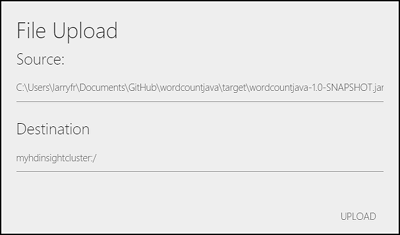

<properties
    pageTitle="Caricare dati per i processi di Hadoop in HDInsight | Microsoft Azure"
    description="Informazioni su come caricare e accedere ai dati per i processi di Hadoop in HDInsight con CLI Azure, Esplora archivi Azure, PowerShell di Azure, riga di comando Hadoop o Sqoop."
    services="hdinsight,storage"
    documentationCenter=""
    tags="azure-portal"
    authors="mumian"
    manager="jhubbard"
    editor="cgronlun"/>

<tags
    ms.service="hdinsight"
    ms.workload="big-data"
    ms.tgt_pltfrm="na"
    ms.devlang="na"
    ms.topic="article"
    ms.date="08/10/2016"
    ms.author="jgao"/>

#Caricare dati per i processi di Hadoop in HDInsight

Azure HDInsight fornisce un completi Hadoop distribuita file system (HDFS) su archiviazione Blob Azure. È progettata come estensione HDFS per assicurare un'esperienza ottimale per i clienti. Consente l'insieme completo di componenti ecosistema Hadoop operare direttamente su dei dati che gestisce. Azure archiviazione Blob e HDFS sono distinti file System ottimizzate per l'archiviazione dei dati e i calcoli su tali dati. Per informazioni sui vantaggi derivanti dall'uso archiviazione Blob Azure, vedere [lo spazio di archiviazione Blob Azure usare con HDInsight][hdinsight-storage].

**Prerequisiti**

Prima di iniziare, tenere presente i seguenti requisiti:

* Un cluster di Azure HDInsight. Per istruzioni, vedere [Guida introduttiva di Azure HDInsight] [ hdinsight-get-started] o [cluster di provisioning HDInsight][hdinsight-provision].

##Perché nell'archiviazione blob?

Azure HDInsight cluster vengono in genere utilizzati per eseguire processi MapReduce e i cluster vengono eliminati dopo questi processi completato. Mantenere i dati nel HDFS cluster dopo aver completati i calcoli è un modo costoso per archiviare i dati. Archiviazione Blob Azure è una capacità di disponibilità, scalabilità, elevata, opzione di costo e condivisibile lo spazio di archiviazione per i dati che deve essere elaborato usando HDInsight. Archiviazione dei dati in un blob Abilita i cluster HDInsight utilizzati per il calcolo deve essere rilasciato in modo sicuro senza perdere dati.

###Directory

Contenitori di archiviazione Blob Azure memorizzare i dati come coppie chiave/valore e non c'è alcun gerarchia directory. Tuttavia il carattere "/" utilizzabile all'interno del nome chiave per ingrandirne la visualizzazione come se un file è archiviato all'interno di una struttura di directory. HDInsight vede questi come se fossero directory effettiva.

Tasto del blob, ad esempio, potrebbe essere *input/log1.txt*. È presente alcuna directory "input" effettiva, ma a causa di presenza del carattere "/" nel nome della chiave, ha l'aspetto di un percorso file.

Per questi motivi, se si utilizzano strumenti di Azure Explorer potreste riscontrare alcuni file 0 byte. Questi file hanno due funzioni:

- Se sono presenti le cartelle vuote, contrassegnate dell'esistenza della cartella. Archiviazione Blob Azure è sufficientemente intelligente sapere che se è presente un blob denominato foo/bar, esiste una cartella denominata **foo**. È l'unico modo per indicare una cartella vuota denominata **foo** dalla presenza di questo file speciale byte 0 nella posizione.

- Contengono metadati speciali che sono necessaria dal file system Hadoop, in particolare le autorizzazioni e proprietari per le cartelle.

##Utilità della riga di comando

Microsoft offre le seguenti utilità per l'uso con archiviazione Blob Azure:

| Strumento | Linux | OS X | Windows |
| ---- |:-----:|:----:|:-------:|
| [Azure interfaccia della riga di comando][azurecli] | ✔ | ✔ | ✔ |
| [PowerShell Azure][azure-powershell] | | | ✔ |
| [AzCopy][azure-azcopy] | | | ✔ |
| [Comando Hadoop](#commandline) | ✔ | ✔ | ✔ |

> [AZURE.NOTE] Mentre CLI Azure, Azure PowerShell e i AzCopy possono tutti essere utilizzato da Azure esterno, Hadoop comando è disponibile solo in cluster HDInsight e consente solo il caricamento dei dati dal file system locale in archiviazione Blob Azure.

###CLI Azure

CLI Azure è uno strumento multipiattaforma che consente di gestire i servizi Azure. Per caricare dati in archiviazione Blob Azure, procedere come segue:

[AZURE.INCLUDE [use-latest-version](../../includes/hdinsight-use-latest-cli.md)]

1. [Installare e configurare CLI Azure per Mac, Linux e Windows](../xplat-cli-install.md).

2. Aprire un prompt dei comandi, bash o altri shell e usare le operazioni seguenti per eseguire l'autenticazione all'abbonamento Azure.

        azure login

    Quando richiesto, immettere il nome utente e la password per l'abbonamento.

3. Immettere il comando seguente per visualizzare un elenco degli account di archiviazione per l'abbonamento:

        azure storage account list

4. Selezionare l'account di archiviazione che contiene il blob da utilizzare, quindi usare il comando seguente per recuperare la chiave per l'account:

        azure storage account keys list <storage-account-name>

    In questo modo chiavi **primarie** ed **secondario** . Copiare il valore di chiave **primaria** da utilizzare nei passaggi successivi.

5. Utilizzare il comando seguente per recuperare un elenco dei contenitori blob in account di archiviazione:

        azure storage container list -a <storage-account-name> -k <primary-key>

6. Per caricare e scaricare i file di archivio blob, utilizzare i comandi seguenti:

    * Per caricare un file:

            azure storage blob upload -a <storage-account-name> -k <primary-key> <source-file> <container-name> <blob-name>

    * Per scaricare un file:

            azure storage blob download -a <storage-account-name> -k <primary-key> <container-name> <blob-name> <destination-file>

> [AZURE.NOTE] Se sempre si lavora con lo stesso account di archiviazione, è possibile impostare le seguenti variabili di ambiente invece di specificare l'account e principali per ogni comando:
>
> * **AZURE\_lo spazio di archiviazione\_ACCOUNT**: il nome dell'account di archiviazione
>
> * **AZURE\_lo spazio di archiviazione\_accesso\_chiave**: la chiave account di archiviazione

###PowerShell Azure

PowerShell Azure è un ambiente di script che è possibile utilizzare per controllare e automatizzare la distribuzione e gestione dei carichi di lavoro di Azure. Per informazioni sulla configurazione workstation per eseguire Azure PowerShell, vedere [installare e configurare Azure PowerShell](../powershell-install-configure.md).

[AZURE.INCLUDE [use-latest-version](../../includes/hdinsight-use-latest-powershell.md)]

**Per caricare un file locale in archiviazione Blob Azure**

1. Aprire la console di Azure PowerShell come indicato in [installare e configurare Azure PowerShell](../powershell-install-configure.md).
2. Impostare i valori delle variabili prime cinque nello script seguente:

        $resourceGroupName = "<AzureResourceGroupName>"
        $storageAccountName = "<StorageAccountName>"
        $containerName = "<ContainerName>"

        $fileName ="<LocalFileName>"
        $blobName = "<BlobName>"

        # Get the storage account key
        $storageAccountKey = (Get-AzureRmStorageAccountKey -ResourceGroupName $resourceGroupName -Name $storageAccountName)[0].Value
        # Create the storage context object
        $destContext = New-AzureStorageContext -StorageAccountName $storageAccountName -StorageAccountKey $storageaccountkey

        # Copy the file from local workstation to the Blob container
        Set-AzureStorageBlobContent -File $fileName -Container $containerName -Blob $blobName -context $destContext

3. Incollare lo script nella console di Azure PowerShell per eseguirlo per copiare il file.

Ad esempio script di PowerShell creati per lavorare con HDInsight, vedere [Strumenti di HDInsight](https://github.com/blackmist/hdinsight-tools).

###AzCopy

AzCopy è uno strumento della riga di comando è progettato per semplificare le attività di trasferimento dei dati in e disconnettersi da un account di archiviazione Azure. È possibile utilizzarla come strumento autonomo o incorporare questo strumento in un'applicazione esistente. [Scaricare AzCopy][azure-azcopy-download].

La sintassi AzCopy è:

    AzCopy <Source> <Destination> [filePattern [filePattern...]] [Options]

Per ulteriori informazioni, vedere [AzCopy - durante il caricamento o download dei file per i BLOB Azure][azure-azcopy].

###Riga di comando Hadoop

Riga di comando Hadoop è utile solo per la memorizzazione dei dati in archiviazione blob quando i dati sono già presenti nel nodo principale.

Per utilizzare il comando Hadoop, è innanzitutto necessario connettersi a headnode utilizzando uno dei metodi seguenti:

* **HDInsight basato su Windows**: [connessione tramite Desktop remoto](hdinsight-administer-use-management-portal.md#connect-to-hdinsight-clusters-by-using-rdp)

* **HDInsight basati su Linux**: connettersi tramite SSH ([comando SSH](hdinsight-hadoop-linux-use-ssh-unix.md#connect-to-a-linux-based-hdinsight-cluster) o [PuTTY](hdinsight-hadoop-linux-use-ssh-windows.md#connect-to-a-linux-based-hdinsight-cluster))

Una volta connessa, è possibile utilizzare la sintassi seguente per caricare un file allo spazio di archiviazione.

    hadoop -copyFromLocal <localFilePath> <storageFilePath>

Per esempio`hadoop fs -copyFromLocal data.txt /example/data/data.txt`

Poiché il sistema di file predefinito per HDInsight in archiviazione Blob Azure, /example/data.txt è effettivamente in archiviazione Blob Azure. È anche possibile fare riferimento al file come:

    wasbs:///example/data/data.txt

o

    wasbs://<ContainerName>@<StorageAccountName>.blob.core.windows.net/example/data/davinci.txt

Per un elenco di altri comandi Hadoop che funzionano con i file, vedere [http://hadoop.apache.org/docs/r2.7.0/hadoop-project-dist/hadoop-common/FileSystemShell.html](http://hadoop.apache.org/docs/r2.7.0/hadoop-project-dist/hadoop-common/FileSystemShell.html)

> [AZURE.WARNING] Nei cluster HBase, il valore predefinito Blocca dimensioni utilizzata quando la scrittura dei dati è 256KB. Mentre funziona correttamente quando si utilizza HBase APIs o API REST, utilizzando il `hadoop` o `hdfs dfs` comandi per scrivere dati superiori ~ 12GB genereranno un errore. Vedere la sezione [eccezione dello spazio di archiviazione per la scrittura nel blob](#storageexception) sotto per ulteriori informazioni.

##Client con interfaccia grafico

Esistono diverse applicazioni che offrono un'interfaccia grafica per l'utilizzo di archiviazione Azure. Di seguito è un elenco di alcune di queste applicazioni:

| Client | Linux | OS X | Windows |
| ------ |:-----:|:----:|:-------:|
| [Microsoft Visual Studio Tools per HDInsight](hdinsight-hadoop-visual-studio-tools-get-started.md#navigate-the-linked-resources) | ✔ | ✔ | ✔ |
| [Esplora archivi Azure](http://storageexplorer.com/) | ✔ | ✔ | ✔ |
| [Studio di spazio di archiviazione cloud 2](http://www.cerebrata.com/Products/CloudStorageStudio/) | | | ✔ |
| [CloudXplorer](http://clumsyleaf.com/products/cloudxplorer) | | | ✔ |
| [Esplora Azure](http://www.cloudberrylab.com/free-microsoft-azure-explorer.aspx) | | | ✔ |
| [Cyberduck](https://cyberduck.io/) |  | ✔ | ✔ |

###Visual Studio Tools per HDInsight

Per ulteriori informazioni, vedere [esplorare le risorse collegate](hdinsight-hadoop-visual-studio-tools-get-started.md#navigate-the-linked-resources).

###Esplora archivi Azure

*Esplora archivi Azure* è uno strumento utile per analizzare e modificare i dati nei blob. È uno strumento gratuito, open source che può essere scaricato dal [http://storageexplorer.com/](http://storageexplorer.com/). Il codice sorgente è disponibile anche il collegamento.

Prima di utilizzare lo strumento, è necessario conoscere la chiave account e nome account Azure dello spazio di archiviazione. Per istruzioni su come ottenere queste informazioni, vedere la "come: visualizzazione, copia e lo spazio di archiviazione Rigenera tasti" sezione di [creare, gestire, o eliminare un account di archiviazione][azure-create-storage-account].  

1. Eseguire lo spazio di archiviazione Azure Explorer. Se la prima volta che si dispone di Esplora aree di spazio di archiviazione è stato eseguito, verrà richiesto per ___nome dell'account di archiviazione__ e __la chiave account lo spazio di archiviazione__. Se si dispone eseguito prima, usare il pulsante __Aggiungi__ per aggiungere un nuovo nome di account di archiviazione e la chiave.

    Immettere il nome e chiave per l'account di archiviazione utilizzato per il cluster HDinsight e quindi selezionare __Salva e aprire__.

    ![HDI. AzureStorageExplorer][image-azure-storage-explorer]

5. Nell'elenco dei contenitori a sinistra della schermata, fare clic sul nome del contenitore associato il cluster HDInsight. Per impostazione predefinita, questo è il nome del cluster HDInsight, ma può essere diverso se è stato immesso un nome specifico durante la creazione del cluster.

6. Dalla barra degli strumenti, selezionare l'icona di caricamento.

    

7. Specificare un file da caricare e quindi fare clic su **Apri**. Quando richiesto, selezionare __Carica__ per caricare il file nella radice del contenitore di spazio di archiviazione. Se si desidera caricare il file in un percorso specifico, immettere il percorso nel campo di __destinazione__ e quindi selezionare __Carica__.

    
    
    Al termine del durante il caricamento di file, è possibile utilizzare dai processi sul cluster HDInsight.

##Archiviazione Blob Azure montaggio come unità locale

Vedere [archiviazione Blob Azure montaggio come unità locale](http://blogs.msdn.com/b/bigdatasupport/archive/2014/01/09/mount-azure-blob-storage-as-local-drive.aspx).

##Servizi

###Dati di Azure Factory

Il servizio di Azure Data Factory è un servizio completamente gestito per la composizione di spazio di archiviazione, elaborazione dei dati e dati movimento ODS nella pipeline di produzione dati semplificata, scalable e affidabile.

Azure Factory dati può essere utilizzata per spostare i dati in archiviazione Blob Azure o per creare pipeline di dati che utilizzano direttamente HDInsight caratteristiche quali Hive e maialino.

Per ulteriori informazioni, vedere la [documentazione di Azure Data Factory](https://azure.microsoft.com/documentation/services/data-factory/).

###Apache Sqoop

Sqoop è uno strumento progettato per trasferire dati tra Hadoop e database relazionali. È possibile utilizzare per importare dati da un sistema di gestione di database relazionali (RDBMS), ad esempio SQL Server, MySQL o Oracle nel Hadoop distributed file system (HDFS), la trasformazione dei dati in Hadoop con MapReduce o Hive e quindi esportare i dati in un RDBMS.

Per ulteriori informazioni, vedere [Usare Sqoop con HDInsight][hdinsight-use-sqoop].

##Sviluppo SDK

Archiviazione Blob Azure è possibile accedervi utilizzando un SDK Azure da linguaggio di programmazione seguenti:

* .NET
* Java
* Node
* PHP
* Python
* Trascrizione

Per ulteriori informazioni sull'installazione degli SDK Azure, vedere [download di Azure](https://azure.microsoft.com/downloads/)

## Risoluzione dei problemi

### Eccezione di spazio di archiviazione per la scrittura nel blob

__Sintomi__: quando si usa il `hadoop` o `hdfs dfs` comandi per scrivere i file memorizzati ~ 12 GB o più grandi in un cluster di HBase, è possibile riscontrare l'errore seguente: 

    ERROR azure.NativeAzureFileSystem: Encountered Storage Exception for write on Blob : example/test_large_file.bin._COPYING_ Exception details: null Error Code : RequestBodyTooLarge
    copyFromLocal: java.io.IOException
            at com.microsoft.azure.storage.core.Utility.initIOException(Utility.java:661)
            at com.microsoft.azure.storage.blob.BlobOutputStream$1.call(BlobOutputStream.java:366)
            at com.microsoft.azure.storage.blob.BlobOutputStream$1.call(BlobOutputStream.java:350)
            at java.util.concurrent.FutureTask.run(FutureTask.java:262)
            at java.util.concurrent.Executors$RunnableAdapter.call(Executors.java:471)
            at java.util.concurrent.FutureTask.run(FutureTask.java:262)
            at java.util.concurrent.ThreadPoolExecutor.runWorker(ThreadPoolExecutor.java:1145)
            at java.util.concurrent.ThreadPoolExecutor$Worker.run(ThreadPoolExecutor.java:615)
            at java.lang.Thread.run(Thread.java:745)
    Caused by: com.microsoft.azure.storage.StorageException: The request body is too large and exceeds the maximum permissible limit.
            at com.microsoft.azure.storage.StorageException.translateException(StorageException.java:89)
            at com.microsoft.azure.storage.core.StorageRequest.materializeException(StorageRequest.java:307)
            at com.microsoft.azure.storage.core.ExecutionEngine.executeWithRetry(ExecutionEngine.java:182)
            at com.microsoft.azure.storage.blob.CloudBlockBlob.uploadBlockInternal(CloudBlockBlob.java:816)
            at com.microsoft.azure.storage.blob.CloudBlockBlob.uploadBlock(CloudBlockBlob.java:788)
            at com.microsoft.azure.storage.blob.BlobOutputStream$1.call(BlobOutputStream.java:354)
            ... 7 more

__Causa__: HBase in HDInsight cluster predefinita di una dimensione di blocco di 256 KB durante la scrittura di archiviazione Azure. Durante questo metodo funziona per HBase APIs o API REST, verrà generato un errore quando si usa il `hadoop` o `hdfs dfs` utilità della riga di comando.

__Risoluzione__: usare `fs.azure.write.request.size` per specificare una dimensione maggiore per il blocco. È possibile eseguire questa operazione in base al costo per uso utilizzando il `-D` parametro. Di seguito è illustrato un esempio di utilizzo di questo parametro con il `hadoop` comando:

    hadoop -fs -D fs.azure.write.request.size=4194304 -copyFromLocal test_large_file.bin /example/data

È inoltre possibile aumentare il valore di `fs.azure.write.request.size` globalmente utilizzando Ambari. Per modificare il valore dell'interfaccia utente Web Ambari, è possibile utilizzare la procedura seguente:

1. Nel browser passare all'interfaccia utente Web Ambari per il cluster. Si tratta di https://CLUSTERNAME.azurehdinsight.net, dove __nome cluster__ è il nome del cluster.

    Quando richiesto, immettere il nome dell'amministratore e la password per il cluster.

2. Partire dal lato sinistro dello schermo, selezionare __HDFS__e quindi selezionare la scheda __configurazioni__ .

3. Nel campo __filtro...__ immettere `fs.azure.write.request.size`. Verrà visualizzato il campo e il valore corrente al centro della pagina.

4. Modificare il valore da 262144 (256KB) per il nuovo valore. Ad esempio, 4194304 (4MB).

Per ulteriori informazioni sull'uso di Ambari, vedere [gestire HDInsight cluster tramite l'interfaccia utente Web Ambari](hdinsight-hadoop-manage-ambari.md).

## Passaggi successivi

Dopo avere appreso come recuperare i dati in HDInsight, vedere gli articoli seguenti per informazioni su come eseguire l'analisi:

* [Guida introduttiva di Azure HDInsight][hdinsight-get-started]
* [Inviare i processi di Hadoop a livello di programmazione][hdinsight-submit-jobs]
* [Usare Hive con HDInsight][hdinsight-use-hive]
* [Utilizzare maialino con HDInsight][hdinsight-use-pig]

[azure-management-portal]: https://porta.azure.com
[azure-powershell]: http://msdn.microsoft.com/library/windowsazure/jj152841.aspx

[azure-storage-client-library]: /develop/net/how-to-guides/blob-storage/
[azure-create-storage-account]: ../storage/storage-create-storage-account.md
[azure-azcopy-download]: ../storage/storage-use-azcopy.md
[azure-azcopy]: ../storage/storage-use-azcopy.md

[hdinsight-use-sqoop]: hdinsight-use-sqoop.md

[hdinsight-storage]: hdinsight-hadoop-use-blob-storage.md
[hdinsight-submit-jobs]: hdinsight-submit-hadoop-jobs-programmatically.md
[hdinsight-get-started]: hdinsight-hadoop-linux-tutorial-get-started.md

[hdinsight-use-hive]: hdinsight-use-hive.md
[hdinsight-use-pig]: hdinsight-use-pig.md
[hdinsight-provision]: hdinsight-provision-clusters.md

[sqldatabase-create-configure]: ../sql-database-create-configure.md

[apache-sqoop-guide]: http://sqoop.apache.org/docs/1.4.4/SqoopUserGuide.html

[Powershell-install-configure]: ../powershell-install-configure.md

[azurecli]: ../xplat-cli-install.md

[image-azure-storage-explorer]: ./media/hdinsight-upload-data/HDI.AzureStorageExplorer.png
[image-ase-addaccount]: ./media/hdinsight-upload-data/HDI.ASEAddAccount.png
[image-ase-blob]: ./media/hdinsight-upload-data/HDI.ASEBlob.png
