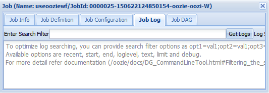
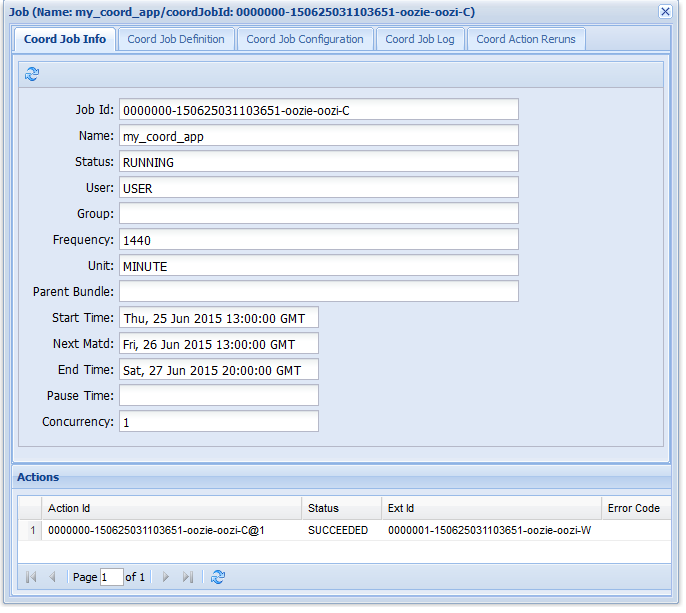

<properties
    pageTitle="Usare i flussi di lavoro Hadoop Oozie in basati su Linux HDInsight | Microsoft Azure"
    description="Utilizzare Hadoop Oozie HDInsight basati su Linux. Informazioni su come definire un flusso di lavoro Oozie e inviare un processo Oozie."
    services="hdinsight"
    documentationCenter=""
    authors="Blackmist"
    manager="jhubbard"
    editor="cgronlun"
    tags="azure-portal"/>

<tags
    ms.service="hdinsight"
    ms.workload="big-data"
    ms.tgt_pltfrm="na"
    ms.devlang="na"
    ms.topic="article"
    ms.date="10/11/2016"
    ms.author="larryfr"/>

# Utilizzare Oozie con Hadoop per definire ed eseguire un flusso di lavoro basati su Linux HDInsight

[AZURE.INCLUDE [oozie-selector](../../includes/hdinsight-oozie-selector.md)]

Informazioni su come utilizzare Apache Oozie per definire un flusso di lavoro che utilizza Hive e Sqoop e quindi eseguire il flusso di lavoro in un cluster basati su Linux HDInsight.

Apache Oozie è un sistema di flusso di lavoro/coordinazione che consente di gestire processi di Hadoop. È integrato con stack Hadoop e supporta processi Hadoop per Apache MapReduce, maialino Apache, Apache Hive e Apache Sqoop. Può inoltre essere utilizzato per pianificare processi che sono specifici di un sistema, ad esempio programmi Java o script di shell

> [AZURE.NOTE] Un'altra opzione per la definizione di flussi di lavoro con HDInsight è Azure Data Factory. Per ulteriori informazioni su Factory di dati di Azure, vedere [usare maialino e Hive con dati Factory][azure-data-factory-pig-hive].

##Prerequisiti

Prima di iniziare questa esercitazione, è necessario disporre le operazioni seguenti:

- **Azure un abbonamento**: vedere [ottenere Azure versione di valutazione gratuita](https://azure.microsoft.com/pricing/free-trial/).

- **Azure CLI**: vedere [installare e configurare CLI Azure](../xplat-cli-install.md)
    
    [AZURE.INCLUDE [use-latest-version](../../includes/hdinsight-use-latest-cli.md)]

- **HDInsight un cluster**: vedere [Guida introduttiva a HDInsight su Linux](hdinsight-hadoop-linux-tutorial-get-started.md)

- **Database di SQL Azure**: questo verrà creato mediante la procedura descritta in questo documento

##Flusso di lavoro di esempio

Il flusso di lavoro che verrà implementato seguendo le istruzioni disponibili in questo documento contiene due azioni. Azioni sono le definizioni per attività, ad esempio in esecuzione Hive, Sqoop, MapReduce o un altro processo:

![Diagramma di flusso di lavoro][img-workflow-diagram]

1. Un'azione Hive esegue uno script HiveQL per estrarre il record da **hivesampletable** incluso in HDInsight. Ogni riga di dati descrive una visita da un dispositivo mobile specifico. Il formato di record è simile a quanto segue:

        8       18:54:20        en-US   Android Samsung SCH-i500        California     United States    13.9204007      0       0
        23      19:19:44        en-US   Android HTC     Incredible      Pennsylvania   United States    NULL    0       0
        23      19:19:46        en-US   Android HTC     Incredible      Pennsylvania   United States    1.4757422       0       1

    Lo script Hive utilizzato in questo documento conta visite totali per ogni piattaforma (ad esempio, Android o iPhone) e archiviati i conteggi in una nuova tabella Hive.

    Per ulteriori informazioni su Hive, vedere [Usare Hive con HDInsight][hdinsight-use-hive].

2.  Un'azione Sqoop consente di esportare il contenuto della nuova tabella Hive a una tabella in un database SQL Azure. Per ulteriori informazioni su Sqoop, vedere [Usare Hadoop Sqoop con HDInsight][hdinsight-use-sqoop].

> [AZURE.NOTE] Per le versioni Oozie supportate nei cluster HDInsight, vedere [quali sono le novità in versioni cluster Hadoop fornite da HDInsight?] [hdinsight-versions].

##Creare la cartella di lavoro

Oozie prevede risorse necessarie per un processo verrà archiviato nella stessa directory. Questo esempio viene usata **wasbs: / / / esercitazioni/useoozie**. Usare il comando seguente per creare la directory e la directory dei dati che conterrà la nuova tabella Hive creata da questo flusso di lavoro:

    hdfs dfs -mkdir -p /tutorials/useoozie/data

> [AZURE.NOTE] Il `-p` parametro causati tutte le directory nel percorso verranno creati se non sono ancora disponibili. La directory **dei dati** da utilizzare per contenere dati usati per lo script **useooziewf.hql** .

Anche eseguire il comando seguente, che assicura che Oozie può rappresentare il proprio account utente durante l'esecuzione di processi Hive e Sqoop. Sostituire **nomeutente** con il nome di accesso:

    sudo adduser USERNAME users

Se si riceve un messaggio di errore che l'utente è già un membro del gruppo utenti, è sufficiente ignorarlo.

##Aggiungere un driver di database

Poiché il flusso di lavoro utilizza Sqoop per esportare i dati al Database SQL, è necessario specificare una copia del driver JDBC usato per comunicare al Database SQL. Utilizzare il comando seguente per copiare la cartella di lavoro:

    hdfs dfs -copyFromLocal /usr/share/java/sqljdbc_4.1/enu/sqljdbc*.jar /tutorials/useoozie/

Se il flusso di lavoro utilizzato altre risorse, ad esempio un vaso contenente un'applicazione di MapReduce, è necessario aggiungere questi anche.

##Definire la query Hive

Utilizzare la procedura seguente per creare uno script HiveQL che definisce una query che verrà utilizzata in un flusso di lavoro Oozie più avanti in questo documento.

1. Consente di connettersi al cluster basati su Linux HDInsight SSH:

    * **Client Linux, Unix o OS X**: vedere [Usare SSH con basati su Linux Hadoop in HDInsight da Linux, OS X o Unix](hdinsight-hadoop-linux-use-ssh-unix.md)

    * **Client Windows**: vedere [Usare SSH con basati su Linux Hadoop in HDInsight da Windows](hdinsight-hadoop-linux-use-ssh-windows.md)

2. Utilizzare il comando seguente per creare un nuovo file:

        nano useooziewf.hql

1. Una volta aperto l'editor di aspetti, utilizzare la seguente come il contenuto del file:

        DROP TABLE ${hiveTableName};
        CREATE EXTERNAL TABLE ${hiveTableName}(deviceplatform string, count string) ROW FORMAT DELIMITED
        FIELDS TERMINATED BY '\t' STORED AS TEXTFILE LOCATION '${hiveDataFolder}';
        INSERT OVERWRITE TABLE ${hiveTableName} SELECT deviceplatform, COUNT(*) as count FROM hivesampletable GROUP BY deviceplatform;

    Sono disponibili due variabili utilizzate nello script:

    - **${hiveTableName}**: conterrà il nome della tabella da creare
    - **${hiveDataFolder}**: conterrà la posizione in cui memorizzare i file di dati per la tabella

    File di definizione del flusso di lavoro (workflow in questa esercitazione) passa tali valori alla procedura HiveQL in fase di esecuzione.

2. Premere Ctrl + X per chiudere l'editor. Quando richiesto, selezionare **Y** per salvare il file, quindi utilizzare **INVIO** per usare il nome del file **useooziewf.hql** .

3. Per copiare **useooziewf.hql** **wasbs:///tutorials/useoozie/useooziewf.hql**, utilizzare i comandi seguenti:

        hdfs dfs -copyFromLocal useooziewf.hql /tutorials/useoozie/useooziewf.hql

    Questi comandi archiviano il file **useooziewf.hql** l'account di archiviazione Azure associato al cluster in grado di mantenere il file anche se il cluster viene eliminato. In questo modo è possibile risparmiare eliminando cluster quando non si trovano in uso, mantenendo i processi e flussi di lavoro.

##Definire il flusso di lavoro

Definizioni di flussi di lavoro Oozie scritte in hPDL (un XML Process Definition Language). Per definire il flusso di lavoro, procedere come segue:

1. Utilizzare l'istruzione seguente per creare e modificare un nuovo file:

        nano workflow.xml

1. Una volta aperto l'editor di aspetti, immettere quanto segue come il contenuto del file:

        <workflow-app name="useooziewf" xmlns="uri:oozie:workflow:0.2">
            <start to = "RunHiveScript"/>
            <action name="RunHiveScript">
            <hive xmlns="uri:oozie:hive-action:0.2">
                <job-tracker>${jobTracker}</job-tracker>
                <name-node>${nameNode}</name-node>
                <configuration>
                <property>
                    <name>mapred.job.queue.name</name>
                    <value>${queueName}</value>
                </property>
                </configuration>
                
                <param>hiveTableName=${hiveTableName}</param>
                <param>hiveDataFolder=${hiveDataFolder}</param>
            </hive>
            <ok to="RunSqoopExport"/>
            <error to="fail"/>
            </action>
            <action name="RunSqoopExport">
            <sqoop xmlns="uri:oozie:sqoop-action:0.2">
                <job-tracker>${jobTracker}</job-tracker>
                <name-node>${nameNode}</name-node>
                <configuration>
                <property>
                    <name>mapred.compress.map.output</name>
                    <value>true</value>
                </property>
                </configuration>
                <arg>export</arg>
                <arg>--connect</arg>
                <arg>${sqlDatabaseConnectionString}</arg>
                <arg>--table</arg>
                <arg>${sqlDatabaseTableName}</arg>
                <arg>--export-dir</arg>
                <arg>${hiveDataFolder}</arg>
                <arg>-m</arg>
                <arg>1</arg>
                <arg>--input-fields-terminated-by</arg>
                <arg>"\t"</arg>
                <archive>sqljdbc41.jar</archive>
                </sqoop>
            <ok to="end"/>
            <error to="fail"/>
            </action>
            <kill name="fail">
            <message>Job failed, error message[${wf:errorMessage(wf:lastErrorNode())}] </message>
            </kill>
            <end name="end"/>
        </workflow-app>

    Esistono due azioni definite del flusso di lavoro:

    - **RunHiveScript**: questo è l'azione avvia ed esegue **useooziewf.hql** Hive script

    - **RunSqoopExport**: consente di esportare i dati creati dal script Hive al Database SQL utilizzando Sqoop. Verrà eseguito solo se l'azione **RunHiveScript** ha esito positivo.

        > [AZURE.NOTE] Per ulteriori informazioni sull'Oozie del flusso di lavoro e l'utilizzo di azioni del flusso di lavoro, vedere [la documentazione Apache Oozie 4.0] [ apache-oozie-400] (per HDInsight versione 3.0) o [la documentazione Apache Oozie 3.3.2] [ apache-oozie-332] (per HDInsight versione 2.1).

    Si noti che il flusso di lavoro ha più voci, ad esempio `${jobTracker}`, che verranno sostituiti da valori utilizzare nella definizione del processo più avanti in questo documento.

    Si noti inoltre la `<archive>sqljdbc4.jar</arcive>` voce nella sezione Sqoop. Questo indica Oozie per rendere disponibili in questo archivio per Sqoop durante l'esecuzione di questa azione.

2. Usare Ctrl + X, quindi **Y** e **INVIO** per salvare il file.

3. Utilizzare il comando seguente per copiare il file **workflow** **wasbs:///tutorials/useoozie/workflow.xml**:

        hdfs dfs -copyFromLocal workflow.xml /tutorials/useoozie/workflow.xml

##Creare il database

Seguire i passaggi nel documento [Crea un Database SQL](../sql-database/sql-database-get-started.md) per creare un nuovo database. Durante la creazione del database, utilizzare __oozietest__ come nome del database. Prendere nota del nome utilizzato per il server di database, anche come necessario nella sezione successiva.

###Creare la tabella

> [AZURE.NOTE] Esistono diversi modi per connettersi al Database di SQL per creare una tabella. La procedura seguente utilizza [FreeTDS](http://www.freetds.org/) dal cluster HDInsight.

3. Usare il comando seguente per installare FreeTDS nel cluster HDInsight:

        sudo apt-get --assume-yes install freetds-dev freetds-bin

4. Una volta installato FreeTDS, utilizzare il comando seguente per connettersi al server di Database SQL creato in precedenza:

        TDSVER=8.0 tsql -H <serverName>.database.windows.net -U <sqlLogin> -P <sqlPassword> -p 1433 -D oozietest

    Si riceverà output simile al seguente:

        locale is "en_US.UTF-8"
        locale charset is "UTF-8"
        using default charset "UTF-8"
        Default database being set to oozietest
        1>

5. Nel `1>` richiesto, immettere le righe seguenti:

        CREATE TABLE [dbo].[mobiledata](
        [deviceplatform] [nvarchar](50),
        [count] [bigint])
        GO
        CREATE CLUSTERED INDEX mobiledata_clustered_index on mobiledata(deviceplatform)
        GO

    Quando il `GO` viene immessa, le istruzioni precedenti verranno valutate. Verrà creato una nuova tabella denominata **mobiledata** che verranno scritti da Sqoop.

    Per verificare che la tabella è stata creata, utilizzare le operazioni seguenti:

        SELECT * FROM information_schema.tables
        GO

    È necessario vedere output simile al seguente:

        TABLE_CATALOG   TABLE_SCHEMA    TABLE_NAME      TABLE_TYPE
        oozietest       dbo     mobiledata      BASE TABLE

8. Immettere `exit` nel `1>` prompt uscire dall'utilità tsql.

##Creare la definizione del processo

La definizione del processo viene descritto dove cercare i workflow, nonché altri file utilizzati dal flusso di lavoro (ad esempio useooziewf.hql.) Definisce inoltre i valori per proprietà utilizzato all'interno del flusso di lavoro e i file associati.

1. Utilizzare il comando seguente per ottenere l'indirizzo completo WASB allo spazio di archiviazione predefinito. Da usare nel file di configurazione in un momento:

        sed -n '/<name>fs.default/,/<\/value>/p' /etc/hadoop/conf/core-site.xml

    Informazioni in questo modo analogo al seguente:

        <name>fs.defaultFS</name>
        <value>wasbs://mycontainer@mystorageaccount.blob.core.windows.net</value>

    Salvare la **wasbs://mycontainer@mystorageaccount.blob.core.windows.net** valore, come verrà utilizzato nei passaggi successivi.

2. Utilizzare il comando seguente per ottenere il FQDN di headnode cluster. Questa verrà utilizzata per l'indirizzo JobTracker per il cluster. Da usare nel file di configurazione in un momento:

        hostname -f

    Restituirà informazioni simile al seguente:

        hn0-CLUSTERNAME.randomcharacters.cx.internal.cloudapp.net

    La porta utilizzata per il JobTracker è 8050, l'indirizzo completo da utilizzare per il JobTracker sarà **hn0 CLUSTERNAME.randomcharacters.cx.internal.cloudapp.net:8050**.

1. Per creare la configurazione di definizione del processo Oozie, utilizzare le operazioni seguenti:

        nano job.xml

2. Una volta aperto l'editor di aspetti, utilizzare la seguente come il contenuto del file:

        <?xml version="1.0" encoding="UTF-8"?>
        <configuration>

          <property>
            <name>nameNode</name>
            <value>wasbs://mycontainer@mystorageaccount.blob.core.windows.net</value>
          </property>

          <property>
            <name>jobTracker</name>
            <value>JOBTRACKERADDRESS</value>
          </property>

          <property>
            <name>queueName</name>
            <value>default</value>
          </property>

          <property>
            <name>oozie.use.system.libpath</name>
            <value>true</value>
          </property>

          <property>
            <name>hiveScript</name>
            <value>wasbs://mycontainer@mystorageaccount.blob.core.windows.net/tutorials/useoozie/useooziewf.hql</value>
          </property>

          <property>
            <name>hiveTableName</name>
            <value>mobilecount</value>
          </property>

          <property>
            <name>hiveDataFolder</name>
            <value>wasbs://mycontainer@mystorageaccount.blob.core.windows.net/tutorials/useoozie/data</value>
          </property>

          <property>
            <name>sqlDatabaseConnectionString</name>
            <value>"jdbc:sqlserver://serverName.database.windows.net;user=adminLogin;password=adminPassword;database=oozietest"</value>
          </property>

          <property>
            <name>sqlDatabaseTableName</name>
            <value>mobiledata</value>
          </property>

          <property>
            <name>user.name</name>
            <value>YourName</value>
          </property>

          <property>
            <name>oozie.wf.application.path</name>
            <value>wasbs://mycontainer@mystorageaccount.blob.core.windows.net/tutorials/useoozie</value>
          </property>
        </configuration>

    * Sostituire tutte le istanze di **wasbs://mycontainer@mystorageaccount.blob.core.windows.net** con il valore ricevuto in precedenza.

    > [AZURE.WARNING] È necessario utilizzare il percorso completo WASB, con l'account contenitore e lo spazio di archiviazione come parte del percorso. Utilizzando il formato breve (wasbs: / / /) impedirà l'azione RunHiveScript di non riuscire se viene avviato il processo.

    * Sostituire **JOBTRACKERADDRESS** con l'indirizzo JobTracker/ResourceManager ricevuto in precedenza.

    * Sostituire **YourName** con il nome di accesso per il cluster HDInsight.

    * Sostituire **nomeserver**, **adminLogin**e **adminPassword** con le informazioni per il Database di SQL Azure.

    La maggior parte delle informazioni in questo file viene utilizzato per popolare i valori utilizzati per il file workflow o ooziewf.hql (ad esempio ${nameNode}.)

    > [AZURE.NOTE] La voce **oozie.wf.application.path** definisce dove trovare file workflow. XML che contiene il flusso di lavoro eseguito da questo processo.

2. Usare Ctrl + X, quindi **Y** e **INVIO** per salvare il file.

##Inviare e gestire il processo

La procedura seguente usa il comando Oozie di inviare e gestire i flussi di lavoro Oozie nel cluster. Il comando Oozie è un'interfaccia [API REST Oozie](https://oozie.apache.org/docs/4.1.0/WebServicesAPI.html).

> [AZURE.IMPORTANT] Quando si utilizza il comando Oozie, è necessario utilizzare il FQDN per headnode HDInsight. Il nome di dominio completo, accessibile solo dal cluster, o se il cluster si trova in una rete virtuale Azure, da altri computer sulla stessa rete.

1. Consente di ottenere l'URL per il servizio Oozie le operazioni seguenti:

        sed -n '/<name>oozie.base.url/,/<\/value>/p' /etc/oozie/conf/oozie-site.xml

    Verrà restituito un valore simile al seguente:

        <name>oozie.base.url</name>
        <value>http://hn0-CLUSTERNAME.randomcharacters.cx.internal.cloudapp.net:11000/oozie</value>

    La parte **http://hn0-CLUSTERNAME.randomcharacters.cx.internal.cloudapp.net:11000/oozie** è l'URL da usare con il comando Oozie.

2. Utilizzare le operazioni seguenti per creare una variabile di ambiente per l'URL, in modo che non è necessario digitare per ogni comando:

        export OOZIE_URL=http://HOSTNAMEt:11000/oozie

    Sostituire l'URL con quello ricevuto in precedenza.

3. Per inviare il processo, utilizzare il seguente:

        oozie job -config job.xml -submit

    Carica le informazioni sul processo da **job.xml** e invia il Oozie, ma non viene eseguito.

    Al termine, il comando deve restituire l'ID del processo. Ad esempio `0000005-150622124850154-oozie-oozi-W`. Questa verrà utilizzata per gestire il processo.

4. Visualizzare lo stato del processo utilizzando il comando seguente. Immettere l'ID di processo restituito tramite il comando precedente:

        oozie job -info <JOBID>

    Restituirà informazioni simile al seguente.

        Job ID : 0000005-150622124850154-oozie-oozi-W
        ------------------------------------------------------------------------------------------------------------------------------------
        Workflow Name : useooziewf
        App Path      : wasbs:///tutorials/useoozie
        Status        : PREP
        Run           : 0
        User          : USERNAME
        Group         : -
        Created       : 2015-06-22 15:06 GMT
        Started       : -
        Last Modified : 2015-06-22 15:06 GMT
        Ended         : -
        CoordAction ID: -
        ------------------------------------------------------------------------------------------------------------------------------------

    Questo processo lo stato di `PREP`, che indica che è stato inviato, ma questa non è ancora iniziata.

4. Per avviare il processo, utilizzare le operazioni seguenti:

        oozie job -start JOBID

    Se si verifica lo stato dopo questo comando, sia in esecuzione e si desidera ottenere informazioni per le azioni all'interno del processo.

5. Una volta completata l'attività, è possibile verificare che i dati è stati generati esportati e alla tabella di Database SQL, utilizzare i comandi seguenti:

        TDSVER=8.0 tsql -H <serverName>.database.windows.net -U <adminLogin> -P <adminPassword> -p 1433 -D oozietest

    Nel `1>` richiesto, immettere quanto segue:

        SELECT * FROM mobiledata
        GO

    Si deve ricevere informazioni simile al seguente:

        deviceplatform  count
        Android 31591
        iPhone OS       22731
        proprietary development 3
        RIM OS  3464
        Unknown 213
        Windows Phone   1791
        (6 rows affected)

Per ulteriori informazioni sul comando Oozie, vedere [Oozie strumento riga di comando](https://oozie.apache.org/docs/4.1.0/DG_CommandLineTool.html).

##API REST Oozie

API REST Oozie consentono di creare strumenti personalizzati che funzionano con Oozie. HDInsight informazioni specifiche sull'utilizzo dell'API REST Oozie sono i seguenti:

* **URI**: l'API REST accessibili dal esterne al cluster`https://CLUSTERNAME.azurehdinsight.net/oozie`

* **Autenticazione**: È necessario eseguire l'autenticazione all'API utilizzando l'account cluster HTTP (amministratori) e la password. Per esempio:

        curl -u admin:PASSWORD https://CLUSTERNAME.azurehdinsight.net/oozie/versions

Per ulteriori informazioni sull'uso di API REST Oozie, vedere [API dei servizi Web Oozie](https://oozie.apache.org/docs/4.1.0/WebServicesAPI.html).

##Interfaccia utente Web Oozie

L'interfaccia utente Web Oozie fornisce una visualizzazione basata sul web nello stato dei processi Oozie nel cluster. Consente di visualizzare lo stato dei processi, la definizione del processo, configurazione, un grafico delle azioni nel processo e dei registri per il processo. È anche possibile visualizzare i dettagli per le azioni all'interno di un processo.

Per accedere all'interfaccia utente Web Oozie, utilizzare la procedura seguente:

1. Creare un tunnel SSH cluster HDInsight. Per informazioni su come eseguire questa operazione, vedere [Usare SSH connettersi accesso web Ambari dell'interfaccia utente, ResourceManager, JobHistory, NameNode, Oozie e altre web dell'interfaccia utente](hdinsight-linux-ambari-ssh-tunnel.md).

2. Dopo aver creato un tunnel, aprire l'interfaccia web Ambari nel web browser. URI per il sito Ambari è **https://CLUSTERNAME.azurehdinsight.net**. Sostituire **nome cluster** con il nome del cluster HDInsight basati su Linux.

3. Partire dal lato sinistro della pagina, selezionare **Oozie**, quindi **Collegamenti rapidi**e infine **Dell'interfaccia utente Web Oozie**.

    

4. L'interfaccia utente Web Oozie valori predefiniti per la visualizzazione del flusso di lavoro processi in esecuzione. Per visualizzare tutti i processi di flusso di lavoro, selezionare **Tutti i processi**.

    

5. Selezionare una posizione per visualizzare ulteriori informazioni sul processo.

    

6. Nella scheda Info di processo, è possibile visualizzare informazioni sul processo di base, come le singole azioni all'interno del processo. Utilizzando le schede nella parte superiore è possibile visualizzare l'accesso di definizione del processo, configurazione del processo, il Log di processi o visualizzare un indirizzati aciclici grafico (DAG) del processo.

    * **Log di processi**: selezionare il pulsante **GetLogs** per ottenere tutti i registri per il processo o utilizzare il campo **Immettere il filtro di ricerca** per filtrare i registri

        

    * **JobDAG**: DAG il è una rappresentazione grafica dei percorsi di dati create tramite il flusso di lavoro

        

7. Selezionare una delle azioni nella scheda **Info processo** visualizzerà le informazioni per l'azione. Ad esempio, selezionare l'azione **RunHiveScript** .

    

8. È possibile visualizzare i dettagli relativi all'azione, incluso un collegamento a **Console URL**, che possono essere utilizzati per visualizzare le informazioni JobTracker per il processo.

##Pianificazione dei processi

Il coordinatore consente di specificare un inizio, fine e la frequenza di occorrenza per i processi in modo che essi possono essere pianificate per alcune ore.

Per definire una pianificazione per il flusso di lavoro, utilizzare la procedura seguente:

1. Per creare un nuovo file denominato **coordinator.xml**, utilizzare le operazioni seguenti:

        nano coordinator.xml

    Utilizzare la seguente come il contenuto del file:

        <coordinator-app name="my_coord_app" frequency="${coordFrequency}" start="${coordStart}" end="${coordEnd}" timezone="${coordTimezone}" xmlns="uri:oozie:coordinator:0.4">
          <action>
            <workflow>
              <app-path>${workflowPath}</app-path>
            </workflow>
          </action>
        </coordinator-app>

    Si noti che utilizza `${...}` variabili che verranno sostituite da valori nella definizione del processo. Le variabili sono:

    * **${coordFrequency}**: ora tra l'esecuzione delle istanze del processo
    * **${coordStart}**: il processo ora di inizio
    * **${coordEnd}**: l'ora di fine processo
    * **${coordTimezone}**: coordinatore processi sono in un fuso orario fisso con nessuna ora legale (in genere rappresentato tramite UTC). Fuso orario corrente viene definito il "fuso orario di Oozie elaborazione"
    * **${wfPath}**: il percorso per il workflow. Xml

2. Usare Ctrl + X, quindi **Y** e **INVIO** per salvare il file.

3. Per copiare nella cartella di lavoro per il processo, utilizzare le operazioni seguenti:

        hadoop fs -copyFromLocal coordinator.xml /tutorials/useoozie/coordinator.xml

4. Per modificare il file **job.xml** , utilizzare le operazioni seguenti:

        nano job.xml

    Apportare le modifiche seguenti:

    * Modifica `<name>oozie.wf.application.path</name>` a `<name>oozie.coord.application.path</name>`. Questo indica Oozie per eseguire il file coordinatore anziché il file del flusso di lavoro

    * Aggiungere la seguente azione sarà set di una variabile utilizzata nel coordinator.xml in modo che punti al percorso del file di workflow:

            <property>
              <name>workflowPath</name>
              <value>wasbs://mycontainer@mystorageaccount.blob.core.windows.net/tutorials/useoozie</value>
            </property>

        Sostituire i valori per **mycontainer** e **mystorageaccount** con i valori utilizzati nelle altre voci nel file job.xml.

    * Aggiungere la seguente azione che definiscono l'inizio, fine e frequenza da usare per il file coordinator.xml:

            <property>
              <name>coordStart</name>
              <value>2015-06-25T12:00Z</value>
            </property>

            <property>
              <name>coordEnd</name>
              <value>2015-06-27T12:00Z</value>
            </property>

            <property>
              <name>coordFrequency</name>
              <value>1440</value>
            </property>

            <property>
              <name>coordTimezone</name>
              <value>UTC</value>
            </property>

        Questi impostare l'ora di inizio per 12:00 del 25 giugno 2015, l'ora di fine per il 27 giugno 2015 e l'intervallo per l'esecuzione del processo per ogni giorno (la frequenza è in minuti, quindi 24 ore x 60 minuti = 1440 minuti.) Infine, il fuso orario è impostato su UTC.

5. Usare Ctrl + X, quindi **Y** e **INVIO** per salvare il file.

6. Per eseguire il processo, utilizzare il comando seguente:

        oozie job -config job.xml -run

    Per inviare e avviare il processo.

7. Se si visita l'interfaccia utente Web Oozie e selezionare la scheda **Processi coordinatore** , è necessario informazioni simile al seguente:

    

    Si noti la voce **Successiva verificarsi** . si tratta quando l'esecuzione del processo successivo.

8. Simile al processo del flusso di lavoro precedente, selezionare la voce del processo nell'interfaccia utente di web verranno visualizzate le informazioni sul processo:

    

    Si noti che mostra solo esecuzioni esito negativo del processo, non singole azioni all'interno del flusso di lavoro pianificato. Per visualizzare, selezionare una delle voci di **azione** . Verrà visualizzata informazioni simili a quelle recuperati per il processo del flusso di lavoro precedente.

    

##Risoluzione dei problemi

Quando la risoluzione dei problemi con i processi di Oozie, UI Oozie molto utile poiché consente di visualizzare facilmente entrambi i registri Oozie, nonché collegamenti ai registri JobTracker per MapReduce le attività, ad esempio Hive query. In generale, deve essere il motivo per la risoluzione dei problemi:

1. Visualizzare il processo nell'interfaccia utente Web Oozie.

2. Se c'è un errore per un'azione specifica, selezionare l'azione per verificare se il campo di **Messaggio di errore** saranno disponibili ulteriori informazioni sull'errore.

3. Se disponibile, utilizzare l'URL dall'azione per visualizzare ulteriori dettagli (ad esempio, i registri JobTracker,) per l'azione.

Di seguito sono errori specifici che si verifichino e viene spiegato come risolverli.

###JA009: Impossibile inizializzare cluster

**Sintomi**: lo stato del processo verrà modificate in **sospeso**. Dettagli per il processo verranno visualizzato lo stato di RunHiveScript come **START_MANUAL**. Selezionare l'azione verrà visualizzato il messaggio di errore seguente:

    JA009: Cannot initialize Cluster. Please check your configuration for map

**Causa**: non contengono indirizzi di WASB utilizzati nel file **job.xml** il contenitore di spazio di archiviazione o il nome dell'account di archiviazione. Formato dell'indirizzo WASB deve essere `wasbs://containername@storageaccountname.blob.core.windows.net`.

**Risoluzione**: modificare gli indirizzi WASB utilizzati dal processo.

###JA002: Oozie non è consentito per rappresentare &lt;utente >

**Sintomi**: lo stato del processo verrà modificate in **sospeso**. Dettagli per il processo verranno visualizzato lo stato di RunHiveScript come **START_MANUAL**. Selezionare l'azione verrà visualizzato il messaggio di errore seguente:

    JA002: User: oozie is not allowed to impersonate <USER>

**Causa**: impostazioni di autorizzazione corrente non consentono di Oozie rappresentare l'account utente specificato.

**Risoluzione**: Oozie è autorizzato a rappresentare gli utenti del gruppo di **utenti** . Utilizzare la `groups USERNAME` per visualizzare i gruppi che l'account utente sia un membro di. Se l'utente non è un membro del gruppo di **utenti** , utilizzare il comando seguente per aggiungere l'utente al gruppo:

    sudo adduser USERNAME users

> [AZURE.NOTE] Può richiedere diversi minuti affinché HDInsight riconoscere l'utente è stato aggiunto al gruppo.

###Pulsante di visualizzazione errore (Sqoop)

**Sintomi**: lo stato del processo verrà modificato in **KILLED**. Dettagli per il processo verranno visualizzato lo stato di RunSqoopExport come **errore**. Selezionare l'azione verrà visualizzato il messaggio di errore seguente:

    Launcher ERROR, reason: Main class [org.apache.oozie.action.hadoop.SqoopMain], exit code [1]

**Causa**: Sqoop non riesce a caricare il driver di database necessario per accedere al database.

**Risoluzione**: quando si utilizza Sqoop da un processo Oozie, è necessario includere il driver di database con altre risorse (ad esempio workflow) utilizzato dal processo.

È anche necessario fare riferimento dell'archivio contenente il driver di database dalla `<sqoop>...</sqoop>` sezione del workflow.

Ad esempio, per il processo di questo documento, utilizzare la procedura seguente:

1. Copiare il file sqljdbc4.1.jar alla directory /tutorials/useoozie:

         hadoop fs -copyFromLocal /usr/share/java/sqljdbc_4.1/enu/sqljdbc41.jar /tutorials/useoozie/sqljdbc41.jar

2. Modificare il workflow per aggiungere il seguente in una nuova riga sopra `</sqoop>`:

        <archive>sqljdbc41.jar</archive>

##Passaggi successivi
In questa esercitazione, è stato illustrato come definire un flusso di lavoro Oozie e su come eseguire un processo Oozie. Per ulteriori informazioni sull'uso di HDInsight, vedere gli articoli seguenti:

- [Usa basate sul tempo Oozie coordinatore con HDInsight][hdinsight-oozie-coordinator-time]
- [Caricare dati per i processi di Hadoop in HDInsight][hdinsight-upload-data]
- [Utilizzare Sqoop con Hadoop in HDInsight][hdinsight-use-sqoop]
- [Usare Hive con Hadoop in HDInsight][hdinsight-use-hive]
- [Utilizzare maialino con Hadoop in HDInsight][hdinsight-use-pig]
- [Sviluppare programmi Java MapReduce per HDInsight][hdinsight-develop-mapreduce]

[hdinsight-cmdlets-download]: http://go.microsoft.com/fwlink/?LinkID=325563

[azure-data-factory-pig-hive]: ../data-factory/data-factory-data-transformation-activities.md
[hdinsight-oozie-coordinator-time]: hdinsight-use-oozie-coordinator-time.md
[hdinsight-versions]:  hdinsight-component-versioning.md
[hdinsight-storage]: hdinsight-use-blob-storage.md
[hdinsight-get-started]: hdinsight-get-started.md

[hdinsight-use-sqoop]: hdinsight-use-sqoop-mac-linux.md
[hdinsight-provision]: hdinsight-provision-clusters.md
[hdinsight-upload-data]: hdinsight-upload-data.md
[hdinsight-use-mapreduce]: hdinsight-use-mapreduce.md
[hdinsight-use-hive]: hdinsight-use-hive.md
[hdinsight-use-pig]: hdinsight-use-pig.md
[hdinsight-storage]: hdinsight-use-blob-storage.md
[hdinsight-get-started-emulator]: hdinsight-get-started-emulator.md

[hdinsight-develop-mapreduce]: hdinsight-develop-deploy-java-mapreduce-linux.md

[sqldatabase-create-configue]: sql-database-create-configure.md
[sqldatabase-get-started]: sql-database-get-started.md

[azure-create-storageaccount]: storage-create-storage-account.md

[apache-hadoop]: http://hadoop.apache.org/
[apache-oozie-400]: http://oozie.apache.org/docs/4.0.0/
[apache-oozie-332]: http://oozie.apache.org/docs/3.3.2/

[powershell-download]: http://azure.microsoft.com/downloads/
[powershell-about-profiles]: http://go.microsoft.com/fwlink/?LinkID=113729
[powershell-install-configure]: powershell-install-configure.md
[powershell-start]: http://technet.microsoft.com/library/hh847889.aspx
[powershell-script]: https://technet.microsoft.com/en-us/library/ee176961.aspx

[cindygross-hive-tables]: http://blogs.msdn.com/b/cindygross/archive/2013/02/06/hdinsight-hive-internal-and-external-tables-intro.aspx

[img-workflow-diagram]: ./media/hdinsight-use-oozie/HDI.UseOozie.Workflow.Diagram.png
[img-preparation-output]: ./media/hdinsight-use-oozie/HDI.UseOozie.Preparation.Output1.png
[img-runworkflow-output]: ./media/hdinsight-use-oozie/HDI.UseOozie.RunWF.Output.png

[technetwiki-hive-error]: http://social.technet.microsoft.com/wiki/contents/articles/23047.hdinsight-hive-error-unable-to-rename.aspx
