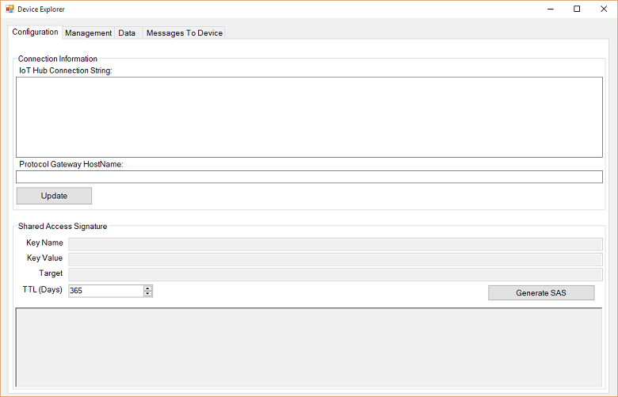
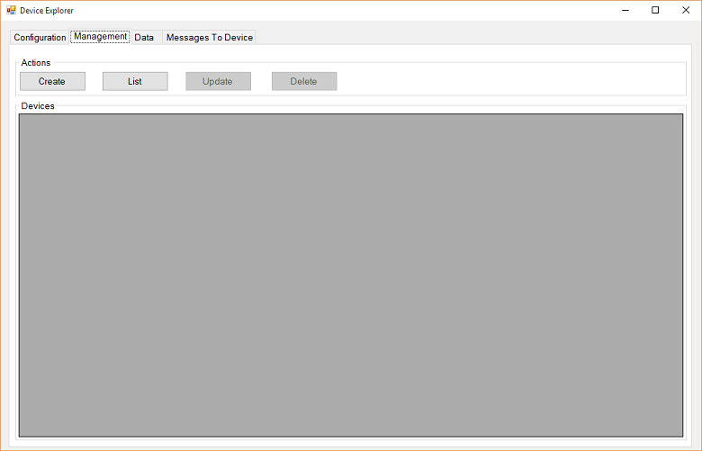
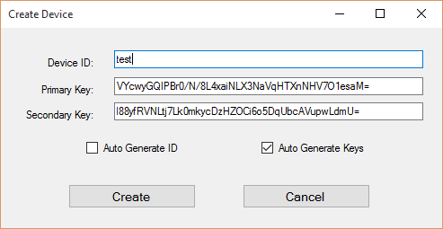

<properties
    pageTitle="Con il dispositivo di Azure IoT SDK per C | Microsoft Azure"
    description="Informazioni sulle e iniziare a lavorare con il codice di esempio nel dispositivo IoT Azure SDK per C."
    services="iot-hub"
    documentationCenter=""
    authors="olivierbloch"
    manager="timlt"
    editor=""/>

<tags
     ms.service="iot-hub"
     ms.devlang="cpp"
     ms.topic="article"
     ms.tgt_pltfrm="na"
     ms.workload="na"
     ms.date="09/06/2016"
     ms.author="obloch"/>

# <a name="introducing-the-azure-iot-device-sdk-for-c"></a>Introduzione al dispositivo di Azure IoT SDK per C

Il **dispositivo di Azure IoT SDK** è un insieme di librerie progettate per semplificare il processo di eventi invio e ricezione di messaggi dal servizio di **Azure IoT Hub** . Ci sono diverse varianti di SDK ogni una piattaforma specifica, ma in questo articolo descrive il **dispositivo di Azure IoT SDK per C**.

Il dispositivo di Azure IoT SDK per C è scritto in ANSI C (C99) per ottimizzare la portabilità. In questo modo è adatto per il funzionamento in un numero di piattaforme e dispositivi, in particolare in cui la riduzione a icona disco e memoria è una priorità.  

Sono disponibili una vasta gamma di piattaforme in cui il SDK è stato verificato (vedere la [Azure Certified per il catalogo dispositivo IoT](https://catalog.azureiotsuite.com/) per informazioni dettagliate). Anche se in questo articolo contiene procedure dettagliate del codice di esempio in esecuzione su piattaforma Windows, tenere presente che il codice descritto in questo articolo corrisponde esattamente l'intervallo delle piattaforme supportate.

In questo articolo verrà introdotto l'architettura del dispositivo di Azure IoT SDK per C. È necessario viene illustrato come inizializzare la libreria del dispositivo, l'invio di eventi a IoT Hub, nonché ricevere messaggi da tale. Le informazioni in questo articolo dovrebbero essere sufficiente per iniziare a utilizzare il SDK, ma anche vengono forniti collegamenti a ulteriori informazioni sulle librerie.

## <a name="sdk-architecture"></a>Architettura SDK

È possibile trovare il **dispositivo di Azure IoT SDK per C** nell'archivio di [Microsoft Azure IoT SDK](https://github.com/Azure/azure-iot-sdks) GitHub e visualizzare i dettagli dell'API del [riferimento all'API C](http://azure.github.io/azure-iot-sdks/c/api_reference/index.html).

L'ultima versione di librerie di sono disponibili nella sezione **Generale** di questo repository:

  

Questo archivio contiene tutta la famiglia di Azure IoT dispositivo SDK. Tuttavia, in questo articolo riguarda il dispositivo di Azure IoT SDK *per C* che può essere trovato nella cartella **c** .

  

* Implementazione di base di SDK sono disponibili nel **iothub\_client** cartella che contiene l'implementazione del livello API più basso in SDK: libreria **IoTHubClient** . Raccolta **IoTHubClient** contiene API implementazione messaggistica elaborati per l'invio di messaggi all'IoT Hub, nonché la ricezione di messaggi da essa. Quando si utilizza questa raccolta, è responsabile per l'implementazione di serializzazione messaggio (non hanno un limite con l'esempio di serializzatore descritto di seguito), mentre altri dettagli per comunicare con IoT Hub vengono gestiti automaticamente.
* La cartella **serializzatore** contiene funzioni di supporto ed esempi che mostra come serializzare dati prima di inviare a Hub di IoT Azure utilizzando la libreria client. Si noti che l'utilizzo del serializzatore non obbligatori e solo fornito per comodità. Se si usa la raccolta **serializzatore** , iniziare con la definizione di un modello che specifica eventi che si desidera inviare a IoT Hub, nonché i messaggi che si prevede di ricevere da essa. Dopo aver definito il modello, SDK fornisce un'area di API che consente di lavorare facilmente eventi e messaggi senza doversi preoccupare dettagli serializzazione.
La raccolta dipende da altre raccolte di Apri origine che implementano trasporto utilizzando diversi protocolli (MQTT, AMQP).
* Raccolta **IoTHubClient** dipende da altre raccolte di Apri origine:
   * Libreria di [Azure C shared utilità](https://github.com/Azure/azure-c-shared-utility) che fornisce funzionalità comuni di attività di base (ad esempio stringa, la modifica di elenco, IO, ecc....) necessaria per diverse SDK C correlata Azure
   * Raccolta di [Azure uAMQP](https://github.com/Azure/azure-uamqp-c) implementazione sul lato client di AMQP ottimizzati per i dispositivi di vincolo delle risorse.
   * Libreria di [Azure uMQTT](https://github.com/Azure/azure-umqtt-c) che è una raccolta generica implementazione del protocollo MQTT e ottimizzati per i dispositivi di vincolo delle risorse.

Questa è più semplice da comprendere esaminando codice di esempio. Nelle sezioni seguenti vengono guidano l'utente tramite un paio di applicazioni di esempio inclusi in SDK. Questa operazione deve fornire un aspetto ottima per le varie funzionalità dei livelli dell'architettura di SDK, nonché un'introduzione alle come funzionano le API.

## <a name="before-running-the-samples"></a>Prima di eseguire gli esempi

Prima di poter eseguire gli esempi nel dispositivo IoT Azure SDK per C è necessario creare un'istanza del servizio nell'abbonamento a Azure se è già non CE l'hai e completare le 2 attività:
* preparare l'ambiente di sviluppo
* ottenere le credenziali di dispositivo.

Se è necessario creare un'istanza di Azure IoT Hub dall'abbonamento Azure, seguire le istruzioni [di seguito](https://github.com/Azure/azure-iot-sdks/blob/master/doc/setup_iothub.md).

Il [file Leggimi](https://github.com/Azure/azure-iot-sdks/tree/master/c) incluso in SDK fornisce istruzioni su come preparare l'ambiente di sviluppo e ottenere le credenziali di dispositivo.
Nelle sezioni seguenti includono alcune altri commenti su queste istruzioni.

### <a name="preparing-your-development-environment"></a>Preparare l'ambiente di sviluppo

Mentre per alcune piattaforme (ad esempio NuGet per Windows o apt_get per Debian e Ubuntu) vengono forniti i pacchetti e gli esempi di utilizzano questi pacchetti quando è disponibile, le istruzioni seguenti illustrano come creare la raccolta e gli esempi di moduli direttamente il codice.

Prima di tutto, è necessario ottenere una copia di SDK da GitHub e quindi creare l'origine. Contattare del ramo **master** di [archivio GitHub](https://github.com/Azure/azure-iot-sdks)per ottenere una copia dell'origine.

Dopo aver scaricato una copia dell'origine, è necessario completare la procedura descritta nell'articolo SDK ["Preparare l'ambiente di sviluppo"](https://github.com/Azure/azure-iot-sdks/blob/master/c/doc/devbox_setup.md).


Di seguito sono riportati alcuni suggerimenti per completare la procedura descritta nella Guida di preparazione:

-   Quando si installa l'utilità di **CMake** , scegliere l'opzione per aggiungere **CMake** al percorso di sistema per **tutti gli utenti** (aggiungendo **all'utente corrente** funziona anche):

  


-   Prima di aprire il **prompt dei comandi di sviluppo per VS2015**, installare gli strumenti della riga di comando fra. Per installare questi strumenti, completare la procedura seguente:

    1. Avviare il programma di installazione di **Visual Studio 2015** (o scegliere **Microsoft Visual Studio 2015** dal Pannello di controllo **programmi e funzionalità** e selezionare **Modifica**).
    
    2. Assicurarsi che sia selezionata la caratteristica **Fra per Windows** nel programma di installazione, ma è anche possibile selezionare l'opzione di **Estensione GitHub per Visual Studio** per garantire l'integrazione di IDE:

        

    3. Completare la configurazione guidata per installare gli strumenti.

    4. Aggiungere la directory **bin** strumenti fra variabile di ambiente **PATH** del sistema. In Windows, questo avrà l'aspetto seguente:

        


Al termine tutti i passaggi descritti nella pagina ["Preparare l'ambiente di sviluppo"](https://github.com/Azure/azure-iot-sdks/blob/master/c/doc/devbox_setup.md) , si è pronti a compilare le applicazioni di esempio.

### <a name="obtaining-device-credentials"></a>Ottenere le credenziali di dispositivo

Ora che l'ambiente di sviluppo è impostata, la prossima operazione da eseguire è ottenere un insieme di credenziali per un dispositivo.  Per un dispositivo in grado di accedere a un hub IoT, è necessario prima aggiungere il dispositivo del Registro di sistema di dispositivo IoT Hub. Quando si aggiunge il dispositivo viene visualizzato un set di credenziali per un dispositivo che è necessario affinché il dispositivo in grado di connettersi a un hub IoT. Le applicazioni di esempio vengono illustrate nella sezione successiva si aspettano queste credenziali sotto forma di una **stringa di connessione di dispositivi**.

Sono disponibili due strumenti disponibili nel repository Apri origine SDK per semplificare la gestione IoT Hub. Uno è un Windows applicazione denominato Gestione dispositivi, il secondo è che un Node basata sul strumento CLI per piattaforme diverse denominato iothub explorer. È possibile acquisire familiarità con questi strumenti [qui](https://github.com/Azure/azure-iot-sdks/blob/master/doc/manage_iot_hub.md).

Come si presenterà tramite esecuzione degli esempi su Windows in questo articolo, verrà utilizzato lo strumento Esplora dispositivi. Ma è anche possibile usare Esplora iothub se si preferiscono strumenti CLI.

Lo strumento [Esplora dispositivi](https://github.com/Azure/azure-iot-sdks/tree/master/tools/DeviceExplorer) utilizza le librerie di servizio IoT Azure per eseguire varie operazioni su IoT Hub, incluse l'aggiunta di dispositivi. Se si utilizza Esplora dispositivi per aggiungere un dispositivo, si riceverà una stringa di connessione corrispondente. È necessario questa stringa di connessione per verificare l'esempio eseguire le applicazioni.

Nel caso in cui non si già familiarità con il processo, la procedura seguente viene descritto come utilizzare Esplora dispositivi per aggiungere un dispositivo e ottenere una stringa di connessione di dispositivi.

È possibile trovare un programma di installazione di Windows per lo strumento Esplora dispositivi nella [pagina di rilascio SDK](https://github.com/Azure/azure-iot-sdks/releases). Ma è anche possibile eseguire lo strumento direttamente dal relativo codice aprendo **[DeviceExplorer.sln](https://github.com/Azure/azure-iot-sdks/blob/master/tools/DeviceExplorer/DeviceExplorer.sln)** in **Visual Studio 2015** e la compilazione della soluzione.

Quando si esegue il programma verrà visualizzata l'interfaccia:

  

Immettere la **Stringa di connessione Hub IoT** nel primo campo e fare clic su **Aggiorna**. In questo modo lo strumento, in modo che possano comunicare con IoT Hub.

Una volta configurata la stringa di connessione IoT Hub fare clic sulla scheda **Gestione** :

  

Verrà visualizzata nel punto in cui è possibile gestire i dispositivi registrati l'hub IoT.

È possibile creare un dispositivo facendo clic su **Crea** . Viene visualizzata una finestra di dialogo con un set di chiavi precompilate (primarie e secondarie). È necessario effettuare è immettere l' **ID di dispositivo** e quindi fare clic su **Crea**.

  

Dopo aver creato il dispositivo, l'elenco di dispositivi viene aggiornato con tutti i dispositivi registrati, incluso quello che appena creato. Se si rapida nuovi dispositivi, si noterà questo menu:

  

Se si sceglie l'opzione **Copia stringa di connessione per dispositivo selezionato** , la stringa di connessione del dispositivo viene copiata negli Appunti. Conservare una copia della stringa di connessione. È necessario durante l'esecuzione di applicazioni di esempio descritte nelle sezioni successive.

Dopo aver completato la procedura indicata sopra, si è pronti per avviare l'esecuzione di codice. Entrambi gli esempi di avere una costante nella parte superiore del file di origine principale che consente di immettere una stringa di connessione. Ad esempio, la riga corrispondente dalla **iothub\_client\_esempio\_amqp** applicazione viene visualizzata come segue.

```
static const char* connectionString = "[device connection string]";
```

Se si desidera seguire su carta, immettere la stringa di connessione di dispositivi, ricompilare la soluzione e sarà possibile eseguire il codice di esempio.

## <a name="iothubclient"></a>IoTHubClient

All'interno di **iothub\_client** cartella repository SDK di iot azure esiste una cartella di **esempi** che contiene un'applicazione denominata **iothub\_client\_esempio\_amqp**.

La versione di Windows di **iothub\_client\_esempio\_ampq** applicazione include la soluzione Visual Studio seguente:

  

Questa soluzione contiene un singolo progetto. È importante notare che sono disponibili quattro pacchetti NuGet installati in questa soluzione:

- Microsoft.Azure.C.SharedUtility
- Microsoft.Azure.IoTHub.AmqpTransport
- Microsoft.Azure.IoTHub.IoTHubClient
- Microsoft.Azure.uamqp

È sempre necessario il pacchetto di **Microsoft.Azure.C.SharedUtility** quando si lavora con SDK. Poiché in questo esempio si basa sulla AMQP, è necessario includere anche i pacchetti **Microsoft.Azure.uamqp** e **Microsoft.Azure.IoTHub.AmqpTransport** (esistono pacchetti equivalenti per MQTT e HTTP). Poiché l'esempio viene utilizzata la raccolta di **IoTHubClient** , è necessario includere anche il pacchetto di **Microsoft.Azure.IoTHub.IoTHubClient** della soluzione.

È possibile trovare l'implementazione dell'applicazione di esempio nel **iothub\_client\_esempio\_amqp.c** file di origine.

Si userà questa applicazione di esempio per scorrere di cosa è necessario per utilizzare la libreria **IoTHubClient** .

### <a name="initializing-the-library"></a>Inizializzazione della libreria

> [AZURE.NOTE] Prima di iniziare con le raccolte, potrebbe essere necessario eseguire alcune inizializzazione specifico della piattaforma. Ad esempio, se si prevede di utilizzare AMQP su Linux è necessario inizializzare la raccolta OpenSSL. Negli esempi di [archivio GitHub](https://github.com/Azure/azure-iot-sdks) chiamare la funzione di utilità **platform_init** quando il client inizia e si chiama la funzione **platform_deinit** prima di uscire. Queste funzioni sono dichiarate nel file di intestazione "platform.h". È necessario esaminare le definizioni di queste funzioni per la piattaforma di destinazione nell' [archivio](https://github.com/Azure/azure-iot-sdks) per determinare se è necessario includere un codice di inizializzazione piattaforma nel client di.

Per iniziare a lavorare con le relative raccolte prima di tutto necessario allocare un handle del client IoT Hub:

```
IOTHUB_CLIENT_HANDLE iotHubClientHandle;
iotHubClientHandle = IoTHubClient_CreateFromConnectionString(connectionString, AMQP_Protocol);
```

Nota il passaggio di una copia della stringa di connessione dispositivo di questa funzione (uno abbiamo ottenuto da Esplora dispositivo). È anche possibile designare il protocollo che si desidera utilizzare. Questo esempio viene usata AMQP, ma anche MQTT e HTTP sono un'opzione.

Quando si dispone di un valido **IOTHUB\_CLIENT\_gestire**, è possibile avviare la chiamata API per gli eventi di inviare e ricevere messaggi dall'IoT Hub. Vengono illustrate più avanti.

### <a name="sending-events"></a>Invio di eventi

Invio di eventi a IoT Hub è necessario completare la procedura seguente:

Prima di tutto, creare un messaggio:

```
EVENT_INSTANCE message;
sprintf_s(msgText, sizeof(msgText), "Message_%d_From_IoTHubClient_Over_AMQP", i);
message.messageHandle = IoTHubMessage_CreateFromByteArray((const unsigned char*)msgText, strlen(msgText);
```

Quindi inviare il messaggio:

```
IoTHubClient_SendEventAsync(iotHubClientHandle, message.messageHandle, SendConfirmationCallback, &message);
```

Ogni volta che si invia un messaggio, specificare un riferimento a una funzione di callback richiamato quando i dati vengono inviati:

```
static void SendConfirmationCallback(IOTHUB_CLIENT_CONFIRMATION_RESULT result, void* userContextCallback)
{
    EVENT_INSTANCE* eventInstance = (EVENT_INSTANCE*)userContextCallback;
    (void)printf("Confirmation[%d] received for message tracking id = %d with result = %s\r\n", callbackCounter, eventInstance->messageTrackingId, ENUM_TO_STRING(IOTHUB_CLIENT_CONFIRMATION_RESULT, result));
    /* Some device specific action code goes here... */
    callbackCounter++;
    IoTHubMessage_Destroy(eventInstance->messageHandle);
}
```

Si noti la chiamata per il **IoTHubMessage\_Destroy** funzionare dopo avere con il messaggio. È necessario effettuare la chiamata per liberare risorse quando è stato creato il messaggio.

### <a name="receiving-messages"></a>Ricezione di messaggi

Ricevere un messaggio è un'operazione asincrona. Prima di tutto, per registrare un callback da richiamare quando il dispositivo riceve un messaggio:

```
int receiveContext = 0;
IoTHubClient_SetMessageCallback(iotHubClientHandle, ReceiveMessageCallback, &receiveContext);
```

L'ultimo parametro è un puntatore void in qualsiasi modo. Nell'esempio, si tratta di un puntatore a un intero ma potrebbe essere puntatore a una struttura di dati più complessa. In questo modo la funzione di callback operare su stato condiviso con il chiamante di questa funzione.

Quando il dispositivo riceve un messaggio, viene richiamata la funzione di callback registrato:

```
static IOTHUBMESSAGE_DISPOSITION_RESULT ReceiveMessageCallback(IOTHUB_MESSAGE_HANDLE message, void* userContextCallback)
{
    int* counter = (int*)userContextCallback;
    const char* buffer;
    size_t size;
    if (IoTHubMessage_GetByteArray(message, (const unsigned char**)&buffer, &size) == IOTHUB_MESSAGE_OK)
    {
        (void)printf("Received Message [%d] with Data: <<<%.*s>>> & Size=%d\r\n", *counter, (int)size, buffer, (int)size);
    }

    /* Some device specific action code goes here... */
    (*counter)++;
    return IOTHUBMESSAGE_ACCEPTED;
}
```

Si noti che si usa il **IoTHubMessage\_GetByteArray** per recuperare il messaggio, che in questo esempio è una stringa.

### <a name="uninitializing-the-library"></a>Annullamento dell'inizializzazione della raccolta

Al termine eventi invio e ricezione di messaggi, è possibile annullare l'inizializzazione della raccolta IoT. A tale scopo, esegue la chiamata di funzione seguente:

```
IoTHubClient_Destroy(iotHubClientHandle);
```

In questo modo le risorse allocata precedentemente dalla **IoTHubClient\_CreateFromConnectionString** funzione.

Come si può notare, è facile per gli eventi di inviare e ricevere messaggi con la raccolta di **IoTHubClient** . La raccolta gestisce i dettagli di comunicare con IoT Hub, inclusi il protocollo da utilizzare (dal punto di vista dello sviluppatore, si tratta di un'opzione di configurazione semplice).

Raccolta **IoTHubClient** vengono forniti anche controllare con precisione come serializzare gli eventi che del dispositivo invia a IoT Hub. In alcuni casi può essere utile, ma in altri casi si tratta di un dettaglio di implementazione con cui non si vuole essere in questione. In tal caso, è possibile utilizzare la libreria di **serializzatore** , verranno descritti nella sezione successiva.

## <a name="serializer"></a>Serializzatore

Livello concettuale raccolta **serializzatore** si trova sopra la raccolta di **IoTHubClient** in SDK. La libreria **IoTHubClient** viene utilizzata per la comunicazione con IoT Hub sottostante, ma aggiunge la funzionalità di modellazione rimuovere il carico di lavoro per gestire la serializzazione dei messaggi dello sviluppatore del. Come funziona questa raccolta è preferibile indicato un esempio.

All'interno di **serializzatore** repository SDK di iot azure è **un'esempi** cartella che contiene un'applicazione denominata **simplesample\_amqp**. La versione di Windows in questo esempio include la soluzione Visual Studio seguente:

  

Come nell'esempio precedente, questa occorrenza include diversi pacchetti NuGet:

- Microsoft.Azure.C.SharedUtility
- Microsoft.Azure.IoTHub.AmqpTransport
- Microsoft.Azure.IoTHub.IoTHubClient
- Microsoft.Azure.IoTHub.Serializer
- Microsoft.Azure.uamqp

Visto in più di questi piani nell'esempio precedente, ma **Microsoft.Azure.IoTHub.Serializer** sono le novità. Questa operazione è necessaria quando si utilizza la libreria di **serializzatore** .

È possibile trovare l'implementazione dell'applicazione di esempio nel **simplesample\_amqp.c** file.

Nelle sezioni seguenti vengono guidano l'utente attraverso le parti principali di questo esempio.

### <a name="initializing-the-library"></a>Inizializzazione della libreria

Per iniziare a lavorare con la raccolta **serializzatore** , è necessario chiamare inizializzazione API:

```
serializer_init(NULL);

IOTHUB_CLIENT_HANDLE iotHubClientHandle = IoTHubClient_CreateFromConnectionString(connectionString, AMQP_Protocol);

ContosoAnemometer* myWeather = CREATE_MODEL_INSTANCE(WeatherStation, ContosoAnemometer);
```

La chiamata alla **serializzatore\_inizializzazione** funzione è una chiamata monouso e viene utilizzato per inizializzare la raccolta sottostante. Quindi, chiamare il **IoTHubClient\_CreateFromConnectionString** funzione, la stessa API come illustrato nell'esempio **IoTHubClient** . La chiamata imposta la stringa di connessione dispositivo (si tratta anche nel punto in cui si sceglie il protocollo che si desidera utilizzare). Si noti che in questo esempio AMQP come trasporto, ma potrebbe avere utilizzata HTTP.

Infine, chiamare il **Crea\_modello\_istanza** funzione. Si noti che **WeatherStation** lo spazio dei nomi del modello e **ContosoAnemometer** sono il nome del modello. Dopo aver creato l'istanza del modello, è possibile utilizzare per iniziare subito a inviare gli eventi e la ricezione di messaggi. Tuttavia, è importante tenere presente che un modello.

### <a name="defining-the-model"></a>La definizione del modello

Un modello nella raccolta **serializzatore** definisce gli eventi che il dispositivo è possibile inviare IoT Hub e i messaggi, denominati *Azioni* nel linguaggio di modellazione, che può ricevere. Definire un modello utilizzando un insieme di macro come C il **simplesample\_amqp** applicazione di esempio:

```
BEGIN_NAMESPACE(WeatherStation);

DECLARE_MODEL(ContosoAnemometer,
WITH_DATA(ascii_char_ptr, DeviceId),
WITH_DATA(double, WindSpeed),
WITH_ACTION(TurnFanOn),
WITH_ACTION(TurnFanOff),
WITH_ACTION(SetAirResistance, int, Position)
);

END_NAMESPACE(WeatherStation);
```

Il **iniziare\_spazio dei nomi** e **Fine\_spazio dei nomi** macro entrambi richiedono lo spazio dei nomi del modello come argomento. È previsto alcun testo compreso tra le macro è la definizione dei modelli e le strutture di utilizzano i modelli di dati.

In questo esempio, esiste un unico modello denominato **ContosoAnemometer**. Questo modello consente di definire due eventi che il dispositivo può inviare messaggi a IoT Hub: **DeviceId** e **velocità del vento**. Definisce inoltre tre azioni (messaggi) in grado di ricevere il dispositivo: **TurnFanOn**, **TurnFanOff**e **SetAirResistance**. Ogni evento ha un tipo di ogni azione è un nome (e facoltativamente un insieme di parametri).

Gli eventi e le azioni definite nel modello di definiscono una superficie API che è possibile utilizzare per inviare gli eventi a IoT Hub, come rispondere ai messaggi inviati al dispositivo. Al meglio viene considerato un esempio.

### <a name="sending-events"></a>Invio di eventi

Il modello definisce gli eventi che è possibile inviare a IoT Hub. In questo esempio, che indica che uno di questi due eventi definiti mediante la macro **WITH_DATA** . Ad esempio, se si desidera inviare un evento di **velocità del vento** a un hub IoT, sono disponibili alcuni passaggi previsti dal successo. Il primo è per impostare i dati che si desidera inviare:

```
myWeather->WindSpeed = 15;
```

Il modello definita in precedenza consente di eseguire questa operazione mediante l'impostazione di un membro di una **struttura**. Quindi abbiamo serializzare l'evento a cui che si desidera inviare:

```
unsigned char* destination;
size_t destinationSize;

SERIALIZE(&destination, &destinationSize, myWeather->WindSpeed);
```

Questo codice serializza l'evento a un buffer (a cui fa riferimento **destinazione**). Infine, verrà inviato l'evento a hub IoT con questo codice:

```
sendMessage(iotHubClientHandle, destination, destinationSize);
```

Si tratta di una funzione di supporto nell'applicazione di esempio che invia il nostro evento serializzato a IoT Hub:

```
static void sendMessage(IOTHUB_CLIENT_HANDLE iotHubClientHandle, const unsigned char* buffer, size_t size)
{
    static unsigned int messageTrackingId;
    IOTHUB_MESSAGE_HANDLE messageHandle = IoTHubMessage_CreateFromByteArray(buffer, size);
    if (messageHandle != NULL)
    {
        if (IoTHubClient_SendEventAsync(iotHubClientHandle, messageHandle, sendCallback, (void*)(uintptr_t)messageTrackingId) != IOTHUB_CLIENT_OK)
        {
            printf("failed to hand over the message to IoTHubClient");
        }
        else
        {
            printf("IoTHubClient accepted the message for delivery\r\n");
        }

        IoTHubMessage_Destroy(messageHandle);
    }
    free((void*)buffer);
    messageTrackingId++;
}
```

Questo codice è molto simile a quello di cui è visualizzato nella **iothub\_client\_esempio\_amqp** applicazione, in cui viene creato un messaggio da una matrice di byte e quindi **IoTHubClient\_SendEventAsync** per inviare a IoT Hub. Dopo che è sufficiente devono liberare handle del messaggio e serializzato buffer di dati che è ricevuti in precedenza.

Il secondo ultimo parametro del **IoTHubClient\_SendEventAsync** è un riferimento a una funzione di callback chiamata quando i dati vengono inviati correttamente. Ecco un esempio di una funzione di callback:

```
void sendCallback(IOTHUB_CLIENT_CONFIRMATION_RESULT result, void* userContextCallback)
{
    int messageTrackingId = (intptr_t)userContextCallback;

    (void)printf("Message Id: %d Received.\r\n", messageTrackingId);

    (void)printf("Result Call Back Called! Result is: %s \r\n", ENUM_TO_STRING(IOTHUB_CLIENT_CONFIRMATION_RESULT, result));
}
```

Il secondo parametro è un puntatore al contesto utente. il puntatore stesso è passati a **IoTHubClient\_SendEventAsync**. In questo caso il contesto è un contatore semplice, ma può essere tutto ciò che vuole.

È tutto esiste all'invio di eventi. L'unica verso sinistra per coprire viene spiegato come ricevere messaggi.

### <a name="receiving-messages"></a>Ricezione di messaggi

Ricevere un messaggio funziona allo stesso modo per l'aspetto dei messaggi di lavoro nella raccolta **IoTHubClient** . Innanzitutto, registrare una funzione di callback messaggio:

```
IoTHubClient_SetMessageCallback(iotHubClientHandle, IoTHubMessage, myWeather)
```

Quindi, scrivere la funzione di callback richiamato quando si riceve un messaggio:

```
static IOTHUBMESSAGE_DISPOSITION_RESULT IoTHubMessage(IOTHUB_MESSAGE_HANDLE message, void* userContextCallback)
{
    IOTHUBMESSAGE_DISPOSITION_RESULT result;
    const unsigned char* buffer;
    size_t size;
    if (IoTHubMessage_GetByteArray(message, &buffer, &size) != IOTHUB_MESSAGE_OK)
    {
        printf("unable to IoTHubMessage_GetByteArray\r\n");
        result = EXECUTE_COMMAND_ERROR;
    }
    else
    {
        /*buffer is not zero terminated*/
        char* temp = malloc(size + 1);
        if (temp == NULL)
        {
            printf("failed to malloc\r\n");
            result = EXECUTE_COMMAND_ERROR;
        }
        else
        {
            memcpy(temp, buffer, size);
            temp[size] = '\0';
            EXECUTE_COMMAND_RESULT executeCommandResult = EXECUTE_COMMAND(userContextCallback, temp);
            result =
                (executeCommandResult == EXECUTE_COMMAND_ERROR) ? IOTHUBMESSAGE_ABANDONED :
                (executeCommandResult == EXECUTE_COMMAND_SUCCESS) ? IOTHUBMESSAGE_ACCEPTED :
                IOTHUBMESSAGE_REJECTED;
            free(temp);
        }
    }
    return result;
}
```

Questo codice è standard, ovvero la stessa operazione per qualsiasi soluzione. Questa funzione riceve il messaggio e si occupa di inviarlo alla funzione appropriata tramite la chiamata a **EXECUTE\_comando**. La funzione dipende a questo punto la definizione di azioni nel nostro modello.

Quando si definisce un'azione nel modello, è necessario implementare una funzione chiamata quando il dispositivo riceve il messaggio corrispondente. Ad esempio, se il modello consente di definire l'azione:

```
WITH_ACTION(SetAirResistance, int, Position)
```

È necessario definire una funzione con questa firma:

```
EXECUTE_COMMAND_RESULT SetAirResistance(ContosoAnemometer* device, int Position)
{
    (void)device;
    (void)printf("Setting Air Resistance Position to %d.\r\n", Position);
    return EXECUTE_COMMAND_SUCCESS;
}
```

Si noti che il nome della funzione corrisponda al nome dell'azione nel modello e che i parametri della funzione corrispondono ai parametri specificati per l'azione. Il primo parametro è sempre necessario e contiene un puntatore all'istanza del modello.

Quando il dispositivo riceve un messaggio che soddisfa la firma, la funzione corrispondente. Pertanto, oltre che sia necessario includere ottenuto il codice da **IoTHubMessage**, la ricezione di messaggi è sufficiente la definizione di una funzione semplice per ogni azione definiti nel modello.

### <a name="uninitializing-the-library"></a>Annullamento dell'inizializzazione della raccolta

Al termine dati invio e ricezione di messaggi, è possibile annullare l'inizializzazione della raccolta IoT:

```
        DESTROY_MODEL_INSTANCE(myWeather);
    }
    IoTHubClient_Destroy(iotHubClientHandle);
}
serializer_deinit();
```

Ognuna di queste tre funzioni Allinea con le funzioni di inizializzazione tre descritte in precedenza. La chiamata a queste API assicura liberare risorse assegnate in precedenza.

## <a name="next-steps"></a>Passaggi successivi

In questo articolo contemplato Introduzione all'utilizzo di raccolte di **Azure IoT dispositivo SDK per C**. Fornito con le informazioni necessarie per comprendere quali applicazioni sono incluse in SDK, l'architettura e su come iniziare a lavorare con gli esempi di Windows. Articolo successivo continua la descrizione di SDK per spiegare [ulteriori informazioni sulla raccolta IoTHubClient](iot-hub-device-sdk-c-iothubclient.md).

Per ulteriori informazioni sullo sviluppo per IoT Hub, vedere [IoT Hub SDK][lnk-sdks].

Per esplorare ulteriormente le funzionalità di IoT Hub, vedere:

- [La simulazione di un dispositivo con IoT Gateway SDK][lnk-gateway]


[lnk-file upload]: iot-hub-csharp-csharp-file-upload.md
[lnk-create-hub]: iot-hub-rm-template-powershell.md
[lnk-c-sdk]: iot-hub-device-sdk-c-intro.md
[lnk-sdks]: iot-hub-devguide-sdks.md

[lnk-gateway]: iot-hub-linux-gateway-sdk-simulated-device.md
