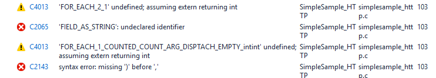

<properties
    pageTitle="Azure IoT dispositivo SDK per C - serializzatore | Microsoft Azure"
    description="Ulteriori informazioni sull'utilizzo di raccolta serializzatore nel dispositivo IoT Azure SDK per C"
    services="iot-hub"
    documentationCenter=""
    authors="olivierbloch"
    manager="timlt"
    editor=""/>

<tags
     ms.service="iot-hub"
     ms.devlang="cpp"
     ms.topic="article"
     ms.tgt_pltfrm="na"
     ms.workload="na"
     ms.date="09/06/2016"
     ms.author="obloch"/>

# <a name="microsoft-azure-iot-device-sdk-for-c--more-about-serializer"></a>Dispositivo di Microsoft Azure IoT SDK per C: ulteriori informazioni, vedere serializzatore

L' [articolo prima](iot-hub-device-sdk-c-intro.md) di questa serie introdotto il **dispositivo di Azure IoT SDK per C**. Articolo successivo fornita una descrizione dettagliata di [**IoTHubClient**](iot-hub-device-sdk-c-iothubclient.md). In questo articolo viene completata la copertura di SDK fornendo una descrizione dettagliata del componente rimanente: la raccolta di **serializzatore** .

L'articolo introduttivo viene descritto come utilizzare la libreria di **serializzatore** di eventi a inviare e ricevere messaggi dall'IoT Hub. In questo articolo è estendere tale discussione, fornendo una descrizione più completa di come modello di dati con il linguaggio delle macro **serializzatore** . L'articolo anche include informazioni più dettagliate su come la raccolta serializza messaggi (e in alcuni casi, come è possibile controllare il comportamento di serializzazione). Verranno inoltre descritti alcuni è possibile modificare i parametri che determinano le dimensioni dei modelli creati.

Infine, l'articolo effettua nuovamente richieste alcuni argomenti trattati in articoli precedenti, ad esempio messaggio e la gestione di proprietà. Come è possibile scoprire, tali funzioni nello stesso modo utilizzando la libreria **serializzatore** in modo raccolta **IoTHubClient** .

Tutti gli elementi descritti in questo articolo si basa su campioni SDK **serializzatore** . Se si desidera seguire su carta, vedere il **simplesample\_amqp** e **simplesample\_http** applicazioni incluse nel dispositivo IoT Azure SDK per C.

È possibile trovare il **dispositivo di Azure IoT SDK per C** nell'archivio di [Microsoft Azure IoT SDK](https://github.com/Azure/azure-iot-sdks) GitHub e visualizzare i dettagli dell'API del [riferimento all'API C](http://azure.github.io/azure-iot-sdks/c/api_reference/index.html).

## <a name="the-modeling-language"></a>Il linguaggio di modellazione

L' [articolo introduttivo](iot-hub-device-sdk-c-intro.md) in questa serie introdotto il **dispositivo di Azure IoT SDK per C** modellazione del linguaggio tramite l'esempio fornito nel **simplesample\_amqp** applicazione:

```
BEGIN_NAMESPACE(WeatherStation);

DECLARE_MODEL(ContosoAnemometer,
WITH_DATA(ascii_char_ptr, DeviceId),
WITH_DATA(double, WindSpeed),
WITH_ACTION(TurnFanOn),
WITH_ACTION(TurnFanOff),
WITH_ACTION(SetAirResistance, int, Position)
);

END_NAMESPACE(WeatherStation);
```

Come si può notare, il linguaggio di modellazione è basato sulle macro C. Si iniziano sempre con la definizione di una **inizio\_spazio dei nomi** e terminano sempre con **Fine\_spazio dei nomi**. Vengono in genere per assegnare un nome lo spazio dei nomi per la propria azienda o, in questo esempio, il progetto che sta lavorando.

Cosa viene inserito lo spazio dei nomi sono definizioni di modello. In questo caso, esiste un unico modello per un anemometer. Ancora una volta, il modello denominato niente, ma in genere denominata per il dispositivo o un tipo di dati che si desidera scambiare con IoT Hub.  

Modelli contengano una definizione degli eventi che è possibile ingresso a IoT Hub ( *dati*) e i messaggi ricevuti dall'IoT Hub ( *Azioni*). Come può vedere dell'esempio, eventi hanno un tipo e un nome. azioni dispongono di un nome e parametri facoltativi (ciascuno con un tipo di).

Che cos' non è illustrati in questo esempio sono altri tipi di dati supportati da SDK. Verranno illustrate più avanti.

> [AZURE.NOTE] IoT Hub fa riferimento ai dati di che un dispositivo invia a tale come *eventi*, mentre il linguaggio di modellazione fa riferimento a tale come *dati* (definita utilizzando **WITH_DATA**). Analogamente, IoT Hub fa riferimento ai dati inviati ai dispositivi come *messaggi*, mentre il linguaggio di modellazione fa riferimento a tale come *Azioni* (definita utilizzando **WITH_ACTION**). Prestare particolare attenzione i termini che seguono possono essere utilizzati in modo intercambiabile in questo articolo.

### <a name="supported-data-types"></a>Tipi di dati supportati

Nei modelli creati con la raccolta **serializzatore** sono supportati i tipi di dati seguenti:

| Tipo                    | Descrizione                            |
|-------------------------|----------------------------------------|
| doppia                  | doppia precisione numero a virgola mobile |
| int                     | numero intero a 32 bit                         |
| margine di flessibilità                   | numero a virgola mobile e precisione singola |
| lungo                    | intero lungo                           |
| int8\_t                 | numero intero a 8 bit                          |
| Int16\_t                | numero intero a 16 bit                         |
| Int32\_t                | numero intero a 32 bit                         |
| Int64\_t                | numero intero a 64 bit                         |
| bool                    | valore booleano                                |
| ASCII\_char\_ptr        | Stringa ASCII                           |
| EDM\_data\_ora\_scarto | offset di data e ora                       |
| EDM\_GUID               | GUID                                   |
| EDM\_binario             | binario                                 |
| DICHIARARE\_struttura         | tipo di dati complessi                      |

Iniziamo con l'ultimo tipo di dati. Il **DECLARE\_struttura** consente di definire i tipi di dati complessi, sono raggruppamenti di altri tipi di base. Questi raggruppamenti consentono di definire un modello è simile alla seguente:

```
DECLARE_STRUCT(TestType,
double, aDouble,
int, aInt,
float, aFloat,
long, aLong,
int8_t, aInt8,
uint8_t, auInt8,
int16_t, aInt16,
int32_t, aInt32,
int64_t, aInt64,
bool, aBool,
ascii_char_ptr, aAsciiCharPtr,
EDM_DATE_TIME_OFFSET, aDateTimeOffset,
EDM_GUID, aGuid,
EDM_BINARY, aBinary
);

DECLARE_MODEL(TestModel,
WITH_DATA(TestType, Test)
);
```

Il modello contiene un evento singolo dati di tipo **TestType**. **TestType** è un tipo complesso che include più membri che collettivamente illustrano i tipi di base supportati dal **serializzatore** modellazione del linguaggio.

Con un modello simile, è possibile scrivere codice per inviare dati a IoT Hub che viene visualizzata come segue:

```
TestModel* testModel = CREATE_MODEL_INSTANCE(MyThermostat, TestModel);

testModel->Test.aDouble = 1.1;
testModel->Test.aInt = 2;
testModel->Test.aFloat = 3.0f;
testModel->Test.aLong = 4;
testModel->Test.aInt8 = 5;
testModel->Test.auInt8 = 6;
testModel->Test.aInt16 = 7;
testModel->Test.aInt32 = 8;
testModel->Test.aInt64 = 9;
testModel->Test.aBool = true;
testModel->Test.aAsciiCharPtr = "ascii string 1";

time_t now;
time(&now);
testModel->Test.aDateTimeOffset = GetDateTimeOffset(now);

EDM_GUID guid = { { 0x00, 0x01, 0x02, 0x03, 0x04, 0x05, 0x06, 0x07, 0x08, 0x09, 0x0A, 0x0B, 0x0C, 0x0D, 0x0E, 0x0F } };
testModel->Test.aGuid = guid;

unsigned char binaryArray[3] = { 0x01, 0x02, 0x03 };
EDM_BINARY binaryData = { sizeof(binaryArray), &binaryArray };
testModel->Test.aBinary = binaryData;

SendAsync(iotHubClientHandle, (const void*)&(testModel->Test));
```

In pratica, abbiamo stiamo assegnazione di un valore per ogni membro della struttura di **Test** e quindi si chiama **SendAsync** per inviare gli eventi di dati di **Test** nel cloud. **SendAsync** è una funzione di supporto per l'invio di un evento singolo dati a IoT Hub:

```
void SendAsync(IOTHUB_CLIENT_LL_HANDLE iotHubClientHandle, const void *dataEvent)
{
    unsigned char* destination;
    size_t destinationSize;
    if (SERIALIZE(&destination, &destinationSize, *(const unsigned char*)dataEvent) ==
    {
        // null terminate the string
        char* destinationAsString = (char*)malloc(destinationSize + 1);
        if (destinationAsString != NULL)
        {
            memcpy(destinationAsString, destination, destinationSize);
            destinationAsString[destinationSize] = '\0';
            IOTHUB_MESSAGE_HANDLE messageHandle = IoTHubMessage_CreateFromString(destinationAsString);
            if (messageHandle != NULL)
            {
                IoTHubClient_SendEventAsync(iotHubClientHandle, messageHandle, sendCallback, (void*)0);

                IoTHubMessage_Destroy(messageHandle);
            }
            free(destinationAsString);
        }
        free(destination);
    }
}
```

Questa funzione serializza gli eventi di dati specificato e invia a IoT Hub utilizzando **IoTHubClient\_SendEventAsync**. Questo è lo stesso codice descritto in articoli precedenti (**SendAsync** contiene la logica in una funzione comoda).

Un altra funzione di supporto utilizzata nel codice precedente è **GetDateTimeOffset**. Questa funzione trasforma il tempo specificato in un valore di tipo **EDM\_data\_ora\_OFFSET**:

```
EDM_DATE_TIME_OFFSET GetDateTimeOffset(time_t time)
{
    struct tm newTime;
    gmtime_s(&newTime, &time);
    EDM_DATE_TIME_OFFSET dateTimeOffset;
    dateTimeOffset.dateTime = newTime;
    dateTimeOffset.fractionalSecond = 0;
    dateTimeOffset.hasFractionalSecond = 0;
    dateTimeOffset.hasTimeZone = 0;
    dateTimeOffset.timeZoneHour = 0;
    dateTimeOffset.timeZoneMinute = 0;
    return dateTimeOffset;
}
```

Se si esegue questo codice, il seguente messaggio viene inviato a IoT Hub:

```
{"aDouble":1.100000000000000, "aInt":2, "aFloat":3.000000, "aLong":4, "aInt8":5, "auInt8":6, "aInt16":7, "aInt32":8, "aInt64":9, "aBool":true, "aAsciiCharPtr":"ascii string 1", "aDateTimeOffset":"2015-09-14T21:18:21Z", "aGuid":"00010203-0405-0607-0809-0A0B0C0D0E0F", "aBinary":"AQID"}
```

Si noti che la serializzazione JSON, qual è il formato generato dalla libreria **serializzatore** . Si noti inoltre che ogni membro dell'oggetto JSON serializzato corrisponde ai membri di **TestType** definiti nel nostro modello. I valori corrispondono esattamente anche quelle utilizzate nel codice. Tuttavia, si noti che i dati binari con codifica base 64: "AQID" è la base 64 codifica di {0x01, 0x02, 0x03}.

In questo esempio viene il vantaggio derivante dall'uso della raccolta **serializzatore** - consente di inviare JSON nel cloud, senza la necessità di gestire in modo esplicito serializzazione nell'applicazione. Sufficiente preoccuparsi di impostazione i valori degli eventi dati il nostro modello e quindi chiamare API semplice per inviare gli eventi nel cloud.

Con queste informazioni, possiamo definire modelli che includono l'intervallo di tipi di dati supportati, inclusi i tipi di complessi (è possibile includere anche tipi complessi in altri tipi complessi). Tuttavia, ha serializzata JSON generati da un punto importante viene visualizzata l'esempio precedente. *Come* si inviare i dati con la raccolta **serializzatore** determina esattamente come formato di JSON. Tale punto particolare è qual verranno illustrate successivo.

## <a name="more-about-serialization"></a>Altre informazioni

La sezione precedente in evidenza un esempio di output generato dalla libreria di **serializzatore** . In questa sezione verrà spiegata la raccolta come serializza i dati e come è possibile controllare questo comportamento utilizzando la serializzazione API.

Per spostare la discussione sulla serializzazione, è necessario utilizzare un nuovo modello in base a un termostato. Prima di tutto, si fornire alcune informazioni generali su scenario si sta tentando di indirizzi.

Si desidera un termostato che misura temperatura e umidità del modello. Ogni parte di dati verrà inviata a IoT Hub in modo leggermente diverso. Per impostazione predefinita, ingresses termostato un evento di temperatura ogni 2 minuti; un evento umidità è ingressed ogni 15 minuti. Una volta ingressed entrambi gli eventi, deve includere un timestamp che mostra il tempo che è stato misurato corrispondente temperatura o umidità.

Dato questo scenario, verrà illustrata con due diversi modi per modellare i dati e verrà spiegato l'effetto che ha installato modellazione in output serializzato.

### <a name="model-1"></a>Modello di 1

Ecco la prima versione di un modello che supporta lo scenario precedente:

```
BEGIN_NAMESPACE(Contoso);

DECLARE_STRUCT(TemperatureEvent,
int, Temperature,
EDM_DATE_TIME_OFFSET, Time);

DECLARE_STRUCT(HumidityEvent,
int, Humidity,
EDM_DATE_TIME_OFFSET, Time);

DECLARE_MODEL(Thermostat,
WITH_DATA(TemperatureEvent, Temperature),
WITH_DATA(HumidityEvent, Humidity)
);

END_NAMESPACE(Contoso);
```

Si noti che il modello include due eventi di dati: **temperatura** e **umidità**. Diversamente da quanto succede esempi precedenti, il tipo di ogni evento è una struttura mediante **DECLARE\_struttura**. **TemperatureEvent** include una misura di temperatura e un timestamp; **HumidityEvent** contiene una misura umidità e un timestamp. Questo modello offre un modo naturale per modellare i dati per lo scenario descritto in precedenza. Quando si invia un evento nel cloud, è necessario inviare temperatura/timestamp o da una coppia di umidità/timestamp.

È possibile inviare un evento di temperatura nel cloud usando il codice, ad esempio le operazioni seguenti:

```
time_t now;
time(&now);
thermostat->Temperature.Temperature = 75;
thermostat->Temperature.Time = GetDateTimeOffset(now);

unsigned char* destination;
size_t destinationSize;
if (SERIALIZE(&destination, &destinationSize, thermostat->Temperature) == IOT_AGENT_OK)
{
    sendMessage(iotHubClientHandle, destination, destinationSize);
}
```

È necessario usare valori hard-coded per temperatura e umidità nel codice di esempio, ma immaginare che vengono effettivamente recuperate questi valori tramite campione sensori corrispondenti nel termostato.

Il codice precedente utilizza l'helper **GetDateTimeOffset** che è stata introdotta in precedenza. Per motivi che diventeranno deselezionare successive, questo codice separa in modo esplicito l'attività di serializzazione e invio dell'evento. Il codice precedente serializza l'evento temperatura in un buffer. Quindi, **sendMessage** è una funzione di supporto (incluse in **simplesample\_amqp**) che invia l'evento a IoT Hub:

```
static void sendMessage(IOTHUB_CLIENT_HANDLE iotHubClientHandle, const unsigned char* buffer, size_t size)
{
    static unsigned int messageTrackingId;
    IOTHUB_MESSAGE_HANDLE messageHandle = IoTHubMessage_CreateFromByteArray(buffer, size);
    if (messageHandle != NULL)
    {
        IoTHubClient_SendEventAsync(iotHubClientHandle, messageHandle, sendCallback, (void*)(uintptr_t)messageTrackingId);

        IoTHubMessage_Destroy(messageHandle);
    }
    free((void*)buffer);
}
```

Questo codice è un sottoinsieme dell'helper **SendAsync** descritte nella sezione precedente, pertanto abbiamo non è possibile vedere su di esso nuovamente.

Quando si esegue il codice precedente per inviare l'evento temperatura, questo modulo serializzato dell'evento verrà inviato a IoT Hub:

```
{"Temperature":75, "Time":"2015-09-17T18:45:56Z"}
```

Abbiamo stiamo l'invio di una temperatura del tipo **TemperatureEvent** e struttura contiene un membro la **temperatura** e **l'ora** . Questo è riflesso direttamente nei dati serializzati.

Analogamente, è possibile inviare un evento umidità con questo codice:

```
thermostat->Humidity.Humidity = 45;
thermostat->Humidity.Time = GetDateTimeOffset(now);
if (SERIALIZE(&destination, &destinationSize, thermostat->Humidity) == IOT_AGENT_OK)
{
    sendMessage(iotHubClientHandle, destination, destinationSize);
}
```

Il modulo serializzato viene inviato a IoT Hub viene visualizzata come segue:

```
{"Humidity":45, "Time":"2015-09-17T18:45:56Z"}
```

Anche in questo caso come previsto.

Con questo modello, si possono immaginare come altri eventi possono essere aggiunte facilmente. Definire più strutture utilizzando **DECLARE\_struttura**e includere l'evento corrispondente nel modello utilizzando **con\_dati**.

A questo punto, possibile modificare il modello in modo che includa gli stessi dati ma con una struttura diversa.

### <a name="model-2"></a>Modello di 2

Valutare la possibilità di questo modello alternativo a quello precedente:

```
DECLARE_MODEL(Thermostat,
WITH_DATA(int, Temperature),
WITH_DATA(int, Humidity),
WITH_DATA(EDM_DATE_TIME_OFFSET, Time)
);
```

In questo caso è stata eliminata la **DECLARE\_struttura** macro e semplicemente la definizione di elementi di dati da questo scenario utilizzando tipi semplici dal linguaggio di modellazione.

Solo per il momento è possibile ignorare l'evento **ora** . Con tale riposo, ecco il codice in ingresso **temperatura**:

```
time_t now;
time(&now);
thermostat->Temperature = 75;

unsigned char* destination;
size_t destinationSize;
if (SERIALIZE(&destination, &destinationSize, thermostat->Temperature) == IOT_AGENT_OK)
{
    sendMessage(iotHubClientHandle, destination, destinationSize);
}
```

Questo codice invia l'evento serializzato seguente al IoT Hub:

```
{"Temperature":75}
```

E il codice per l'invio dell'evento umidità viene visualizzata come segue:

```
thermostat->Humidity = 45;
if (SERIALIZE(&destination, &destinationSize, thermostat->Humidity) == IOT_AGENT_OK)
{
    sendMessage(iotHubClientHandle, destination, destinationSize);
}
```

Questo codice invio di tale IoT Hub:

```
{"Humidity":45}
```

Finora non sono ancora presenti sorprese. A questo punto è necessario modificare come si usa la macro SERIALIZE.

La macro **SERIALIZE** può richiedere più eventi di dati come argomenti. In questo modo si serializzare evento **temperatura** e **umidità** insieme e inviarle a IoT Hub in un'unica chiamata:

```
if (SERIALIZE(&destination, &destinationSize, thermostat->Temperature, thermostat->Humidity) == IOT_AGENT_OK)
{
    sendMessage(iotHubClientHandle, destination, destinationSize);
}
```

Si può immaginare che il risultato di questo codice è che gli eventi di due dati vengono inviati a IoT Hub:

[

{"Temperatura": 75},

{"Umidità": 45}

]

In altre parole, si potrebbe aspettare che il codice è diverso da quello di invio **temperatura** e **umidità** separatamente. È utile solo per passare entrambi gli eventi **SERIALIZE** nella stessa chiamata. Tuttavia, non è che le maiuscole/minuscole. Se, tuttavia, il codice precedente invia questo evento singolo dati all'IoT Hub:

{"Temperatura": 75, "umidità": 45}

Può sembrare strana perché il nostro modello definisce **temperatura** e **umidità** come due eventi *distinti* :

```
DECLARE_MODEL(Thermostat,
WITH_DATA(int, Temperature),
WITH_DATA(int, Humidity),
WITH_DATA(EDM_DATE_TIME_OFFSET, Time)
);
```

Al punto di più questi eventi in cui **temperatura** e **umidità** sono nella stessa struttura non è modello:

```
DECLARE_STRUCT(TemperatureAndHumidityEvent,
int, Temperature,
int, Humidity,
);

DECLARE_MODEL(Thermostat,
WITH_DATA(TemperatureAndHumidityEvent, TemperatureAndHumidity),
);
```

Se è stato usato questo modello, sarebbe più semplice da comprendere come **temperatura** e **umidità** verrebbe inviato lo stesso messaggio serializzato. Tuttavia potrebbe non essere Cancella perché funziona in questo modo quando si passano entrambi gli eventi dati **SERIALIZE** tramite modello 2.

Questo comportamento risulta più semplice da comprendere se si conoscono ipotesi che effettua la raccolta di **serializzatore** . Per organizzare meglio questo necessario tornare al nostro modello:

```
DECLARE_MODEL(Thermostat,
WITH_DATA(int, Temperature),
WITH_DATA(int, Humidity),
WITH_DATA(EDM_DATE_TIME_OFFSET, Time)
);
```

Pensare di questo modello in termini di orientato agli oggetti. In questo caso è stiamo modellazione un dispositivo fisico (termostato) e tale dispositivo include attributi come la **temperatura** e **umidità**.

È possibile inviare lo stato dell'intero del modello con codice, ad esempio le operazioni seguenti:

```
if (SERIALIZE(&destination, &destinationSize, thermostat->Temperature, thermostat->Humidity, thermostat->Time) == IOT_AGENT_OK)
{
    sendMessage(iotHubClientHandle, destination, destinationSize);
}
```

Supponendo che i valori della temperatura, umidità e l'ora sono impostate, si vedrà un evento … inviato a IoT Hub:

```
{"Temperature":75, "Humidity":45, "Time":"2015-09-17T18:45:56Z"}
```

In alcuni casi potrebbe essere solo inviare *alcune* proprietà del modello nel cloud (questa operazione è particolarmente vera se il modello contiene un numero elevato di eventi di dati). È utile inviare solo un sottoinsieme di dati eventi, come nell'esempio precedente:

```
{"Temperature":75, "Time":"2015-09-17T18:45:56Z"}
```

Verrà generato lo stesso evento serializzato come se fosse stato eseguito definito un **TemperatureEvent** con un membro **temperatura** e **l'ora** come con il modello 1. In questo caso è stato possibile generare lo stesso evento serializzato utilizzando un modello diverso (modello 2) perché è chiamato **SERIALIZE** in modo diverso.

Il punto importante è che se si passano più eventi di dati a **SERIALIZE,** quindi si presuppone che ogni evento è una proprietà di un singolo oggetto JSON.

L'approccio ottimale dipende dal è e come si pensa il modello. Se si sta inviando "eventi" nel cloud e ogni evento contiene un insieme di proprietà predefinito, quindi il primo approccio molto più significativo. In questo caso è necessario utilizzare **DECLARE\_struttura** per definire la struttura di ogni evento e quindi includerli nel modello senza il **con\_dati** macro. Quindi inviare ogni evento come è stato fatto il cognome indicati. In questo approccio è necessario passare solo un evento singolo dati al **SERIALIZZATORE**.

Se si pensa il modello in modo orientato agli oggetti, il secondo approccio può soddisfare è. In questo caso, gli elementi definiti tramite **con\_dati** Elenca le proprietà"" dell'oggetto. Passare un sottoinsieme di eventi a **SERIALIZE** che si è soddisfatti, a seconda quantità dello stato di "dell'oggetto" da inviare al cloud.

Approccio nether è errato o a destra. È sufficiente sapere come funziona la raccolta **serializzatore** e scegliere l'approccio di modellazione più adatto alle proprie esigenze.

## <a name="message-handling"></a>Gestione dei messaggi

Finora in questo articolo è illustrata soltanto l'invio di eventi a IoT Hub e non è indirizzato la ricezione di messaggi. Il motivo è che è necessario conoscere la ricezione di messaggi ampiamente stato nascosto in un [articolo precedente](iot-hub-device-sdk-c-intro.md). Richiamare da tale articolo elaborazione dei messaggi mediante la registrazione di una funzione di callback messaggio:

```
IoTHubClient_SetMessageCallback(iotHubClientHandle, IoTHubMessage, myWeather)
```

È quindi possibile scrivere la funzione di callback richiamato quando si riceve un messaggio:

```
static IOTHUBMESSAGE_DISPOSITION_RESULT IoTHubMessage(IOTHUB_MESSAGE_HANDLE message, void* userContextCallback)
{
    IOTHUBMESSAGE_DISPOSITION_RESULT result;
    const unsigned char* buffer;
    size_t size;
    if (IoTHubMessage_GetByteArray(message, &buffer, &size) != IOTHUB_MESSAGE_OK)
    {
        printf("unable to IoTHubMessage_GetByteArray\r\n");
        result = EXECUTE_COMMAND_ERROR;
    }
    else
    {
        /*buffer is not zero terminated*/
        char* temp = malloc(size + 1);
        if (temp == NULL)
        {
            printf("failed to malloc\r\n");
            result = EXECUTE_COMMAND_ERROR;
        }
        else
        {
            memcpy(temp, buffer, size);
            temp[size] = '\0';
            EXECUTE_COMMAND_RESULT executeCommandResult = EXECUTE_COMMAND(userContextCallback, temp);
            result =
                (executeCommandResult == EXECUTE_COMMAND_ERROR) ? IOTHUBMESSAGE_ABANDONED :
                (executeCommandResult == EXECUTE_COMMAND_SUCCESS) ? IOTHUBMESSAGE_ACCEPTED :
                IOTHUBMESSAGE_REJECTED;
            free(temp);
        }
    }
    return result;
}
```

Questa implementazione di **IoTHubMessage** chiama la funzione specifica per ogni azione nel modello. Ad esempio, se il modello consente di definire l'azione:

```
WITH_ACTION(SetAirResistance, int, Position)
```

È necessario definire una funzione con questa firma:

```
EXECUTE_COMMAND_RESULT SetAirResistance(ContosoAnemometer* device, int Position)
{
    (void)device;
    (void)printf("Setting Air Resistance Position to %d.\r\n", Position);
    return EXECUTE_COMMAND_SUCCESS;
}
```

**SetAirResistance** viene quindi chiamato quando il messaggio viene inviato al dispositivo.

Cosa spiegare non è ancora aspetto la versione serializzata del messaggio. In altre parole, se si desidera inviare un messaggio **SetAirResistance** nel dispositivo, che aspetto

Se si invia un messaggio a un dispositivo, è necessario tramite il servizio di Azure IoT SDK. È comunque necessario conoscere la stringa da inviare a richiamare una particolare azione. Il formato generale per l'invio di un messaggio viene visualizzata come segue:

```
{"Name" : "", "Parameters" : "" }
```

Si sta inviando un oggetto JSON serializzato con due proprietà: **nome** è il nome dell'azione (messaggio) e **parametri** contiene i parametri di tale azione.

Per richiamare **SetAirResistance** , ad esempio, è possibile inviare il messaggio a un dispositivo:

```
{"Name" : "SetAirResistance", "Parameters" : { "Position" : 5 }}
```

Il nome dell'azione deve corrispondere esattamente un'azione definita nel modello. I nomi di parametro devono corrispondere anche. Si noti inoltre maiuscole e minuscole. **Nome** e **parametri** sono sempre lettere maiuscole. Assicurarsi di maiuscole/minuscole del nome dell'azione e i parametri del modello. In questo esempio, il nome dell'azione è "SetAirResistance" e non "setairresistance".

Questa sezione viene descritto tutto quello che è necessario sapere quando gli eventi invio e ricezione di messaggi con la raccolta di **serializzatore** . Prima di continuare, di seguito illustrate alcune è possibile configurare i parametri che controllano le dimensioni del modello è.

## <a name="macro-configuration"></a>Configurazione di macro

Se si usa la raccolta **serializzatore** viene trovata una parte importante di SDK da tenere presenti nella raccolta di azure-c-condiviso-utilità.
Se si dispone di duplicato repository SDK di iot Azure da GitHub utilizzando l'opzione - ricorsiva, si possono trovare questa raccolta di utilità condivisa:

```
.\\c\\azure-c-shared-utility
```

Se non si dispone di duplicato la raccolta, è possibile trovarlo [qui](https://github.com/Azure/azure-c-shared-utility).

All'interno della libreria utilità condiviso si trova nella cartella seguente:

```
azure-c-shared-utility\\macro\_utils\_h\_generator.
```

Questa cartella contiene una soluzione di Visual Studio denominata **macro\_utilità\_h\_generator.sln**:

  

Il programma in questa soluzione genera il **macro\_utils.h** file. Esiste una macro predefinita\_file utils.h incluso in SDK. Questa soluzione consente di modificare alcuni parametri e quindi ricreare il file di intestazione in base a tali parametri.

I due parametri chiavi preoccuparsi sono **nArithmetic** e **nMacroParameters** sono definite in queste due righe nell'azione di macro\_utils.tt:

```
<#int nArithmetic=1024;#>
<#int nMacroParameters=124;/*127 parameters in one macro definition in C99 in chapter 5.2.4.1 Translation limits*/#>

```

Questi valori sono i parametri predefiniti inclusi con SDK. Ogni parametro significato:

-   nMacroParameters – controlla il numero di parametri possono essere presenti in una dichiarazione di un\_definizione del modello di macro.

-   nArithmetic – controlla il numero totale di membri consentita in un modello.

Il motivo che questi parametri sono importanti è che consentono di controllare il modello può essere. Si consideri ad esempio la definizione di modello:

```
DECLARE_MODEL(MyModel,
WITH_DATA(int, MyData)
);
```

Come detto in precedenza, **DECLARE\_modello** è sufficiente una macro C. I nomi del modello e **con\_dati** informativa (ancora un'altra macro) è parametri di **DECLARE\_modello**. **nMacroParameters** definisce il numero di parametri può essere inclusi in **DECLARE\_modello**. In modo efficace, definisce quanti eventi e azione dichiarazioni di dati è possibile creare. Di conseguenza, con il limite predefinito di 124 ciò significa che è possibile definire un modello con una combinazione di circa 60 azioni ed eventi di dati. Se si tenta di questo limite, si riceverà errori del compilatore con un aspetto simili alla seguente:

  

Il parametro **nArithmetic** è più il funzionamento interno del linguaggio macro di applicazione.  Controlla il numero totale di membri che è possibile creare nel modello, incluse le macro **DECLARE_STRUCT** . Se si inizia a visualizzare gli errori del compilatore, ad esempio seguente, è consigliabile provare ad aumentare **nArithmetic**:

   

Se si desidera modificare questi parametri, modificare i valori nella macro\_utils.tt file, ricompilare la macro\_utilità\_h\_generator.sln soluzione ed eseguire il programma compilato. Quando si esegue questa operazione, una nuova macro\_utils.h file viene generato e inserito nel. \\comuni\\directory inc.

Per utilizzare la nuova versione della macro\_utils.h, rimuovere il pacchetto NuGet **serializzatore** dalla soluzione e in sostituzione includono progetto di Visual Studio **serializzatore** . In questo modo il codice per la compilazione rispetto al codice sorgente della libreria di serializzatore. Sono incluse macro aggiornata\_utils.h. Se si vuole ripetere l'operazione per **simplesample\_amqp**, prima di tutto la rimozione del pacchetto NuGet per la raccolta serializzatore dalla soluzione:

   

Aggiungere quindi il progetto alla soluzione Visual Studio:

> . \\c\\serializzatore\\build\\windows\\serializer.vcxproj

Al termine, la soluzione dovrebbe risultare analoga alla seguente:

   

A questo punto durante la compilazione della soluzione, la macro aggiornata\_utils.h comprende il binario.

Si noti che l'aumento di questi valori sufficientemente elevati può superare i limiti del compilatore. A questo punto, **nMacroParameters** è il parametro principale con cui si è interessati. Specifica di C99 specifica un numero minimo di 127 parametri sono consentiti nella definizione di una macro. Il compilatore Microsoft segue esattamente la specifica (e ha un limite di 127), in modo che non sarà possibile ingrandire le dimensioni **nMacroParameters** oltre il valore predefinito. Altri compilatori potrebbero consentono di eseguire questa operazione (ad esempio, il compilatore GNU supporta un limite superiore).

Finora abbiamo trattato praticamente tutto quello che è necessario conoscere come scrivere codice con la raccolta di **serializzatore** . Prima della conclusione, è possibile rivedere alcuni argomenti da articoli precedenti che è possibile che si chiede sulle.

## <a name="the-lower-level-apis"></a>API di livello inferiore

Applicazione di esempio in cui è attivo in questo articolo è **simplesample\_amqp**. In questo esempio si utilizza il livello superiore (il non-"llo") API per gli eventi di inviare e ricevere messaggi. Se si usa queste API, viene eseguito un thread in background che gestisce l'invio di eventi e la ricezione di messaggi. Tuttavia, è possibile utilizzare le API di livello inferiore (TTO) per eliminare questo thread in background e assumere il controllo esplicito quando si invia eventi o si ricevono messaggi da nel cloud.

Come descritto in un [articolo precedente](iot-hub-device-sdk-c-iothubclient.md), esiste un set di funzioni che include l'API di livello superiore:

-   IoTHubClient\_CreateFromConnectionString

-   IoTHubClient\_SendEventAsync

-   IoTHubClient\_SetMessageCallback

-   IoTHubClient\_Destroy

Queste API vengono illustrate **simplesample\_amqp**.

È inoltre disponibile un oggetto analogo insieme di API di livello inferiore.

-   IoTHubClient\_TTO\_CreateFromConnectionString

-   IoTHubClient\_TTO\_SendEventAsync

-   IoTHubClient\_TTO\_SetMessageCallback

-   IoTHubClient\_TTO\_Destroy

Si noti che le API di livello inferiore funzionano esattamente come descritto negli articoli precedenti. Se si vuole che un thread in background per gestire gli eventi invio e ricezione di messaggi, è possibile utilizzare il primo set di API. Utilizzare il secondo set di API se si desidera controllare esplicito quando si invia e ricevano dati dall'IoT Hub. Uno dei due set di lavoro API altrettanto bene con la raccolta di **serializzatore** .

Per un esempio dell'utilizzo di API di livello inferiore con la raccolta **serializzatore** , vedere il **simplesample\_http** applicazione.

## <a name="additional-topics"></a>Argomenti aggiuntivi

Alcuni altri argomenti che è opportuno menzionare nuovamente appartengono gestione, utilizzando le credenziali alternative e opzioni di configurazione. Si tratta di tutti gli argomenti trattati in un [articolo precedente](iot-hub-device-sdk-c-iothubclient.md). Il punto principale è che tutte queste funzionalità funzionamento nello stesso modo con la raccolta **serializzatore** quello con la libreria **IoTHubClient** . Ad esempio, se si desidera allegare proprietà a un evento da un modello, utilizzare **IoTHubMessage\_proprietà** e **mappa**\_**AddorUpdate**, come descritto in precedenza:

```
MAP_HANDLE propMap = IoTHubMessage_Properties(message.messageHandle);
sprintf_s(propText, sizeof(propText), "%d", i);
Map_AddOrUpdate(propMap, "SequenceNumber", propText);
```

Se l'evento è stato generato dalla raccolta di **serializzatore** o creato manualmente con la raccolta **IoTHubClient** non ha importanza.

Per le credenziali alternative utilizzando **IoTHubClient\_TTO\_crea** funziona anche come **IoTHubClient\_CreateFromConnectionString** per l'allocazione un **IOTHUB\_CLIENT\_gestire**.

Infine, se si usa la raccolta **serializzatore** , è possibile impostare le opzioni di configurazione con **IoTHubClient\_TTO\_SetOption** esattamente come è stato fatto quando si utilizza la libreria **IoTHubClient** .

Una caratteristica che sia univoca per la raccolta **serializzatore** sono inizializzazione API. È possibile iniziare a lavorare con la raccolta, è necessario chiamare **serializzatore\_inizializzazione**:

```
serializer_init(NULL);
```

Questa operazione viene eseguita prima di chiamare **IoTHubClient\_CreateFromConnectionString**.

Analogamente, dopo aver completato utilizza la raccolta, l'ultima chiamata è necessario apportare consiste nel **serializzatore\_deinit**:

```
serializer_deinit();
```

In caso contrario, tutte le altre caratteristiche elencate funzionano nella raccolta **serializzatore** uguali nella raccolta **IoTHubClient** . Per ulteriori informazioni su questi argomenti, vedere l' [articolo precedente](iot-hub-device-sdk-c-iothubclient.md) in questa serie.

## <a name="next-steps"></a>Passaggi successivi

In questo articolo vengono illustrati in dettaglio aspetti della libreria **serializzatore** contenute nel **dispositivo IoT Azure SDK per C**. Con le informazioni di cui che è necessario capire come utilizzare i modelli per eventi di inviare e ricevere messaggi dall'IoT Hub.

Anche questo conclude la serie in tre parti su come sviluppare applicazioni con il **dispositivo di Azure IoT SDK per C**. Deve trattarsi di sufficienti informazioni non solo per iniziare a ma per ottenere una conoscenza approfondita del funzionano delle API. Per ulteriori informazioni, sono disponibili alcuni esempi di SDK non descritti in questo argomento. In caso contrario, la [documentazione SDK](https://github.com/Azure/azure-iot-sdks) è un'ottima risorsa per ulteriori informazioni.


Per ulteriori informazioni sullo sviluppo per IoT Hub, vedere [IoT Hub SDK][lnk-sdks].

Per esplorare ulteriormente le funzionalità di IoT Hub, vedere:

- [La simulazione di un dispositivo con IoT Gateway SDK][lnk-gateway]

[lnk-sdks]: iot-hub-devguide-sdks.md

[lnk-gateway]: iot-hub-linux-gateway-sdk-simulated-device.md
