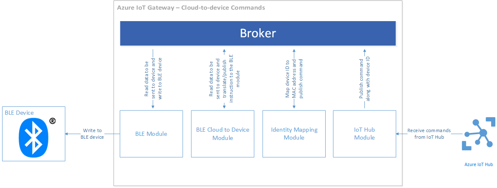

<properties
    pageTitle="Utilizzare un dispositivo reale con SDK Gateway IoT | Microsoft Azure"
    description="Procedura dettagliata di Azure IoT Gateway SDK usando un dispositivo Texas strumenti SensorTag per inviare dati a IoT Hub tramite un gateway in esecuzione in un modulo di calcolare Edison Intel"
    services="iot-hub"
    documentationCenter=""
    authors="chipalost"
    manager="timlt"
    editor=""/>

<tags
     ms.service="iot-hub"
     ms.devlang="cpp"
     ms.topic="article"
     ms.tgt_pltfrm="na"
     ms.workload="na"
     ms.date="08/29/2016"
     ms.author="andbuc"/>


# <a name="azure-iot-gateway-sdk-beta--send-device-to-cloud-messages-with-a-real-device-using-linux"></a>Azure IoT Gateway SDK (beta): inviare messaggi di dispositivo nel cloud con un dispositivo reale con Linux

In questa procedura dettagliata del [campione di energia bassa Bluetooth] [ lnk-ble-samplecode] illustra come utilizzare [Azure IoT Gateway SDK] [ lnk-sdk] per inoltra telemetria dispositivo nel cloud a IoT Hub da un dispositivo fisico e in che modo inviare i comandi dall'IoT Hub in un dispositivo fisico.

Questa procedura dettagliata include:

* **Architettura**: informazioni importanti a architettonica il campione di energia bassa Bluetooth.

* **Compila ed Esegui**: i passaggi necessari per creare ed eseguire l'esempio.

## <a name="architecture"></a>Architettura

Procedura dettagliata viene illustrato come creare ed eseguire un IoT Gateway nello Intel Edison calcolare modulo utilizzabile Linux. Il gateway viene compilato mediante il SDK Gateway IoT. L'esempio utilizza un dispositivo Bluetooth bassa energia (attiva) Texas strumenti SensorTag per raccogliere dati sulla temperatura.

Quando si esegue il gateway è:

- Si connette a un dispositivo SensorTag utilizzando il protocollo Bluetooth bassa energia (attiva).
- Si connette all'IoT Hub mediante il protocollo HTTP.
- Inoltra telemetria dal dispositivo SensorTag IoT Hub.
- Invia i comandi dall'IoT Hub al dispositivo SensorTag.

Il gateway contiene i moduli seguenti:

- *Modulo attiva* che interagisce con un dispositivo attiva per ricevere dati sulla temperatura da comandi dispositivo e inviarlo al dispositivo.
- *Attiva Cloud al modulo dispositivo* che converte i messaggi JSON ricevuti dal cloud in istruzioni attiva per il *modulo attiva*.
- *Modulo logger* che registra tutti i messaggi di gateway.
- Un *modulo di mapping dell'identità* che converte tra Attiva dispositivo MAC indirizzi e dell'identità dei dispositivi di Azure IoT Hub.
- Un *modulo IoT Hub* che carica i dati di telemetria a un hub IoT e riceve i comandi di dispositivo da un hub IoT.
- Un *modulo stampante attiva* che interpreta telemetria dal dispositivo attiva e stampa di dati formattati in alla console di abilitare il debug e risoluzione dei problemi.

### <a name="how-data-flows-through-the-gateway"></a>Il flusso di dati tramite il Gateway

Il diagramma blocco seguente illustra la pipeline di flusso di telemetria Carica dati:


I passaggi che un elemento di telemetria accetta in viaggio da un dispositivo attiva a IoT Hub sono:

1. Il dispositivo attiva genera un campione di temperatura e invia tramite Bluetooth al modulo attiva il gateway.
2. Il modulo attiva riceve il codice di esempio e pubblica per il gestore insieme indirizzo MAC del dispositivo.
3. Il modulo di mapping identità raccoglie questo messaggio e utilizza una tabella interna per tradurre l'indirizzo MAC del dispositivo in un'identità di dispositivo IoT Hub (ID dispositivo e chiave dispositivo). Viene quindi pubblicata un nuovo messaggio che contiene i dati di esempio temperatura, l'indirizzo del dispositivo, l'ID del dispositivo e la chiave del MAC.
4. Il modulo IoT Hub riceve il nuovo messaggio (generato dal modulo di mapping di identità) e pubblica per IoT Hub.
5. Il modulo logger registra tutti i messaggi utilizzando il gestore su un file.

Il diagramma blocco seguente illustra la pipeline di flusso dei dati di comandi di dispositivo:



1. Il modulo IoT Hub richiede hub IoT per i nuovi messaggi di comando.
2. Quando il modulo IoT Hub riceve un nuovo messaggio di comando, vengono pubblicati per il gestore.
3. Il modulo di mapping identità recupera il messaggio di comando e viene utilizzata una tabella interna per tradurre l'ID di dispositivo IoT Hub a un dispositivo indirizzo MAC. Viene quindi pubblicata un nuovo messaggio che include l'indirizzo MAC del dispositivo di destinazione nella mappa delle proprietà del messaggio.
4. Cloud attiva al modulo dispositivo raccoglie questo messaggio e lo converte nell'istruzione attiva corretto per il modulo attiva. Viene quindi pubblicata un nuovo messaggio.
5. Il modulo attiva raccoglie questo messaggio e viene eseguita l'istruzione i/o di comunicare con il dispositivo attiva.
6. Il modulo logger registra tutti i messaggi utilizzando il gestore su un file.

## <a name="prepare-your-hardware"></a>Preparare l'hardware

In questa esercitazione si presuppone che si utilizza un dispositivo [Texas strumenti SensorTag](http://www.ti.com/ww/en/wireless_connectivity/sensortag2015/index.html) connesso a una bacheca Edison Intel.

### <a name="set-up-the-edison-board"></a>Configurare la bacheca Edison

Prima di iniziare, verificare che sia possibile connettersi dispositivo Edison alla rete wireless. Per configurare il dispositivo Edison, è necessario connettersi a un computer host. Intel fornisce introduzione Guide per sistemi operativi seguenti:

- [Iniziare con la scheda Intel Edison sviluppo in Windows a 64 bit][lnk-setup-win64].
- [Iniziare con la scheda Intel Edison sviluppo in Windows a 32][lnk-setup-win32].
- [Iniziare a utilizzare la scheda sviluppo Edison Intel in Mac OS X][lnk-setup-osx].
- [Guida introduttiva con la scheda Edison Intel® su Linux][lnk-setup-linux].

Per configurare il dispositivo Edison e familiarizzare con il prodotto, è necessario completare tutti i passaggi descritti in questi "Introduzione" articoli fatta eccezione per l'ultimo passaggio, "Scegliere IDE", che è necessaria per l'esercitazione corrente. Al termine del processo di installazione Edison sono:

- Inserito nella memoria flash il Edison con firmware più recente.
- Stabilire una connessione seriale da host per il Edison.
- Eseguire lo script **configure_edison** per impostare una password e attivare WiFi nel Edison.

### <a name="enable-connectivity-to-the-sensortag-device-from-your-edison-board"></a>Abilitare la connessione al dispositivo SensorTag dalle discussioni Edison

Prima di eseguire l'esempio, è necessario verificare che le discussioni Edison possibile connettersi al dispositivo SensorTag.

Prima di tutto è necessario verificare che il Edison possibile connettersi al dispositivo SensorTag.

1. Sbloccare bluetooth nel Edison, verificare che il numero di versione **5.37**.
    
    ```
    rfkill unblock bluetooth
    bluetoothctl --version
    ```

2. Eseguire il comando **bluetoothctl** . Si è ora una shell interattiva bluetooth. 

3. Immettere il comando **accendere** accendere controller bluetooth. È necessario vedere output simile a:
    
    ```
    [NEW] Controller 98:4F:EE:04:1F:DF edison [default]
    ```

4. In shell interattiva bluetooth, immettere il comando **Esegui analisi** per cercare dispositivi bluetooth. È necessario vedere output simile a:
    
    ```
    Discovery started
    [CHG] Controller 98:4F:EE:04:1F:DF Discovering: yes
    ```

5. Rendere il dispositivo SensorTag facendo clic sul pulsante piccolo (LED verde necessario flash). Il Edison deve individuare il dispositivo SensorTag:
    
    ```
    [NEW] Device A0:E6:F8:B5:F6:00 CC2650 SensorTag
    [CHG] Device A0:E6:F8:B5:F6:00 TxPower: 0
    [CHG] Device A0:E6:F8:B5:F6:00 RSSI: -43
    ```
    
    In questo esempio, è possibile vedere che l'indirizzo MAC del dispositivo SensorTag **A0:E6:F8:B5:F6:00**.

6. Disattivare l'analisi immettendo il comando **analisi disattivato** .
    
    ```
    [CHG] Controller 98:4F:EE:04:1F:DF Discovering: no
    Discovery stopped
    ```

7. Connettere il dispositivo SensorTag usando il proprio indirizzo MAC tramite l'immissione di **connettere \<indirizzo MAC >**. Si noti che l'output di esempio seguente viene abbreviato:
    
    ```
    Attempting to connect to A0:E6:F8:B5:F6:00
    [CHG] Device A0:E6:F8:B5:F6:00 Connected: yes
    Connection successful
    [CHG] Device A0:E6:F8:B5:F6:00 UUIDs: 00001800-0000-1000-8000-00805f9b34fb
    ...
    [NEW] Primary Service
            /org/bluez/hci0/dev_A0_E6_F8_B5_F6_00/service000c
            Device Information
    ...
    [CHG] Device A0:E6:F8:B5:F6:00 GattServices: /org/bluez/hci0/dev_A0_E6_F8_B5_F6_00/service000c
    ...
    [CHG] Device A0:E6:F8:B5:F6:00 Name: SensorTag 2.0
    [CHG] Device A0:E6:F8:B5:F6:00 Alias: SensorTag 2.0
    [CHG] Device A0:E6:F8:B5:F6:00 Modalias: bluetooth:v000Dp0000d0110
    ```
    
    Nota: È possibile elencare le caratteristiche di GATT del dispositivo di nuovo utilizzando il comando **gli attributi di elenco** .

8. È possibile ora disconnettere il dispositivo con il comando **Disconnetti** e quindi uscire da shell bluetooth con il comando **Esci da** :
    
    ```
    Attempting to disconnect from A0:E6:F8:B5:F6:00
    Successful disconnected
    [CHG] Device A0:E6:F8:B5:F6:00 Connected: no
    ```

A questo punto si è pronti eseguire l'esempio attiva Gateway nel dispositivo Edison.

## <a name="run-the-ble-gateway-sample"></a>Eseguire l'esempio attiva Gateway

Per eseguire l'esempio di tabella nel Edison, è necessario completare tre attività:

- Configurare il tuo fulcro IoT due dispositivi di esempio.
- Creare SDK di Gateway IoT nel dispositivo Edison.
- Configurare ed eseguire l'esempio di tabella in un dispositivo Edison.

In fase di scrittura, SDK di Gateway IoT supporta solo gateway che utilizzano moduli attiva su Linux.

### <a name="configure-two-sample-devices-in-your-iot-hub"></a>Configurare il tuo fulcro IoT due dispositivi di esempio

- [Creare un hub IoT] [ lnk-create-hub] nell'abbonamento Azure, è necessario il nome del computer di controllo per completare questa procedura dettagliata. Se non si dispone di un account, è possibile creare un [account gratuito] [ lnk-free-trial] in pochi minuti.
- Aggiungere un dispositivo chiamato **SensorTag_01** per il tuo fulcro IoT e prendere nota della chiave id e dispositivo. È possibile usare [Esplora dispositivi o iothub explorer] [ lnk-explorer-tools] strumenti per aggiungere questo dispositivo hub IoT creato nel passaggio precedente e recuperare la chiave. Si eseguirà il mapping di questo dispositivo al dispositivo SensorTag quando si configura il gateway.

### <a name="build-the-iot-gateway-sdk-on-your-edison-device"></a>Creare SDK di Gateway IoT nel dispositivo Edison

La versione di **operazioni** sul Edsion non supporta submodules. Per scaricare il codice sorgente completo per il SDK Gateway IoT per il Edison sono disponibili due opzioni:

- Opzione #1: Duplicare [Azure IoT Gateway SDK] [ lnk-sdk] archivio nel Edison e clonare manualmente il repository per ogni submodule.
- Opzione #2: Duplicare [Azure IoT Gateway SDK] [ lnk-sdk] archivio in un dispositivo desktop nel punto in cui **fra** supporta submodules e quindi copiare repository completato con submodules sul Edison.

Se si sceglie l'opzione #2, utilizzare i comandi di **operazioni** seguenti per duplicare SDK di Gateway IoT e tutto il relativo submodules:

```
git clone --recursive https://github.com/Azure/azure-iot-gateway-sdk.git 
git submodule update --init --recursive
```

È quindi necessario zip l'intero repository locale in un unico file di archivio prima di copiare il Edison. È possibile utilizzare un'utilità, ad esempio **pscp** è incluso in **Putty** in cui copiare il file di archivio di Edison. Per esempio:

```
pscp .\gatewaysdk.zip root@192.168.0.45:/home/root
```

Quando si dispone di una copia completa del repository IoT Gateway SDK nel Edison, è possibile creare tramite il comando seguente dalla cartella che contiene il SDK:

```
./tools/build.sh
```

### <a name="configure-and-run-the-ble-sample-on-your-edison-device"></a>Configurare ed eseguire l'esempio di tabella in un dispositivo Edison

Per avviare ed eseguire l'esempio, è necessario configurare ogni modulo che fa parte di gateway. Questa configurazione viene fornita in un file JSON ed è necessario configurare tutti i moduli di partecipanti cinque. Esiste un file JSON di esempio fornito repository denominato **gateway_sample.json** che si può usare come punto di partenza per la creazione di un file di configurazione. Il file è nella cartella **esempi/ble_gateway_hl/src** nella copia locale del repository IoT Gateway SDK.

Nelle sezioni seguenti descrivono come modificare il file di configurazione per il campione attiva e si presuppone che l'archivio IoT Gateway SDK è nel **/home/root/azure-iot-gateway-sdk /** cartella nel dispositivo Edison. Se l'archivio è altrove, è necessario regolare i percorsi di conseguenza:

#### <a name="logger-configuration"></a>Configurazione di logger

Presupponendo che l'archivio di gateway si trova nella cartella **/home/root/azure-iot-gateway-sdk /**, configurare il modulo logger come indicato di seguito:

```json
{
    "module name": "logger",
    "module path": "/home/root/azure-iot-gateway-sdk/build/modules/logger/liblogger_hl.so",
    "args":
    {
        "filename":"/home/root/gw_logger.log"
    }
}
```

#### <a name="ble-module-configuration"></a>Configurazione del modulo di tabella

La configurazione di esempio per il dispositivo attiva prende in considerazione un dispositivo SensorTag strumenti Texas. Qualsiasi dispositivo attiva standard in grado di operare come un GATT periferiche funzionerà, ma è necessario aggiornare l'ID di caratteristica GATT e i dati (per le istruzioni di scrittura). Aggiungere l'indirizzo MAC del dispositivo SensorTag: 

```json
{
  "module name": "SensorTag",
  "module path": "/home/root/azure-iot-gateway-sdk/build/modules/ble/libble_hl.so",
  "args": {
    "controller_index": 0,
    "device_mac_address": "<<AA:BB:CC:DD:EE:FF>>",
    "instructions": [
      {
        "type": "read_once",
        "characteristic_uuid": "00002A24-0000-1000-8000-00805F9B34FB"
      },
      {
        "type": "read_once",
        "characteristic_uuid": "00002A25-0000-1000-8000-00805F9B34FB"
      },
      {
        "type": "read_once",
        "characteristic_uuid": "00002A26-0000-1000-8000-00805F9B34FB"
      },
      {
        "type": "read_once",
        "characteristic_uuid": "00002A27-0000-1000-8000-00805F9B34FB"
      },
      {
        "type": "read_once",
        "characteristic_uuid": "00002A28-0000-1000-8000-00805F9B34FB"
      },
      {
        "type": "read_once",
        "characteristic_uuid": "00002A29-0000-1000-8000-00805F9B34FB"
      },
      {
        "type": "write_at_init",
        "characteristic_uuid": "F000AA02-0451-4000-B000-000000000000",
        "data": "AQ=="
      },
      {
        "type": "read_periodic",
        "characteristic_uuid": "F000AA01-0451-4000-B000-000000000000",
        "interval_in_ms": 1000
      },
      {
        "type": "write_at_exit",
        "characteristic_uuid": "F000AA02-0451-4000-B000-000000000000",
        "data": "AA=="
      }
    ]
  }
}
```

#### <a name="iot-hub-module"></a>Modulo IoT Hub

Aggiungere il nome del computer IoT di controllo. Il valore del suffisso è in genere **azure devices.net**:

```json
{
  "module name": "IoTHub",
  "module path": "/home/root/azure-iot-gateway-sdk/build/modules/iothub/libiothub_hl.so",
  "args": {
    "IoTHubName": "<<Azure IoT Hub Name>>",
    "IoTHubSuffix": "<<Azure IoT Hub Suffix>>",
    "Transport": "HTTP"
  }
}
```

#### <a name="identity-mapping-module-configuration"></a>Configurazione del modulo di mapping identità

Aggiungere l'indirizzo MAC del dispositivo SensorTag e del dispositivo Id e la chiave del dispositivo **SensorTag_01** che sono stati aggiunti al tuo fulcro IoT:

```json
{
  "module name": "mapping",
  "module path": "/home/root/azure-iot-gateway-sdk/build/modules/identitymap/libidentity_map_hl.so",
  "args": [
    {
      "macAddress": "<<AA:BB:CC:DD:EE:FF>>",
      "deviceId": "<<Azure IoT Hub Device ID>>",
      "deviceKey": "<<Azure IoT Hub Device Key>>"
    }
  ]
}
```

#### <a name="ble-printer-module-configuration"></a>Configurazione del modulo di stampante attiva

```json
{
    "module name": "BLE Printer",
    "module path": "/home/root/azure-iot-gateway-sdk/build/samples/ble_gateway_hl/ble_printer/libble_printer.so",
    "args": null
}
```

#### <a name="routing-configuration"></a>Configurazione di routing

La seguente configurazione garantisce le operazioni seguenti:
- Il modulo **Logger** riceve e registrare tutti i messaggi.
- Il modulo **SensorTag** invia messaggi alle **mapping** e moduli **Stampante attiva** .
- Il modulo **mapping** invia messaggi al modulo **IoTHub** devono essere inviati il tuo fulcro IoT.
- Il modulo **IoTHub** invia messaggi al modulo **mapping** .
- Il modulo **mapping** invia messaggi al modulo **SensorTag** .

```json
"links" : [
    {"source" : "*", "sink" : "Logger" },
    {"source" : "SensorTag", "sink" : "mapping" },
    {"source" : "SensorTag", "sink" : "BLE Printer" },
    {"source" : "mapping", "sink" : "IoTHub" },
    {"source" : "IoTHub", "sink" : "mapping" },
    {"source" : "mapping", "sink" : "SensorTag" }
  ]
```

Per eseguire l'esempio eseguire **ble_gateway_hl** binario passare il percorso del file di configurazione JSON. Se è stato utilizzato il file **gateway_sample.json** , il comando da eseguire è simile alla seguente:

```
./build/samples/ble_gateway_hl/ble_gateway_hl ./samples/ble_gateway_hl/src/gateway_sample.json
```

Potrebbe essere necessario premere il pulsante sul dispositivo SensorTag per rendere il prima di eseguire l'esempio.

Quando si esegue l'esempio, è possibile usare [Esplora dispositivi o iothub explorer] [ lnk-explorer-tools] strumento per monitorare i messaggi gateway inoltra dal dispositivo SensorTag.

## <a name="send-cloud-to-device-messages"></a>Inviare messaggi cloud al dispositivo

Il modulo attiva supporta anche invio delle istruzioni dall'IoT Hub Azure al dispositivo. È possibile usare [Esplora dispositivi di Azure IoT Hub](https://github.com/Azure/azure-iot-sdks/blob/master/tools/DeviceExplorer/doc/how_to_use_device_explorer.md) o [IoT Hub Explorer](https://github.com/Azure/azure-iot-sdks/tree/master/tools/iothub-explorer) per inviare messaggi JSON che il modulo di gateway attiva passa dispositivo attiva. Ad esempio, se si utilizza il dispositivo Texas strumenti SensorTag quindi è possibile inviare i messaggi di JSON seguenti al dispositivo dall'IoT Hub.

- Reimpostare tutte LED e il cicalino (disattivare)

    ```json
    {
      "type": "write_once",
      "characteristic_uuid": "F000AA65-0451-4000-B000-000000000000",
      "data": "AA=="
    }
    ```

- Configurare i/o come 'remoto'

    ```json
    {
      "type": "write_once",
      "characteristic_uuid": "F000AA66-0451-4000-B000-000000000000",
      "data": "AQ=="
    }
    ```

- Attivare il LED rosso

    ```json
    {
      "type": "write_once",
      "characteristic_uuid": "F000AA65-0451-4000-B000-000000000000",
      "data": "AQ=="
    }
    ```

- Attivare il LED verde

    ```json
    {
      "type": "write_once",
      "characteristic_uuid": "F000AA65-0451-4000-B000-000000000000",
      "data": "Ag=="
    }
    ```

- Attivare il cicalino

    ```json
    {
      "type": "write_once",
      "characteristic_uuid": "F000AA65-0451-4000-B000-000000000000",
      "data": "BA=="
    }
    ```

Il comportamento predefinito per un dispositivo che usa il protocollo HTTP a cui connettersi IoT Hub è controllare ogni 25 minuti per un nuovo comando. Pertanto, se si inviano diversi comandi separati è necessario attendere 25 minuti per il dispositivo per ricevere ogni comando.

> [AZURE.NOTE] Il gateway anche verifica la presenza di nuovi comandi ogni volta che viene avviato in modo che è possibile imporre per eseguire un comando da arrestare e avviare il gateway.

## <a name="next-steps"></a>Passaggi successivi

Se si desidera comprendere più avanzate di SDK Gateway IoT e sperimentare alcuni esempi di codice, visitare le seguenti esercitazioni di sviluppo e risorse:

- [Gateway IoT Azure SDK][lnk-sdk]

Per esplorare ulteriormente le funzionalità di IoT Hub, vedere:

- [Guida per sviluppatori][lnk-devguide]

<!-- Links -->
[lnk-ble-samplecode]: https://github.com/Azure/azure-iot-gateway-sdk/blob/master/samples/ble_gateway_hl
[lnk-free-trial]: https://azure.microsoft.com/pricing/free-trial/
[lnk-explorer-tools]: https://github.com/Azure/azure-iot-sdks/blob/master/doc/manage_iot_hub.md
[lnk-setup-win64]: https://software.intel.com/get-started-edison-windows
[lnk-setup-win32]: https://software.intel.com/get-started-edison-windows-32
[lnk-setup-osx]: https://software.intel.com/get-started-edison-osx
[lnk-setup-linux]: https://software.intel.com/get-started-edison-linux
[lnk-sdk]: https://github.com/Azure/azure-iot-gateway-sdk/


[lnk-devguide]: iot-hub-devguide.md
[lnk-create-hub]: iot-hub-create-through-portal.md 
