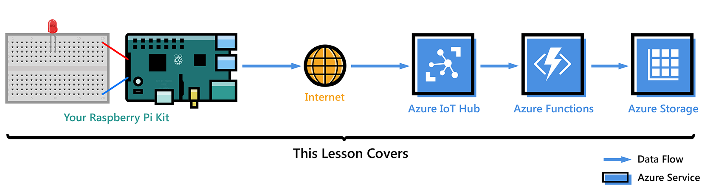
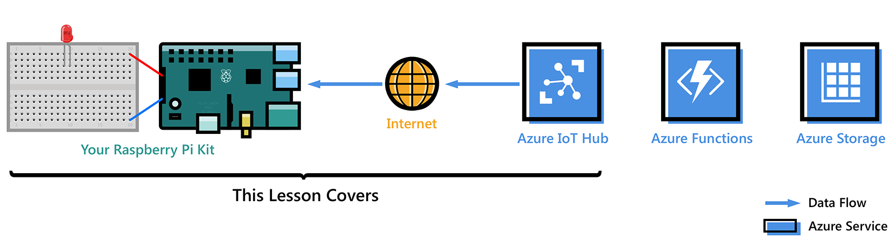

<properties
 pageTitle="Introduzione al lampone Pi 3 | Microsoft Azure"
 description="Guida introduttiva a Raspberry Pi 3, creare il tuo fulcro IoT Azure e connettere il Pi hub IoT"
 services="iot-hub"
 documentationCenter=""
 authors="shizn"
 manager="timlt"
 tags=""
 keywords=""/>

<tags
 ms.service="iot-hub"
 ms.devlang="multiple"
 ms.topic="article"
 ms.tgt_pltfrm="na"
 ms.workload="na"
 ms.date="10/21/2016"
 ms.author="xshi"/>

# Introduzione al lampone Pi 3

In questa esercitazione, è necessario innanzitutto nozioni di base dell'uso Raspberry Pi 3 tale Raspbian in esecuzione. Quindi come collegare facilmente i dispositivi nel cloud con [Azure IoT Hub](iot-hub-what-is-iot-hub.md). Per esempi di Windows 10 IoT Core, visitare [windowsondevices.com](http://www.windowsondevices.com/).

## Lezione 1: Configurare il dispositivo

In questa lezione, configurare il dispositivo Raspberry Pi 3 con un sistema operativo, configurare l'ambiente di sviluppo e distribuire un'applicazione di pi greco.

### Configurare il dispositivo

Configurare i 3 di pi greco Raspberry per il primo utilizzo e installare il sistema operativo Raspbian, un sistema operativo gratuito ottimizzate per l'hardware Raspberry pi greco.

*Tempo previsto per: 30 minuti* 

[Vai a 'Configurare il dispositivo'](iot-hub-raspberry-pi-kit-node-lesson1-configure-your-device.md)

### Tutti gli strumenti
Scaricare gli strumenti e software per compilare e distribuire prima applicazione per Raspberry Pi 3.

*Tempo previsto per: 20 minuti* 

[Vai a 'Tutti gli strumenti'](iot-hub-raspberry-pi-kit-node-lesson1-get-the-tools-win32.md)

### Creare e distribuire l'applicazione intermittenza

Duplicare l'applicazione di Node esempio da Github e gulp per distribuire l'applicazione per la propria scheda Raspberry Pi 3. Questa applicazione di esempio lampeggiante LED collegati alla scheda ogni due secondi.

*Tempo previsto per: 5 minuti* 

[Passare a ' creare e distribuire l'applicazione intermittenza '](iot-hub-raspberry-pi-kit-node-lesson1-deploy-blink-app.md)

## Lezione 2: Creare il tuo fulcro IoT

In questa lezione, creare l'account Azure gratuito provisioning l'hub di Azure IoT e creare il primo dispositivo in Azure IoT hub.

Completare lezione 1 prima di iniziare questa lezione.

### Ottenere gli strumenti di Azure

Installare Azure interfaccia della riga (comando Azure).

*Tempo previsto per: 10 minuti* 

[Fare clic su 'Ottenere Azure strumenti'](iot-hub-raspberry-pi-kit-node-lesson2-get-azure-tools-win32.md)

### Creare il tuo fulcro IoT e registrare i 3 di pi greco Raspberry

Creare il gruppo di risorse, provisioning il primo hub IoT Azure e aggiungere il primo dispositivo IoT Hub Azure usa CLI Azure. 

*Tempo previsto per: 10 minuti* 

[Passare a 'Creare il tuo fulcro IoT e registrare i 3 di pi greco Raspberry'](iot-hub-raspberry-pi-kit-node-lesson2-prepare-azure-iot-hub.md)

## Lezione 3: Inviare messaggi di dispositivo nel cloud

In questa lezione è inviare messaggi dal Pi il tuo fulcro IoT. È anche possibile creare un'app di funzione Azure messaggi in arrivo dal tuo fulcro IoT e vengono scritte in un archivio tabelle Azure.

Completare le lezioni 1 e 2 prima di iniziare questa lezione.

### Creare un account di archiviazione Azure e Azure funzione app

Un modello di gestione risorse Azure consente di creare un'app di funzione Azure e un account di archiviazione Azure.

*Tempo previsto per: 10 minuti* 

[Passare a 'Crea un account di archiviazione Azure e Azure funzione app'](iot-hub-raspberry-pi-kit-node-lesson3-deploy-resource-manager-template.md)

### Eseguire l'applicazione di esempio per inviare messaggi di dispositivo nel cloud

Distribuire ed eseguire un'applicazione di esempio al dispositivo Raspberry Pi 3 che invia messaggi a IoT hub.

*Tempo previsto per: 10 minuti* 

[Vai a 'Eseguire l'applicazione di esempio per inviare messaggi di dispositivo nel cloud'](iot-hub-raspberry-pi-kit-node-lesson3-run-azure-blink.md)

### Leggere i messaggi persistente in archiviazione Azure
Monitorare i messaggi di dispositivo nel cloud quando vengono scritti allo spazio di archiviazione Azure.

*Tempo previsto per: 5 minuti* 

[Passare 'leggere i messaggi di mantenere in archiviazione Azure'](iot-hub-raspberry-pi-kit-node-lesson3-read-table-storage.md)

## Lezione 4: Invio di messaggi cloud al dispositivo

In questa lezione demos come inviare messaggi dall'hub di Azure IoT per il Pi Raspberry 3. È possibile controllare i messaggi attivato e disattivato il comportamento del LED che sia connesso al pi greco. Preparazione di un'applicazione di esempio per ottenere l'attività.

Completare le lezioni 1, 2 e 3 prima di iniziare questa lezione.

### Eseguire l'applicazione di esempio per ricevere messaggi cloud al dispositivo

L'applicazione di esempio nella lezione 4 viene eseguito sul Pi e monitora i messaggi in arrivo dall'hub IoT. Una nuova attività confessano invia messaggi per il Pi dall'hub IoT a lampeggiare il LED.

*Tempo previsto per: 10 minuti* 

[Vai a 'Eseguire l'applicazione di esempio per ricevere messaggi cloud al dispositivo'](iot-hub-raspberry-pi-kit-node-lesson4-send-cloud-to-device-messages.md)

### Sezione facoltativa: modificare attivato e disattivato il comportamento del LED

Personalizzare i messaggi da modificare e disattivare il comportamento del LED.

*Tempo previsto per: 10 minuti* 

[Passare a "sezione facoltativa: modificare attivato e disattivato il comportamento del LED'](iot-hub-raspberry-pi-kit-node-lesson4-change-led-behavior.md)

## Risoluzione dei problemi

Se vengono soddisfatte eventuali problemi durante le lezioni, è possibile cercare soluzioni in questa pagina.

[Passare a 'Risoluzione dei problemi'](iot-hub-raspberry-pi-kit-node-troubleshooting.md)
