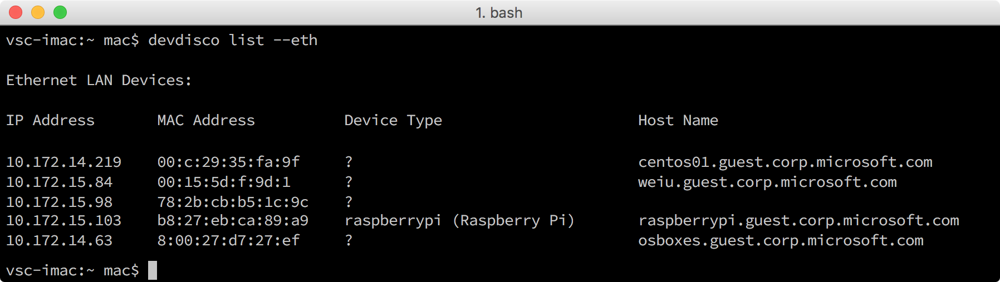

<properties
 pageTitle="Creare e distribuire l'applicazione intermittenza | Microsoft Azure"
 description="Duplicare l'applicazione di Node esempio da Github e gulp per distribuire l'applicazione per la propria scheda Raspberry Pi 3. Questa applicazione di esempio lampeggiante LED collegati alla scheda ogni due secondi."
 services="iot-hub"
 documentationCenter=""
 authors="shizn"
 manager="timlt"
 tags=""
 keywords=""/>

<tags
 ms.service="iot-hub"
 ms.devlang="multiple"
 ms.topic="article"
 ms.tgt_pltfrm="na"
 ms.workload="na"
 ms.date="10/21/2016"
 ms.author="xshi"/>

# <a name="13-create-and-deploy-the-blink-application"></a>1.3 creare e distribuire l'applicazione intermittenza

## <a name="131-what-you-will-do"></a>1.3.1 azioni da adottare

Duplicare l'applicazione di Node esempio da Github e usare lo strumento confessano per distribuire l'applicazione di esempio per il Pi Raspberry 3. L'applicazione di esempio lampeggiante LED collegati alla scheda ogni due secondi. Se è necessario soddisfare gli eventuali problemi, tentare le soluzioni di [risoluzione dei problemi di pagina](iot-hub-raspberry-pi-kit-node-troubleshooting.md).

## <a name="132-what-you-will-learn"></a>1.3.2 informazioni contenute

- Come utilizzare il `device-discover-cli` strumento per recuperare informazioni rete il pi greco.
- Informazioni su come distribuire ed eseguire l'applicazione di esempio con il pi greco.
- Informazioni su come distribuire ed eseguire il debug di applicazioni in esecuzione in modalità remota sul pi greco.

## <a name="133-what-you-need"></a>1.3.3 cosa occorre

È necessario che sia completata nelle sezioni seguenti vengono nella lezione 1:

- [Configurare il dispositivo](iot-hub-raspberry-pi-kit-node-lesson1-configure-your-device.md)
- [Tutti gli strumenti](iot-hub-raspberry-pi-kit-node-lesson1-get-the-tools-win32.md)

## <a name="134-obtain-the-ip-address-and-host-name-of-your-pi"></a>1.3.4 ottenere il nome di host e indirizzo IP del pi greco

Aprire un prompt dei comandi in Windows o una finestra del terminale in Mac OS o Ubuntu e quindi eseguire il comando seguente:

```bash
devdisco list --eth
```

Verrà visualizzato un output simile al seguente:



Annotare il `IP address` e `hostname` del pi greco. Queste informazioni più avanti in questa sezione sono necessarie.

> [AZURE.NOTE] Assicurarsi che il Pi sia connesso alla stessa rete del computer in uso. Ad esempio, se il computer sia connesso a una rete wireless mentre il Pi è connesso a una rete cablata, potrebbe non essere visualizzato l'indirizzo IP nell'output devdisco.

## <a name="135-clone-the-sample-application"></a>1.3.5 duplicare l'applicazione di esempio

Per aprire il codice di esempio, procedere come segue:

1. Duplicare l'archivio di esempio da Github eseguendo il comando seguente:

    ```bash
    git clone https://github.com/Azure-Samples/iot-hub-node-raspberrypi-getting-started.git
    ```

2. Aprire l'applicazione di esempio in Visual Studio codice eseguendo i comandi seguenti:

    ```bash
    cd iot-hub-node-raspberrypi-getting-started
    cd Lesson1
    code .
    ```


Il `app.js` dei file nel `app` sottocartella è il file di origine chiave che contiene il codice per controllare il LED.

### <a name="136-install-application-dependencies"></a>1.3.6 installare dipendenze delle applicazioni

Installare le raccolte e altri moduli che è necessario per l'applicazione di esempio eseguendo il comando seguente:

```bash
npm install
```

## <a name="137-configure-the-device-connection"></a>1.3.7 configurare la connessione al dispositivo

Per configurare la connessione al dispositivo, procedere come segue:

1. Generare il file di configurazione del dispositivo, eseguire il comando seguente:

    ```bash
    gulp init
    ```

    File di configurazione `config-raspberrypi.json` contiene le credenziali utente utilizzare agli utenti di accedere il pi greco. Per evitare la perdita delle credenziali utente, viene generato il file di configurazione nella sottocartella `.iot-hub-getting-started` della cartella principale nel computer in uso.

2. Aprire il file di configurazione del dispositivo in Visual Studio codice eseguendo il comando seguente:

    ```bash
    # For Windows command prompt
    code %USERPROFILE%\.iot-hub-getting-started\config-raspberrypi.json

    # For macOS or Ubuntu
    code ~/.iot-hub-getting-started/config-raspberrypi.json
    ```

3. Sostituire il segnaposto `[device hostname or IP address]` con l'indirizzo IP o il nome host che viene visualizzato nella sezione 1.3.4.

    

Congratulazioni! È stato creato correttamente l'applicazione di esempio prima per il pi greco.

## <a name="138-deploy-and-run-the-sample-application"></a>1.3.8 distribuire ed eseguire l'applicazione di esempio

### <a name="1381-install-nodejs-and-npm-on-your-pi"></a>1.3.8.1 installato Node e NPM il pi greco

Installare Node e NPM con i pi greco eseguendo il comando seguente:

```bash
gulp install-tools
```

Può richiedere dieci minuti per completare la prima volta che si esegue questa operazione.

### <a name="1382-deploy-and-run-the-sample-app"></a>1.3.8.2 distribuire ed eseguire l'applicazione di esempio

Distribuire ed eseguire l'applicazione di esempio eseguendo il comando seguente:

```bash
gulp deploy && gulp run
```

### <a name="1383-verify-the-app-works"></a>1.3.8.3 verificare il funzionamento di app

Viene visualizzato il LED con i pi greco lampeggiante ogni due secondi.  Se non viene visualizzato il LED lampeggiante, vedere [risoluzione dei problemi di Guida](iot-hub-raspberry-pi-kit-node-troubleshooting.md) per le soluzioni ai problemi comuni.


> [AZURE.NOTE] Usare `Ctrl + C` per terminare l'applicazione.

## <a name="139-summary"></a>1.3.9 riepilogo

Aver installato gli strumenti necessari per lavorare con i pi greco e distribuire un'applicazione di esempio per il Pi a lampeggiare il LED. È possibile procedere con la lezione successiva per creare, distribuire ed eseguire un'altra applicazione di esempio che connette il Pi Azure IoT Hub per inviare e ricevere messaggi.

## <a name="next-steps"></a>Passaggi successivi

A questo punto si è pronti iniziare lezione 2 che inizia con [tutti gli strumenti Azure](iot-hub-raspberry-pi-kit-node-lesson2-get-azure-tools-win32.md)
