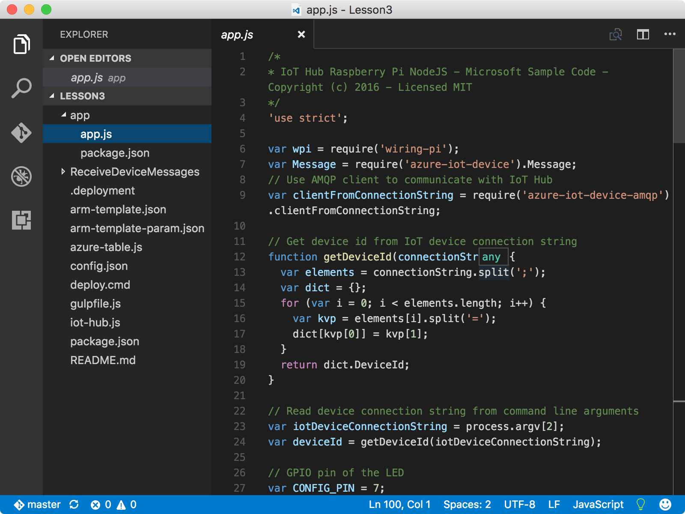

<properties
 pageTitle="Creare un account di archiviazione Azure e Azure funzione app | Microsoft Azure"
 description="L'app funzione Azure ascolta gli eventi hub IoT Azure, elabora i messaggi in arrivo e li scrive all'archivio tabelle Azure."
 services="iot-hub"
 documentationCenter=""
 authors="shizn"
 manager="timlt"
 tags=""
 keywords=""/>

<tags
 ms.service="iot-hub"
 ms.devlang="multiple"
 ms.topic="article"
 ms.tgt_pltfrm="na"
 ms.workload="na"
 ms.date="10/21/2016"
 ms.author="xshi"/>

# <a name="31-create-an-azure-function-app-and-azure-storage-account"></a>3.1 creare un'app di funzione Azure e account Azure archiviazione

[Funzioni di Azure](../../articles/azure-functions/functions-overview.md) è una soluzione per l'esecuzione facilmente frammenti di codice, denominate "funzioni", nel cloud. Un'app di funzione Azure ospita l'esecuzione delle funzioni in Azure.

## <a name="311-what-will-you-do"></a>3.1.1 cosa fare

Un modello di gestione risorse Azure consente di creare un'app di funzione Azure e un account di archiviazione Azure. L'app funzione Azure ascolta gli eventi hub IoT Azure, elabora i messaggi in arrivo e li scrive all'archivio tabelle Azure. Se è necessario soddisfare gli eventuali problemi, tentare le soluzioni di [risoluzione dei problemi di pagina](iot-hub-raspberry-pi-kit-node-troubleshooting.md).

## <a name="312-what-will-you-learn"></a>3.1.2 informazioni in

- Come utilizzare [Gestione risorse Azure](../../articles/azure-resource-manager/resource-group-overview.md) per la distribuzione di Azure risorse.
- Informazioni su come usare un'app di Azure funzione per elaborare i messaggi hub IoT e scritte a una tabella in un archivio tabelle Azure.

## <a name="313-what-do-you-need"></a>3.1.3 cosa occorre

- È necessario che sia completata lezioni precedenti: [iniziare a utilizzare i 3 di pi greco Raspberry](iot-hub-raspberry-pi-kit-node-get-started.md) e [creare l'hub di Azure IoT](iot-hub-raspberry-pi-kit-node-get-started.md).

## <a name="314-open-the-sample-app"></a>3.1.4 aprire l'app di esempio

Aprire il progetto di esempio in Visual Studio codice eseguendo i comandi seguenti:

```bash
cd Lesson3
code .
```



- Il `app.js` dei file nel `app` sottocartella è il file di origine chiave. Il file di origine contiene il codice per inviare un messaggio 20 ore per il tuo fulcro IoT e lampeggiare LED per ogni messaggio che viene inviato.
- Il `arm-template.json` file è il modello di gestione di risorse Azure che contiene un'app di funzione Azure e un account di archiviazione Azure.
- Il `arm-template-param.json` file è il file di configurazione usato dal modello di gestione di risorse Azure.
- Il `ReceiveDeviceMessages` sottocartella contiene il codice node per la funzione Azure.

## <a name="315-configure-azure-resource-manager-templates-and-create-resources-in-azure"></a>3.1.5 configurare i modelli di Azure Manager delle risorse e creare le risorse in Azure

Aggiornamento di `arm-template-param.json` file di codice Visual Studio.


- Sostituire **[nome IoT Hub]** con **{il nome di hub}** specificato nella [Lezione 2](iot-hub-raspberry-pi-kit-node-lesson2-prepare-azure-iot-hub.md).
- Sostituire **[stringa del prefisso per le nuove risorse]** con qualsiasi prefisso desiderato. Il prefisso assicura che il nome della risorsa sia univoco globale per evitare conflitti. Non utilizzare trattino o numero iniziale del prefisso.

> [AZURE.NOTE] Non è necessario `azure_storage_connection_string` in questa sezione. Lasciarla invariata come.

Dopo aver aggiornato il `arm-template-param.json` file e distribuire le risorse in Azure eseguendo il comando seguente:

```bash
az resource group deployment create --template-file-path arm-template.json --parameters-file-path arm-template-param.json -g iot-sample -n mydeployment
```

Bastano circa 5 minuti per creare queste risorse. Durante la creazione di risorse è in corso, è possibile passare alla sezione successiva.

## <a name="316-summary"></a>3.1.6 riepilogo

È stata creata l'app funzione Azure per elaborare IoT hub messaggi e un account di archiviazione Azure per archiviare i messaggi. È possibile spostare in alla sezione successiva per distribuire ed eseguire il codice di esempio per inviare messaggi di dispositivo nel cloud del pi greco.

## <a name="next-steps"></a>Passaggi successivi

[3.2 eseguire l'applicazione di esempio per inviare messaggi di dispositivo nel cloud sui 3 di pi greco Raspberry](iot-hub-raspberry-pi-kit-node-lesson3-run-azure-blink.md)

