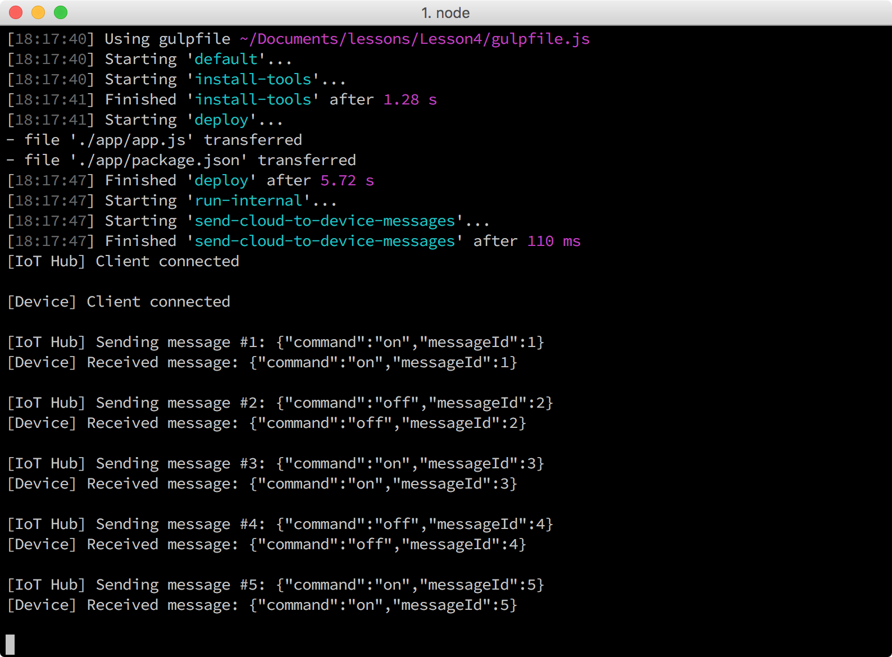

<properties
 pageTitle="Facoltativo sezione - cambiare attivato e disattivato il comportamento del LED | Microsoft Azure"
 description="Personalizzare i messaggi da modificare e disattivare il comportamento del LED."
 services="iot-hub"
 documentationCenter=""
 authors="shizn"
 manager="timlt"
 tags=""
 keywords=""/>

<tags
 ms.service="iot-hub"
 ms.devlang="multiple"
 ms.topic="article"
 ms.tgt_pltfrm="na"
 ms.workload="na"
 ms.date="10/21/2016"
 ms.author="xshi"/>

# <a name="42-optional-section-change-the-on-and-off-behavior-of-the-led"></a>4.2 sezione facoltativa: modificare attivato e disattivato il comportamento del LED

## <a name="421-what-you-will-do"></a>4.2.1 azioni da adottare

Personalizzare i messaggi da modificare e disattivare il comportamento del LED. Se è necessario soddisfare gli eventuali problemi, tentare le soluzioni di [risoluzione dei problemi di pagina](iot-hub-raspberry-pi-kit-node-troubleshooting.md).

## <a name="422-what-you-will-learn"></a>4.2.2 informazioni contenute

Utilizzare funzioni Node aggiuntive per modificare e disattivare il comportamento del LED.

## <a name="423-what-you-need"></a>4.2.3 cosa occorre

È necessario che sia completata [4.1 eseguire un'applicazione di esempio con il pi greco Raspberry ricevere cloud ai messaggi di dispositivo](iot-hub-raspberry-pi-kit-node-lesson4-send-cloud-to-device-messages.md).

## <a name="424-add-nodejs-functions"></a>4.2.4 aggiungere funzioni Node

1. Aprire l'applicazione di esempio nel codice Visual Studio eseguendo i comandi seguenti:

    ```bash
    cd Lesson4
    code .
    ```

2. Aprire la `app.js` file e quindi aggiungere le funzioni seguenti all'estremità:

    ```javascript
    function turnOnLED() {
      wpi.digitalWrite(CONFIG_PIN, 1);
    }

    function turnOffLED() {
      wpi.digitalWrite(CONFIG_PIN, 0);
    }
    ```

    

3. Aggiungere le condizioni seguenti prima di quello predefinito nel blocco switch-case del `receiveMessageCallback` funzione:

    ```javascript
    case 'on':
      turnOnLED();
      break;
    case 'off':
      turnOffLED();
      break;
    ```

    L'applicazione di esempio per rispondere a ulteriori istruzioni mediante messaggi è stata configurata. L'istruzione "in" Attiva il LED e l'istruzione "off" Disattiva il LED.

4. Aprire il file gulpfile.js e quindi aggiungere una nuova funzione prima della funzione `sendMessage`:

    ```javascript
    var buildCustomMessage = function (messageId) {
      if ((messageId & 1) && (messageId < MAX_MESSAGE_COUNT)) {
        return new Message(JSON.stringify({ command: 'on', messageId: messageId }));
      } else if (messageId < MAX_MESSAGE_COUNT) {
        return new Message(JSON.stringify({ command: 'off', messageId: messageId }));
      } else {
        return new Message(JSON.stringify({ command: 'stop', messageId: messageId }));
      }
    }
    ```

    

5. Nel `sendMessage` funzione, sostituire la riga `var message = buildMessage(sentMessageCount);` con la nuova riga nel frammento di codice seguente:

    ```javascript
    var message = buildCustomMessage(sentMessageCount);
    ```

6. Salvare le modifiche.

### <a name="425-deploy-and-run-the-sample-application"></a>4.2.5 distribuire ed eseguire l'applicazione di esempio

Distribuire ed eseguire l'applicazione di esempio il Pi eseguendo il comando seguente:

```bash
gulp
```

Verrà visualizzato il LED attivati per due secondi e quindi disattivata per un'altra due secondi. L'ultimo messaggio "non" interrompe l'applicazione di esempio esecuzione.



Congratulazioni! Personalizzazione di messaggi inviati a di pi greco dall'hub IoT correttamente.

### <a name="427-summary"></a>4.2.7 riepilogo

Questa sezione facoltativa demos come personalizzare i messaggi in modo che l'applicazione di esempio può controllare attivato e disattivato il comportamento del LED in modo diverso.

