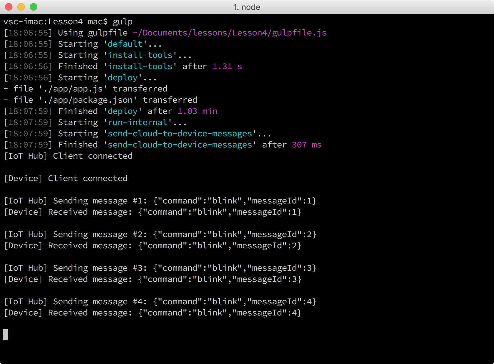

<properties
 pageTitle="Eseguire l'applicazione di esempio per ricevere messaggi cloud per dispositivo | Microsoft Azure"
 description="L'applicazione di esempio nella lezione 4 viene eseguito sul Pi e monitora i messaggi in arrivo dall'hub IoT. Una nuova attività confessano invia messaggi per il Pi dall'hub IoT a lampeggiare il LED."
 services="iot-hub"
 documentationCenter=""
 authors="shizn"
 manager="timlt"
 tags=""
 keywords=""/>

<tags
 ms.service="iot-hub"
 ms.devlang="multiple"
 ms.topic="article"
 ms.tgt_pltfrm="na"
 ms.workload="na"
 ms.date="10/21/2016"
 ms.author="xshi"/>

# <a name="41-run-the-sample-application-to-receive-cloud-to-device-messages"></a>4.1 eseguire l'applicazione di esempio per ricevere messaggi cloud al dispositivo

In questa sezione, si distribuisce un'applicazione di esempio per i 3 di pi greco Raspberry. L'applicazione di esempio controlla i messaggi in arrivo dall'hub IoT. È anche possibile eseguire un'attività confessano nel computer in uso per inviare messaggi al Pi dall'hub IoT. Alla ricezione di messaggi, l'applicazione di esempio lampeggiante il LED. Se è necessario soddisfare gli eventuali problemi, tentare le soluzioni di [risoluzione dei problemi di pagina](iot-hub-raspberry-pi-kit-node-troubleshooting.md).

## <a name="411-what-you-will-do"></a>4.1.1 azioni da adottare

- Connettere l'applicazione di esempio per il tuo fulcro IoT.
- Distribuire ed eseguire l'applicazione di esempio.
- Inviare messaggi dall'hub IoT per il Pi a lampeggiare il LED.

## <a name="412-what-you-will-learn"></a>4.1.2 informazioni contenute

- Come controllare i messaggi in arrivo dall'hub IoT.
- Come inviare messaggi cloud al dispositivo dall'hub IoT per il pi greco. 

## <a name="413-what-do-you-need"></a>4.1.3 cosa occorre

- 3 di pi greco Raspberry che ha configurato per l'utilizzo. Per informazioni su come configurare i pi greco, vedere [lezione 1: Introduzione a dispositivo Raspberry Pi 3](iot-hub-raspberry-pi-kit-node-get-started.md)
- Un hub IoT creata nell'abbonamento Azure. Per informazioni su come creare il tuo fulcro IoT Azure, vedere [Lezione 2: creare il tuo fulcro IoT Azure](iot-hub-raspberry-pi-kit-node-get-started.md)

## <a name="414-connect-the-sample-application-to-your-iot-hub"></a>4.1.4 connettere l'applicazione di esempio per il tuo fulcro IoT

1. Verificare che ci si trova nella cartella repo `iot-hub-node-raspberrypi-getting-started`. Aprire l'applicazione di esempio in Visual Studio codice eseguendo i comandi seguenti:

    ```bash
    cd Lesson4
    code .
    ```

    Avviso di `app.js` dei file nel `app` sottocartella. Il `app.js` file è il file di origine chiave che contiene il codice per controllare i messaggi in arrivo dall'IoT Hub. Il `blinkLED` funzione lampeggiante il LED.

    

2. Inizializzare il file di configurazione con i comandi seguenti:

    ```bash
    npm install
    gulp init
    ```

    Se è stata completata lezione 3 nel computer in uso, tutte le configurazioni vengono ereditate in modo che è possibile procedere al passaggio 4.1.5. Se è stata completata lezione 3 in un altro computer, è necessario sostituire i segnaposto nel `config-raspberrypi.json` file. Il `config-raspberrypi.json` file è presente una sottocartella della cartella principale.

    

- Sostituire **[hostname dispositivo o l'indirizzo IP]** con indirizzo IP o nome host che ottengono utilizzando il comando il pi greco`devdisco list --eth`
- Sostituire **[stringa di connessione dispositivo IoT]** con la stringa di connessione dispositivo che ottiene utilizzando il comando `az iot hub show-connection-string --name {my hub name} --resource-group {resource group name}`.
- Sostituire **[stringa di connessione hub IoT]** con la stringa di connessione hub IoT che ottiene utilizzando il comando `az iot device show-connection-string --hub {my hub name} --device-id {device id} --resource-group {resource group name}`.

## <a name="415-deploy-and-run-the-sample-application"></a>4.1.5 distribuire ed eseguire l'applicazione di esempio

Distribuire ed eseguire l'applicazione di esempio il Pi eseguendo i comandi seguenti:
  
```
gulp
```

Il comando confessano esegue l'attività di installazione strumenti prima di tutto. Quindi distribuisce l'applicazione di esempio per il pi greco. Infine, l'applicazione viene eseguito nel Pi e un'attività separata nel computer host di inviare messaggi di intermittenza 20 per il Pi dall'hub IoT.

Una volta che viene eseguita l'applicazione di esempio, viene avviato ascoltare i messaggi provenienti da un centro di raccolta IoT. Nel frattempo, attività confessano invia molti dei messaggi di "intermittenza" dall'IoT Hub per il pi greco. Per ogni messaggio intermittenza ricevuto, l'applicazione di esempio chiama la funzione blinkLED per lampeggiare il LED.

Verrà visualizzato il LED lampeggiante ogni due secondi attività confessano invio 20 messaggi dall'hub IoT per il pi greco. L'ultimo è un messaggio "non" che indica l'applicazione di interruzione dell'esecuzione.



## <a name="416-summary"></a>4.1.6 riepilogo

Inviate correttamente i messaggi dall'hub IoT al Pi a lampeggiare il LED. Sezione successiva è facoltativo che illustra come modificare attivato e disattivato il comportamento del LED.

## <a name="next-steps"></a>Passaggi successivi

[Sezione facoltativa: modificare attivato e disattivato il comportamento del LED](iot-hub-raspberry-pi-kit-node-lesson4-change-led-behavior.md)