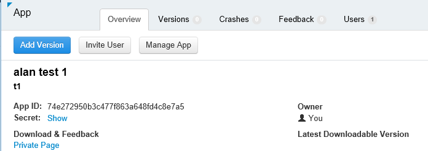

<properties
    pageTitle="Esempio di MyDriving Azure IoT: compilarlo | Microsoft Azure"
    description="Creare un'app che è una dimostrazione completa sulla progettazione di un sistema IoT utilizzando Microsoft Azure, inclusi flusso Analitica, apprendimento e gli hub di evento."
    services=""
    documentationCenter=".net"
    suite=""
    authors="harikmenon"
    manager="douge"/>

<tags
    ms.service="multiple"
    ms.workload="tbd"
    ms.tgt_pltfrm="ibiza"
    ms.devlang="dotnet"
    ms.topic="article"
    ms.date="03/25/2016"
    ms.author="harikm"/>


# <a name="build-and-deploy-the-mydriving-solution-to-your-environment"></a>Compilare e distribuire la soluzione MyDriving all'ambiente di

MyDriving è una soluzione Internet di elementi (IoT) per raccogliere dati dall'Auto, viene elaborato utilizzando l'apprendimento e presenta sul telefono cellulare. Back-end è costituito da una varietà di servizi forniti da Microsoft Azure. Il client possono essere telefoni Android o iOS Windows 10.

Abbiamo creato la soluzione MyDriving per offerta una panoramica di creazione di sistema IoT. Dall' [archivio MyDriving in GitHub](https://github.com/Azure-Samples/MyDriving), è possibile ottenere script Manager delle risorse di Azure per distribuire l'architettura di back-end nell'account Azure. Da questo punto, è possibile riconfigurare i diversi servizi, modificare la query in base ai dati disponibili e così via. È possibile trovare questi script - insieme codice per app per dispositivi mobili, il progetto API del servizio di Azure App e altro ancora, repository MyDriving.

Se non hai ancora provato l'app, consultare la [Guida introduttiva di ottenere](iot-solution-get-started.md).

Esiste un account dettagliato dell'architettura nella [Guida di riferimento MyDriving](http://aka.ms/mydrivingdocs). In conclusione, numerosi dispositivi che è necessario impostare e in cui impostano fino a creare un progetto simile:

* Un' **applicazione client** viene eseguito su telefoni Android, iOS e Windows 10. Serve la piattaforma Xamarin per condividere la maggior parte del codice, archiviato in GitHub in `src/MobileApp`. L'app esegue due funzioni distinte:
 * Inoltra telemetria dal dispositivo sistemi diagnostici (OBD) e il proprio servizio di posizione back-end cloud del sistema.
 * È un'interfaccia utente in cui gli utenti possono richiedere sulle loro registrata viaggi.
* Un **servizio cloud** Flash la Compact Flash i dati di viaggio in tempo reale ed elabora. L'attività principale di creazione questo servizio consiste nel scegliere, aggiungere un parametro e associare una varietà di servizi Azure. Alcune parti richiedono gli script di filtro e processo i dati in arrivo. Abbiamo utilizzare un modello di gestione di risorse Azure per configurare tutte le parti.
* Un' **applicazione di servizio mobile** è il servizio web dietro la parte dell'interfaccia utente dell'applicazione dispositivo. Il processo principale consiste nell'eseguire query sul database di dati memorizzati, elaborati. Il codice è GitHub in `src/MobileAppService`.
* **Visual Studio con Xamarin** è l'ambiente di sviluppo. Xamarin esistente come componente di Visual Studio e come un ambiente di sviluppo integrato autonomo (IDE), viene usata per generare il codice multipiattaforma e su dispositivi. Per generare il codice di iOS, è necessario disporre di un'istanza di Xamarin in esecuzione in un computer OS X. Se necessario, può essere eseguito come un agente gestito da Visual Studio.
* **Test** delle app di dispositivo viene eseguita nel Cloud Test Xamarin.
* **GitHub** è l'archivio in cui viene memorizzato codice, script e modelli.
* **Visual Studio Team Services** è un servizio cloud che consente di gestire la compilazione continua e test delle applicazioni di servizio e dispositivo web.
* **HockeyApp** viene utilizzato per distribuire versioni del codice di dispositivo. Raccoglie inoltre report di utilizzo e di arresto anomalo e commenti degli utenti.
* **Visual Studio applicazione approfondimenti** controlla il servizio web per dispositivi mobili.

Vediamo come si configura la tutto ciò. Si noti che molti dei passaggi facoltativi.

## <a name="sign-up-for-accounts"></a>Iscriversi per gli account

-   [Nozioni di base di visual Studio Dev](https://www.visualstudio.com/products/visual-studio-dev-essentials-vs.aspx). Questo programma gratuito consente di accedere facilmente a molti strumenti di sviluppo e servizi, ivi compresi Visual Studio, Visual Studio Team Services e Azure. Fornisce una carta di credito $25/ mese in Azure per 12 mesi. Include anche gli abbonamenti a Pluralsight formazione e Xamarin University. È inoltre possibile iscriversi separatamente per livelli gratuiti di [Azure](https://azure.com) e [Visual Studio Team Services](https://www.visualstudio.com/products/visual-studio-team-services-vs.aspx), ma questi non forniscono crediti Azure.

-   [HockeyApp](https://rink.hockeyapp.net/) (facoltativo), per la gestione di distribuzione di test di App per dispositivi mobili e la raccolta di telemetria.

-   [Xamarin](https://xamarin.com/) (obbligatorio), per la creazione di app per dispositivi mobili e l'esecuzione di test e debug viene eseguito nel [Cloud Test Xamarin](https://xamarin.com/test-cloud).

-   [GitHub](https://github.com/Azure-Samples/MyDriving/) (facoltativo), per creare archivi pubblici gratuiti per il proprio codice (archivi privati sono pagate). In alternativa, è possibile utilizzare il piano di base in Visual Studio Team Services per archivi privati.

-   [Power BI](https://powerbi.microsoft.com/) (facoltativo), creare visualizzazioni avanzate dei dati nell'intero sistema.

> [AZURE.NOTE] Non è necessario un account GitHub per accedere al codice MyDriving repository [GitHub MyDriving](https://github.com/Azure-Samples/MyDriving).

## <a name="install-development-tools"></a>Installare gli strumenti di sviluppo

È per lo sviluppo di soluzioni completo: un iOS, Android e Windows 10 Mobile app multipiattaforma, con un Azure back-end.

In alternativa, è possibile utilizzare Xamarin Studio nel Mac o Windows per lo sviluppo di App per dispositivi mobili se non si sta utilizzando nel Azure back-end.

Esiste una [descrizione più completa del programma di installazione](https://msdn.microsoft.com/library/mt613162.aspx).

### <a name="windows-development-machine"></a>Computer di sviluppo di Windows

Lo strumento centrale su Windows è Visual Studio, per l'utilizzo con l'app MyDriving per Android e Windows, il progetto API del servizio di App e le estensioni microservice.

Xamarin, fra, emulatori e altri componenti utili vengano integrati con Visual Studio.

Installazione:

-   [Visual Studio 2015 con Xamarin](https://www.visualstudio.com/products/visual-studio-community-vs) qualsiasi edizione - Community è gratuita.

-   [SQLite per piattaforma Windows universale](https://visualstudiogallery.msdn.microsoft.com/4913e7d5-96c9-4dde-a1a1-69820d615936). Necessario per generare il codice di Windows 10 Mobile.

-   [Azure SDK per Visual Studio 2015](https://go.microsoft.com/fwlink/?linkid=518003&clcid=0x409). Offre il SDK per l'esecuzione di applicazioni in Azure, con gli strumenti della riga di comando per la gestione di Azure.

-   [Servizio azure tessuti SDK](http://www.microsoft.com/web/handlers/webpi.ashx?command=getinstallerredirect&appid=MicrosoftAzure-ServiceFabric). È necessario per creare l'estensione [microservice](../service-fabric/service-fabric-get-started.md) .

Inoltre, accertarsi di avere le estensioni di Visual Studio destra. Verificare che in **Strumenti**visualizzati **Android, iOS, Xamarin...**. In caso contrario, aprire il pannello di controllo e quindi selezionare **programmi e funzionalità** > **Microsoft** > **Visual Studio 2015** > **Modifica**. Selezionare **sviluppo multipiattaforma** **C\#/.Net (Xamarin)**. Da qui, verificare che sia installato **Fra per Windows** .

### <a name="mac-development-machine"></a>Computer di sviluppo Mac

Mac (Yosemite o versioni successive) è necessaria se si desidera sviluppare per iOS. Anche se si utilizza Visual Studio con Xamarin in Windows per sviluppare e gestire tutto il codice, Xamarin utilizza un agente installato in un Mac per creare e firmare il codice di iOS.


(In alternativa, è possibile utilizzare Xamarin Studio direttamente nel Mac sviluppare App multipiattaforma.)

Non è necessario Mac se non si vuole includere iOS come piattaforma di destinazione.

Installazione:

-   [Xamarin Studio per iOS](https://developer.xamarin.com/guides/ios/getting_started/installation/mac/). È anche possibile impostare Visual Studio e Xamarin in un Mac che esegue una macchina virtuale di Windows. Vedere [il programma di installazione, installazione e verifiche per gli utenti Mac](https://msdn.microsoft.com/library/mt488770.aspx) su MSDN.

-   [Strumenti di sviluppo Azure](https://azure.microsoft.com/downloads/) (facoltativo).

Consentire l'accesso remoto su Mac. Aprire **Preferenze di sistema** > **condivisione**e quindi selezionare **Accesso remoto**.

Quando si apre un progetto di iOS in Visual Studio in Windows, Xamarin plug-in verrà chiesto di ID del Mac.

## <a name="fetch-the-github-repository"></a>Recuperare l'archivio GitHub

Recuperare una copia locale del [repository GitHub MyDriving](https://github.com/Azure-Samples/MyDriving) tramite il pulsante **Scarica ZIP** in GitHub, Visual Studio o un altro client fra.

Decomprimere il file in una cartella con un nome di percorso breve, ad esempio c:\\codice.

In alternativa, se si desidera mantenere aggiornati con o contribuire al nostro codice, clonare come indicato di seguito repository:

**operazioni duplicato https://github.com/Azure-Samples/MyDriving.git**

## <a name="get-a-bing-maps-api-key"></a>Ottenere un Bing maps API chiave

[Eseguire la registrazione per una chiave API Bing Maps](https://msdn.microsoft.com/library/ff428642.aspx).

È necessario sostituire nella riga 22 `src/MobileApps/MyDriving/MyDriving.Utils/Logger.cs`.


## <a name="build-the-demo-app"></a>Creare app demo

Aprire queste soluzioni in Visual Studio:

-   src\MobileApps\MyDriving.sln

-   src\MobileAppService\MyDrivingService.sln

-   src\Extensions\ServiceFabric\VINLookUpApplication\VINLookUpApplication.sln

Vengono fornite istruzioni per:

-   Protezione alcuni progetti potenzialmente non attendibili. Scegliere per aprirli se si desidera procedere.

-   Impostare la modalità sviluppatore se si sta lavorando su un computer Windows 10 aggiornato.

-   Specificare le credenziali Xamarin.

-   Connettersi a Mac Xamarin. Se non si dispone di un computer Mac, fare clic sul progetto iOS in Visual Studio e quindi selezionare **Scarica progetto**.

Rigenerare la soluzione.

Nel caso di problemi con la creazione, provare le soluzioni ai quirks abbiamo trovato:

-   *Non viene caricato VINLookupApplication progetto*: assicurarsi che sia installato [Azure SDK per Visual Studio 2015](https://go.microsoft.com/fwlink/?linkid=518003&clcid=0x409).

-   *Non crea tessuti servizio progetto*: creare progetti interfaccia prima di tutto e assicurarsi che sia installato Service tessuti SDK.

-   *Non creare app android*:

    -   Aprire **Strumenti** > **Android** > **Android SDK Manager**e assicurarsi che 6 Android (API 23) / piattaforma SDK è installata.

    -   Eliminare la directory e quindi rigenerare:<br/>
        `%LocalAppData%\Xamarin\zips`

## <a name="get-to-know-the-code"></a>Imparare a conoscere il codice

Soluzione, sarà possibile trovare:

-   Estensioni Azure: servizio tessuti.

-   Azure HDInsight: Script per l'elaborazione dei dati di viaggio in Azure.

-   App per dispositivi mobili: App dispositivo.

-   MobileAppsService/MyDrivingService: Terminare web indietro.

-   Power BI: La definizione del report.

-   Script:

    -   Manager delle risorse: modelli per creare le risorse Azure.

    -   PowerShell: Script per eseguire i modelli di Manager delle risorse.

    -   Database SQL Azure: Debug di database.

-   Database SQL: CreateTables ha: definizioni di schema.

-   Azure flusso Analitica: Query che trasformano il flusso di dati in ingresso.

## <a name="run-the-apps-in-development-mode"></a>Eseguire l'App in modalità sviluppo

Intervenire per eseguire le applicazioni, in base al dispositivo in uso:

-  Back-end: MyDrivingService imposta come progetto di avvio, premere F5 per eseguire il servizio web back-end. Verrà aperta una visualizzazione browser della voce API.

-  Client mobili: [App per dispositivi mobili sono sviluppati in Xamarin](https://developer.xamarin.com/guides/cross-platform/deployment,_testing,_and_metrics/debugging_with_xamarin/).
 -  Android: Per informazioni dettagliate, vedere [Il debug di Android in Xamarin](http://developer.xamarin.com/guides/android/deployment,_testing,_and_metrics/debugging_with_xamarin_android/).

 -  iOS: per informazioni dettagliate, vedere [debug in iOS](http://developer.xamarin.com/guides/ios/deployment,_testing,_and_metrics/debugging_in_xamarin_ios/).

 -  Windows Phone: Per informazioni dettagliate, vedere [Xamarin + Windows Phone](https://developer.xamarin.com/guides/cross-platform/windows/phone/).

## <a name="upload-the-mobile-app-to-hockeyapp"></a>Caricare l'app per dispositivi mobili HockeyApp

HockeyApp gestisce la distribuzione dell'app Windows, Android o iOS per verificare gli utenti, informare gli utenti di nuove versioni. Raccoglie anche utile arresto anomalo report, commenti degli utenti con le schermate e metriche di utilizzo.

[Prima di tutto caricare](http://support.hockeyapp.net/kb/app-management-2/how-to-create-a-new-app) l'app genera. Quindi accedere a [HockeyApp](https://rink.hockeyapp.net) dal computer di sviluppo. Nel dashboard di sviluppo, fare clic su **Nuova App**e quindi trascinare i file compilati nella finestra. (In un secondo momento, è possibile automatizzare il servizio di compilazione per eseguire questa operazione.)

Ora si è nel dashboard app.



Ripetere la procedura per ogni piattaforma che l'app viene eseguita nel. È possibile eseguire le operazioni seguenti:

-  Utilizzare l' [ID di app](http://support.hockeyapp.net/kb/app-management-2/how-to-find-the-app-id) nel dashboard per inviare commenti e suggerimenti e dati di un arresto anomalo dell'app. In MyDriving, aggiornare gli ID di src/MobileApps/MyDriving/MyDriving.Utils/Logger.cs.

-  [Invita utenti di prova](http://support.hockeyapp.net/kb/app-management-2/how-to-invite-beta-testers). È possibile ottenere un URL per la selezione di utenti tester. Potrà iscriversi per il team, scaricare l'app e inviare commenti e suggerimenti.

-  Se si preferisce una versione beta più aperta, impostare la distribuzione al pubblico. Fare clic su **Gestisci App** > **distribuzione** > **scaricare = pubblico**. Ora tutti gli utenti possono scaricare l'app e inviare commenti e suggerimenti e verrà visualizzata una notifica quando si inserisce una nuova versione. Potrebbe essere visualizzato anche alcuni report di arresto anomalo da essi.

    

-  [Report di arresto anomalo di collegamento per Visual Studio Team Services](http://support.hockeyapp.net/kb/third-party-bug-trackers-services-and-webhooks/how-to-use-hockeyapp-with-visual-studio-team-services-vsts-or-team-foundation-server-tfs). Fare clic su **Gestisci App** > **Visual Studio Team Services**. HockeyApp possibile creare automaticamente gli elementi di lavoro in Team Services quando sono disponibili i report di arresto anomalo o ricezione di commenti e suggerimenti.

Altre informazioni nel [sito HockeyApp](https://hockeyapp.net).

## <a name="test-the-mobile-app-on-xamarin-test-cloud"></a>Verificare l'app per dispositivi mobili nel Cloud Test Xamarin

[Xamarin Test Cloud](https://developer.xamarin.com/guides/testcloud/introduction-to-test-cloud/) consente di automatizzare test dell'interfaccia utente nei dispositivi reali nel cloud. Utilizzando il framework NUnit, scrivere i test eseguiti l'app tramite l'interfaccia utente.

Per utilizzare Xamarin, [Xamarin.UITests](https://developer.xamarin.com/guides/testcloud/uitest/intro-to-uitest/) SDK è incorporare l'app, viene fornito come pacchetto NuGet. È possibile trovarla nell'app demo ed è inclusa la creazione di nuovi progetti di test con i modelli di Xamarin.


Un progetto di test di esempio è incluso l'app nel repository. In [MyDriving](https://github.com/Azure-Samples/MyDriving/tree/master/src/MobileAppService), esaminare [src](https://github.com/Azure-Samples/MyDriving/tree/master/src)/MobileApps/[MyDriving](https://github.com/Azure-Samples/MyDriving/tree/master/src/MobileApps/MyDriving)/MyDriving.UITests/.

Se si usa una compilazione di Visual Studio Team Services, è facile scrivere Xamarin UI unit test ed eseguirli durante la compilazione.

## <a name="deploy-azure-services"></a>Distribuire i servizi di Azure

Per eseguire una distribuzione automatica di Azure servizi e dei servizi di compilazione Team Services, vedere le istruzioni dettagliate in **scripts/README.md**.

Microsoft Azure offre un'ampia varietà di diversi servizi che è possibile utilizzare la creazione di applicazioni cloud. Benché molte possono essere utilizzate singolarmente (ad esempio applicazioni di servizio/Web App), fanno al meglio quando si interconnessi alla maschera un sistema integrato come viene utilizzato in MyDriving.

È possibile creare e connettere servizi Azure manualmente, ma è molto più veloci e affidabili a utilizzare Gestione risorse di Azure modelli. [Manager delle risorse](../azure-resource-manager/resource-group-overview.md) consente di automatizzare la distribuzione di una soluzione risorse e creazione di collegamenti tra di esse.

Il modello sono disponibili per il sistema MyDriving repository GitHub in [Script/ARM](https://github.com/Azure-Samples/MyDriving/tree/master/scripts/ARM). Fornisce una visualizzazione completa e concisa di come sono interconnessi diversi servizi di architettura. Spiegheremo tutti questi elementi in dettaglio nella [Guida di riferimento MyDriving](http://aka.ms/mydrivingdocs), ma sono disponibili molte appena leggendo tramite il modello.

> [AZURE.NOTE] I servizi più Azure hanno un costo associato, a seconda del livello prezzo. Se ha familiarità con Azure, è possibile [eseguire una prova gratuitamente](https://azure.microsoft.com/free/). Tuttavia, se non si prevede di utilizzare alcuni componenti del sistema MyDriving, assicurarsi di rimuovere in modo da evitare incorrere costi. La sezione "Stima dei costi operativi" più avanti in questo articolo viene fornito un riepilogo delle spese di assistenza tipici.

### <a name="edit-the-template"></a>Modificare il modello

Per personalizzare la distribuzione, ad esempio per rimuovere componenti non necessari oppure per aggiungere altri utenti, verificare prima di tutto una copia di scenario\_complete.params.json e scenario\_complete.json in cui si desidera apportare modifiche.

È possibile utilizzare lo scenario\_file complete.params.json per ignorare le varie valori predefiniti, ad esempio il servizio SKU o il tipo di replica di archiviazione, come descritto nella tabella seguente. I valori predefiniti selezionare le opzioni di costo più basso.

| **Parametro**         | **Descrizione**                | **Valore predefinito** |
|--------|---------|-------|
| Hub IoT SKU           | Livello di servizio IoT Hub Azure | F1                |
| Tipo di Account di archiviazione  | Tipo di replica di spazio di archiviazione       | LRS standard      |
| Obiettivo di servizio SQL | Consumo intervallo aperto concorrenza   | DW100             |
| Piano di hosting SKU      | Piano di servizio servizio di App   | F1                |

In uno scenario\_complete.json:

-   Cercare "base" e sostituirlo con un nome che si preferisce.

-   Cercare "Creare". Ognuna di queste sezioni crea una risorsa.

-   Impostare gli opportuni valori sqlServerAdminLogin e sqlServerAdminPassword.

-   Prima di eliminare una sezione che crea una risorsa, verificare la presenza di dipendenti dalla ricerca per il proprio nome in un' posizione nel file. Si noti che ogni sezione in cui viene creato un servizio include una sezione *dependsOn* che elenca le dipendenze.

Ecco cosa consente di configurare il modello. Informazioni dettagliate sono disponibili nella [Guida di riferimento](http://aka.ms/mydrivingdocs).

| **Servizio**                 | **Descrizione e dettagli**  
|---|----
| Account di archiviazione            | Il modello consente di creare tre account:                                                                                                                                                                       
|| -Database SQL che riceve telemetria aggregato dal flusso Analitica e funge da archivio di backup per le tabelle di Azure App servizio che espongono i dati tramite i punti finali API.                      
|| -Archiviazione blob che sono indicati i dati cronologici da un altro processo flusso Analitica, possano essere elaborati dal HDInsight.                                                                                         
|| -Un database SQL che riceve risultati elaborati da HDInsight da utilizzare con Power BI.                                                                                                                 
| Hub IoT Azure                     | Stabilisce una connessione bidirezionale a ogni dispositivo collegato. Soluzione MyDriving app per dispositivi mobili funge da un gateway di campo per inviare dati a Azure IoT Hub. Azure IoT quindi viene utilizzata come input al flusso Analitica. |
| Hub evento Azure                   | Un output per un processo di flusso Analitica che Accoda output a estensioni che vengono creati con Azure servizio tessuti.                                                                                               
| SQL Azure Data Warehouse          |                                                                                                                                                                                                            
| Processi Analitica flusso | Connettere ingressi e uscite con una query, che viene utilizzata per aggregare sia dati in tempo reale e per l'App API del servizio, apprendimento Azure, estensioni e Power BI.                               
| Area di lavoro formazione computer  | Include esperimenti, codice R e API servizio.                                                                                                                                                              
| Dati di Azure Factory                | Formazione apprendimento pianificata.                                                                                                                                                                     
| Piano di servizio tessuti hosting | Per le estensioni.                                                                                                                                                                                            
| Servizio di App ("App per dispositivi mobili")  | Ospita il progetto Mobile App API che fornisce i punti finali per app per dispositivi mobili. Il codice API deve essere distribuito al servizio di App da Visual Studio.                                                         
| Regole di avviso                 | Invia che posta elettronica se le risposte app indicano errori.                                                                                                                                            
| Informazioni dettagliate sui applicazione        | Per il monitoraggio delle prestazioni delle API del servizio di App. È necessario configurare la connessione in Visual Studio.                                                                                          
| Archivio chiave Azure                   | Per il salvataggio del certificato di cluster del servizio web.                                                                                                                                                                

### <a name="run-the-template"></a>Eseguire il modello

In **scripts/README.md**, sono disponibili istruzioni dettagliate per l'esecuzione del modello.

Per eseguire il provisioning di tutti questi servizi nell'account Azure mediante gli script, eseguire una delle operazioni seguenti:

-   Usare PowerShell:

    ```

    cd scripts/PowerShell;
    deploy.ps1 *location* *resourceGroupName*
    ```

 -   *è il [percorso di Azure](https://azure.microsoft.com/regions/), ad esempio* `North Europe` o `West US`. Usare `Get-AzureLocation` per trovare un elenco delle posizioni disponibili.

 -   *resourceGroupName* è il nome che si desidera assegnare al gruppo appartenenti a tutte le risorse. Dopo aver con le risorse, è possibile eliminare le tutte insieme eliminando questo gruppo.

-   Eseguire DeploymentScripts/Bash/deploy.sh con Bash.

-   Aprire e compilare la soluzione di Visual Studio DeploymentScripts/VS/DeployARM.sln.

Si noti che ogni volta che viene eseguito il modello, viene creato un nuovo set di risorse con i nuovi nomi. Per eliminare le risorse, accedere al portale di ed eliminare il gruppo di risorse.

Se lo script non riesce per qualsiasi motivo, è possibile eseguirlo nuovamente.

Lo script offre la possibilità di configurazione dell'integrazione continua in Visual Studio Team Services. Se è stata configurata un progetto Team Services, è necessario un URL: https://yourAccountName.visualstudio.com. Quando viene richiesto, immettere l'URL completo. È possibile assegnare un nome nuovo o esistente per un progetto Team Services.

## <a name="set-up-build-and-test-definitions-in-visual-studio-team-services"></a>Configurare la compilazione e testare le definizioni in Visual Studio Team Services

Abbiamo utilizzare i servizi di Team del progetto principalmente per la creazione e verificare le funzionalità. Ma fornisce anche il supporto di collaborazione eccellente, ad esempio Gestione attività con le schede Kanban, revisione codice integrato con le attività e controllo del codice sorgente e gestita compilato. Si integra anche con altri strumenti, ad esempio GitHub, Xamarin, HockeyApp e naturalmente, Visual Studio. È possibile accedere tramite l'interfaccia web o tramite Visual Studio, se più comodo in qualsiasi momento.

La procedura descritta nelle definizioni di compilazione e rilascio utilizza una varietà di plug-in servizi disponibili in Team Services [Marketplace](https://marketplace.visualstudio.com/VSTS). Oltre a utilità di base per l'esecuzione di righe di comando o copiare i file, sono disponibili i servizi che richiamare build Xamarin, Android e altri fornitori e che si connettono a HockeyApp.


### <a name="build-definitions"></a>Definizioni di compilazione

Abbiamo definizioni di compilazione per ognuno dei destinatari principali. Sono anche disponibili delle varianti per la caratteristica e il test di regressione. Il risultato è:

-   MyDriving.Services (app web back-end per l'app per dispositivi mobili)

-   MyDriving.Xamarin.Android

    -   Caratteristica di MyDriving.Xamarin.Android

    -   MyDriving.Xamarin.Android regressione

-   MyDriving.Xamarin.iOS

    -   Caratteristica di MyDriving.Xamarin.iOS

    -   MyDriving.Xamarin.iOS regressione

-   MyDriving.Xamarin.UWP

    -   Caratteristica di MyDriving.Xamarin.UWP

    -   MyDriving.Xamarin.UWP regressione

Se si desidera visualizzare i dettagli completi della configurazione, vedere sezione 4.7 della [Guida di riferimento MyDriving](http://aka.ms/mydrivingdocs), "Compilazione e configurazione di rilascio." Seguono lo stesso modello generale. Script:

1.  Consente di ripristinare il pacchetto NuGet. Abbiamo non mantenere codice compilato nel repository, in modo che i primi passi ogni compilazione siano per ripristinare i pacchetti NuGet necessari.

2.  Attiva la licenza. Viene eseguita la compilazione nel cloud, in modo in cui è necessaria una licenza, in particolare, per il servizio di compilazione Xamarin, è necessario attivare la licenza nel computer di compilazione corrente. Quindi abbiamo disattivarlo immediatamente dopo, per consentire che deve essere utilizzato in un altro computer.

3.  Compila utilizzando il servizio appropriato. Serve Xamarin build per l'App per dispositivi mobili e Visual Studio compila per il servizio web back-end.

4.  Consente di creare test.

5.  Consente di eseguire test. Abbiamo eseguire i test di app per dispositivi mobili in Xamarin Test Cloud.

6.  Pubblica il risultato di compilazione di destinazione.

Trigger per le build principale è impostato per l'integrazione continua. Ovvero la compilazione viene eseguita ogni volta che è stato archiviato codice ramo master.


### <a name="release-definitions"></a>Definizioni di rilascio

Definizioni di rilascio siano configurate nello stesso modo.

Per il servizio web è configurare la distribuzione di Azure web App:


E il rilascio trigger è impostato su distribuzione continua. Vale a dire ogni controllo aggiuntivo seguito da un risultati compilazione completato un aggiornamento all'app web.


Per App per dispositivi mobili, è distribuire in HockeyApp:


## <a name="explore-telemetry-by-using-application-insights"></a>Esplorare telemetria tramite applicazione approfondimenti

[Informazioni dettagliate sui applicazione](../application-insights/app-insights-overview.md) raccoglie telemetria sulle prestazioni e l'uso dei servizi web. Applicazione approfondimenti SDK invia telemetria dal servizio alla risorsa applicazione approfondimenti in Azure.

Individuare la risorsa applicazione approfondimenti che il modello impostato. Non esiste, è possibile esplorare i grafici delle prestazioni del [progetto di servizio App Mobile](https://github.com/Azure-Samples/MyDriving/tree/master/src/MobileAppService). Che vengano visualizzate richieste di server e i tempi di risposta, errori, e conta eccezione. Sono disponibili anche grafici dipendenza dei tempi di risposta, vale a dire chiamate per il database e le API REST, ad esempio l'apprendimento. Se sono presenti problemi di prestazioni, sarà possibile vedere quali parte del sistema è causati.


Se si dispone di un servizio web che ha configurato manualmente, è facile confondere i tipi di grafici stesso. Fare clic su e il servizio web **Tools** > **estensioni** > **Aggiungi**. Selezionare **informazioni approfondite dell'applicazione**.


La caratteristica funziona tramite strumentazione dell'applicazione con SDK approfondimenti applicazione.

È possibile aggiungere telemetria personalizzato (o strumento un'applicazione che viene eseguito in un punto qualsiasi all'esterno di Azure) aggiungendo [SDK approfondimenti di applicazione](../application-insights/app-insights-asp-net.md) in fase di sviluppo. Questo è utile per la metrica log che dipende dall'applicazione, ad esempio lunghezza media di andata e ritorno degli utenti o chilometraggio totale. In Visual Studio, fare clic sul progetto e quindi selezionare **Aggiungi approfondimenti applicazione**.


Informazioni dettagliate sui applicazione invia e-mail di avviso se rileva insoliti numeri delle risposte di errore. È anche possibile impostare i proprio avvisi per diverse metriche, ad esempio i tempi di risposta.

Solo per assicurarsi che il servizio web sia sempre aggiornato e in esecuzione, è possibile impostare i [test di disponibilità](../application-insights/app-insights-monitor-web-app-availability.md). Questi test effettuare il ping del sito da diverse posizioni in tutto il mondo di 15 minuti. Nuovo, viene visualizzato un messaggio di posta elettronica se sembra essere un problema.

## <a name="estimate-operational-costs"></a>Stima dei costi operativi

È molto conveniente eseguire un'app analogo al seguente su piccola scala. Molti dei servizi sono gratuiti Entry livelli, in modo che sviluppo e il funzionamento di piccole dimensioni costi poco. E naturalmente, non devono delle applicazioni di utilizzare tutte le funzionalità illustrate in MyDriving.

Ecco una stima approssimativa dei costi per impostare la configurazione di sviluppo per MyDriving. È anche nota alcune alternative abbiamo *Networking* . Queste informazioni possono risultare utili come stimare i propri costi.

Si supponga di:

-   Un team di non più di cinque (più osservando parti interessate).

-   Esecuzione di un mese.

-   100 utenti con quattro viaggi al giorno.

>[AZURE.NOTE] Se ha familiarità con Azure, esiste un [account gratuito](https://azure.microsoft.com/free/).

| **Servizio/componente**  | **Note** | **Costo/mese** |
|--------|--------|----------------|
| [Visual Studio 2015 Community](https://www.visualstudio.com/products/visual-studio-community-vs) con [Xamarin](https://visualstudiogallery.msdn.microsoft.com/dcd5b7bd-48f0-4245-80b6-002d22ea6eee) <br/>Ambiente di sviluppo multipiattaforma| Community di Visual Studio. (Necessario [Visual Studio Professional](https://www.visualstudio.com/vs-2015-product-editions) per [Xamarin.Forms](https://xamarin.com/forms)per progettare multipiattaforma da un'unica base di codice).  | $0   |
| [Hub IoT Azure](https://azure.microsoft.com/pricing/details/iot-hub/) <br/>Connessione dati bidirezionale nei dispositivi | 8.000 messaggi + 0,5 KB/messaggio gratuito. | $0             |
| [Flusso Analitica](https://azure.microsoft.com/pricing/details/stream-analytics/)  <br/>   Elaborazione di dati del flusso di volumi elevati                                                                                                                                                              | Spese di $0.031 per streaming unità orarie, quando è attivo. Scegliere il numero di unità di flusso che si desidera. altre novità in scalare. | $23            |
| [Apprendimento](https://azure.microsoft.com/documentation/services/machine-learning/)<br/> Risposte adattate                                                                                                                                                                              |  $10/postazioni/mese. <br/>                                                                                                                                                                                 + 3 ore prova \* $1 / Provare ora. <br/>                                                                                                                                                           + 3.5 ora API CPU \* $2 / ora di produzione CPU. <br/>                                                                                                                                                          Tempo CPU API presuppone 5 minuti al giorno, formazione, anche se questo sarebbe salire con i dati di input.                   <br/>                                                                                                                                                                     + punteggio per elaborare 400 viaggi/giorno/giorno min 2.  | $20            |
| [Servizio di App](https://azure.microsoft.com/pricing/details/app-service/)  <br/> Host per dispositivi mobili back-end                                                                                                                                                                              | Livello B1: produzione web app. | $56            |
| [Servizi di Team Visual Studio](https://azure.microsoft.com/pricing/details/visual-studio-team-services/)  <br/> Creare unit test e la gestione del rilascio; gestione delle attività | Agenti privati, cinque utenti.| $0             |
| [Informazioni dettagliate sui applicazione](https://azure.microsoft.com/pricing/details/application-insights/) <br/>Monitoraggio delle prestazioni e l'uso di siti e servizi web| Livello gratuito.  | $0             |
| [HockeyApp](http://hockeyapp.net/pricing/) <br/> Distribuzione dei beta App e raccolta di commenti e suggerimenti, l'utilizzo e dati di un arresto anomalo                                                                                                                                      | Due App gratuita per i nuovi utenti.<br/> $30/ mese successivo.  | $0    |
| [Xamarin](https://store.xamarin.com/)<br/> Codice su una piattaforma uniforme per più dispositivi | Versione di valutazione gratuita. <br/>$25/ mese successivo.| $0    |
| [Database SQL](https://azure.microsoft.com/pricing/details/sql-database/) Azure servizio di App| Livello di base. modello di database singola. | $5             |
| [Infrastruttura di servizio](https://azure.microsoft.com/pricing/details/service-fabric/) (facoltativo)  | Eseguire un cluster locale. | $0             |
| [Power BI](https://powerbi.microsoft.com/pricing/)<br/> Visualizza versatile e analisi dei dati di flusso e statici| Livello gratuito: almeno 1 GB, 10.000 righe/ora, giorno aggiornamento. <br/> $10/utente/mese per [limiti superiori](https://powerbi.microsoft.com/documentation/powerbi-power-bi-pro-content-what-is-it/), altre opzioni di connessione e la collaborazione.    | $0             |
| [Spazio di archiviazione](https://azure.microsoft.com/pricing/details/storage/)   | G (in locale ridondanti) &lt; $0.024 100 G/GB.  | $3             |
| [Dati Factory](https://azure.microsoft.com/pricing/details/data-factory/)                                                                                                                       | $0.60 per attività \* (8-5 FOC).| $2             |
| [HDInsight](https://azure.microsoft.com/pricing/details/hdinsight/) <br/>  Cluster su richiesta per la formazione giornaliere   | Tre nodi A3 0,32 dollari/ora per 1 ora ogni giorno * 31 giorni. | $30            |
| [Hub di evento](https://azure.microsoft.com/pricing/details/event-hubs/)  | Di base con unità di velocità $11/ mese + ingresso $0.028. | $11            |
| Adattatore OBD  || $12            |
| **Totale**|    | **$157**       |

Per ulteriori informazioni, vedere:

-   Riepilogo dei [limiti e le quote di servizio Azure](../azure-subscription-service-limits.md#iot-hub-limits)

-   Azure [prezzi calcolatrice](https://azure.microsoft.com/pricing/calculator/)

## <a name="send-us-your-feedback"></a>Inviare feedback

Poiché abbiamo creato MyDriving per partecipa sistemi IoT, ci teniamo sicuramente feedback degli utenti è sulla bene funziona. Indicare se:

-  Si verificano problemi o problematiche.

-  Esiste un punto di estensione per renderlo più adatto al proprio scenario.

-  È disponibile un modo più efficiente per ottenere determinate esigenze.

-  Si dispone di altri suggerimenti per migliorare la documentazione o MyDriving.

Per inviare commenti e suggerimenti, archiviare [problema nel GitHub] o lasciare un commento seguente (en-us edition).

È per la collaborazione dall'utente.

## <a name="next-steps"></a>Passaggi successivi

È consigliabile la [Guida di riferimento MyDriving](http://aka.ms/mydrivingdocs), ovvero una descrizione dettagliata della struttura del sistema e dei relativi componenti.
