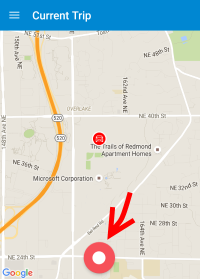
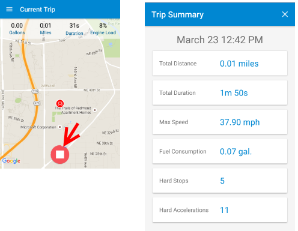

<properties
    pageTitle="Esempio di MyDriving Azure IoT: Guida introduttiva | Microsoft Azure"
    description="Guida introduttiva a un'app che è una dimostrazione completa sulla progettazione di un sistema IoT utilizzando Microsoft Azure, inclusi flusso Analitica, apprendimento e gli hub di evento."
    services=""
    documentationCenter=".net"
    suite=""
    authors="harikmenon"
    manager="douge"/>

<tags
    ms.service="multiple"
    ms.workload="tbd"
    ms.tgt_pltfrm="ibiza"
    ms.devlang="dotnet"
    ms.topic="article"
    ms.date="03/25/2016"
    ms.author="harikm"/>

# Sistema MyDriving IoT: Guida introduttiva

MyDriving è un sistema che illustra la struttura e l'implementazione di una tipica soluzione [Internet di elementi](iot-suite-overview.md) (IoT) che raccoglie telemetria da dispositivi, elabora i dati nel cloud e applica apprendimento fornire una risposta adattata. Dimostrazione registra dati relativi le visite auto utilizzando i dati dal telefono cellulare e un adattatore che raccoglie informazioni dal sistema di controllo di auto. Utilizza questi dati per fornire un feedback su uno stile Guida rispetto ad altri utenti.

Lo scopo reale di MyDriving è per iniziare la creazione di soluzioni personalizzate IoT. Ma prima che, di seguito procedere con l'app MyDriving se stesso, come un membro del team utente test. Offre un'esperienza di app e il sistema sottostante come consumer, prima di delve nell'architettura. Introduce anche a HockeyApp, interessanti consente di gestire le distribuzioni alfa e beta le App per utenti di prova.

## Utilizzare l'esperienza mobile

È possibile usare l'app MyDriving se si dispone di un dispositivo Windows 10, Android o iOS.

### Installazione di Windows 10 Mobile e Android

Nel dispositivo:

1.  Consenti sviluppo App:

    -   Android: Nelle **Impostazioni** > **sicurezza**, consentire app da **origini sconosciute**.

    -   Windows 10: Nelle **Impostazioni** > **aggiornamenti** > **Per gli sviluppatori**, impostare **la modalità sviluppatore**.

2.  Partecipare il nostro team beta mediante iscrizione con o l'accesso a [HockeyApp](https://rink.hockeyapp.net). HockeyApp rende più facile distribuire versioni iniziale dell'app per utenti di prova.

    Se si usa Windows 10, utilizzare il Visualizzatore di bordo.

    Se un partecipante compilazione 2016, accedere con la stessa Microsoft indirizzo di posta elettronica registrato per la conferenza utilizzando uno dei pulsanti di Microsoft. Si sta già iscritti con HockeyApp.

    

3.  Scaricare e installare l'app da qui:

    -   [Android](http://rink.io/spMyDrivingAndroid)

    -   [Windows 10](http://rink.io/spMyDrivingUWP)

    Esistono due elementi. Installare il certificato nella pagina **Utenti attendibili**. Installare l'app.

*Eventuali problemi di avvio dell'app di Windows 10 Mobile?* Telefono potrebbe essere un aggiornamento o due versioni. Assicurarsi di che aver importato gli aggiornamenti più recenti o installare:

 - [Microsoft.NET.Native.Framework.1.2.appx](https://download.hockeyapp.net/packages/win10/Microsoft.NET.Native.Framework.1.2.appx) 

 - [Microsoft.NET.Native.Runtime.1.1.appx](https://download.hockeyapp.net/packages/win10/Microsoft.NET.Native.Runtime.1.1.appx) 

 - [Microsoft.VCLibs.ARM.14.00.appx](https://download.hockeyapp.net/packages/win10/Microsoft.VCLibs.ARM.14.00.appx)

### installazione di iOS

Se si è partecipato compilazione 2016, scaricare l'app come membro del team di test HockeyApp:

1.  Sul dispositivo iOS, accedere a [HockeyApp](https://rink.hockeyapp.net).
    Utilizzare uno dei pulsanti di accesso Microsoft e accedere con la stessa Microsoft indirizzo di posta elettronica registrato con la conferenza. (Non utilizzare i campi di posta elettronica e password).

    

2.  Nel dashboard HockeyApp selezionare MyDriving e scaricarlo.

3.  Autorizzare la versione beta da HockeyApp:

    un. Passare a **Impostazioni** > **generali** > **profili e gestione di dispositivi.**

    b. Considerare attendibile il certificato **Bit Stadium GmbH** .

Se non hanno partecipato compilazione 2016, è possibile compilare e distribuire manualmente l'app:

1.   Scaricare il codice [da GitHub].

2.   Compilare e distribuire utilizzando [Xamarin].

Ulteriori informazioni disponibili nella [Guida di riferimento MyDriving](http://aka.ms/mydrivingdocs).

## Ottenere un adattatore OBD (facoltativo)

Questa è la parte che produca come un sistema di Internet di elementi reale! È possibile usare l'app senza uno, ma è più divertente reali e non sono costose.

Sistemi diagnostici (OBD) sono la funzionalità di auto utilizzati garage per ottimizzare la vostra auto e diagnosticare rumori dispari e anteriori avviso. A meno che l'auto è di grande antichità, si trovano in un punto qualsiasi un socket mano, in genere dietro ali in dashboard. Con il connettore destro, è possibile aggiungere metriche delle prestazioni del modulo e apportare alcune modifiche. È possibile acquistare un connettore OBD menziona da posizioni comune. Connessione tramite Bluetooth o Wi-Fi per un'app sul telefono.

In questo caso, verranno connettere la macchina al cloud. La connessione diretta dal OBD consiste nel telefono, ma il nostro app funziona per l'inoltro. Telemetria di Auto viene inviato direttamente all'hub MyDriving IoT nel punto in cui viene elaborato per registrare i viaggi e valutare lo stile di Guida.

Per collegare un dispositivo OBD:

1.  Verificare che il veicolo dispone di un socket OBD.

2.  Ottenere un adattatore OBD:

    -   Se si usa un telefono Android o Windows, è necessario un adattatore Bluetooth abilitata OBD II. È stato usato [Prodotti BAFX 34t5 Bluetooth OBDII dello strumento].

    -   Se si usa un telefono iOS, è necessario un adattatore OBD abilitato Wi-Fi. È stato usato [ScanTool OBDLink MX Wi-Fi: OBD scheda/Diagnostics Scanner].

3.  Seguire le istruzioni fornite con la scheda OBD per connettersi a un telefono. Tenere presente quanto segue:

    -   Un adattatore Bluetooth deve essere associato al telefono, nella pagina **Impostazioni** .

    -   Una scheda di rete Wi-Fi deve avere un indirizzo nella 192.168.xxx.xxx intervallo.

4.  Se si dispone di auto diverse, è possibile ottenere una scheda distinta per ogni (massimo di tre).

Se non si dispone di una scheda OBD, l'app invierà ancora posizione e la velocità dati da ricevitore GPS del telefono back-end e verrà richiesto se si desidera simulare una OBD.

È possibile trovare informazioni sull'utilizzo di dati dalla scheda OBD l'app e sulle opzioni disponibili per la creazione di dispositivo OBD nella sezione 2.1, "IoT dispositivi" nella [Guida di riferimento MyDriving](http://aka.ms/mydrivingdocs).

## Usare l'app

Avviare l'app. Non c'è una Guida introduttiva iniziale per completare il processo come funziona.

### Rilevare i viaggi

Toccare il pulsante di record (grande cerchio rosso nella parte inferiore dello schermo) per avviare un viaggio e toccare di nuovo per terminare.

Ogni volta che si avvia un viaggio, se non esiste alcun dispositivo OBD, verrà chiesto se si desidera utilizzare questo programma.

Alla fine di un viaggio, toccare il pulsante Interrompi e viene visualizzato un riepilogo.

### Rivedere i viaggi

### Modificare il profilo

## Inviare feedback test

Poiché abbiamo creato MyDriving per partecipa sistemi IoT, ci teniamo sicuramente feedback degli utenti è sulla bene funziona. Indicare se:

- Si verificano problemi o problematiche.

- Esiste un punto di estensione per renderlo più adatto al proprio scenario.

- È disponibile un modo più efficiente per ottenere determinate esigenze.

- Si dispone di altri suggerimenti per migliorare la documentazione o MyDriving.

In app MyDriving stesso, è possibile utilizzare il meccanismo di commenti e suggerimenti HockeyApp incorporato: in iOS e Android, solo assegnare un dibattimento un telefono o usare il comando di menu **commenti e suggerimenti** . Questa operazione verrà associati automaticamente una schermata in modo che si saprà cosa si sta parlando. E se sono presenti qualsiasi problema anomalo, HockeyApp consente di raccogliere i registri di arresto anomalo per inviare commenti e suggerimenti su di essi. È inoltre possibile assegnare i commenti e suggerimenti tramite il [portale di HockeyApp].

È anche possibile archiviare un [problema nel GitHub]o lasciare un commento seguente (en-us edition).

È per la collaborazione dall'utente.

## Passaggi successivi

-   Esplorare la [Guida di riferimento MyDriving](http://aka.ms/mydrivingdocs) per capire come abbiamo progettato e creato l'intero sistema MyDriving.

-   [Creare e distribuire un sistema nel forum relativo](iot-solution-build-system.md) tramite script Manager delle risorse di Azure. [Guida di riferimento MyDriving](http://aka.ms/mydrivingdocs) semplificato anche aree in cui è necessario apportare la maggior parte delle personalizzazioni.

  [da GitHub]: https://github.com/Azure-Samples/MyDriving
  [utilizzo Xamarin]: https://developer.xamarin.com/guides/ios/getting_started/installation/
  [Strumento di analisi OBDII BAFX prodotti 34t5 Bluetooth]: http://www.amazon.com/gp/product/B005NLQAHS
  [ScanTool OBDLink MX Wi-Fi: OBD scheda/diagnostica Scanner]: http://www.amazon.com/gp/product/B00OCYXTYY/ref=s9_simh_gw_g263_i1_r?pf_rd_m=ATVPDKIKX0DER&pf_rd_s=desktop-2&pf_rd_r=1MWRMKXK4KK9VYMJ44MP
  [Portale HockeyApp]: https://rink.hockeyapp.org
  [rilasciare su GitHub]: https://github.com/Azure-Samples/MyDriving/issues
