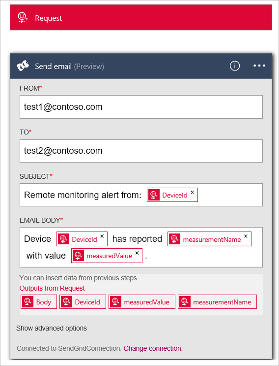

<properties
  pageTitle="Famiglia di prodotti IoT Azure e logica Apps | Microsoft Azure"
  description="Esercitazione su come collegare App logica alla famiglia di prodotti IoT Azure per processo aziendale."
  services=""
  suite="iot-suite"
  documentationCenter=""
  authors="aguilaaj"
  manager="timlt"
  editor=""/>

<tags
  ms.service="iot-suite"
  ms.devlang="na"
  ms.topic="article"
  ms.tgt_pltfrm="na"
  ms.workload="na"
  ms.date="08/16/2016"
  ms.author="araguila"/>
  
# <a name="tutorial-connect-logic-app-to-your-azure-iot-suite-remote-monitoring-preconfigured-solution"></a>Esercitazione: Connessione logica App alla soluzione Azure IoT Suite monitoraggio remoto preconfigurato

La [Famiglia di prodotti Microsoft Azure IoT] [ lnk-internetofthings] remota preconfigurato soluzione di monitoraggio è un'ottima soluzione per iniziare rapidamente a usare un set di caratteristiche-to-end per semplificare la soluzione IoT. In questa esercitazione viene illustrato come aggiungere logica di App per il remote preconfigurato soluzione di monitoraggio di Microsoft Azure IoT Suite. Questa procedura viene illustrato come è possibile eseguire la soluzione IoT ulteriormente mediante la connessione a un processo aziendale.

_Se si sta cercando una procedura dettagliata su come effettuare il provisioning di un controllo remoto preconfigurato soluzione, vedere [Esercitazione: Introduzione a soluzioni IoT preconfigurato][lnk-getstarted]._

Prima di iniziare questa esercitazione, è necessario:

- Eseguire il provisioning della soluzione di preconfigurato monitoraggio remota nell'abbonamento Azure.

- Creare un account SendGrid che consentono di inviare un messaggio e-mail che attiva il processo aziendale. È possibile iscriversi a un account di valutazione gratuito in [SendGrid](https://sendgrid.com/) facendo clic su **prova gratuitamente**. Dopo aver registrato per l'account di valutazione gratuita, è necessario creare una [chiave dell'API](https://sendgrid.com/docs/User_Guide/Settings/api_keys.html) in SendGrid la concessione di autorizzazioni di inviare posta. È necessario questo tasto API in un secondo momento nell'esercitazione.

Supponendo che già stato effettuato il provisioning il monitoraggio remoto preconfigurato soluzione, passare al gruppo di risorse per la soluzione nel [portale di Azure][lnk-azureportal]. Gruppo di risorse ha lo stesso nome il nome della soluzione si è scelto quando si viene completato il provisioning della soluzione di monitoraggio remota. Nel gruppo di risorse, è possibile visualizzare tutte le risorse di Azure provisioning per la soluzione ad eccezione dell'applicazione di Azure Active Directory che è possibile trovare nel portale classica di Azure. La schermata seguente mostra un blade **gruppo di risorse** di esempio per una soluzione di preconfigurato monitoraggio remota:


Per iniziare, impostare l'app logica da utilizzare con la soluzione preconfigurata.

## <a name="set-up-the-logic-app"></a>Configurare l'App logica

1. Fare clic su __Aggiungi__ nella parte superiore della stessa il e gruppo di risorse nel portale di Azure.

2. Cercare __App logica__, selezionarlo e quindi fare clic su **Crea**.

3. Compilare il __nome__ e utilizzare lo stesso **abbonamento** e **gruppo di risorse** che è utilizzato quando viene completato il provisioning della soluzione di monitoraggio remota. Fare clic su __Crea__.

    

4. Dopo avere completato la distribuzione, è possibile verificare che l'App logica è elencata come risorsa nel gruppo di risorse.

5. Fare clic su App logica per passare a e il logica App, selezionare il modello di **App logica vuota** per aprire la **Logica App Designer**.

    

6. Selezionare __richiesta__. Questa azione specifica che una richiesta HTTP in arrivo con una specifica JSON formattati atti payload come trigger.

7. Incollare lo Schema di JSON corpo richiedere le operazioni seguenti:

    ```
    {
      "$schema": "http://json-schema.org/draft-04/schema#",
      "id": "/",
      "properties": {
        "DeviceId": {
          "id": "DeviceId",
          "type": "string"
        },
        "measuredValue": {
          "id": "measuredValue",
          "type": "integer"
        },
        "measurementName": {
          "id": "measurementName",
          "type": "string"
        }
      },
      "required": [
        "DeviceId",
        "measurementName",
        "measuredValue"
      ],
      "type": "object"
    }
    ```
    
    > [AZURE.NOTE] È possibile copiare l'URL per il post HTTP dopo che si salva l'app logica, ma prima di tutto è necessario aggiungere un'azione.

8. Fare clic su __+ nuova azione__ sotto i trigger manuale. Fare clic su **Aggiungi un'azione**.

    

9. Cercare **SendGrid - inviare posta elettronica** e fare clic su esso.

    

10. Immettere un nome per la connessione, ad esempio **SendGridConnection**, immettere la **Chiave dell'API SendGrid** creata quando si imposta l'account SendGrid e fare clic su **Crea**.

    

11. Aggiungere gli indirizzi di posta elettronica che ai campi **da** e **a** cui si è proprietari. Aggiungere **il monitoraggio di avviso [DeviceId] remoto** nel campo **oggetto** . Nella casella **Corpo del messaggio di posta elettronica** , aggiungere **dispositivo [DeviceId] segnala [measurementName] con valore [measuredValue].** È possibile aggiungere **[DeviceId]**, **[measurementName]**e **[measuredValue]** facendo clic nella sezione **è possibile inserire dati nei passaggi precedenti** .

    

12. Fare clic su __Salva__ nel menu superiore.

13. Fare clic su trigger **richiedere** e copiare il valore __Http Post a questo URL__ . Questo URL è necessario più avanti in questa esercitazione.

> [AZURE.NOTE] Logica App consentono di eseguire [diversi tipi di azione] [ lnk-logic-apps-actions] inclusi azioni in Office 365. 

## <a name="set-up-the-eventprocessor-web-job"></a>Configurare il processo di Web EventProcessor

In questa sezione, è possibile connettersi alla soluzione preconfigurata all'App logica è stato creato. Per completare questa attività, aggiungere l'URL per attivare l'App logica per l'azione che viene attivata quando un valore di sensore dispositivo supera una determinata soglia.

1. Utilizzare il client fra per duplicare l'ultima versione del [azure iot-remota monitoraggio repository github][lnk-rmgithub]. Per esempio:

    ```
    git clone https://github.com/Azure/azure-iot-remote-monitoring.git
    ```

2. In Visual Studio, aprire __RemoteMonitoring.sln__ alla copia locale del repository.

3. Aprire il file __ActionRepository.cs__ nel **infrastruttura\\archivio** cartella.

4. Aggiornare il dizionario **actionIds** con __Http Post a questo URL__ annotato dell'App logica come indicato di seguito:

    ```
    private Dictionary<string,string> actionIds = new Dictionary<string, string>()
    {
        { "Send Message", "<Http Post to this UR>" },
        { "Raise Alarm", "<Http Post to this UR> }
    };
    ```

5. Salvare le modifiche in soluzione e uscire da Visual Studio.

## <a name="deploy-from-the-command-line"></a>Distribuire dalla riga di comando

In questa sezione, si distribuisce la versione aggiornata della soluzione di monitoraggio remota per sostituire la versione attualmente in esecuzione in Azure.

1. Dopo la [configurazione dev] [ lnk-devsetup] istruzioni per configurare l'ambiente per la distribuzione.

2.  Per distribuire in locale, attenersi alla [distribuzione locale] [ lnk-localdeploy] istruzioni.

3.  Per distribuire nel cloud e aggiornare la distribuzione cloud esistente, seguire la [distribuzione del cloud] [ lnk-clouddeploy] istruzioni. Usare il nome della distribuzione originale come il nome di distribuzione. Per esempio se la distribuzione originale è stata chiamata **demologicapp**, usare il comando seguente:

    ``
    build.cmd cloud release demologicapp
    ``
    
    Quando viene eseguito lo script di generazione, assicurarsi di utilizzare stesso account Azure, abbonamento, l'area geografica e istanza di Active Directory che è stato utilizzato quando viene completato il provisioning della soluzione.

## <a name="see-your-logic-app-in-action"></a>Vedere l'App logica in azione

Soluzione di preconfigurato monitoraggio remoto è due regole impostate per impostazione predefinita durante il provisioning di una soluzione. Entrambe le regole vengono sul dispositivo **SampleDevice001** :

* Temperatura > 38.00
* Umidità > 48,00

La regola temperatura attiva l'azione **Generare allarmi** e la regola umidità attiva l'azione **SendMessage** . Supponendo che sia lo stesso URL per le azioni è stata utilizzata la classe **ActionRepository** , l'app logica attiva per una regola. Le regole di utilizzano SendGrid per inviare un messaggio e-mail **** all'indirizzo con i dettagli dell'avviso.

> [AZURE.NOTE] L'App logica continua a impostare un trigger ogni volta che viene soddisfatta la soglia. Per evitare i messaggi di posta elettronica, è possibile disattivare le regole nel portale soluzione o disattivare l'App logica nel [portale di Azure][lnk-azureportal].

Oltre a ricevere messaggi di posta elettronica, è possibile visualizzare quando l'App logica viene eseguita nel portale:


## <a name="next-steps"></a>Passaggi successivi

Ora che sono state usate un'App logica a cui connettersi la soluzione preconfigurata un processo aziendale, è possibile ottenere ulteriori informazioni le opzioni per la personalizzazione di soluzioni preconfigurate:

- [Utilizzo di telemetria dinamica con monitoraggio remoto preconfigurato soluzione][lnk-dynamic]
- [Informazioni i metadati della soluzione preconfigurato monitoraggio remoto][lnk-devinfo]

[lnk-dynamic]: iot-suite-dynamic-telemetry.md
[lnk-devinfo]: iot-suite-remote-monitoring-device-info.md

[lnk-internetofthings]: https://azure.microsoft.com/documentation/suites/iot-suite/
[lnk-getstarted]: iot-suite-getstarted-preconfigured-solutions.md
[lnk-azureportal]: https://portal.azure.com
[lnk-logic-apps-actions]: ../connectors/apis-list.md
[lnk-rmgithub]: https://github.com/Azure/azure-iot-remote-monitoring
[lnk-devsetup]: https://github.com/Azure/azure-iot-remote-monitoring/blob/master/Docs/dev-setup.md
[lnk-localdeploy]: https://github.com/Azure/azure-iot-remote-monitoring/blob/master/Docs/local-deployment.md
[lnk-clouddeploy]: https://github.com/Azure/azure-iot-remote-monitoring/blob/master/Docs/cloud-deployment.md
