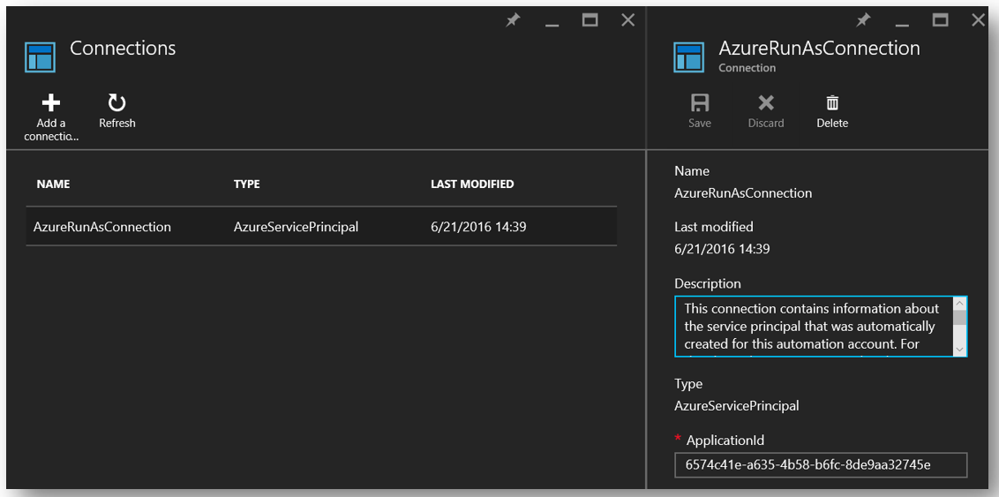
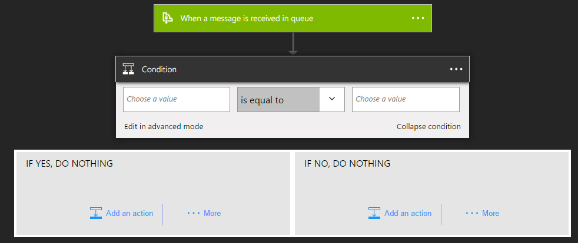

<properties
    pageTitle="Come installare archivio tasto con il controllo e rotazione delle chiavi to end | Microsoft Azure"
    description="Utilizzare questa procedura per ottenere il programma di installazione con rotazione delle chiavi e il monitoraggio dei registri archivio chiave"
    services="key-vault"
    documentationCenter=""
    authors="swgriffith"
    manager="mbaldwin"
    tags=""/>

<tags
    ms.service="key-vault"
    ms.workload="identity"
    ms.tgt_pltfrm="na"
    ms.devlang="na"
    ms.topic="article"
    ms.date="07/05/2016"
    ms.author="jodehavi;stgriffi"/>
#<a name="how-to-setup-key-vault-with-end-to-end-key-rotation-and-auditing"></a>Come installare archivio tasto con il controllo e rotazione delle chiavi to end

##<a name="introduction"></a>Introduzione

Dopo aver creato l'archivio di chiave di Azure, sarà possibile iniziare a utilizzare tale archivio per archiviare le chiavi e informazioni riservate. Le applicazioni non è più necessario per mantenere le chiavi o informazioni riservate, bensì richiederà loro dall'archivio di chiave in base alle esigenze. In questo modo è possibile aggiornare chiavi e informazioni riservate senza influenzare il comportamento dell'applicazione aperta un'ampia gamma di possibilità all'interno della chiave e il comportamento di gestione segreta.

In questo articolo illustra un esempio di utilizzo Azure chiave archivio per archiviare un segreto, in questo caso un tasto di Account di archiviazione di Azure cui è possibile accedere da un'applicazione. Presenterà anche implementazione di una rotazione programmata della chiave di account che lo spazio di archiviazione. Infine, consentono a una dimostrazione di come monitorare i registri di controllo archivio chiave e generare avvisi quando richieste imprevisto.

> \[AZURE. Nota\] in questa esercitazione non è destinata a spiegare in modo dettagliato l'insieme iniziale dell'archivio tasto Azure. Per informazioni, vedere [Guida introduttiva di Azure chiave archivio](key-vault-get-started.md). In alternativa, per interfaccia della riga di comando multipiattaforma istruzioni, vedere [questa esercitazione equivalente](key-vault-manage-with-cli.md).

##<a name="setting-up-keyvault"></a>La configurazione di KeyVault

Per attivare un'applicazione di recuperare un segreto dall'archivio chiave Azure, è necessario creare il segreto e caricare l'archivio. Questo risultato può essere ottenuto facilmente tramite PowerShell come illustrato di seguito.

Avviare una sessione di PowerShell Azure e accedere al proprio account Azure con il comando seguente:

```powershell
Login-AzureRmAccount
```

Nella finestra del browser a comparsa, immettere il nome utente dell'account Azure e la password. PowerShell Azure otterrà tutte le sottoscrizioni che sono associati a questo account e per impostazione predefinita, viene utilizzato il primo.

Se si hanno più abbonamenti, è necessario specificare uno specifico utilizzato per creare l'archivio di chiave Azure. Digitare quanto segue per visualizzare le sottoscrizioni per l'account:

```powershell
Get-AzureRmSubscription
```

Per specificare l'abbonamento a cui è associato l'archivio chiave che effettuerà l'accesso, digitare:

```powershell
Set-AzureRmContext -SubscriptionId <subscriptionID> 
```

In questo articolo è illustrata la memorizzazione di una chiave di account di archiviazione come segreto, sarà necessario ottenere tale tasto account lo spazio di archiviazione.

```powershell
Get-AzureRmStorageAccountKey -ResourceGroupName <resourceGroupName> -Name <storageAccountName>
```

Dopo avere recuperato il segreto, in questo caso la chiave account lo spazio di archiviazione, sarà necessario da convertire in una stringa protetta e quindi si crea un segreto con tale valore l'archivio chiave.

```powershell
$secretvalue = ConvertTo-SecureString <storageAccountKey> -AsPlainText -Force

Set-AzureKeyVaultSecret -VaultName <vaultName> -Name <secretName> -SecretValue $secretvalue
```
Avanti desiderato per ottenere l'URI per il segreto che appena creato. Quando si chiama l'archivio di chiave per recuperare il segreto questa verrà utilizzata in un passaggio successivo. Eseguire il seguente comando di PowerShell e prendere nota del valore "Id", ossia URI segreta.

```powershell
Get-AzureKeyVaultSecret –VaultName <vaultName>
```

##<a name="setting-up-application"></a>La configurazione dell'applicazione

Dopo aver creato un segreto archiviato desiderata recuperare la password segreta e utilizzare dal codice. Esistono alcuni passaggi necessari per eseguire questa operazione, il primo e più importanti di cui è la registrazione dell'applicazione con Azure Active Directory e quindi di avvisare le informazioni sull'applicazione Azure chiave archivio in modo che può consentire richieste dall'applicazione in uso.

> \[AZURE. Nota\] l'applicazione deve essere creato nel tenant di Azure Active Directory stesso come l'archivio di chiave. 

Prima di tutto aprire la scheda applicazioni di Azure Active Directory


Scegliere 'Aggiungi' per aggiungere una nuova applicazione per la tua promozione Azure


Lasciare il tipo di applicazione come 'Applicazione Web e/o il API WEB' e specificare un nome per l'applicazione.


Specificare l'applicazione di un 'URL Sign-On' e 'App ID URI'. Questi possono essere tutto ciò che vuole per questa demo e possono essere modificati in un secondo momento, se necessario.


Dopo aver aggiunto l'applicazione di Azure Active Directory, verranno inseriti nella pagina dell'applicazione. Da quel momento fare clic sulla scheda 'Configura' e quindi individuare e copiare il valore di "ID Client". Prendere nota dell'ID client per la procedura successiva.

Sarà necessario per generare una chiave per l'applicazione in grado di interagire con i Azure AD Avanti. È possibile creare nella sezione "Tasti" nella scheda 'Configurazione'. Prendere nota della chiave appena generata dall'applicazione di Azure Active Directory per l'utilizzo in un passaggio successivo.


Prima di stabilire tutte le chiamate dall'applicazione in archivio chiave sarà necessario informare l'archivio di tasto applicazione e la relativa ' autorizzazioni. Il comando seguente accetta il nome di archivio e l'ID client dell'app di Azure Active Directory e concede l'accesso 'Get' per l'archivio principali per l'applicazione.

```powershell
Set-AzureRmKeyVaultAccessPolicy -VaultName <vaultName> -ServicePrincipalName <clientIDfromAzureAD> -PermissionsToSecrets Get
```

A questo punto si è pronti iniziare a creare l'applicazione chiama. Nell'applicazione è necessario innanzitutto installare i pacchetti NuGet richiesti per interagire con Azure chiave archivio e Azure Active Directory. Dalla console di gestione di pacchetti di Visual Studio immettere i comandi seguenti. Si noti che nella scrittura di questo articolo la versione corrente del pacchetto di Active Directory 3.10.305231913, in modo che può essere necessario verificare la versione più recente e aggiornare di conseguenza.

```powershell
Install-Package Microsoft.IdentityModel.Clients.ActiveDirectory -Version 3.10.305231913

Install-Package Microsoft.Azure.KeyVault
```

Nel codice dell'applicazione, creare una classe per contenere il metodo per l'autenticazione di Active Directory. In questo esempio per la classe è denominata 'Utilità'. È quindi necessario aggiungere la descritta di seguito.

```csharp
using Microsoft.IdentityModel.Clients.ActiveDirectory;
```

Aggiungere il metodo seguente per recuperare il token JWT da Azure Active Directory. Per ottenere la gestibilità che può essere necessario spostare sul disco rigido codificato valori stringa nella configurazione del web o dell'applicazione.

```csharp
public async static Task<string> GetToken(string authority, string resource, string scope)
{
    var authContext = new AuthenticationContext(authority);

    ClientCredential clientCred = new ClientCredential("<AzureADApplicationClientID>","<AzureADApplicationClientKey>");

    AuthenticationResult result = await authContext.AcquireTokenAsync(resource, clientCred);

    if (result == null)

    throw new InvalidOperationException("Failed to obtain the JWT token");

    return result.AccessToken;
}
```

Infine, è possibile aggiungere il codice necessario per chiamare archivio chiave e recuperare il valore segreto. Prima di tutto è necessario aggiungere quanto segue istruzione.

```csharp
using Microsoft.Azure.KeyVault;
```

Aggiungerà il metodo chiama per richiamare archivio chiave e recuperare il segreto. In questo metodo si fornirà il segreto URI che è stato salvato nel passaggio precedente. Si noti l'utilizzo del metodo GetToken dalla classe utilità creato in precedenza.
    
```csharp
var kv = new KeyVaultClient(new KeyVaultClient.AuthenticationCallback(Utils.GetToken));

var sec = kv.GetSecretAsync(<SecretID>).Result.Value;
```

Quando si esegue l'applicazione, è possibile eseguire l'autenticazione in Azure Active Directory e quindi recupera il valore segreto dall'archivio di chiave Azure.

##<a name="key-rotation-using-azure-automation"></a>Rotazione di chiave utilizzando l'automazione di Azure

Sono disponibili diverse opzioni per l'implementazione di una strategia di rotazione per valori memorizzati come informazioni riservate Azure chiave archivio. Come parte di un processo manuale, è possono ruotare informazioni riservate, potrebbe essere ruotati a livello di programmazione sfruttando chiamate API o possono essere ruotate in uno script di automazione. Ai fini di questo articolo è verrà sfruttando PowerShell Azure combinati con l'automazione di Azure per modificare un Account di archiviazione di Azure tasto e quindi verrà aggiornato un segreto archivio chiave con la nuova chiave. 

Per consentire l'automazione Azure impostare i valori segreti nell'archivio chiave è necessario ottenere l'ID client per la connessione denominata 'AzureRunAsConnection' è stato creato quando si è stabilito l'istanza di automazione di Azure. È possibile ottenere questo ID scegliendo 'Risorse' istanza di automazione di Azure. Da tale posizione scegliere 'connessioni e quindi selezionare il principio di servizio 'AzureRunAsConnection'. Si desidera prendere nota dell'ID di applicazione' '. 



Quando si è ancora presente nella finestra di risorse è anche possibile scegliere 'Moduli'. Moduli che si selezionare 'Raccolta' e quindi cercare e 'Importazione' versione aggiornata del ciascuno dei moduli seguenti.

    Azure
    Azure.Storage   
    AzureRM.Profile
    AzureRM.KeyVault
    AzureRM.Automation
    AzureRM.Storage
    
> \[AZURE. Nota\] nella scrittura di questo articolo solo le risposte sopra indicato moduli necessari per l'aggiornamento per lo script condiviso sotto. Se si trovano che il processo di automazione non riesce, è necessario verificare la presenza di tutti i moduli necessari e le dipendenze tra importate.

Dopo avere recuperato l'ID di applicazione per la connessione di automazione di Azure, è necessario stabilire l'archivio di chiave Azure che l'applicazione ha accesso per aggiornare informazioni riservate nell'insieme di credenziali. Può essere eseguita con il seguente comando di PowerShell.

```powershell
Set-AzureRmKeyVaultAccessPolicy -VaultName <vaultName> -ServicePrincipalName <applicationIDfromAzureAutomation> -PermissionsToSecrets Set
```

Quindi selezionare la risorsa 'Runbook' sotto l'istanza di Azure automazione e selezionare "Aggiungi un Runbook". Selezionare 'Rapida creazione'. Assegnare un nome il runbook e selezionare 'PowerShell' come tipo di runbook. Se lo si desidera aggiungere una descrizione. Infine, fare clic su 'Create'.


Nel riquadro editor per il nuovo runbook si desidera incollare il seguente script di PowerShell.

```powershell
$connectionName = "AzureRunAsConnection"
try
{
    # Get the connection "AzureRunAsConnection "
    $servicePrincipalConnection=Get-AutomationConnection -Name $connectionName         

    "Logging in to Azure..."
    Add-AzureRmAccount `
        -ServicePrincipal `
        -TenantId $servicePrincipalConnection.TenantId `
        -ApplicationId $servicePrincipalConnection.ApplicationId `
        -CertificateThumbprint $servicePrincipalConnection.CertificateThumbprint 
    "Login complete."
}
catch {
    if (!$servicePrincipalConnection)
    {
        $ErrorMessage = "Connection $connectionName not found."
        throw $ErrorMessage
    } else{
        Write-Error -Message $_.Exception
        throw $_.Exception
    }
}

#Optionally you may set the following as parameters
$StorageAccountName = <storageAccountName>
$RGName = <storageAccountResourceGroupName>
$VaultName = <keyVaultName>
$SecretName = <keyVaultSecretName>

#Key name. For example key1 or key2 for the storage account
New-AzureRmStorageAccountKey -ResourceGroupName $RGName -StorageAccountName $StorageAccountName -KeyName "key2" -Verbose
$SAKeys = Get-AzureRmStorageAccountKey -ResourceGroupName $RGName -Name $StorageAccountName

$secretvalue = ConvertTo-SecureString $SAKeys[1].Value -AsPlainText -Force

$secret = Set-AzureKeyVaultSecret -VaultName $VaultName -Name $SecretName -SecretValue $secretvalue
```

Nel riquadro editor è possibile scegliere 'Riquadro Test' per testare lo script. Durante l'esecuzione di script senza errori è possibile selezionare l'opzione 'Pubblica' e applicarvi una pianificazione per runbook al riquadro Configurazione runbook.

##<a name="key-vault-auditing-pipeline"></a>Il controllo archivio chiave pipeline

Quando si imposta un archivio di chiave Azure è possibile attivare il controllo per raccogliere i registri richieste di accesso all'archivio chiave. Questi file di log sono archiviate in un account di archiviazione di Azure designato e può quindi essere estratta, monitorare e analizzati. Di seguito viene descritta uno scenario che utilizza le funzioni di Azure, Azure logica App e chiave archivio dei registri per creare una pipeline per inviare un messaggio di posta elettronica quando informazioni riservate dall'archivio di vengono recuperati da un'applicazione che corrisponde all'id app dell'app web.

Prima di tutto, è necessario attivare la registrazione sull'archivio di chiave. Questa operazione può essere eseguita tramite i comandi di PowerShell seguenti (dettagli completi possono essere visualizzati [di seguito](key-vault-logging.md)):

```powershell
$sa = New-AzureRmStorageAccount -ResourceGroupName <resourceGroupName> -Name <storageAccountName> -Type Standard\_LRS -Location 'East US'
$kv = Get-AzureRmKeyVault -VaultName '<vaultName>' 
Set-AzureRmDiagnosticSetting -ResourceId $kv.ResourceId -StorageAccountId $sa.Id -Enabled $true -Categories AuditEvent
```

Una volta questa opzione è attivata, i log di controllo per iniziare la raccolta nell'account di archiviazione designato. Questi file di log conterrà eventi come e quando si accede a archivi il tasto e l'autore. 

> \[AZURE. Nota\] è possibile accedere al massimo le informazioni di registrazione, 10 minuti dopo la chiave archivio operazione. Nella maggior parte dei casi, sarà più rapido rispetto a quella.

Il passaggio successivo consiste nel [creare una coda di Azure servizio Bus](../service-bus-messaging/service-bus-dotnet-get-started-with-queues.md). Questo sarà nel punto in cui vengono inseriti i log di controllo archivio chiave. Una volta nella coda, l'App logica verrà loro sollevare e agire su di essi. Per creare un Bus di servizio è relativamente dirette e di seguito sono riportati i passaggi di alto livelli:

1. Creare uno spazio dei nomi Bus di servizio (se si dispone già di quello che si desidera utilizzare per questa quindi andare al passaggio 2).
2. Individuare il Bus di servizio nel portale e selezionare lo spazio dei nomi che si desidera creare la coda in.
3. Selezionare nuovo e scegliere servizio Bus -> coda e immettere i dettagli necessari.
4. Usare le informazioni sulla connessione di servizio Bus scegliendo lo spazio dei nomi e facendo clic su _Informazioni di connessione_. Queste informazioni saranno necessarie per la parte successiva.

Successivamente, sarà necessario [creare una funzione di Azure](../azure-functions/functions-create-first-azure-function.md) per sondaggio i registri di archivio di chiave all'interno di account di archiviazione e sollevare i nuovi eventi. Questo valore sarà una funzione che lo ha attivata in base alla pianificazione.

Creare una funzione di Azure (scegliere Nuovo -> funzione App del portale). Durante la creazione è possibile utilizzare un piano di hosting esistente o crearne uno nuovo. È inoltre possibile scegliere per l'hosting dinamiche. Sono disponibili ulteriori informazioni sulla funzione Opzioni hosting [qui](../azure-functions/functions-scale.md).

Dopo avere creata la funzione di Azure, spostarsi su di esso e scegliere un timer funzione e C\# fare clic su **Crea** dalla schermata start.


Nella scheda _sviluppo_ , sostituire il codice run.csx con le operazioni seguenti:

```csharp
#r "Newtonsoft.Json"

using System;
using Microsoft.WindowsAzure.Storage;
using Microsoft.WindowsAzure.Storage.Auth;
using Microsoft.WindowsAzure.Storage.Blob;
using Microsoft.ServiceBus.Messaging; 
using System.Text;

public static void Run(TimerInfo myTimer, TextReader inputBlob, TextWriter outputBlob, TraceWriter log) 
{ 
    log.Info("Starting");

    CloudStorageAccount sourceStorageAccount = new CloudStorageAccount(new StorageCredentials("<STORAGE_ACCOUNT_NAME>", "<STORAGE_ACCOUNT_KEY>"), true);

    CloudBlobClient sourceCloudBlobClient = sourceStorageAccount.CreateCloudBlobClient();

    var connectionString = "<SERVICE_BUS_CONNECTION_STRING>";
    var queueName = "<SERVICE_BUS_QUEUE_NAME>";

    var sbClient = QueueClient.CreateFromConnectionString(connectionString, queueName);

    DateTime dtPrev = DateTime.UtcNow;
    if(inputBlob != null)
    {
        var txt = inputBlob.ReadToEnd();

        if(!string.IsNullOrEmpty(txt))
        {
            dtPrev = DateTime.Parse(txt);
            log.Verbose($"SyncPoint: {dtPrev.ToString("O")}");
        }
        else
        {
            dtPrev = DateTime.UtcNow;
            log.Verbose($"Sync point file didnt have a date. Setting to now.");
        }
    }

    var now = DateTime.UtcNow;

    string blobPrefix = "insights-logs-auditevent/resourceId=/SUBSCRIPTIONS/<SUBSCRIPTION_ID>/RESOURCEGROUPS/<RESOURCE_GROUP_NAME>/PROVIDERS/MICROSOFT.KEYVAULT/VAULTS/<KEY_VAULT_NAME>/y=" + now.Year +"/m="+now.Month.ToString("D2")+"/d="+ (now.Day).ToString("D2")+"/h="+(now.Hour).ToString("D2")+"/m=00/";

    log.Info($"Scanning:  {blobPrefix}");

    IEnumerable<IListBlobItem> blobs = sourceCloudBlobClient.ListBlobs(blobPrefix, true);

    log.Info($"found {blobs.Count()} blobs");

    foreach(var item in blobs)
    {
        if (item is CloudBlockBlob)
        {
            CloudBlockBlob blockBlob = (CloudBlockBlob)item;

            log.Info($"Syncing: {item.Uri}");

            string sharedAccessUri = GetContainerSasUri(blockBlob);

            CloudBlockBlob sourceBlob = new CloudBlockBlob(new Uri(sharedAccessUri));

            string text;
            using (var memoryStream = new MemoryStream())
            {
                sourceBlob.DownloadToStream(memoryStream);
                text = System.Text.Encoding.UTF8.GetString(memoryStream.ToArray());
            }

            dynamic dynJson = JsonConvert.DeserializeObject(text);

            //required to order by time as they may not be in the file
            var results = ((IEnumerable<dynamic>) dynJson.records).OrderBy(p => p.time);

            foreach (var jsonItem in results)
            {
                DateTime dt = Convert.ToDateTime(jsonItem.time);

                if(dt>dtPrev){
                    log.Info($"{jsonItem.ToString()}");

                    var payloadStream = new MemoryStream(Encoding.UTF8.GetBytes(jsonItem.ToString()));
                    //When sending to ServiceBus, use the payloadStream and set keeporiginal to true
                    var message = new BrokeredMessage(payloadStream, true);
                    sbClient.Send(message);
                    dtPrev = dt;
                }
            }
        }
    }
    outputBlob.Write(dtPrev.ToString("o"));
}

static string GetContainerSasUri(CloudBlockBlob blob) 
{
    SharedAccessBlobPolicy sasConstraints = new SharedAccessBlobPolicy();

    sasConstraints.SharedAccessStartTime = DateTime.UtcNow.AddMinutes(-5);
    sasConstraints.SharedAccessExpiryTime = DateTime.UtcNow.AddHours(24);
    sasConstraints.Permissions = SharedAccessBlobPermissions.Read;

    //Generate the shared access signature on the container, setting the constraints directly on the signature.
    string sasBlobToken = blob.GetSharedAccessSignature(sasConstraints);

    //Return the URI string for the container, including the SAS token.
    return blob.Uri + sasBlobToken;
}
```
> \[AZURE. Nota\] assicurarsi di sostituire le variabili nel codice precedente in modo che punti al proprio account di archiviazione in cui sono memorizzati i registri archivio chiave, al servizio Bus creata in precedenza e il percorso specifico per i registri di spazio di archiviazione archivio chiave.

La funzione riprende il log più recente dell'account di archiviazione in cui sono memorizzati i registri archivio chiave, acquisisce gli eventi più recenti dal file e li inserisce a una coda Bus di servizio. Poiché un singolo file potrebbero avere più eventi, ad esempio più di un'ora intera, quindi viene creata un file di _sync.txt_ che la funzione prende in considerazione anche per determinare il timbro dell'ora dell'ultimo evento che è stata scelta. In questo modo che si non push lo stesso evento più volte. Il file _sync.txt_ contiene semplicemente un timestamp per l'ultimo evento rilevato. I log durante il caricamento, sono necessario essere ordinati in base al timestamp per assicurarsi che vengono ordinate correttamente.

Per questa funzione è fare riferimento a un paio di altre raccolte che non sono disponibili all'esterno della casella nelle funzioni di Azure. Per includere tali, occorre Azure funzioni in modo da estrarre loro utilizzo nuget. Scegliere l'opzione di _Visualizzazione di file_ 


e aggiungere un nuovo file denominato _project.json_ con il contenuto seguente:

```json
    {
      "frameworks": {
        "net46":{
          "dependencies": {
                "WindowsAzure.Storage": "7.0.0",
                "WindowsAzure.ServiceBus":"3.2.2"
          }
        }
       }
    }
```
Su _salvare_ questo attiverà funzioni Azure per scaricare i file binari necessari. 

Passare alla scheda **integrazione** e assegnare un nome significativo per l'uso della funzione il parametro timer. Nel codice, è previsto che il timer da chiamare _myTimer_. Specificare un' [espressione CRON](../app-service-web/web-sites-create-web-jobs.md#CreateScheduledCRON) nel modo seguente: 0 \* \* \* \* \* per il timer che impedirà la funzione per eseguire un minuto. 

Nella stessa scheda **integrazione** , aggiungere un input che saranno del tipo di _Archiviazione Blob Azure_. Questo farà riferimento al file _sync.txt_ che contiene il timestamp dell'ultimo evento esaminato dalla funzione. Questo sarà disponibile all'interno della funzione dal nome parametro. Nel codice, l'input di archiviazione Blob Azure prevede che il nome del parametro da _inputBlob_. Scegliere l'account di archiviazione in cui verrà salvato il file _sync.txt_ (potrebbe essere della stessa o un account di archiviazione diversi) e nella casella percorso, specificare il percorso in cui si trova il file, nel formato di {container-name}/path/to/sync.txt.

Aggiungere un output che sarà del tipo di output di _Archiviazione Blob Azure_ . Questa operazione anche verrà punti al file _sync.txt_ definito nell'input. Per scrivere il timestamp dell'ultimo evento esaminato, questo verrà utilizzato dalla funzione. Il codice sopra prevede questo parametro da chiamare _outputBlob_.

A questo punto la funzione è pronta. Assicurarsi di tornare alla scheda **sviluppo** e _salvare_ il codice. Nella finestra di output per gli errori di compilazione di controllare e correggere quelli di conseguenza. Se la compilazione, quindi il codice dovrebbe ora essere in esecuzione e minuto verrà controllare i registri di archivio di chiave push eventuali nuovi eventi nella coda di servizio Bus definito. Verranno visualizzate informazioni di registrazione scrivere la funzione viene attivata ogni volta che finestra il log.

###<a name="azure-logic-app"></a>App logica Azure

È quindi necessario creare un'App di logica di Azure che verranno sollevare gli eventi che la funzione viene inserendo accodare Bus di servizio, analizzare il contenuto e inviare un messaggio di posta elettronica basato su una condizione viene trovata una corrispondenza.

[Creare un'App logica](../app-service-logic/app-service-logic-create-a-logic-app.md) facendo clic su New -> App logica. 

Dopo aver creato l'App logica, spostarsi su di esso e scegliere _Modifica_. Nell'editor di logica App scegliere _Servizio Bus coda_ api gestita e immettere le credenziali Bus di servizio per connettersi alla coda.


Scegliere Avanti per _aggiungere una condizione_. In condizione, passare all' _editor avanzato_ e immettere le informazioni seguenti, sostituendo il APP_ID con APP_ID effettivo di un'applicazione web:

```
@equals('<APP_ID>', json(decodeBase64(triggerBody()['ContentData']))['identity']['claim']['appid'])
```

Questa espressione essenzialmente restituirà **false** se la proprietà **appid** raccolte durante l'evento in arrivo, ovvero il corpo del messaggio Bus di servizio, non è **appid** dell'app. 

A questo punto, creare un'azione sotto l'opzione _se no, non eseguire alcuna operazione..._ .



Per l'azione, scegliere _Office 365 - inviare posta elettronica_. Compilare i campi per creare un messaggio di posta elettronica da inviare quando definita condizione restituisce falsa. Se non si dispone di Office 365 da prendere in considerazione alternative per ottenere lo stesso.

A questo punto si dispone di una pipeline to end che una volta al minuto, verrà cercati i log di controllo nuovo chiave archivio. Eventuali nuovi registri che trova, verrà inviarli a una coda di Bus di servizio. Verrà attivata l'App logica come un nuovo messaggio recapitata nella coda e se appid all'interno dell'evento non corrisponde all'id app dell'applicazione chiamante quindi inviare un messaggio di posta elettronica. 
