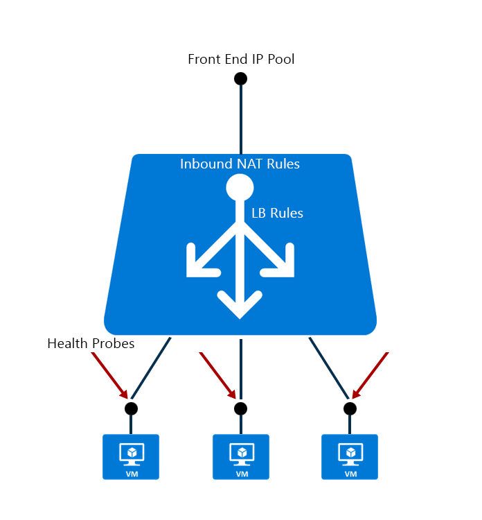

<properties
   pageTitle="Azure supporto Manager delle risorse per bilanciamento del carico | Microsoft Azure "
   description="Utilizzo di powershell per bilanciamento del carico Gestione risorse Azure. Uso dei modelli di bilanciamento del carico"
   services="load-balancer"
   documentationCenter="na"
   authors="sdwheeler"
   manager="carmonm"
   editor="tysonn" />
<tags
   ms.service="load-balancer"
   ms.devlang="na"
   ms.topic="article"
   ms.tgt_pltfrm="na"
   ms.workload="infrastructure-services"
   ms.date="10/24/2016"
   ms.author="sewhee" />

# Utilizzo di Azure Gestione risorse di supporto con bilanciamento del carico Azure

Gestione risorse di Azure è il framework gestione preferito per i servizi di Azure. Azure di bilanciamento del carico può essere gestita usando API basate su Gestione risorse di Azure e strumenti.

## Concetti

Gestione risorse di bilanciamento del carico Azure contiene le risorse figlio seguenti:

- Configurazione IP front-end – un bilanciamento del carico può includere uno o più front-end indirizzi IP, noti anche come un IP virtuale (VIP). Questi indirizzi IP fungono ingresso per il traffico.

- Pool di indirizzi di back-end – si tratta di indirizzi IP associati con macchina virtuale Network Interface Card (NIC) in cui verrà distribuito carico.

- Caricare le regole di bilanciamento del carico: una proprietà regola esegue il mapping di una combinazione di porta e combinazione di porta a un insieme di indirizzi IP di back-end e indirizzi IP specificato front-end. Un servizio di bilanciamento del carico singola può contenere più bilanciamento del carico regole. Ogni regola è una combinazione di un front-end IP e porte e back-end IP e porte associate alle macchine virtuali.

- Le ricerche, le ricerche consentono di tenere traccia dello stato delle istanze di macchine Virtuali. Se una verifica dell'integrità non riesce, all'istanza macchine Virtuali verrà eseguita automaticamente dalla rotazione.

- Le regole in entrata NAT-regole NAT che definisce il traffico in ingresso attraversano il lato anteriore terminano IP e distribuiti a IP back-end.

## Guida introduttiva modelli

Gestione risorse di Azure consente di effettuare il provisioning di applicazioni utilizzando un modello dichiarativo. In un unico modello, è possibile distribuire più servizi con le relative dipendenze. Utilizzare lo stesso modello per distribuire ripetutamente l'applicazione in ogni fase del ciclo di vita dell'applicazione.

Modelli possono includere le definizioni per macchine virtuali, reti virtuali, set di disponibilità, le interfacce di rete (NIC), gli account di archiviazione, servizi di bilanciamento del carico, gruppi di sicurezza di rete e indirizzi IP pubblico. Con i modelli è possibile creare tutte le informazioni che necessarie per un'applicazione complessa. Nel sistema di gestione del contenuto per il controllo delle versioni e la collaborazione, è possibile controllare il file del modello.

[Ulteriori informazioni sui modelli](http://go.microsoft.com/fwlink/?LinkId=544798)

[Ulteriori informazioni sulle risorse di rete](../virtual-network/resource-groups-networking.md)

Sono disponibili modelli di Guida introduttiva con Azure di bilanciamento del carico in un [repository GitHub](https://github.com/Azure/azure-quickstart-templates) hosting di una serie di modelli della Comunità generato.

Esempi di modelli:

- [2 macchine virtuali in un servizio di bilanciamento del carico e le regole di bilanciamento del carico](http://go.microsoft.com/fwlink/?LinkId=544799)
- [2 macchine virtuali VNET con un interno di bilanciamento del carico e di bilanciamento del carico di regole](http://go.microsoft.com/fwlink/?LinkId=544800)
- [2 macchine virtuali di un servizio di bilanciamento del carico e configurare le regole NAT sul kg](http://go.microsoft.com/fwlink/?LinkId=544801)

## La configurazione di bilanciamento del carico Azure con PowerShell o CLI

Guida introduttiva a cmdlet Gestione risorse di Azure, gli strumenti della riga di comando e API REST

- [Cmdlet per la rete Azure](https://msdn.microsoft.com/library/azure/mt163510.aspx) possono essere usate per creare un bilanciamento del carico.
- [Come creare un bilanciamento del carico Gestione risorse di Azure](load-balancer-get-started-ilb-arm-ps.md)
- [Usa CLI Azure con Gestione risorse Azure](../xplat-cli-azure-resource-manager.md)
- [Bilanciamento del carico API REST](https://msdn.microsoft.com/library/azure/mt163651.aspx)

## Passaggi successivi

È anche possibile [iniziare la creazione di un servizio di bilanciamento del carico è connessa a Internet](load-balancer-get-started-internet-arm-ps.md) e configurare il tipo della [modalità di distribuzione](load-balancer-distribution-mode.md) per una specifica bilanciamento rete il traffico caricamento.

Informazioni su come gestire [le impostazioni di timeout di inattività TCP per un bilanciamento del carico](load-balancer-tcp-idle-timeout.md). Questo è importante quando l'applicazione deve mantenere attivi per i server dietro un bilanciamento del carico connessioni.
