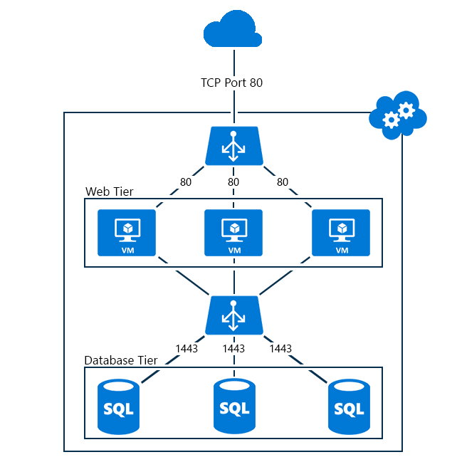

<properties
   pageTitle="Creare un bilanciamento del carico interno tramite PowerShell nel modello di distribuzione classica | Microsoft Azure"
   description="Informazioni su come creare un bilanciamento del carico interno tramite PowerShell nel modello di distribuzione classica"
   services="load-balancer"
   documentationCenter="na"
   authors="sdwheeler"
   manager="carmonm"
   editor=""
   tags="azure-service-management"
/>
<tags
   ms.service="load-balancer"
   ms.devlang="na"
   ms.topic="get-started-article"
   ms.tgt_pltfrm="na"
   ms.workload="infrastructure-services"
   ms.date="02/09/2016"
   ms.author="sewhee" />

# Iniziare a creare un interno di bilanciamento del carico (classico) tramite PowerShell

[AZURE.INCLUDE [load-balancer-get-started-ilb-classic-selectors-include.md](../../includes/load-balancer-get-started-ilb-classic-selectors-include.md)]

[AZURE.INCLUDE [load-balancer-get-started-ilb-intro-include.md](../../includes/load-balancer-get-started-ilb-intro-include.md)]

[AZURE.INCLUDE [azure-arm-classic-important-include](../../includes/learn-about-deployment-models-classic-include.md)]Informazioni su come [eseguire questa procedura utilizzando il modello di Manager delle risorse](load-balancer-get-started-ilb-arm-ps.md).

[AZURE.INCLUDE [load-balancer-get-started-ilb-scenario-include.md](../../includes/load-balancer-get-started-ilb-scenario-include.md)]

[AZURE.INCLUDE [azure-ps-prerequisites-include.md](../../includes/azure-ps-prerequisites-include.md)]

## Creare un set per macchine virtuali di bilanciamento del carico interno

Per creare un set di bilanciamento del carico interno e i server che verranno inviare loro il traffico, è necessario eseguire le operazioni seguenti:

1. Creare un'istanza di interno il bilanciamento del carico da endpoint del traffico in ingresso per eseguire il bilanciamento tra i server di un set di bilanciamento del carico.

1. Aggiungere i punti finali corrispondenti alle macchine virtuali che riceverà il traffico in entrata.

1. Configurare i server che verranno inviato il traffico del carico per inviare il traffico all'indirizzo IP (VIP) virtuale dell'istanza interno il bilanciamento del carico.

### Passaggio 1: Creare un'istanza di bilanciamento del carico interno

Per un servizio cloud esistente o un servizio cloud distribuito in una rete virtuale internazionali, è possibile creare un'istanza di bilanciamento del carico interno con i comandi di Windows PowerShell seguenti:

    $svc="<Cloud Service Name>"
    $ilb="<Name of your ILB instance>"
    $subnet="<Name of the subnet within your virtual network>"
    $IP="<The IPv4 address to use on the subnet-optional>"

    Add-AzureInternalLoadBalancer -ServiceName $svc -InternalLoadBalancerName $ilb –SubnetName $subnet –StaticVNetIPAddress $IP

Si noti che l'utilizzo dei cmdlet di Windows PowerShell [Aggiungi AzureEndpoint](https://msdn.microsoft.com/library/dn495300.aspx) utilizza il parametro DefaultProbe impostato. Per ulteriori informazioni sui set di parametro aggiuntivo, vedere [Aggiungere AzureEndpoint](https://msdn.microsoft.com/library/dn495300.aspx).

### Passaggio 2: Aggiungere endpoint all'istanza di bilanciamento del carico interno

Ecco un esempio:

    $svc="mytestcloud"
    $vmname="DB1"
    $epname="TCP-1433-1433"
    $lbsetname="lbset"
    $prot="tcp"
    $locport=1433
    $pubport=1433
    $ilb="ilbset"
    Get-AzureVM –ServiceName $svc –Name $vmname | Add-AzureEndpoint -Name $epname -Lbset $lbsetname -Protocol $prot -LocalPort $locport -PublicPort $pubport –DefaultProbe -InternalLoadBalancerName $ilb | Update-AzureVM

### Passaggio 3: Configurare i server per inviare il traffico al nuovo endpoint di bilanciamento del carico interno

È necessario configurare i server cui il traffico sarà il bilanciamento del carico per utilizzare il nuovo indirizzo IP (VIP) dell'istanza interno il bilanciamento del carico. Questo è l'indirizzo in cui è in attesa l'istanza di bilanciamento del carico interno. Nella maggior parte dei casi, è necessario solo aggiungere o modificare un record DNS per l'indirizzo VIP dell'istanza di bilanciamento del carico interno.

Se si specifica l'indirizzo IP durante la creazione dell'istanza di bilanciamento del carico interno, si dispone già l'indirizzo VIP. In caso contrario, è possibile visualizzare l'indirizzo VIP i comandi seguenti:

    $svc="<Cloud Service Name>"
    Get-AzureService -ServiceName $svc | Get-AzureInternalLoadBalancer

Per utilizzare questi comandi, inserire i valori e rimuovere il < e >. Ecco un esempio:

    $svc="mytestcloud"
    Get-AzureService -ServiceName $svc | Get-AzureInternalLoadBalancer

Visualizzazione del comando Get-AzureInternalLoadBalancer, annotare l'indirizzo IP e apportare le modifiche necessarie al server o i record DNS per verificare che il traffico viene inviato all'indirizzo VIP.

>[AZURE.NOTE]La piattaforma Microsoft Azure utilizza un indirizzo IPv4 statico, pubblicamente routing per un'ampia varietà di scenari amministrativi. L'indirizzo IP è 168.63.129.16. Questo indirizzo IP non deve essere bloccato da un firewall, poiché può causare comportamenti imprevisti.
>Per quanto riguarda Azure interno il bilanciamento del carico, l'indirizzo IP viene utilizzato il monitoraggio delle ricerche di bilanciamento del carico per determinare lo stato di integrità per macchine virtuali in un set di bilanciamento del carico. Se un gruppo di sicurezza di rete viene utilizzato per limitare il traffico in macchine virtuali Azure in un set di bilanciamento del carico internamente o viene applicato a una Subnet di rete virtuale, verificare che si aggiunge una regola di sicurezza di rete per consentire il traffico da 168.63.129.16.

## Esempio di bilanciamento del carico interno

Per scorrere il processo end-to-end di creazione di un set di bilanciamento del carico per due configurazioni di esempio, vedere le sezioni seguenti.

### Internet affiancate, applicazione a più livelli

Si desidera fornire un servizio di database di bilanciamento del carico per un set di server web esposto a Internet. Entrambi gli insiemi di server sono ospitati in un servizio cloud di Azure singola. Il traffico di server Web alla porta TCP 1433 deve essere distribuito tra due macchine virtuali di livello del database. Figura 1 illustra la configurazione.

La configurazione è costituita da:

- Il servizio cloud esistente ospita macchine virtuali è denominato mytestcloud.

- Due server di database esistente sono denominate DB1, DB2.

- Server Web nel livello web connettersi al server di database il livello di database utilizzando l'indirizzo IP privato. È anche possibile usare il proprio DNS per la rete virtuale e registrare manualmente un record per il set di bilanciamento del carico interno.

I comandi seguenti configurare una nuova istanza di bilanciamento del carico interno denominata **ILBset** e aggiungere endpoint alle macchine virtuali corrispondente a due server di database:

    $svc="mytestcloud"
    $ilb="ilbset"
    Add-AzureInternalLoadBalancer -ServiceName $svc -InternalLoadBalancerName $ilb
    $prot="tcp"
    $locport=1433
    $pubport=1433
    $epname="TCP-1433-1433"
    $lbsetname="lbset"
    $vmname="DB1"
    Get-AzureVM –ServiceName $svc –Name $vmname | Add-AzureEndpoint -Name $epname -LbSetName $lbsetname -Protocol $prot -LocalPort $locport -PublicPort $pubport –DefaultProbe -InternalLoadBalancerName $ilb | Update-AzureVM

    $epname="TCP-1433-1433-2"
    $vmname="DB2"
    Get-AzureVM –ServiceName $svc –Name $vmname | Add-AzureEndpoint -Name $epname -LbSetName $lbsetname -Protocol $prot -LocalPort $locport -PublicPort $pubport –DefaultProbe -InternalLoadBalancerName $ilb | Update-AzureVM

## Rimuovere una configurazione di bilanciamento del carico interno

Per rimuovere una macchina virtuale come un endpoint da un'istanza di bilanciamento del carico interno, utilizzare i comandi seguenti:

    $svc="<Cloud service name>"
    $vmname="<Name of the VM>"
    $epname="<Name of the endpoint>"
    Get-AzureVM -ServiceName $svc -Name $vmname | Remove-AzureEndpoint -Name $epname | Update-AzureVM

Per utilizzare questi comandi, inserire i valori, la rimozione di < e >.

Ecco un esempio:

    $svc="mytestcloud"
    $vmname="DB1"
    $epname="TCP-1433-1433"
    Get-AzureVM -ServiceName $svc -Name $vmname | Remove-AzureEndpoint -Name $epname | Update-AzureVM

Per rimuovere un'istanza di bilanciamento del carico interno da un servizio cloud, usare i comandi seguenti:

    $svc="<Cloud service name>"
    Remove-AzureInternalLoadBalancer -ServiceName $svc

Per utilizzare questi comandi, immettere il valore e rimuovere il < e >.

Ecco un esempio:

    $svc="mytestcloud"
    Remove-AzureInternalLoadBalancer -ServiceName $svc

## Ulteriori informazioni sui cmdlet di bilanciamento carico interno

Per ottenere ulteriori informazioni sui cmdlet di bilanciamento del carico interno, eseguire i comandi seguenti al prompt dei comandi di Windows PowerShell:

- Get-help nuovo AzureInternalLoadBalancerConfig-completo

- Get-help AzureInternalLoadBalancer aggiungere-completo

- Get-help Get-AzureInternalLoadbalancer-completo

- Get-help Rimuovi AzureInternalLoadBalancer-completo

## Passaggi successivi

[Configurare una modalità di distribuzione carico bilanciamento utilizzando affinità dell'indirizzo IP di origine](load-balancer-distribution-mode.md)

[Configurare le impostazioni di timeout di inattività TCP per il servizio di bilanciamento del carico](load-balancer-tcp-idle-timeout.md)