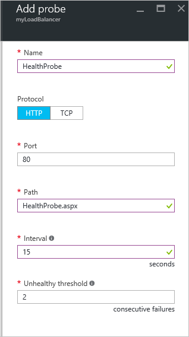

<properties
   pageTitle="Creare un servizio di bilanciamento del carico esposto a Internet in Gestione risorse tramite il portale di Azure | Microsoft Azure"
   description="Informazioni su come creare un servizio di bilanciamento del carico esposto a Internet in Gestione risorse tramite il portale di Azure"
   services="load-balancer"
   documentationCenter="na"
   authors="anavinahar"
   manager="narayan"
   editor=""
   tags="azure-resource-manager"
/>
<tags
   ms.service="load-balancer"
   ms.devlang="na"
   ms.topic="hero-article"
   ms.tgt_pltfrm="na"
   ms.workload="infrastructure-services"
   ms.date="09/14/2016"
   ms.author="annahar" />

# Creazione di una connessione Internet di bilanciamento del carico tramite il portale di Azure

[AZURE.INCLUDE [load-balancer-get-started-internet-arm-selectors-include.md](../../includes/load-balancer-get-started-internet-arm-selectors-include.md)]

[AZURE.INCLUDE [load-balancer-get-started-internet-intro-include.md](../../includes/load-balancer-get-started-internet-intro-include.md)]

[AZURE.INCLUDE [azure-arm-classic-important-include](../../includes/azure-arm-classic-important-include.md)]Questo articolo illustra il modello di distribuzione di Manager delle risorse. È inoltre possibile [imparare a creare un esposto a Internet di bilanciamento del carico mediante la distribuzione classica](load-balancer-get-started-internet-classic-portal.md)

[AZURE.INCLUDE [load-balancer-get-started-internet-scenario-include.md](../../includes/load-balancer-get-started-internet-scenario-include.md)]

Questo è descritta la sequenza delle singole attività che deve essere eseguita per creare un bilanciamento del carico e spiegano in modo dettagliato operazioni per eseguire l'operazione.

## Che cos'è necessario creare un servizio di bilanciamento del carico esposto a Internet?

È necessario creare e configurare i seguenti oggetti per distribuire un bilanciamento del carico.

- Configurazione IP front-end - contiene indirizzi IP per il traffico di rete in ingresso.

- Pool di indirizzi di back-end - contiene le interfacce di rete (NIC) per le macchine virtuali di ricevere il traffico di rete di bilanciamento del carico.

- Regole di bilanciamento del carico - contiene le regole di mapping di una porta pubblica del servizio di bilanciamento del carico alla porta nel pool di indirizzi di back-end.

- In ingresso regole NAT - contiene le regole di mapping di una porta pubblica del servizio di bilanciamento del carico a una porta per una macchina virtuale specifica nel pool di indirizzi di back-end.

- Esegue la ricerca - contiene le ricerche integrità utilizzate per verificare la disponibilità delle istanze di macchine virtuali nel pool di indirizzi di back-end.

È possibile ottenere ulteriori informazioni su componenti di bilanciamento del carico Azure Gestione risorse di [gestione di Azure risorse](load-balancer-arm.md)di supporto per bilanciamento del carico.

## Configurare un bilanciamento del carico nel portale di Azure

> [AZURE.IMPORTANT] Si suppone che si dispone di una rete virtuale denominata **myVNet**. Fare riferimento alla [creazione di rete virtuale](../virtual-network/virtual-networks-create-vnet-arm-pportal.md) per eseguire questa operazione. Presuppone anche se è presente una subnet all'interno di **myVNet** chiamato **Essere kg-Subnet** e due macchine virtuali denominata **web1** e **web2** rispettivamente entro lo stesso set di disponibilità chiamato **myAvailSet** in **myVNet**. Fare riferimento a [questo collegamento](../virtual-machines/virtual-machines-windows-hero-tutorial.md) per creare macchine virtuali.

1. Da un browser passare al portale di Azure: [http://portal.azure.com](http://portal.azure.com) e accedere con l'account Azure.

2. Nell'angolo superiore sinistro dello schermo selezionare **Nuovo** > **rete** > **di bilanciamento del carico.**

3. In e il **bilanciamento del carico crea** , digitare un nome per il servizio di bilanciamento del carico. Di seguito viene chiamato **myLoadBalancer**.

4. In **tipo**, selezionare **pubblico**.

5. In **indirizzo IP pubblico**, creare un nuovo IP pubblico denominato **myPublicIP**.

6. Nel gruppo risorse selezionare **myRG**. Quindi selezionare una **posizione**appropriata e quindi fare clic su **OK**. Bilanciamento del carico verrà avviato distribuire e potrebbe richiedere alcuni minuti per completare correttamente la distribuzione.

## Creare un pool di indirizzi di back-end

1. Dopo il bilanciamento del carico è distribuito correttamente, selezionarla all'interno delle risorse. In Impostazioni selezionare pool di back-end. Digitare un nome per il pool di back-end. Quindi fare clic sul pulsante **Aggiungi** nella parte superiore della stessa e che viene visualizzato.

2. Fare clic su **Aggiungi una macchina virtuale** e il **componente back-end pool** .  Selezionare **scegliere un set di disponibilità** in **set di disponibilità** e **myAvailSet**. Successivamente, selezionare **scegliere macchine virtuali** nella sezione macchine virtuali e il e fare clic su **web1** e **web2**, le due macchine virtuali create per il bilanciamento del carico. Assicurarsi che entrambe abbiano blu segni di spunta a sinistra, come illustrato nell'immagine seguente. In tale blade seguite da OK nella finestra e **computer scegliere virtuale** , quindi **OK** nella finestra e **back-end pool di aggiungere** , quindi fare clic su **Seleziona** .

    

3. Verificare che le notifiche nell'elenco a discesa è un aggiornamento per quanto riguarda il salvataggio del pool di back-end bilanciamento carico oltre ad aggiornare l'interfaccia di rete per macchine virtuali **web1** e **web2**.

## Creare un sondaggio, regola kg e le regole NAT

1. Creare una verifica dell'integrità.

    In impostazioni di bilanciamento del carico, selezionare le ricerche. Fare clic su **Aggiungi** nella parte superiore della stessa e.

    Esistono due modi per configurare un sondaggio: HTTP o TCP. In questo esempio viene HTTP, ma TCP possono essere configurate in modo simile.
    Aggiornare le informazioni necessarie. Come detto, **myLoadBalancer** verrà caricato il traffico saldo sulla porta 80. Il percorso selezionato è HealthProbe.aspx, intervallo è 15 secondi e non corretti soglia è 2. Al termine, fare clic su **OK** per creare la ricerca.

    Posizionare il puntatore sulle "i" icona per ulteriori informazioni su queste configurazioni singoli e come possono essere modificate per rispondere alle proprie esigenze.

    

2. Creare una regola di bilanciamento del carico.

    Fare clic su regole nella sezione Impostazioni di bilanciamento del carico di bilanciamento del carico. Nella nuova pala, fare clic su **Aggiungi**. Assegnare un nome alla regola. In questo caso, è HTTP. Scegliere la porta front-end e back-end porta. In questo caso, 80 viene scelto per entrambi. Scegliere **back-end kg** come il pool di back-end e creato in precedenza **HealthProbe** come la verifica. È possibile impostare altre configurazioni in base alle proprie esigenze. Quindi fare clic su OK per salvare il regola di bilanciamento del carico.

    

3. Creare le regole in entrata NAT

    Fare clic su regole in entrata NAT nella sezione Impostazioni di bilanciamento del carico. In e il nuovo, fare clic su **Aggiungi**. Quindi assegnare un nome alla regola NAT in ingresso. Di seguito viene chiamato **inboundNATrule1**. La destinazione deve essere l'indirizzo IP pubblico creato in precedenza. Selezionare Custom in servizio e selezionare il protocollo che si desidera utilizzare. Di seguito TCP sia selezionata. Immettere la porta 3441 e la porta di destinazione, in questo caso, 3389. quindi fare clic su OK per salvare la regola.

    Dopo aver creata la prima regola, ripetere questo passaggio per la seconda regola NAT in ingresso chiamata inboundNATrule2 dalla porta 3442 alla porta di destinazione 3389.

    

## Rimuovere un bilanciamento del carico

Per eliminare un bilanciamento del carico, selezionare il bilanciamento del carico che si desidera rimuovere. In e il *Servizio di bilanciamento del carico* , fare clic su **Elimina** disponibile nella parte superiore e il. Quindi selezionare **Sì** quando richiesto.

## Passaggi successivi

[Per iniziare la configurazione di un servizio di bilanciamento del carico interno](load-balancer-get-started-ilb-arm-cli.md)

[Configurare una modalità di distribuzione carico di bilanciamento del carico](load-balancer-distribution-mode.md)

[Configurare le impostazioni di timeout di inattività TCP per il servizio di bilanciamento del carico](load-balancer-tcp-idle-timeout.md)
