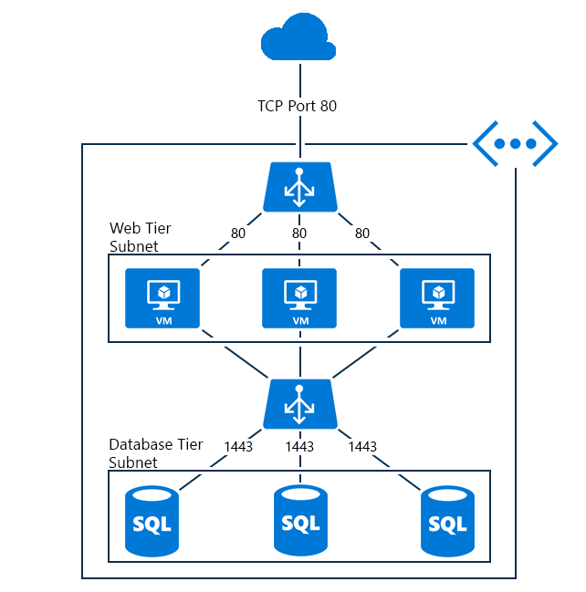

<properties
   pageTitle="Panoramica di bilanciamento del carico interno | Microsoft Azure"
   description="Panoramica di bilanciamento del carico interno e delle relative caratteristiche. Come funziona il un bilanciamento del carico per gli scenari di Azure e possibili configurare gli endpoint interni"
   services="load-balancer"
   documentationCenter="na"
   authors="sdwheeler"
   manager="carmonm"
   editor="tysonn" />
<tags
   ms.service="load-balancer"
   ms.devlang="na"
   ms.topic="article"
   ms.tgt_pltfrm="na"
   ms.workload="infrastructure-services"
   ms.date="10/24/2016"
   ms.author="sewhee" />

# Panoramica di bilanciamento carico interno

Diversamente da quanto succede quindi Internet affiancata di bilanciamento del carico, il servizio di bilanciamento del carico interno (ILB) indirizza il traffico solo alle risorse all'interno del servizio cloud o tramite VPN per accedere a infrastruttura di Azure. L'infrastruttura di limita l'accesso a bilanciamento del carico virtuali indirizzi IP (VIP) di un servizio Cloud o una rete virtuale in modo che non verranno mai essere esposto direttamente a un endpoint di Internet. In questo modo interno applicazioni line-of unità aziendali per eseguire in Azure e accedere dall'interno cloud o risorse locali.

## Perché potrebbe essere necessario un sistema di bilanciamento del carico interno

Azure interno caricare bilanciamento del carico (ILB) fornisce il bilanciamento del carico tra macchine virtuali che si trovano all'interno di un servizio cloud o una rete virtuale con un ambito internazionali. Per informazioni sull'utilizzo e la configurazione di reti virtuali con un ambito internazionali, vedere [Reti virtuali internazionali](https://azure.microsoft.com/blog/2014/05/14/regional-virtual-networks/) nel blog Azure. Reti virtuali esistenti che sono state configurate per un gruppo di affinità non è possibile usare ILB.

ILB Abilita i tipi di bilanciamento del carico seguenti:

- All'interno di un servizio cloud, da macchine virtuali a un insieme di macchine virtuali che si trovano all'interno del servizio cloud stesso (vedere Figura 1).
- All'interno di una rete virtuale da macchine virtuali nella rete virtuale a un insieme di macchine virtuali che si trovano all'interno del servizio cloud stesso della directory di rete (vedere Figura 2).
- In una rete virtuale tra locale e dal computer locale di un set di macchine virtuali che si trovano all'interno del servizio cloud stesso della directory di rete (vedere Figura 3).
- Applicazioni esposto a Internet a più livelli in cui i livelli di back-end non esposto a Internet, ma richiedono bilanciamento del carico per il traffico dal livello esposto a Internet.
- Bilanciamento del carico per le applicazioni line ospitate in Azure senza bisogno di ulteriore carico bilanciamento del carico hardware o software. Inclusi i server in locale nel set di computer cui il traffico è carico bilanciato.

## Applicazioni a più livelli è connessa a Internet

Il livello web sono previsti i punti finali esposto a Internet per i client di Internet e fa parte di un set di bilanciamento del carico. Bilanciamento del carico distribuisce il traffico in ingresso dai client web per la porta TCP 443 (HTTPS) ai server web.

I server di database sono dietro un endpoint ILB che il server web utilizzato per lo spazio di archiviazione. Questo servizio database bilanciato endpoint, il tipo di traffico è il bilanciamento del carico tra i server di database nel set di ILB.

Nella figura seguente mostra l'applicazione a più livelli all'interno del servizio cloud stesso è connessa a Internet.

Figura 1 - Internet affiancate applicazione a più livelli

È possibile inoltre utilizzare un'applicazione multilivello è quando il ILB distribuito in un servizio cloud diverso da quello di utilizzo del servizio per la ILB.

Servizi cloud usando la stessa rete virtuale avrà accesso all'endpoint ILB.

Figura 2 mostra web front-end server si trovano in un servizio cloud diverso dal database back-end e tramite l'endpoint ILB all'interno della stessa rete virtuale.

Figura 2 - server front-end in un servizio cloud diverso

## Intranet applicazioni line-of business

Il traffico dai client sulla rete locale è possibile ottenere bilanciamento del carico per tutto il set di server Line utilizzando connessione VPN alla rete Azure.

Il computer client avranno accesso a un indirizzo IP dal servizio di Azure VPN utilizzando punto al sito VPN. Per consentire l'utilizzo dell'applicazione line ospitato dietro l'endpoint ILB.

Figura 3 - applicazioni line ospitate dietro l'endpoint kg

Un altro scenario per il line è disporre di una rete VPN da un sito per la rete virtuale in cui è configurato l'endpoint ILB. In questo modo il traffico di rete locale a indirizzato all'endpoint ILB.

Figura 4 - il traffico di rete locale indirizzato all'endpoint ILB

## Passaggi successivi

[Azure supporto Manager delle risorse per bilanciamento del carico di Azure](load-balancer-arm.md)

[Per iniziare la configurazione di un servizio di bilanciamento del carico è connessa a Internet](load-balancer-get-started-internet-arm-ps.md)

[Per iniziare la configurazione di un servizio di bilanciamento del carico interno](load-balancer-get-started-ilb-arm-ps.md)

[Configurare una modalità di distribuzione carico di bilanciamento del carico](load-balancer-distribution-mode.md)

[Configurare le impostazioni di timeout di inattività TCP per il servizio di bilanciamento del carico](load-balancer-tcp-idle-timeout.md)

