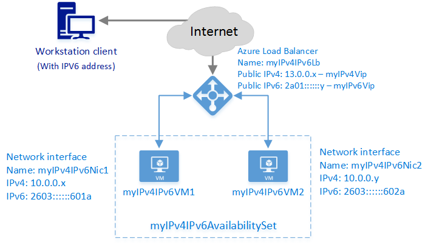

<properties
    pageTitle="Creare un servizio di bilanciamento del carico IPv6 in Gestione di risorse di Azure usa CLI Azure è connessa a Internet | Microsoft Azure"
    description="Informazioni su come creare un servizio di bilanciamento del carico IPv6 in Gestione di risorse di Azure usa CLI Azure è connessa a Internet"
    services="load-balancer"
    documentationCenter="na"
    authors="sdwheeler"
    manager="carmonm"
    editor=""
    tags="azure-resource-manager"
    keywords="IPv6, bilanciamento del carico azure, stack doppio, ip pubblico, ipv6 nativo, mobile, iot"
/>
<tags
    ms.service="load-balancer"
    ms.devlang="na"
    ms.topic="article"
    ms.tgt_pltfrm="na"
    ms.workload="infrastructure-services"
    ms.date="09/14/2016"
    ms.author="sewhee"
/>

# <a name="create-an-internet-facing-load-balancer-with-ipv6-in-azure-resource-manager-using-the-azure-cli"></a>Creare un servizio di bilanciamento del carico IPv6 in Gestione di risorse di Azure usa CLI Azure è connessa a Internet

> [AZURE.SELECTOR]
- [PowerShell](./load-balancer-ipv6-internet-ps.md)
- [CLI Azure](./load-balancer-ipv6-internet-cli.md)
- [Modello](./load-balancer-ipv6-internet-template.md)

Un servizio di bilanciamento del carico Azure è un bilanciamento del carico Layer 4 (TCP, UDP). Bilanciamento del carico fornisce disponibilità distribuendo il traffico in ingresso tra istanze del servizio integro in servizi cloud e/o virtuali in un set di bilanciamento del carico. Azure di bilanciamento del carico può presentare anche questi servizi in più porte, più indirizzi IP o entrambe.

## <a name="example-deployment-scenario"></a>Scenario di distribuzione di esempio

Il diagramma seguente illustra soluzione di bilanciamento del carico distribuito utilizzando il modello di esempio descritto in questo articolo.



In questo scenario si creerà le risorse di Azure seguenti:

- due macchine)
- un'interfaccia virtuali per ogni macchina virtuale con indirizzi IPv4 e IPv6 assegnati
- un bilanciamento del carico esposto a Internet con IPv4 e un indirizzo IP pubblico IPv6
- un Set di disponibilità per che contiene due macchine virtuali
- due caricare le regole di bilanciamento del carico per eseguire il mapping VIP pubblico per gli endpoint privati

## <a name="deploying-the-solution-using-the-azure-cli"></a>Distribuire la soluzione utilizzando CLI Azure

La procedura seguente viene illustrato come creare un servizio di bilanciamento del carico Gestione risorse Azure con CLI è connessa a Internet. Azure Gestione risorse di ogni risorsa viene creato e configurato singolarmente e quindi inserire insieme per creare una risorsa.

Per distribuire un bilanciamento del carico, creare e configurare i seguenti oggetti:

- Configurazione IP front-end - contiene indirizzi IP per il traffico di rete in ingresso.
- Pool di indirizzi di back-end - contiene le interfacce di rete (NIC) per le macchine virtuali di ricevere il traffico di rete di bilanciamento del carico.
- Regole di bilanciamento del carico - contiene le regole di mapping di una porta pubblica del servizio di bilanciamento del carico alla porta nel pool di indirizzi di back-end.
- In ingresso regole NAT - contiene le regole di mapping di una porta pubblica del servizio di bilanciamento del carico a una porta per una macchina virtuale specifica nel pool di indirizzi di back-end.
- Esegue la ricerca - contiene le ricerche integrità utilizzate per verificare la disponibilità delle istanze di macchine virtuali nel pool di indirizzi di back-end.

Per ulteriori informazioni, vedere [Gestione di Azure risorse di supporto per bilanciamento del carico](load-balancer-arm.md).

## <a name="set-up-your-cli-environment-to-use-azure-resource-manager"></a>Configurare l'ambiente CLI per utilizzare Gestione risorse di Azure

In questo esempio, si esegue il strumenti CLI in una finestra di comando di PowerShell. Non si sono utilizzando i cmdlet di PowerShell di Azure, ma vengono utilizzate funzionalità di creazione di script di PowerShell per migliorare la leggibilità e riutilizzo.

1. Se non è mai utilizzato CLI Azure, vedere [installare e configurare CLI Azure](../../articles/xplat-cli-install.md) e seguire le istruzioni fino al punto in cui si seleziona l'account Azure e la sottoscrizione.

2. Eseguire il comando **configurazione azure modalità** per passare alla modalità di gestione risorse.

        azure config mode arm

    Output previsto:

        info:    New mode is arm

3. Accedere a Azure e ottenere un elenco delle sottoscrizioni.

        azure login

    Immettere le credenziali Azure quando richiesto.

        azure account list

    Selezionare l'abbonamento a cui che si desidera utilizzare. Prendere nota della sottoscrizione Id per il passaggio successivo.

4. Impostare le variabili di PowerShell per l'uso con i comandi CLI.

        ```
        $subscriptionid = "########-####-####-####-############"  # enter subscription id
        $location = "southcentralus"
        $rgName = "pscontosorg1southctrlus09152016"
        $vnetName = "contosoIPv4Vnet"
        $vnetPrefix = "10.0.0.0/16"
        $subnet1Name = "clicontosoIPv4Subnet1"
        $subnet1Prefix = "10.0.0.0/24"
        $subnet2Name = "clicontosoIPv4Subnet2"
        $subnet2Prefix = "10.0.1.0/24"
        $dnsLabel = "contoso09152016"
        $lbName = "myIPv4IPv6Lb"
        ```

## <a name="create-a-resource-group-a-load-balancer-a-virtual-network-and-subnets"></a>Creare un gruppo di risorse, un servizio di bilanciamento del carico, una rete virtuale e subnet

1. Creare un gruppo di risorse

        azure group create $rgName $location

2. Creare un bilanciamento del carico

        $lb = azure network lb create --resource-group $rgname --location $location --name $lbName

3. Creare una rete virtuale (VNet).

        $vnet = azure network vnet create  --resource-group $rgname --name $vnetName --location $location --address-prefixes $vnetPrefix

    Creare due subnet in questa VNet.

        $subnet1 = azure network vnet subnet create --resource-group $rgname --name $subnet1Name --address-prefix $subnet1Prefix --vnet-name $vnetName
        $subnet2 = azure network vnet subnet create --resource-group $rgname --name $subnet2Name --address-prefix $subnet2Prefix --vnet-name $vnetName

## <a name="create-public-ip-addresses-for-the-front-end-pool"></a>Creazione di indirizzi IP per il pool front-end

1. Configurare le variabili di PowerShell

        $publicIpv4Name = "myIPv4Vip"
        $publicIpv6Name = "myIPv6Vip"

2. Creare un indirizzo IP pubblico pool di indirizzi IP front-end.

        $publicipV4 = azure network public-ip create --resource-group $rgname --name $publicIpv4Name --location $location --ip-version IPv4 --allocation-method Dynamic --domain-name-label $dnsLabel
        $publicipV6 = azure network public-ip create --resource-group $rgname --name $publicIpv6Name --location $location --ip-version IPv6 --allocation-method Dynamic --domain-name-label $dnsLabel

    >[AZURE.IMPORTANT]Bilanciamento del carico utilizza l'etichetta di dominio dell'indirizzo IP pubblico come il nome di dominio completo. Questa modifica da distribuzione classica che usa il servizio cloud assegnare un nome come il nome di dominio completo di bilanciamento del carico.
    >In questo esempio il FQDN è *contoso09152016.southcentralus.cloudapp.azure.com*.

## <a name="create-front-end-and-back-end-pools"></a>Creare pool front-end e back-end

In questo esempio viene creato il pool di indirizzi IP front-end che riceve il traffico di rete in ingresso nel sistema di bilanciamento del carico e al pool di indirizzi IP back-end nel punto in cui il pool front-end invia il traffico di rete di bilanciamento del carico.

1. Configurare le variabili di PowerShell

        $frontendV4Name = "FrontendVipIPv4"
        $frontendV6Name = "FrontendVipIPv6"
        $backendAddressPoolV4Name = "BackendPoolIPv4"
        $backendAddressPoolV6Name = "BackendPoolIPv6"

2. Creare un pool front-end IP associazione l'indirizzo IP pubblico creato nel passaggio precedente e il servizio di bilanciamento del carico.

        $frontendV4 = azure network lb frontend-ip create --resource-group $rgname --name $frontendV4Name --public-ip-name $publicIpv4Name --lb-name $lbName
        $frontendV6 = azure network lb frontend-ip create --resource-group $rgname --name $frontendV6Name --public-ip-name $publicIpv6Name --lb-name $lbName
        $backendAddressPoolV4 = azure network lb address-pool create --resource-group $rgname --name $backendAddressPoolV4Name --lb-name $lbName
        $backendAddressPoolV6 = azure network lb address-pool create --resource-group $rgname --name $backendAddressPoolV6Name --lb-name $lbName

## <a name="create-the-probe-nat-rules-and-lb-rules"></a>Creare il sondaggio, le regole NAT e regole kg

In questo esempio viene creato gli elementi seguenti:

- una regola di verifica per controllare la connettività alla porta TCP 80
- una regola NAT per tradurre tutto il traffico in ingresso sulla porta 3389 alla porta 3389 per RDP<sup>1</sup>
- una regola NAT per tradurre tutto il traffico in ingresso sulla porta 3391 alla porta 3389 per RDP<sup>1</sup>
- una regola di bilanciamento carico riconciliare tutto il traffico in ingresso sulla porta 80 alla porta 80 sugli indirizzi nel pool di back-end.

<sup>1</sup> le regole NAT associati a un'istanza di macchina virtuale specifica supporto bilanciamento del carico. Il traffico di rete in arrivo sulla porta 3389 viene inviato per la macchina virtuale specifica e la porta associate alla regola NAT. È necessario specificare un protocollo (UDP o TCP) per una regola NAT. Entrambi i protocolli non assegnare la stessa porta.

1. Configurare le variabili di PowerShell

        $probeV4V6Name = "ProbeForIPv4AndIPv6"
        $natRule1V4Name = "NatRule-For-Rdp-VM1"
        $natRule2V4Name = "NatRule-For-Rdp-VM2"
        $lbRule1V4Name = "LBRuleForIPv4-Port80"
        $lbRule1V6Name = "LBRuleForIPv6-Port80"

2. Creare la ricerca

    Nell'esempio seguente viene creato un sondaggio TCP verifica la presenza per la connettività per la porta TCP 80 back-end ogni 15 secondi. Contrassegna dopo errori consecutivi di due risorse back-end non è disponibile.

        $probeV4V6 = azure network lb probe create --resource-group $rgname --name $probeV4V6Name --protocol tcp --port 80 --interval 15 --count 2 --lb-name $lbName

3. Creare le regole in entrata NAT che consentono le connessioni RDP a risorse back-end

        $inboundNatRuleRdp1 = azure network lb inbound-nat-rule create --resource-group $rgname --name $natRule1V4Name --frontend-ip-name $frontendV4Name --protocol Tcp --frontend-port 3389 --backend-port 3389 --lb-name $lbName
        $inboundNatRuleRdp2 = azure network lb inbound-nat-rule create --resource-group $rgname --name $natRule2V4Name --frontend-ip-name $frontendV4Name --protocol Tcp --frontend-port 3391 --backend-port 3389 --lb-name $lbName

4. Creare un bilanciamento del carico regole che inviano il traffico a porte back-end diverse a seconda del tipo quali front-end ha ricevuto la richiesta

        $lbruleIPv4 = azure network lb rule create --resource-group $rgname --name $lbRule1V4Name --frontend-ip-name $frontendV4Name --backend-address-pool-name $backendAddressPoolV4Name --probe-name $probeV4V6Name --protocol Tcp --frontend-port 80 --backend-port 80 --lb-name $lbName
        $lbruleIPv6 = azure network lb rule create --resource-group $rgname --name $lbRule1V6Name --frontend-ip-name $frontendV6Name --backend-address-pool-name $backendAddressPoolV6Name --probe-name $probeV4V6Name --protocol Tcp --frontend-port 80 --backend-port 8080 --lb-name $lbName

5. Verificare le impostazioni

        azure network lb show --resource-group $rgName --name $lbName

    Output previsto:

        info:    Executing command network lb show
        info:    Looking up the load balancer "myIPv4IPv6Lb"
        data:    Id                              : /subscriptions/########-####-####-####-############/resourceGroups/pscontosorg1southctrlus09152016/providers/Microsoft.Network/loadBalancers/myIPv4IPv6Lb
        data:    Name                            : myIPv4IPv6Lb
        data:    Type                            : Microsoft.Network/loadBalancers
        data:    Location                        : southcentralus
        data:    Provisioning state              : Succeeded
        data:
        data:    Frontend IP configurations:
        data:    Name             Provisioning state  Private IP allocation  Private IP   Subnet  Public IP
        data:    ---------------  ------------------  ---------------------  -----------  ------  ---------
        data:    FrontendVipIPv4  Succeeded           Dynamic                                     myIPv4Vip
        data:    FrontendVipIPv6  Succeeded           Dynamic                                     myIPv6Vip
        data:
        data:    Probes:
        data:    Name                 Provisioning state  Protocol  Port  Path  Interval  Count
        data:    -------------------  ------------------  --------  ----  ----  --------  -----
        data:    ProbeForIPv4AndIPv6  Succeeded           Tcp       80          15        2
        data:
        data:    Backend Address Pools:
        data:    Name             Provisioning state
        data:    ---------------  ------------------
        data:    BackendPoolIPv4  Succeeded
        data:    BackendPoolIPv6  Succeeded
        data:
        data:    Load Balancing Rules:
        data:    Name                  Provisioning state  Load distribution  Protocol  Frontend port  Backend port  Enable floating IP  Idle timeout in minutes
        data:    --------------------  ------------------  -----------------  --------  -------------  ------------  ------------------  -----------------------
        data:    LBRuleForIPv4-Port80  Succeeded           Default            Tcp       80             80            false               4
        data:    LBRuleForIPv6-Port80  Succeeded           Default            Tcp       80             8080          false               4
        data:
        data:    Inbound NAT Rules:
        data:    Name                 Provisioning state  Protocol  Frontend port  Backend port  Enable floating IP  Idle timeout in minutes
        data:    -------------------  ------------------  --------  -------------  ------------  ------------------  -----------------------
        data:    NatRule-For-Rdp-VM1  Succeeded           Tcp       3389           3389          false               4
        data:    NatRule-For-Rdp-VM2  Succeeded           Tcp       3391           3389          false               4
        info:    network lb show


## <a name="create-nics"></a>Creare schede di rete

Creare NIC e associarli regole NAT, le regole di bilanciamento carico e le ricerche.

1. Configurare le variabili di PowerShell

        $nic1Name = "myIPv4IPv6Nic1"
        $nic2Name = "myIPv4IPv6Nic2"
        $subnet1Id = "/subscriptions/$subscriptionid/resourceGroups/$rgName/providers/Microsoft.Network/VirtualNetworks/$vnetName/subnets/$subnet1Name"
        $subnet2Id = "/subscriptions/$subscriptionid/resourceGroups/$rgName/providers/Microsoft.Network/VirtualNetworks/$vnetName/subnets/$subnet2Name"
        $backendAddressPoolV4Id = "/subscriptions/$subscriptionid/resourceGroups/$rgname/providers/Microsoft.Network/loadbalancers/$lbName/backendAddressPools/$backendAddressPoolV4Name"
        $backendAddressPoolV6Id = "/subscriptions/$subscriptionid/resourceGroups/$rgname/providers/Microsoft.Network/loadbalancers/$lbName/backendAddressPools/$backendAddressPoolV6Name"
        $natRule1V4Id = "/subscriptions/$subscriptionid/resourceGroups/$rgname/providers/Microsoft.Network/loadbalancers/$lbName/inboundNatRules/$natRule1V4Name"
        $natRule2V4Id = "/subscriptions/$subscriptionid/resourceGroups/$rgname/providers/Microsoft.Network/loadbalancers/$lbName/inboundNatRules/$natRule2V4Name"

2. Creare una scheda di rete per ogni back-end e aggiungere una configurazione IPv6.

        $nic1 = azure network nic create --name $nic1Name --resource-group $rgname --location $location --private-ip-version "IPv4" --subnet-id $subnet1Id --lb-address-pool-ids $backendAddressPoolV4Id --lb-inbound-nat-rule-ids $natRule1V4Id
        $nic1IPv6 = azure network nic ip-config create --resource-group $rgname --name "IPv6IPConfig" --private-ip-version "IPv6" --lb-address-pool-ids $backendAddressPoolV6Id --nic-name $nic1Name

        $nic2 = azure network nic create --name $nic2Name --resource-group $rgname --location $location --subnet-id $subnet1Id --lb-address-pool-ids $backendAddressPoolV4Id --lb-inbound-nat-rule-ids $natRule1V4Id
        $nic2IPv6 = azure network nic ip-config create --resource-group $rgname --name "IPv6IPConfig" --private-ip-version "IPv6" --lb-address-pool-ids $backendAddressPoolV6Id --nic-name $nic2Name

## <a name="create-the-back-end-vm-resources-and-attach-each-nic"></a>Creare le risorse di macchine Virtuali di back-end e allegare schede di rete

Per creare macchine virtuali, è necessario disporre di un account di archiviazione. Bilanciamento del carico, è necessario essere membri di un set di disponibilità macchine virtuali. Per ulteriori informazioni sulla creazione di macchine virtuali, vedere [creare una macchina virtuale Azure tramite PowerShell](../virtual-machines/virtual-machines-windows-ps-create.md)

1. Configurare le variabili di PowerShell

        $storageAccountName = "ps08092016v6sa0"
        $availabilitySetName = "myIPv4IPv6AvailabilitySet"
        $vm1Name = "myIPv4IPv6VM1"
        $vm2Name = "myIPv4IPv6VM2"
        $nic1Id = "/subscriptions/$subscriptionid/resourceGroups/$rgname/providers/Microsoft.Network/networkInterfaces/$nic1Name"
        $nic2Id = "/subscriptions/$subscriptionid/resourceGroups/$rgname/providers/Microsoft.Network/networkInterfaces/$nic2Name"
        $disk1Name = "WindowsVMosDisk1"
        $disk2Name = "WindowsVMosDisk2"
        $osDisk1Uri = "https://$storageAccountName.blob.core.windows.net/vhds/$disk1Name.vhd"
        $osDisk2Uri = "https://$storageAccountName.blob.core.windows.net/vhds/$disk2Name.vhd"
        $imageurn "MicrosoftWindowsServer:WindowsServer:2012-R2-Datacenter:latest"
        $vmUserName = "vmUser"
        $mySecurePassword = "PlainTextPassword*1"

    >[AZURE.WARNING] In questo esempio viene utilizzato il nome utente e la password per le macchine virtuali in testo non crittografato. Deve essere appropriato attenzione quando usando le credenziali in chiaro. Per un metodo più sicuro di gestire le credenziali di PowerShell, vedere il cmdlet [Get-Credential](https://technet.microsoft.com/library/hh849815.aspx) .

2. Creare il set di account e la disponibilità di spazio di archiviazione

    Quando si creano macchine virtuali, è possibile utilizzare un account di archiviazione esistente. Il comando seguente viene creato un nuovo account di archiviazione.

        $storageAcc = azure storage account create $storageAccountName --resource-group $rgName --location $location --sku-name "LRS" --kind "Storage"

    Creare il set di disponibilità.

        $availabilitySet = azure availset create --name $availabilitySetName --resource-group $rgName --location $location

3. Creare le macchine virtuali con le schede di rete associati

        $vm1 = azure vm create --resource-group $rgname --location $location --availset-name $availabilitySetName --name $vm1Name --nic-id $nic1Id --os-disk-vhd $osDisk1Uri --os-type "Windows" --admin-username $vmUserName --admin-password $mySecurePassword --vm-size "Standard_A1" --image-urn $imageurn --storage-account-name $storageAccountName --disable-bginfo-extension

        $vm2 = azure vm create --resource-group $rgname --location $location --availset-name $availabilitySetName --name $vm2Name --nic-id $nic2Id --os-disk-vhd $osDisk2Uri --os-type "Windows" --admin-username $vmUserName --admin-password $mySecurePassword --vm-size "Standard_A1" --image-urn $imageurn  --storage-account-name $storageAccountName --disable-bginfo-extension

## <a name="next-steps"></a>Passaggi successivi

[Per iniziare la configurazione di un servizio di bilanciamento del carico interno](load-balancer-get-started-ilb-arm-cli.md)

[Configurare una modalità di distribuzione carico di bilanciamento del carico](load-balancer-distribution-mode.md)

[Configurare le impostazioni di timeout di inattività TCP per il servizio di bilanciamento del carico](load-balancer-tcp-idle-timeout.md)
