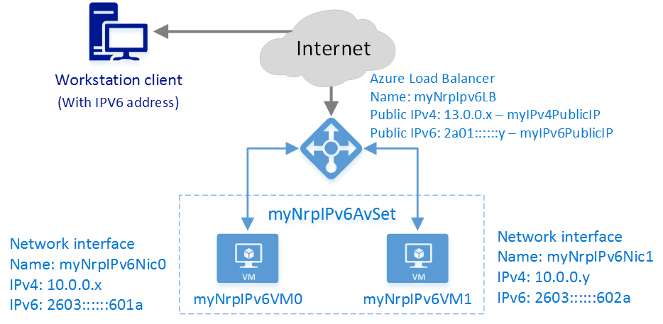

<properties
    pageTitle="Creare una rete Internet affiancate di bilanciamento del carico con IPv6 gestione PowerShell per risorse | Microsoft Azure"
    description="Informazioni su come creare un Internet affiancate di bilanciamento del carico con IPv6 con PowerShell per Manager delle risorse"
    services="load-balancer"
    documentationCenter="na"
    authors="sdwheeler"
    manager="carmonm"
    editor=""
    tags="azure-resource-manager"
    keywords="IPv6, bilanciamento del carico azure, stack doppio, ip pubblico, ipv6 nativo, mobile, iot"
/>
<tags
    ms.service="load-balancer"
    ms.devlang="na"
    ms.topic="article"
    ms.tgt_pltfrm="na"
    ms.workload="infrastructure-services"
    ms.date="09/14/2016"
    ms.author="sewhee"
/>

# Iniziare a creare un Internet affiancate di bilanciamento del carico con IPv6 con PowerShell per Manager delle risorse

> [AZURE.SELECTOR]
- [PowerShell](./load-balancer-ipv6-internet-ps.md)
- [CLI Azure](./load-balancer-ipv6-internet-cli.md)
- [Modello](./load-balancer-ipv6-internet-template.md)

Un servizio di bilanciamento del carico Azure è un bilanciamento del carico Layer 4 (TCP, UDP). Bilanciamento del carico fornisce disponibilità distribuendo il traffico in ingresso tra istanze del servizio integro in servizi cloud e/o virtuali in un set di bilanciamento del carico. Azure di bilanciamento del carico può presentare anche questi servizi in più porte, più indirizzi IP o entrambe.

## Scenario di distribuzione di esempio

Il diagramma seguente illustra il bilanciamento del carico soluzione distribuita in questo articolo.

In questo scenario si creerà le risorse di Azure seguenti:

- un bilanciamento del carico esposto a Internet con IPv4 e un indirizzo IP pubblico IPv6
- due caricare le regole di bilanciamento del carico per eseguire il mapping VIP pubblico per gli endpoint privati
- un Set di disponibilità per che contiene due macchine virtuali
- due macchine)
- un'interfaccia virtuali per ogni macchina virtuale con indirizzi IPv4 e IPv6 assegnati

## Distribuire la soluzione tramite PowerShell Azure

La procedura seguente viene illustrato come creare un servizio di bilanciamento del carico Gestione risorse Azure con PowerShell è connessa a Internet. Azure Gestione risorse di ogni risorsa viene creato e configurato singolarmente, quindi inserire insieme per creare una risorsa.

Per distribuire un bilanciamento del carico, creare e configurare i seguenti oggetti:

- Configurazione IP front-end - contiene indirizzi IP per il traffico di rete in ingresso.
- Pool di indirizzi di back-end - contiene le interfacce di rete (NIC) per le macchine virtuali di ricevere il traffico di rete di bilanciamento del carico.
- Regole di bilanciamento del carico - contiene le regole di mapping di una porta pubblica del servizio di bilanciamento del carico alla porta nel pool di indirizzi di back-end.
- In ingresso regole NAT - contiene le regole di mapping di una porta pubblica del servizio di bilanciamento del carico a una porta per una macchina virtuale specifica nel pool di indirizzi di back-end.
- Esegue la ricerca - contiene le ricerche integrità utilizzate per verificare la disponibilità delle istanze di macchine virtuali nel pool di indirizzi di back-end.

Per ulteriori informazioni, vedere [Gestione di Azure risorse di supporto per bilanciamento del carico](load-balancer-arm.md).

## Configurare PowerShell usare Gestione risorse

Accertarsi di avere l'ultima versione di produzione del modulo di gestione di risorse Azure per PowerShell.

1. Eseguire l'accesso a Azure

        Login-AzureRmAccount

    Immettere le credenziali quando richiesto.

2. Controllare le sottoscrizioni per l'account

        Get-AzureRmSubscription

3. Scegliere quale delle sottoscrizioni Azure da utilizzare.

        Select-AzureRmSubscription -SubscriptionId 'GUID of subscription'

4. Creare un gruppo di risorse (ignorare questo passaggio se Usa un gruppo di risorse esistente)

        New-AzureRmResourceGroup -Name NRP-RG -location "West US"

## Creare una rete virtuale e un indirizzo IP pubblico per il pool front-end IP

1. Creare una rete virtuale con una subnet.

        $backendSubnet = New-AzureRmVirtualNetworkSubnetConfig -Name LB-Subnet-BE -AddressPrefix 10.0.2.0/24
        $vnet = New-AzureRmvirtualNetwork -Name VNet -ResourceGroupName NRP-RG -Location 'West US' -AddressPrefix 10.0.0.0/16 -Subnet $backendSubnet

2. Creare l'indirizzo IP pubblico Azure risorse (PIP) per il pool di indirizzi IP front-end.

        $publicIPv4 = New-AzureRmPublicIpAddress -Name 'pub-ipv4' -ResourceGroupName NRP-RG -Location 'West US' -AllocationMethod Static -IpAddressVersion IPv4 -DomainNameLabel lbnrpipv4
        $publicIPv6 = New-AzureRmPublicIpAddress -Name 'pub-ipv6' -ResourceGroupName NRP-RG -Location 'West US' -AllocationMethod Dynamic -IpAddressVersion IPv6 -DomainNameLabel lbnrpipv6

    >[AZURE.IMPORTANT] Bilanciamento del carico utilizza l'etichetta di dominio dell'indirizzo IP pubblico come prefisso per il nome di dominio completo. In questo esempio, i nomi FQDN sono *lbnrpipv4.westus.cloudapp.azure.com* e *lbnrpipv6.westus.cloudapp.azure.com*.

## Creare un configurazioni IP front-end e un Pool di indirizzi Back-End

1. Creare una configurazione front-end che utilizza gli indirizzi IP pubblico che è stato creato.

        $FEIPConfigv4 = New-AzureRmLoadBalancerFrontendIpConfig -Name "LB-Frontendv4" -PublicIpAddress $publicIPv4
        $FEIPConfigv6 = New-AzureRmLoadBalancerFrontendIpConfig -Name "LB-Frontendv6" -PublicIpAddress $publicIPv6

2. Creare pool di indirizzi di back-end.

        $backendpoolipv4 = New-AzureRmLoadBalancerBackendAddressPoolConfig -Name "BackendPoolIPv4"
        $backendpoolipv6 = New-AzureRmLoadBalancerBackendAddressPoolConfig -Name "BackendPoolIPv6"

## Creare regole kg, regole NAT, una ricerca e un bilanciamento del carico

In questo esempio viene creato gli elementi seguenti:

- una regola NAT per tradurre tutto il traffico in ingresso sulla porta 443 alla porta 4443
- una regola di bilanciamento carico riconciliare tutto il traffico in ingresso sulla porta 80 alla porta 80 sugli indirizzi nel pool di back-end.
- Regola bilanciamento carico per consentire la connessione RDP macchine virtuali sulla porta 3389.
- una regola di verifica per controllare lo stato di integrità di una pagina denominata *HealthProbe.aspx* o un servizio sulla porta 8080
- un bilanciamento del carico che utilizza tutti gli oggetti

1. Creare le regole NAT.

        $inboundNATRule1v4 = New-AzureRmLoadBalancerInboundNatRuleConfig -Name "NicNatRulev4" -FrontendIpConfiguration $FEIPConfigv4 -Protocol TCP -FrontendPort 443 -BackendPort 4443
        $inboundNATRule1v6 = New-AzureRmLoadBalancerInboundNatRuleConfig -Name "NicNatRulev6" -FrontendIpConfiguration $FEIPConfigv6 -Protocol TCP -FrontendPort 443 -BackendPort 4443

2. Creare una verifica dell'integrità. Esistono due modi per configurare un sondaggio:

    Verifica HTTP

        $healthProbe = New-AzureRmLoadBalancerProbeConfig -Name 'HealthProbe-v4v6' -RequestPath 'HealthProbe.aspx' -Protocol http -Port 80 -IntervalInSeconds 15 -ProbeCount 2

    o verifica TCP

        $healthProbe = New-AzureRmLoadBalancerProbeConfig -Name 'HealthProbe-v4v6' -Protocol Tcp -Port 8080 -IntervalInSeconds 15 -ProbeCount 2
        $RDPprobe = New-AzureRmLoadBalancerProbeConfig -Name 'RDPprobe' -Protocol Tcp -Port 3389 -IntervalInSeconds 15 -ProbeCount 2

    In questo esempio, occorre usare ricerche TCP.

3. Creare una regola di bilanciamento del carico.

        $lbrule1v4 = New-AzureRmLoadBalancerRuleConfig -Name "HTTPv4" -FrontendIpConfiguration $FEIPConfigv4 -BackendAddressPool $backendpoolipv4 -Probe $healthProbe -Protocol Tcp -FrontendPort 80 -BackendPort 8080
        $lbrule1v6 = New-AzureRmLoadBalancerRuleConfig -Name "HTTPv6" -FrontendIpConfiguration $FEIPConfigv6 -BackendAddressPool $backendpoolipv6 -Probe $healthProbe -Protocol Tcp -FrontendPort 80 -BackendPort 8080
        $RDPrule = New-AzureRmLoadBalancerRuleConfig -Name "RDPrule" -FrontendIpConfiguration $FEIPConfigv4 -BackendAddressPool $backendpoolipv4 -Probe $RDPprobe -Protocol Tcp -FrontendPort 3389 -BackendPort 3389

4. Creare il bilanciamento del carico utilizzando gli oggetti creati in precedenza.

        $NRPLB = New-AzureRmLoadBalancer -ResourceGroupName NRP-RG -Name 'myNrpIPv6LB' -Location 'West US' -FrontendIpConfiguration $FEIPConfigv4,$FEIPConfigv6 -InboundNatRule $inboundNATRule1v6,$inboundNATRule1v4 -BackendAddressPool $backendpoolipv4,$backendpoolipv6 -Probe $healthProbe,$RDPprobe -LoadBalancingRule $lbrule1v4,$lbrule1v6,$RDPrule

## Creare NIC per macchine virtuali back-end

1. È possibile ottenere la rete virtuale e virtuale Subnet di rete, in cui è necessario creare le schede di rete.

        $vnet = Get-AzureRmVirtualNetwork -Name NRPVNet -ResourceGroupName NRP-RG
        $backendSubnet = Get-AzureRmVirtualNetworkSubnetConfig -Name LB-Subnet-BE -VirtualNetwork $vnet

2. Creare le configurazioni IP e schede di rete per macchine virtuali.

        $nic1IPv4 = New-AzureRmNetworkInterfaceIpConfig -Name "IPv4IPConfig" -PrivateIpAddressVersion "IPv4" -Subnet $backendSubnet -LoadBalancerBackendAddressPool $backendpoolipv4 -LoadBalancerInboundNatRule $inboundNATRule1v4
        $nic1IPv6 = New-AzureRmNetworkInterfaceIpConfig -Name "IPv6IPConfig" -PrivateIpAddressVersion "IPv6" -LoadBalancerBackendAddressPool $backendpoolipv6 -LoadBalancerInboundNatRule $inboundNATRule1v6
        $nic1 = New-AzureRmNetworkInterface -Name 'myNrpIPv6Nic0' -IpConfiguration $nic1IPv4,$nic1IPv6 -ResourceGroupName NRP-RG -Location 'West US'

        $nic2IPv4 = New-AzureRmNetworkInterfaceIpConfig -Name "IPv4IPConfig" -PrivateIpAddressVersion "IPv4" -Subnet $backendSubnet -LoadBalancerBackendAddressPool $backendpoolipv4
        $nic2IPv6 = New-AzureRmNetworkInterfaceIpConfig -Name "IPv6IPConfig" -PrivateIpAddressVersion "IPv6" -LoadBalancerBackendAddressPool $backendpoolipv6
        $nic2 = New-AzureRmNetworkInterface -Name 'myNrpIPv6Nic1' -IpConfiguration $nic2IPv4,$nic2IPv6 -ResourceGroupName NRP-RG -Location 'West US'

## Creare macchine virtuali e assegnare NIC appena creata

Per ulteriori informazioni sulla creazione di una macchina virtuale, vedere [Crea e preconfigurare una macchina virtuale di Windows con Manager delle risorse e Azure PowerShell](..\virtual-machines\virtual-machines-windows-ps-create.md)

1. Creare un account di impostare la disponibilità e lo spazio di archiviazione

        New-AzureRmAvailabilitySet -Name 'myNrpIPv6AvSet' -ResourceGroupName NRP-RG -location 'West US'
        $availabilitySet = Get-AzureRmAvailabilitySet -Name 'myNrpIPv6AvSet' -ResourceGroupName NRP-RG
        New-AzureRmStorageAccount -ResourceGroupName NRP-RG -Name 'mynrpipv6stacct' -Location 'West US' -SkuName $LRS
        $CreatedStorageAccount = Get-AzureRmStorageAccount -ResourceGroupName NRP-RG -Name 'mynrpipv6stacct'

2. Creare ogni macchina virtuale e assegnare precedente creato NIC

        $mySecureCredentials= Get-Credential -Message “Type the username and password of the local administrator account.”

        $vm1 = New-AzureRmVMConfig -VMName 'myNrpIPv6VM0' -VMSize 'Standard_G1' -AvailabilitySetId $availabilitySet.Id
        $vm1 = Set-AzureRmVMOperatingSystem -VM $vm1 -Windows -ComputerName 'myNrpIPv6VM0' -Credential $mySecureCredentials -ProvisionVMAgent -EnableAutoUpdate
        $vm1 = Set-AzureRmVMSourceImage -VM $vm1 -PublisherName MicrosoftWindowsServer -Offer WindowsServer -Skus 2012-R2-Datacenter -Version "latest"
        $vm1 = Add-AzureRmVMNetworkInterface -VM $vm1 -Id $nic1.Id -Primary
        $osDisk1Uri = $CreatedStorageAccount.PrimaryEndpoints.Blob.ToString() + "vhds/myNrpIPv6VM0osdisk.vhd"
        $vm1 = Set-AzureRmVMOSDisk -VM $vm1 -Name 'myNrpIPv6VM0osdisk' -VhdUri $osDisk1Uri -CreateOption FromImage
        New-AzureRmVM -ResourceGroupName NRP-RG -Location 'West US' -VM $vm1

        $vm2 = New-AzureRmVMConfig -VMName 'myNrpIPv6VM1' -VMSize 'Standard_G1' -AvailabilitySetId $availabilitySet.Id
        $vm2 = Set-AzureRmVMOperatingSystem -VM $vm2 -Windows -ComputerName 'myNrpIPv6VM1' -Credential $mySecureCredentials -ProvisionVMAgent -EnableAutoUpdate
        $vm2 = Set-AzureRmVMSourceImage -VM $vm2 -PublisherName MicrosoftWindowsServer -Offer WindowsServer -Skus 2012-R2-Datacenter -Version "latest"
        $vm2 = Add-AzureRmVMNetworkInterface -VM $vm2 -Id $nic2.Id -Primary
        $osDisk2Uri = $CreatedStorageAccount.PrimaryEndpoints.Blob.ToString() + "vhds/myNrpIPv6VM1osdisk.vhd"
        $vm2 = Set-AzureRmVMOSDisk -VM $vm2 -Name 'myNrpIPv6VM1osdisk' -VhdUri $osDisk2Uri -CreateOption FromImage
        New-AzureRmVM -ResourceGroupName NRP-RG -Location 'West US' -VM $vm2

## Passaggi successivi

[Per iniziare la configurazione di un servizio di bilanciamento del carico interno](load-balancer-get-started-ilb-arm-ps.md)

[Configurare una modalità di distribuzione carico di bilanciamento del carico](load-balancer-distribution-mode.md)

[Configurare le impostazioni di timeout di inattività TCP per il servizio di bilanciamento del carico](load-balancer-tcp-idle-timeout.md)
