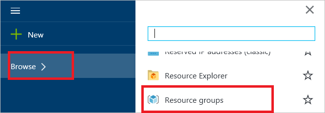
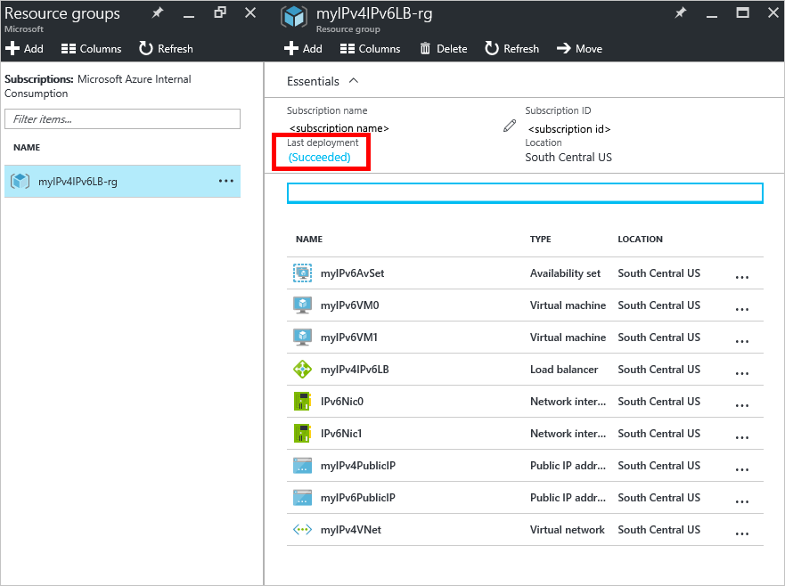

<properties
    pageTitle="Distribuire una connessione Internet bilanciamento del carico soluzione con IPv6 utilizzando un modello | Microsoft Azure"
    description="Informazioni su come distribuire il supporto IPv6 per servizio di bilanciamento del carico Azure e macchine virtuali di bilanciamento del carico."
    services="load-balancer"
    documentationCenter="na"
    authors="sdwheeler"
    manager="carmonm"
    editor=""
    tags="azure-resource-manager"
    keywords="IPv6, bilanciamento del carico azure, stack doppio, ip pubblico, ipv6 nativo, mobile, iot"
/>
<tags
    ms.service="load-balancer"
    ms.devlang="na"
    ms.topic="article"
    ms.tgt_pltfrm="na"
    ms.workload="infrastructure-services"
    ms.date="09/14/2016"
    ms.author="sewhee"
/>

# Distribuire una soluzione di bilanciamento del carico esposto a Internet con IPv6 utilizzando un modello

> [AZURE.SELECTOR]
- [PowerShell](./load-balancer-ipv6-internet-ps.md)
- [CLI Azure](./load-balancer-ipv6-internet-cli.md)
- [Modello](./load-balancer-ipv6-internet-template.md)

Un servizio di bilanciamento del carico Azure è un bilanciamento del carico Layer 4 (TCP, UDP). Bilanciamento del carico fornisce disponibilità distribuendo il traffico in ingresso tra istanze del servizio integro in servizi cloud e/o virtuali in un set di bilanciamento del carico. Azure di bilanciamento del carico può presentare anche questi servizi in più porte, più indirizzi IP o entrambe.

## Scenario di distribuzione di esempio

Il diagramma seguente illustra soluzione di bilanciamento del carico distribuito utilizzando il modello di esempio descritto in questo articolo.

In questo scenario si creerà le risorse di Azure seguenti:

- un'interfaccia virtuali per ogni macchina virtuale con indirizzi IPv4 e IPv6 assegnati
- un bilanciamento del carico esposto a Internet con IPv4 e un indirizzo IP pubblico IPv6
- due caricare le regole di bilanciamento del carico per eseguire il mapping VIP pubblico per gli endpoint privati
- un Set di disponibilità che contiene due macchine virtuali
- due macchine)

## Distribuire il modello tramite il portale di Azure

In questo articolo fa riferimento a un modello pubblicati nella raccolta [Modelli di Guida introduttiva di Azure](https://azure.microsoft.com/documentation/templates/201-load-balancer-ipv6-create/) . È possibile scaricare il modello da una raccolta o la distribuzione di Azure direttamente dalla raccolta di avvio. In questo articolo si presuppone che è stato scaricato il modello nel computer locale.

1. Aprire il portale di Azure e accedere con un account dotato di autorizzazioni per creare macchine virtuali e risorse di rete all'interno di un abbonamento a Azure. Inoltre, a meno che non si sta utilizzando risorse esistenti, l'account richiede l'autorizzazione per creare un gruppo di risorse e un account di archiviazione.

2. Fare clic su "+ nuovo" dal menu, quindi digitare "modello" nella casella di ricerca. Selezionare "Modello distribuzione" dai risultati della ricerca.

    

3. In che tutto blade, fare clic su "Modello distribuzione".

    

4. Fare clic su "Creare".

    

5. Fare clic su "Modifica modello". Eliminare il contenuto esistente e copiare e incollare nell'intero contenuto del file modello (per includere l'inizio e fine {}), quindi fare clic su "Salva".

    > [AZURE.NOTE] Se si usa Microsoft Internet Explorer, quando si incolla è visualizzata una finestra di dialogo che richiede di consentire l'accesso negli Appunti di Windows. Fare clic su "Consenti accesso".

    

6. Fare clic su "Modifica parametri". In e il parametri, specificare i valori per le istruzioni nella sezione parametri modello, quindi fare clic su "Salva" per chiudere e il parametri. In e il distribuzione personalizzata, selezionare l'abbonamento, un gruppo di risorse esistente o crearne uno. Se si sta creando un gruppo di risorse, quindi selezionare un percorso per il gruppo di risorse. Fare clic su **note legali**, quindi fare clic su **Acquista** per le condizioni legali. Azure verrà avviata la distribuzione di risorse. Bastano alcuni minuti per distribuire tutte le risorse.

    

    Per ulteriori informazioni su questi parametri, vedere la sezione [variabili e i parametri di modello](#template-parameters-and-variables) più avanti in questo articolo.

7. Per visualizzare le risorse create dal modello, fare clic su Sfoglia, scorrere verso il basso l'elenco fino a visualizzare "Gruppi di risorse", quindi fare clic su esso.

    

8. Scegliere il nome del gruppo di risorse specificato nel passaggio 6 e il gruppi risorse. Verrà visualizzato un elenco di tutte le risorse distribuite. Se ci sono stati anche, dovrebbe essere indicato "Riuscita" in "Ultima distribuzione". In caso contrario, assicurarsi che l'account in uso disponga delle autorizzazioni per creare le risorse necessarie.

    

    > [AZURE.NOTE] Se si visualizzano i gruppi di risorse immediatamente dopo aver completato il passaggio 6, "Ultima distribuzione" verrà visualizzato lo stato di "Distribuzione" mentre le risorse sono distribuite.

9. Fare clic su "myIPv6PublicIP" nell'elenco delle risorse. Viene visualizzato che disponga di un indirizzo IPv6 in indirizzo IP e che il relativo nome DNS è il valore specificato per il parametro dnsNameforIPv6LbIP nel passaggio 6. Questa risorsa è il pubblico IPv6 host e indirizzo nome accessibile ai client di Internet.

    

## Verificare la connettività

Quando il modello è distribuito correttamente, è possibile convalidare connettività completando le attività seguenti:

1. Accedere al portale di Azure e collegare a ciascuna delle macchine virtuali create per la distribuzione dei modelli. Se è stato distribuito una macchina virtuale Server di Windows, eseguire ipconfig/completa dal prompt dei comandi. Vengono visualizzate le macchine virtuali contengono indirizzi IPv4 e IPv6. Se è stata distribuita macchine virtuali Linux, è necessario configurare il sistema operativo Linux per ricevere gli indirizzi IPv6 dinamici seguendo le istruzioni fornite per la distribuzione Linux.
2. Da un client connesso a Internet IPv6, avviare una connessione all'indirizzo IPv6 pubblico di bilanciamento del carico. Per verificare che il servizio di bilanciamento del carico è bilanciamento del carico tra due macchine virtuali, è possibile installare un server web come Microsoft Internet Information Services (IIS) su ciascuna delle macchine virtuali. La pagina web predefinita in ogni server potrebbe contenere il testo "Server0" o "Server1" per identificarlo. Infine, aprire un browser su un client connesso a Internet IPv6 e individuare il nome host è specificato per il parametro dnsNameforIPv6LbIP di bilanciamento del carico per confermare la connettività IPv6-to-end per ogni macchina virtuale. Se viene visualizzato solo la pagina web da un solo server, potrebbe essere necessario cancellare la cache del browser. Aprire più sessioni di esplorazione private. Verrà visualizzata una risposta da ogni server.
3. Da un client connesso a Internet IPv4, avviare una connessione all'indirizzo IPv4 pubblico di bilanciamento del carico. Per verificare che il servizio di bilanciamento del carico sia il bilanciamento del carico due macchine virtuali, è possibile testare tramite IIS, come descritto nel passaggio 2.
4. Da ogni macchina virtuale, avviare una connessione in uscita a un dispositivo IPv6 o IPv4 connessione Internet. In entrambi i casi, indirizzo IP di origine visualizzato mediante il dispositivo di destinazione è l'indirizzo pubblico IPv4 o IPv6 di bilanciamento del carico.

>[AZURE.NOTE]
ICMP per IPv4 e IPv6 è bloccato nella rete Azure. Di conseguenza, gli strumenti di pacchetti ICMP come effettuare il ping sempre esito negativo. Per testare la connettività, utilizzare un'alternativa TCP, ad esempio TCPing o il cmdlet di PowerShell Test-NetConnection. Si noti che gli indirizzi IP indicati nel diagramma esempi di valori che è possibile che venga visualizzato. Dal momento che gli indirizzi IPv6 vengono assegnati in modo dinamico, gli indirizzi che si riceve variano e possono variare in base l'area geografica. Inoltre, è comune per l'indirizzo IPv6 pubblico su bilanciamento del carico per iniziare con un prefisso diverso rispetto agli indirizzi IPv6 privati nel pool di back-end.

## Le variabili e i parametri del modello

Un modello di gestione di risorse Azure contiene più variabili e i parametri che è possibile personalizzare in base alle esigenze. Variabili vengono utilizzate per valori fissi che non si desidera modificare un utente. I parametri vengono usati per i valori che si vuole che un utente di specificare quando si distribuisce il modello. Il modello di esempio è configurato per lo scenario descritto in questo articolo. È possibile personalizzare in base alle esigenze dell'ambiente.

Il modello di esempio utilizzato in questo articolo include le variabili e i parametri seguenti:

| Parametro / variabile | Note |
|-----------|-------|
| adminUsername | Specificare il nome dell'account di amministratore usato per accedere alle macchine virtuali con. |
| adminPassword | Specificare la password per l'account dell'amministratore usato per accedere alle macchine virtuali con. |
| dnsNameforIPv4LbIP | Specificare il nome host DNS che si desidera assegnare come il nome pubblico del servizio di bilanciamento del carico. Questo nome viene risolto indirizzi IPv4 pubblici di bilanciamento del carico. Il nome deve essere minuscola e corrisponde a regex: ^ [a-z][a-z0-9-]{1,61}[a-z0-9]$. |
| dnsNameforIPv6LbIP | Specificare il nome host DNS che si desidera assegnare come il nome pubblico del servizio di bilanciamento del carico. Questo nome viene risolto indirizzo IPv6 pubblico di bilanciamento del carico. Il nome deve essere minuscola e corrisponde a regex: ^ [a-z][a-z0-9-]{1,61}[a-z0-9]$. Può essere lo stesso nome all'indirizzo IPv4. Quando un client invia una query DNS per il nome di Azure restituirà sia A e AAAA record quando il nome è condiviso. |
| vmNamePrefix | Specificare il prefisso nome macchina virtuale. Il modello viene aggiunto un numero (0, 1, e così via) al nome quando vengono create le macchine virtuali. |
| nicNamePrefix | Specificare il prefisso del nome dell'interfaccia di rete. Il modello viene aggiunto un numero (0, 1, e così via) al nome quando vengono create le interfacce di rete. |
| storageAccountName | Immettere il nome di un account di archiviazione esistente oppure specificare il nome di una nuova da creare dal modello. |
| availabilitySetName | Immettere quindi nome della disponibilità di essere utilizzato con le macchine virtuali |
| addressPrefix | Il prefisso utilizzato per definire l'intervallo di indirizzi della rete virtuale |
| subnetName | Il nome della subnet in creati per la VNet |
| subnetPrefix | Il prefisso utilizzato per definire l'intervallo di indirizzi della subnet |
| vnetName | Specificare il nome per il VNet utilizzato da macchine virtuali. |
| ipv4PrivateIPAddressType | Il metodo di allocazione utilizzato per l'indirizzo IP privato (statica o dinamica) |
| ipv6PrivateIPAddressType | Il metodo di allocazione utilizzato per l'indirizzo IP privato (dinamico). IPv6 supporta solo l'allocazione dinamica. |
| numberOfInstances | Il numero di istanze di bilanciamento del carico distribuito dal modello |
| ipv4PublicIPAddressName | Specificare il nome DNS che si desidera utilizzare per comunicare con l'indirizzo IPv4 pubblico del servizio di bilanciamento del carico. |
| ipv4PublicIPAddressType | Il metodo di allocazione utilizzato per l'indirizzo IP pubblico (statica o dinamica) |
| Ipv6PublicIPAddressName | Specificare il nome DNS che si desidera utilizzare per comunicare con l'indirizzo IPv6 pubblico del servizio di bilanciamento del carico. |
| ipv6PublicIPAddressType | Il metodo di allocazione utilizzato per l'indirizzo IP pubblico (dinamico). IPv6 supporta solo l'allocazione dinamica. |
| lbName | Specificare il nome del sistema di bilanciamento del carico. Questo nome viene visualizzato nel portale o utilizzato quando si fa riferimento a tale con un comando CLI o PowerShell. |

Le variabili rimanente nel modello contengono valori derivati assegnati quando Azure consente di creare le risorse. Non modificare tali variabili.
