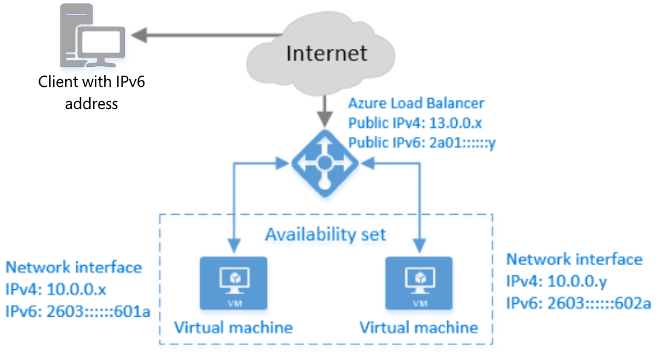

<properties
    pageTitle="Panoramica di IPv6 per bilanciamento del carico Azure | Microsoft Azure"
    description="Comprendere il supporto IPv6 per servizio di bilanciamento del carico Azure e macchine virtuali di bilanciamento del carico."
    services="load-balancer"
    documentationCenter="na"
    authors="sdwheeler"
    manager="carmonm"
    editor=""
    keywords="IPv6, bilanciamento del carico azure, stack doppio, ip pubblico, ipv6 nativo, mobile, iot"
/>
<tags
    ms.service="load-balancer"
    ms.devlang="na"
    ms.topic="article"
    ms.tgt_pltfrm="na"
    ms.workload="infrastructure-services"
    ms.date="09/14/2016"
    ms.author="sewhee"
/>

# Panoramica di IPv6 per bilanciamento del carico Azure

Servizi di bilanciamento del carico esposto a Internet può essere distribuiti con un indirizzo IPv6. Oltre a connettività IPv4, in questo modo le funzionalità seguenti:

* Fine-fine la connettività IPv6 nativa tra i client di Internet pubblica e Azure macchine () tramite il servizio di bilanciamento del carico.
* Fine-Fine in uscita la connettività IPv6 nativa tra macchine virtuali e client di Internet IPv6 attivato pubblica.

L'immagine seguente illustra la funzionalità di IPv6 per bilanciamento del carico di Azure.

Una volta distribuito, un client IPv4 o IPv6 attivato Internet può comunicare con gli indirizzi IPv4 o IPv6 pubblico (o nome host) del servizio di bilanciamento del carico esposto a Internet di Azure. Bilanciamento del carico instrada i pacchetti IPv6 per gli indirizzi IPv6 privati delle macchine virtuali mediante il protocollo NAT (NAT). Il client di Internet IPv6 non è possibile comunicare direttamente con l'indirizzo IPv6 di macchine virtuali.

## Caratteristiche

Supporto di IPv6 nativo per macchine virtuali distribuito tramite Gestione risorse di Azure fornisce:

1. Bilanciamento del carico IPv6 servizi per i client di IPv6 su Internet
2. Endpoint nativo IPv6 e IPv4 in macchine virtuali ("con due barre in pila")
3. In ingresso e in uscita avviata connessioni IPv6 native
4. Protocolli supportati, ad esempio TCP e UDP HTTP (S) abilitare un'ampia gamma di architetture di servizi

## Vantaggi

Questa funzionalità consente i seguenti vantaggi:

* Soddisfare le regole per la pubblica amministrazione che richiedono che le nuove applicazioni siano accessibili solo IPv6 client
* Abilita mobile e Internet di sviluppatori di aspetti (IOT) da utilizzare in pila con due macchine virtuali di Azure (IPv4 + IPv6) per risolvere il mobile crescente & IOT mercati

## Dettagli e limitazioni

Dettagli

* Il servizio di Azure DNS contiene record IPv4 a e IPv6 AAAA e risponde con entrambi i record per il servizio di bilanciamento del carico. Il client sceglie quale indirizzo (IPv4 o IPv6) per comunicare con.
* Quando una macchina virtuale avvia una connessione a un dispositivo connesso a Internet IPv6 pubblico, indirizzo IPv6 di origine della macchina virtuale è indirizzo di rete di traduzione (NAT) all'indirizzo IPv6 pubblico di bilanciamento del carico.
* Macchine virtuali del sistema operativo Linux devono essere configurate per ricevere un indirizzo IP IPv6 tramite DHCP. Molte delle immagini Linux nella raccolta di Azure sono già configurati per supportare IPv6 senza alcuna modifica. Per ulteriori informazioni, vedere [Configurazione DHCPv6 per macchine virtuali Linux](load-balancer-ipv6-for-linux.md)
* Se si sceglie di utilizzare una verifica dell'integrità con il servizio di bilanciamento del carico, creare una verifica IPv4 e usarlo con i punti finali IPv4 e IPv6. Se il servizio nella macchina virtuale viene interrotto, i punti finali IPv4 e IPv6 provengono dalla rotazione.

Limitazioni

* È possibile aggiungere regole di bilanciamento del carico di IPv6 nel portale di Azure. Le regole possono essere create solo tramite il modello CLI, PowerShell.
* Macchine virtuali esistente per utilizzare gli indirizzi IPv6 potrebbero non essere aggiornati. Distribuire macchine virtuali di nuove.
* Un solo indirizzo IPv6 può essere assegnato a una singola interfaccia di rete in ogni macchina virtuale.
* Indirizzi IPv6 non assegnare una macchina virtuale. Si possono essere assegnate a un servizio di bilanciamento del carico.
* Non è possibile configurare la ricerca DNS inversa per gli indirizzi IPv6 pubblici.
* Macchine virtuali con gli indirizzi IPv6 non possono essere membri di un servizio Cloud di Azure. Utenti che possono essere connessi a una rete virtuale Azure (VNet) e comunicare con loro tramite gli indirizzi IPv4.
* Indirizzi IPv6 privato possono essere distribuiti su singole macchine virtuali di un gruppo di risorse, ma non possono essere distribuiti in un gruppo di risorse tramite scala set.
* Azure macchine virtuali non è possibile connettersi tramite IPv6 ad altre macchine virtuali, altri servizi Azure o dispositivi locale. Possono solo comunicare con il servizio di bilanciamento del carico Azure su IPv6. Tuttavia, possono comunicare con le altre risorse utilizzando IPv4.
* Protezione di gruppo di sicurezza di rete (NSG) per IPv4 è supportata nelle distribuzioni doppio stack (IPv4 + IPv6). NSGs si applicano a endpoint IPv6.
* Endpoint IPv6 nella macchina virtuale non viene esposto direttamente a internet. Si tratta di bilanciamento del. Solo le porte specificate nelle regole di bilanciamento del carico sono accessibili su IPv6.
* Cambiare il parametro IdleTimeout per IPv6 è **non sono attualmente supportati**. Il valore predefinito è quattro minuti.

## Passaggi successivi

Informazioni su come distribuire un servizio di bilanciamento del carico IPv6.

* [Disponibilità di IPv6 per area geografica](https://go.microsoft.com/fwlink/?linkid=828357)
* [Distribuire un bilanciamento del carico con IPv6 utilizzando un modello](load-balancer-ipv6-internet-template.md)
* [Distribuire un bilanciamento del carico con IPv6 tramite PowerShell Azure](load-balancer-ipv6-internet-ps.md)
* [Distribuire un bilanciamento del carico con IPv6 usa CLI Azure](load-balancer-ipv6-internet-cli.md)
