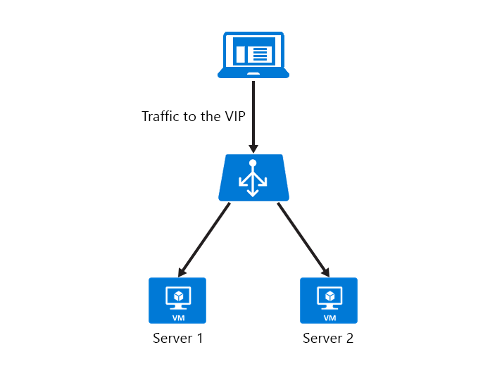

<properties
   pageTitle="Configurare il timeout di inattività TCP bilanciamento carico | Microsoft Azure"
   description="Configurare il timeout di inattività TCP bilanciamento carico"
   services="load-balancer"
   documentationCenter="na"
   authors="sdwheeler"
   manager="carmonm"
   editor="" />
<tags
   ms.service="load-balancer"
   ms.devlang="na"
   ms.topic="article"
   ms.tgt_pltfrm="na"
   ms.workload="infrastructure-services"
   ms.date="10/24/2016"
   ms.author="sewhee" />

# Configurare le impostazioni di tempo di inattività TCP di bilanciamento del carico di Azure

Nella configurazione predefinita di bilanciamento del carico Azure è un'impostazione di timeout di inattività di 4 minuti. Se un periodo di inattività è maggiore del valore di timeout, è possibile che la sessione TCP o HTTP non viene mantenuto tra il client e il servizio cloud.

Quando la connessione è chiusa, l'applicazione client che venga visualizzato il seguente messaggio di errore: "la connessione sottostante chiusa: una connessione che dovrebbe essere conservate è stata chiusa dal server."

Una pratica comune consiste nell'usare un TCP Mantieni attivo. Questa esercitazione mantiene attiva la connessione per un periodo più lungo. Per ulteriori informazioni, vedere questi [esempi di .NET](https://msdn.microsoft.com/library/system.net.servicepoint.settcpkeepalive.aspx). Con attivata Mantieni attivo, i pacchetti vengono inviati durante i periodi di inattività sulla connessione. Questi pacchetti Mantieni attivo assicurarsi che non viene mai raggiunto il valore di timeout di inattività e la connessione viene mantenuta per un periodo di tempo.

Questa impostazione funziona per le connessioni in ingresso. Per evitare di perdere la connessione, è necessario configurare TCP Mantieni attivo con un intervallo rispetto all'impostazione del tempo di inattività o aumentare il valore di timeout di inattività. Per supportare tali scenari, abbiamo creato il supporto per un tempo di inattività configurabile. È ora possibile impostare per una durata da 4 a 30 minuti.

TCP Mantieni attivo funziona anche per gli scenari in cui autonomia non è un vincolo. Non è consigliabile per le applicazioni mobili. Utilizzando un TCP Mantieni attivo in un'applicazione mobile può distogliere più velocemente la pila di dispositivo.

Nelle sezioni seguenti descrivono come modificare le impostazioni di tempo di inattività in macchine virtuali e servizi cloud.

## Configurare il timeout TCP per l'indirizzo IP pubblico istanza a livello di 15 minuti

    Set-AzurePublicIP -PublicIPName webip -VM MyVM -IdleTimeoutInMinutes 15

`IdleTimeoutInMinutes`è facoltativo. Se non è impostata, il timeout predefinito è 4 minuti. L'intervallo di timeout accettabile è 4 a 30 minuti.

## Impostare il tempo di inattività quando si crea un endpoint Azure in una macchina virtuale

Per modificare l'impostazione di timeout di un estremo, utilizzare le operazioni seguenti:

    Get-AzureVM -ServiceName "mySvc" -Name "MyVM1" | Add-AzureEndpoint -Name "HttpIn" -Protocol "tcp" -PublicPort 80 -LocalPort 8080 -IdleTimeoutInMinutes 15| Update-AzureVM

Per recuperare la configurazione del tempo di inattività, utilizzare il comando seguente:

    PS C:\> Get-AzureVM -ServiceName "MyService" -Name "MyVM" | Get-AzureEndpoint
    VERBOSE: 6:43:50 PM - Completed Operation: Get Deployment
    LBSetName : MyLoadBalancedSet
    LocalPort : 80
    Name : HTTP
    Port : 80
    Protocol : tcp
    Vip : 65.52.xxx.xxx
    ProbePath :
    ProbePort : 80
    ProbeProtocol : tcp
    ProbeIntervalInSeconds : 15
    ProbeTimeoutInSeconds : 31
    EnableDirectServerReturn : False
    Acl : {}
    InternalLoadBalancerName :
    IdleTimeoutInMinutes : 15

## Impostare il timeout TCP su un set di bilanciamento del carico endpoint

Se i punti finali fanno parte di un set di bilanciamento del carico endpoint, è necessario impostare il timeout TCP sul set di bilanciamento del carico endpoint. Per esempio:

    Set-AzureLoadBalancedEndpoint -ServiceName "MyService" -LBSetName "LBSet1" -Protocol tcp -LocalPort 80 -ProbeProtocolTCP -ProbePort 8080 -IdleTimeoutInMinutes 15

## Modificare le impostazioni di timeout per i servizi cloud

È possibile utilizzare Azure SDK aggiornare il servizio cloud. Impostazioni endpoint per i servizi cloud apportate nel file .csdef. Aggiornare il timeout TCP per la distribuzione di un servizio cloud, è necessario un aggiornamento di distribuzione. Un'eccezione è se il timeout TCP viene specificato solo per un indirizzo IP pubblico. Pubbliche impostazioni IP siano presenti nel file cscfg e li aggiorna tramite l'aggiornamento e aggiornamento di distribuzione.

Le modifiche .csdef per accedere a Impostazioni endpoint sono:

    <WorkerRole name="worker-role-name" vmsize="worker-role-size" enableNativeCodeExecution="[true|false]">
      <Endpoints>
        <InputEndpoint name="input-endpoint-name" protocol="[http|https|tcp|udp]" localPort="local-port-number" port="port-number" certificate="certificate-name" loadBalancerProbe="load-balancer-probe-name" idleTimeoutInMinutes="tcp-timeout" />
      </Endpoints>
    </WorkerRole>

Le modifiche cscfg per l'impostazione di timeout su IP pubblico sono:

    <NetworkConfiguration>
      <VirtualNetworkSite name="VNet"/>
      <AddressAssignments>
        <InstanceAddress roleName="VMRolePersisted">
        <PublicIPs>
          <PublicIP name="public-ip-name" idleTimeoutInMinutes="timeout-in-minutes"/>
        </PublicIPs>
        </InstanceAddress>
      </AddressAssignments>
    </NetworkConfiguration>

## Esempio di API REST

È possibile configurare il timeout di inattività TCP tramite l'API di gestione di servizio. Assicurarsi che la `x-ms-version` intestazione è impostata su versione `2014-06-01` o versione successiva. Aggiornare la configurazione di input endpoint di bilanciamento del carico specificato in tutte le macchine virtuali in una distribuzione.

### Richiesta

    POST https://management.core.windows.net/<subscription-id>/services/hostedservices/<cloudservice-name>/deployments/<deployment-name>

### Risposta

    <LoadBalancedEndpointList xmlns="http://schemas.microsoft.com/windowsazure" xmlns:i="http://www.w3.org/2001/XMLSchema-instance">
      <InputEndpoint>
        <LoadBalancedEndpointSetName>endpoint-set-name</LoadBalancedEndpointSetName>
        <LocalPort>local-port-number</LocalPort>
        <Port>external-port-number</Port>
        <LoadBalancerProbe>
          <Path>path-of-probe</Path>
          <Port>port-assigned-to-probe</Port>
          <Protocol>probe-protocol</Protocol>
          <IntervalInSeconds>interval-of-probe</IntervalInSeconds>
          <TimeoutInSeconds>timeout-for-probe</TimeoutInSeconds>
        </LoadBalancerProbe>
        <LoadBalancerName>name-of-internal-loadbalancer</LoadBalancerName>
        <Protocol>endpoint-protocol</Protocol>
        <IdleTimeoutInMinutes>15</IdleTimeoutInMinutes>
        <EnableDirectServerReturn>enable-direct-server-return</EnableDirectServerReturn>
        <EndpointACL>
          <Rules>
            <Rule>
              <Order>priority-of-the-rule</Order>
              <Action>permit-rule</Action>
              <RemoteSubnet>subnet-of-the-rule</RemoteSubnet>
              <Description>description-of-the-rule</Description>
            </Rule>
          </Rules>
        </EndpointACL>
      </InputEndpoint>
    </LoadBalancedEndpointList>

## Passaggi successivi

[Panoramica di bilanciamento carico interno](load-balancer-internal-overview.md)

[Per iniziare la configurazione di un servizio di bilanciamento del carico esposto a Internet](load-balancer-get-started-internet-arm-ps.md)

[Configurare una modalità di distribuzione carico di bilanciamento del carico](load-balancer-distribution-mode.md)
