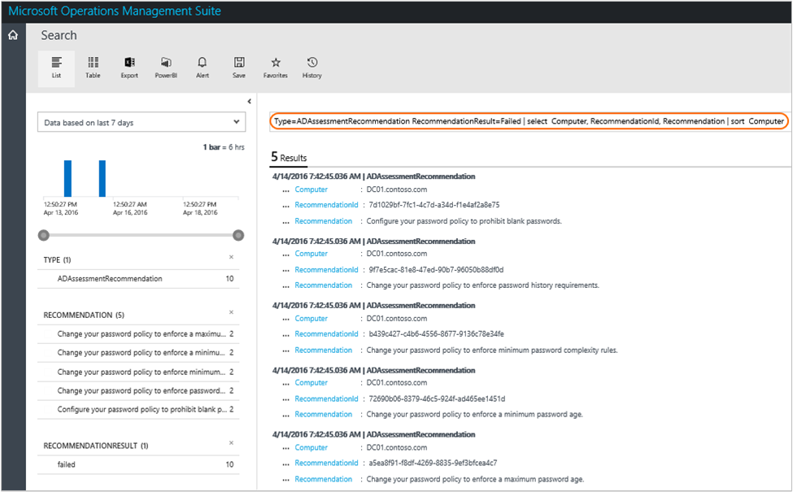

<properties
    pageTitle="Ottimizzare l'ambiente con la soluzione di valutazione di Active Directory in Log Analitica | Microsoft Azure"
    description="È possibile utilizzare la soluzione di valutazione di Active Directory per valutare il rischio e l'integrità del proprio ambiente dal server a intervalli regolari."
    services="log-analytics"
    documentationCenter=""
    authors="bandersmsft"
    manager="jwhit"
    editor=""/>

<tags
    ms.service="log-analytics"
    ms.workload="na"
    ms.tgt_pltfrm="na"
    ms.devlang="na"
    ms.topic="article"
    ms.date="10/10/2016"
    ms.author="banders"/>

# <a name="optimize-your-environment-with-the-active-directory-assessment-solution-in-log-analytics"></a>Ottimizzare l'ambiente con la soluzione di valutazione di Active Directory in Analitica Log

È possibile utilizzare la soluzione di valutazione di Active Directory per valutare il rischio e l'integrità del proprio ambiente dal server a intervalli regolari. In questo articolo consente di installare e usare la soluzione in modo che è possibile eseguire azioni correttive per potenziali problemi.

Questa soluzione comprende un elenco di priorità di consigli specifici per l'infrastruttura di server distribuito. I suggerimenti sono suddivise in quattro aree che consentono di valutare il rischio e intervenire.

I suggerimenti si basano le competenze esperienza dagli ingegneri Microsoft da migliaia di visite. Ogni recommendation le informazioni fornite potrebbe importanza un problema all'utente e come implementare le modifiche suggerite.

È possibile scegliere aree di interesse più importanti per l'organizzazione e registrare l'avanzamento di esecuzione di un ambiente gratuita e integro rischio.

Dopo aver aggiunto la soluzione e una valutazione viene completata, riepilogo vengono visualizzate informazioni relativi alle aree lo stato attivo nel dashboard di **valutazione di Active Directory** per l'infrastruttura nel proprio ambiente. Nelle sezioni seguenti viene descritto come utilizzare le informazioni nel dashboard di **valutazione di Active Directory** , in cui è possibile visualizzare e quindi eseguire le azioni consigliate per l'infrastruttura di server Active Directory.


## <a name="installing-and-configuring-the-solution"></a>Installare e configurare la soluzione
Usare le informazioni seguenti per installare e configurare le soluzioni.

- Agenti devono essere installati nel controller di dominio che fanno parte del dominio da valutare.
- La soluzione di valutazione di Active Directory richiede .NET Framework 4 installato in ogni computer in cui è un agente OMS.
- Aggiungere la soluzione di valutazione di Active Directory nell'area di lavoro OMS usando la procedura descritta nella sezione [aggiungere Analitica Log soluzioni dalla raccolta soluzioni](log-analytics-add-solutions.md).  Non esiste alcun ulteriori operazioni di configurazione necessari.

    >[AZURE.NOTE] Dopo aver aggiunto la soluzione, il file AdvisorAssessment.exe viene aggiunto al server con agenti. Configurazione dati leggere e quindi inviati al servizio Outlook Mobile nel cloud per elaborazione. Logica viene applicata ai dati ricevuti e il servizio cloud registra i dati.

## <a name="active-directory-assessment-data-collection-details"></a>Dettagli insieme di Active Directory valutazione dati

Active Directory valutazione consente di raccogliere dati WMI, i dati del Registro di sistema e dati sulle prestazioni utilizzando gli agenti che è stata attivata.

Nella tabella seguente mostra i metodi di raccolta dati di agenti, se è necessario Operations Manager (SCOM) e come raccolte spesso i dati da un agente.

| piattaforma | Agente diretta | Agente SCOM | Spazio di archiviazione Azure | SCOM necessari? | Dati di agente SCOM inviati tramite il gruppo di gestione | frequenza di raccolta |
|---|---|---|---|---|---|---|
|Windows||||   || 7 giorni|


## <a name="understanding-how-recommendations-are-prioritized"></a>Informazioni sulle modalità vengono assegnata la priorità consigli

Ogni recommendation apportate viene assegnato un valore di peso che identifica l'importanza relativa della recommendation. Vengono visualizzati solo i dieci suggerimenti più importanti.

### <a name="how-weights-are-calculated"></a>La modalità di calcolo spessori

Ponderazioni sono valori aggregati in base a tre fattori chiave:

- *Probabilità* che un problema individuato causerà problemi. Una probabilità superiore equivale a un punteggio generale maggiore per il suggerimento.

- *Impatto* del problema sull'organizzazione se che causano un problema. Un maggiore impatto corrisponde a un punteggio generale maggiore per il suggerimento.

- L' *impegno* necessari per implementare il suggerimento. Un valore superiore equivale a un punteggio generale più piccolo per il suggerimento.

Peso per ogni recommendation è espresso come percentuale del totale punteggio disponibile per ogni area lo stato attivo. Ad esempio, se recommendation nell'area di stato attivo sicurezza e conformità ha un punteggio del 5%, l'implementazione che il prodotto consigliato aumenterà il complessiva punteggio da 5% sicurezza e conformità.

### <a name="focus-areas"></a>Aree di interesse

**Sicurezza e conformità** - quest ' area lo stato attivo Mostra suggerimenti per rischi di sicurezza e violazioni, criteri aziendali e requisiti legali, normativi e di tecniche.

**Disponibilità e continuità aziendale** - quest ' area lo stato attivo Mostra suggerimenti per la disponibilità del servizio, sulla resilienza dell'infrastruttura e protezione di business.

**Prestazioni e scalabilità** - quest ' area lo stato attivo seguito vengono fornite indicazioni per consentire all'organizzazione infrastruttura IT Ingrandisci, assicurarsi che l'ambiente INFORMATICO soddisfi i requisiti di prestazioni corrente e in grado di rispondere in base alle esigenze dell'infrastruttura.

**Eseguire l'aggiornamento, migrazione e distribuzione** - quest ' area lo stato attivo Mostra suggerimenti che consentono di eseguire l'aggiornamento, eseguire la migrazione e distribuire Active Directory per l'infrastruttura esistente.

### <a name="should-you-aim-to-score-100-in-every-focus-area"></a>È preferibile punteggio 100% in ogni area lo stato attivo?

Non necessariamente. I suggerimenti si basano le competenze esperienze acquisite dagli ingegneri Microsoft attraverso migliaia di visite. Tuttavia, un'infrastruttura due server non è le stesse e indicazioni specifiche potrebbero essere più o meno importanti per l'utente. Alcune indicazioni di sicurezza, ad esempio, potrebbero essere meno rilevanti se macchine virtuali non viene esposto a Internet. Alcuni consigli disponibilità potrebbero essere meno rilevanti per i servizi che forniscono raccolta di dati ad hoc con priorità bassa e creazione di report. Problemi relativi a un business consolidato possono essere meno importante per un avvio. Può essere necessario identificare quali aree di interesse sono la priorità e quindi osservare come i punteggi cambiano nel tempo.

Ogni recommendation include indicazioni sui perché è importante. Utilizzare questa guida per valutarne l'implementazione di recommendation è appropriato, dato natura dei servizi IT e le esigenze dell'organizzazione.

## <a name="use-assessment-focus-area-recommendations"></a>Utilizzare valutazione lo stato attivo area consigli

È possibile utilizzare una soluzione di valutazione in OMS, se è presente la soluzione installata. Per ulteriori informazioni sull'installazione di soluzioni, vedere [aggiungere Analitica Log soluzioni dalla raccolta soluzioni](log-analytics-add-solutions.md). Dopo l'installazione, è possibile visualizzare il riepilogo dei suggerimenti utilizzando il riquadro di valutazione nella pagina Panoramica OMS.

Visualizzare le valutazioni di conformità riepilogati per l'infrastruttura e drill-down in consigli.


### <a name="to-view-recommendations-for-a-focus-area-and-take-corrective-action"></a>Per visualizzare suggerimenti per un'area di stato attivo e adottare misure correttive

1. Nella pagina **Panoramica** fare clic sul riquadro di **valutazione** per l'infrastruttura di server.
2. Nella pagina di **valutazione** , rivedere le informazioni di riepilogo in una delle pale area lo stato attivo e quindi fare clic su uno per visualizzare suggerimenti per l'area di stato attivo.
3. In tutte le pagine di area lo stato attivo, è possibile visualizzare le priorità raccomandazioni per l'ambiente. Fare clic su un suggerimento nell'elenco **Oggetti interessati** per visualizzarne i dettagli perché è consigliabile.  
    
4. È possibile eseguire azioni correttive suggerite le azioni **Suggerite**. Quando l'elemento è stato risolto, valutazioni successive registra che sono state effettuate azioni e il punteggio conformità aumenterà consigliate. Gli elementi corretti vengono visualizzati come **Oggetti passato**.

## <a name="ignore-recommendations"></a>Ignora consigli

Se si dispone di suggerimenti che si vuole ignorare, è possibile creare un file di testo utilizzate per evitare che venga visualizzata nei risultati della valutazione consigli OMS.

### <a name="to-identify-recommendations-that-you-will-ignore"></a>Per identificare i suggerimenti che verrà ignorata

1.  Accedere all'area di lavoro e aprire ricerca dei registri. Utilizzare la query seguente per consigli elenco che non sono state per computer nel proprio ambiente.

    ```
    Type=ADAssessmentRecommendation RecommendationResult=Failed | select  Computer, RecommendationId, Recommendation | sort  Computer
    ```

    Ecco una schermata che mostra la query di ricerca dei registri: 

2.  Scegliere consigli che si vuole ignorare. È necessario utilizzare i valori per RecommendationId nella procedura successiva.


### <a name="to-create-and-use-an-ignorerecommendationstxt-text-file"></a>Creare e usare un file di testo IgnoreRecommendations.txt

1.  Creare un file denominato IgnoreRecommendations.txt.
2.  Copiare o digitare ogni RecommendationId per ogni il suggerimento che si desidera Analitica Log per ignorare in una riga separata e quindi salvare e chiudere il file.
3.  Inserire il file nella cartella seguente in ogni computer in cui si desidera OMS per ignorare consigli.
    - Nei computer con l'agente di monitoraggio Microsoft (connesso direttamente o tramite Operations Manager) - *unitàsistema*: \Programmi\Microsoft Agent\Agent monitoraggio
    - Sul server di gestione Operations Manager - *unitàsistema*: \Programmi\Microsoft System Center 2012 R2\Operations Manager\Server

### <a name="to-verify-that-recommendations-are-ignored"></a>Per verificare che vengano ignorati consigli

Dopo il successivo pianificato verrà eseguito di valutazione, per impostazione predefinita ogni 7 giorni, consigli specificati vengono contrassegnati *ignorato* e non verranno visualizzati nel dashboard di valutazione.

1. È possibile utilizzare la query di ricerca dei registri seguenti per visualizzare un elenco di tutti i suggerimenti ignorati.

    ```
    Type=ADAssessmentRecommendation RecommendationResult=Ignored | select  Computer, RecommendationId, Recommendation | sort  Computer
    ```

2.  Se in seguito si decide di vedere i suggerimenti ignorati, rimuovere eventuali file IgnoreRecommendations.txt oppure è possibile rimuovere RecommendationIDs da essi.

## <a name="ad-assessment-solutions-faq"></a>Soluzioni di valutazione di Active Directory domande frequenti

*Con quale frequenza è compatibile con una valutazione?*
- La valutazione viene eseguita ogni 7 giorni.

*È possibile configurare la frequenza di esecuzione la valutazione?*
- Non al momento.

*Se viene rilevato un altro server per aver aggiunto una soluzione di valutazione, sarà essa valutato?*
- Sì, dopo aver scoperto che viene valutata da then, ogni 7 giorni.

*Se è state rimosse un server, quando verrà rimossa la valutazione?*
- Se un server non presenta dati per 3 settimane, viene rimosso.

*Che cos'è il nome del processo che indica la raccolta di dati?*
- AdvisorAssessment.exe

*Quanto tempo per i dati da raccogliere?*
- La raccolta di dati effettivi nel server richiede circa 1 ora. Può richiedere più tempo nel server che dispongono di un numero elevato di server Active Directory.

*Tipo di dati raccolti*
- Sono stati raccolti i tipi di dati seguenti:
    - WMI
    - Registro di sistema
    - Contatori delle prestazioni

*È possibile configurare una raccolta di dati?*
- Non al momento.

*Perché visualizzare solo i consigli primi 10?*
- Invece di fornire un elenco completo enorme delle attività, è consigliabile focalizzare l'attenzione su indirizzamento consigli priorità prima di tutto. Dopo aver risolverli, ulteriori raccomandazioni descritte diventeranno disponibili. Se si preferisce per visualizzare l'elenco dettagliato, è possibile visualizzare tutti i suggerimenti tramite ricerca dei registri.

*È possibile ignorare un suggerimento?*
- Sì, vedere [suggerimenti per Ignora](#ignore-recommendations) sezione precedente.


## <a name="next-steps"></a>Passaggi successivi

- Utilizzare [le ricerche Log in Analitica Log](log-analytics-log-searches.md) per visualizzare suggerimenti e dettagliata i dati di valutazione di Active Directory.
